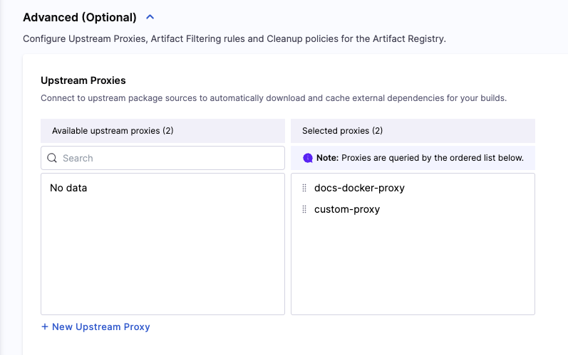

Use this page to learn about all the configuration options for your artifact registries. 

## Registry configuration

To change your registry settings, go to the registry and select **Configuration**."

Here you can:
- Change your registry **Description**.
- Add a label under **Labels**.
- Manage configuration options relative to your registry type such as setting a security scanner for docker registries.
- Manage **Advanced** settings which includes setting an **Upstream Proxy**. 

## Security Scan

When the SCS module is enabled, artifacts in the Harness Artifact Registry are automatically scanned using AquaTrivy, the currently supported scanner. Built-in container scanning creates a pipeline to ensure every artifact is scanned upon entry. Additional scanner options will be introduced in the future.

## Cleanup Policies

*Coming Soon*

## Advanced settings

### Set an upstream proxy

After [creating an upstream proxy](/docs/artifact-registry/manage-registries/create-registry#create-an-upstream-proxy), you can set it in your artifact registry. To do so, follow these steps:

1. In your registry, select **Configuration**.
2. Open the **Advanced (Optional)** dropdown menu. 
3. Select **Configure Upstream**.
4. Under **Available upstream proxies**, you will see a list of available upstream proxies. Select as many as you would like. 
5. Under **Selected proxies**, you will see an ordered list of selected proxies for this registry. When the registry receives a request, the proxies will be *queried in order* from top to bottom.

*In the example above, when the registry is asked for an artifact, it will query the base registry, then `docs-docker-proxy`, then `custom-proxy`.*

6. Click **Save** in the top right corner. 

### Establish artifact filtering rules

Use these rules to establish which artifacts are allowed or blocked entry into your registry.

#### Allowed patterns

In **Allowed Patterns**, use a regex string to define which artifacts will be allowed into the registry. The regex will match against each incoming artifact and, if the match is successful, allow the push operation. 

In **Blocked Patterns**, use a regex string to define which artifacts will be blocked from the registry. The regex will match against each incoming artifact and, if the match is successful, disallow the push operation. 

**Example**:

If you wanted to set a registry to store only prod artifacts and block all dev artifacts you could:

- Set the **Allowed Patterns** regex to `.*-prod`.
- Set the **Blocked Patterns** regex to `dev-.*`.

This will allow in any artifact that ends with `-prod` and block any artifact that starts with `dev-`.