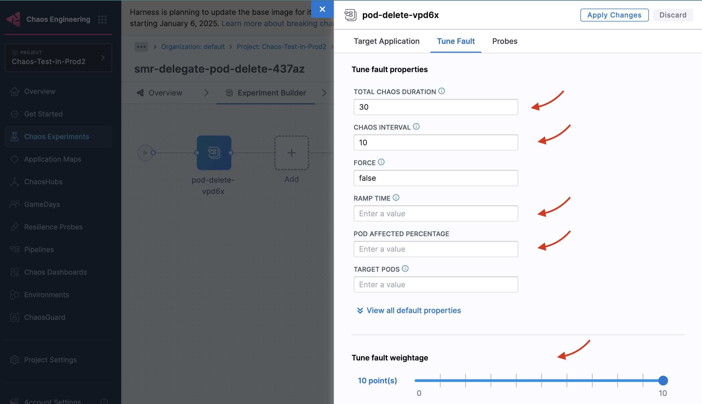
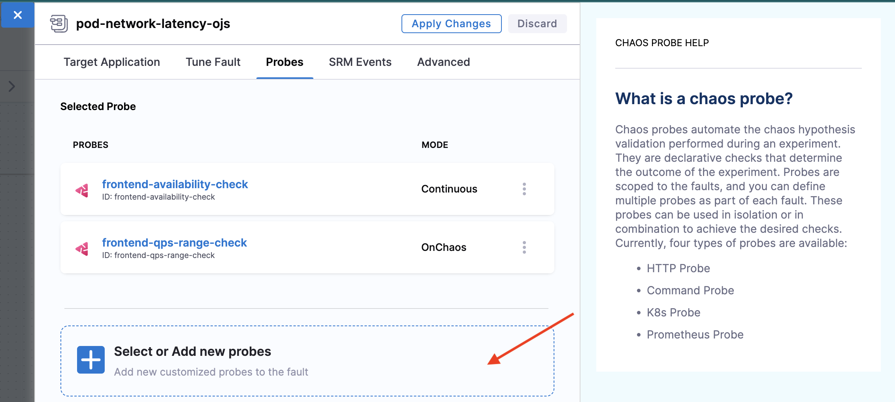

# Create Experiments

Learn how to create comprehensive chaos experiments that validate your system's resilience through controlled failure injection. This guide covers everything from basic experiment creation to advanced configuration options.

## Prerequisites

Before creating your first experiment, ensure you have:

- **Environment** created for your deployment scenario
- **Chaos Infrastructure** installed and connected
- **Target applications** identified and accessible
- **Proper permissions** for experiment creation and execution

:::info Quick Setup
If you haven't set up your environment and infrastructure yet, follow our [Getting Started Guide](../../get-started) first.
:::

## Experiment Creation Methods

Harness provides three flexible approaches to create chaos experiments:

### Blank Canvas
Build experiments from scratch with complete control over every aspect.

### ChaosHub Templates
Use pre-built experiment templates from the Enterprise ChaosHub.

### YAML Upload
Import existing experiment definitions or infrastructure-as-code configurations.

---

## Method 1: Blank Canvas Creation

### Step 1: Start New Experiment

1. Navigate to **Chaos Engineering** → **Experiments**
2. Click **+ New Experiment**
3. Select **Blank Canvas** to start from scratch


### Step 2: Configure Basic Settings

#### Experiment Details
- **Name**: Choose a descriptive name (e.g., "Pod-Delete-Resilience-Test")
- **Description**: Document the experiment's purpose and hypothesis
- **Tags**: Add labels for organization and filtering

#### Target Infrastructure
- **Environment**: Select your target environment
- **Infrastructure**: Choose the chaos infrastructure where the experiment will run


### Step 3: Add Chaos Faults

#### Select Fault Category
Choose from available fault categories:

- **Kubernetes**: Pod deletion, resource stress, network faults
- **Linux**: System resource exhaustion, process kills
- **AWS**: ECS task stop, Lambda function errors, RDS failures
- **GCP**: VM instance stop, Cloud Function errors
- **Azure**: VM restart, App Service disruption


#### Configure Fault Parameters

For each fault, configure:

**Target Selection**
- **Namespace**: Where your application is deployed
- **App Kind**: Deployment, StatefulSet, DaemonSet, etc.
- **App Labels**: Specific label selectors for targeting

**Fault Tunables**
- **Chaos Duration**: How long the fault should run (e.g., 30s, 2m)
- **Ramp Time**: Gradual introduction period
- **Pods Affected**: Percentage or count of pods to target

**Fault Weight**
- Assign importance level (1-10) for resilience score calculation



### Step 4: Add Resilience Probes

Probes validate your system's health during the experiment:

#### HTTP Probe
```yaml
# Example HTTP Probe Configuration
name: "service-availability"
type: "httpProbe"
httpProbe/inputs:
  url: "http://my-service:8080/health"
  insecureSkipTLS: false
  responseTimeout: 10s
  method:
    get:
      criteria: "=="
      responseCode: "200"
mode: "Continuous"
runProperties:
  probeTimeout: 5s
  interval: 2s
  retry: 3
```

#### Command Probe
```yaml
# Example Command Probe
name: "database-connectivity"
type: "cmdProbe"
cmdProbe/inputs:
  command: "pg_isready -h postgres-service -p 5432"
  source:
    image: "postgres:13"
mode: "Edge"
runProperties:
  probeTimeout: 10s
  retry: 2
```

#### Kubernetes Probe
```yaml
# Example K8s Probe
name: "pod-status-check"
type: "k8sProbe"
k8sProbe/inputs:
  group: ""
  version: "v1"
  resource: "pods"
  namespace: "default"
  fieldSelector: "status.phase=Running"
mode: "Continuous"
```



### Step 5: Configure Advanced Settings

#### Experiment Sequence
- **Serial Execution**: Run faults one after another
- **Parallel Execution**: Run multiple faults simultaneously
- **Custom Sequence**: Define complex fault orchestration

#### Safety Controls
- **Node Selector**: Limit execution to specific nodes
- **Tolerations**: Handle node taints appropriately
- **Security Context**: Set appropriate permissions

#### Environment Variables
Set custom environment variables for fault execution:

```yaml
env:
  - name: CUSTOM_CONFIG
    value: "production"
  - name: TIMEOUT_DURATION
    value: "30s"
```

---

## Method 2: ChaosHub Templates

### Step 1: Browse Templates

1. Select **Templates from ChaosHub**
2. Choose your **ChaosHub** (Enterprise or Custom)
3. Browse available experiment templates


### Step 2: Preview and Customize

1. **Preview** the template to understand included faults
2. **Customize** parameters to match your environment
3. **Add or remove** faults as needed
4. **Configure probes** for your specific validation needs

### Popular Templates

#### **Microservices Resilience Suite**
- Pod deletion with service mesh validation
- Network latency injection
- Database connection testing
- Load balancer failover

#### **Infrastructure Stress Test**
- CPU and memory exhaustion
- Disk I/O stress
- Network partition simulation
- Node failure scenarios

#### **Cloud Platform Validation**
- Multi-AZ failure simulation
- Auto-scaling validation
- Managed service disruption
- Cross-region failover testing

---

## Method 3: YAML Upload

### Step 1: Prepare YAML Definition

Create or obtain a chaos experiment YAML file:

```yaml
apiVersion: argoproj.io/v1alpha1
kind: Workflow
metadata:
  name: sample-chaos-experiment
spec:
  entrypoint: chaos-experiment
  templates:
  - name: chaos-experiment
    steps:
    - - name: install-chaos-faults
        template: install-chaos-faults
    - - name: pod-delete
        template: pod-delete
    - - name: revert-chaos
        template: revert-chaos
  
  - name: pod-delete
    container:
      image: litmuschaos/go-runner:latest
      command: [sh, -c]
      args: ["./experiments -name pod-delete"]
      env:
      - name: TOTAL_CHAOS_DURATION
        value: "30"
      - name: CHAOS_INTERVAL
        value: "10"
      - name: FORCE
        value: "false"
```

### Step 2: Upload and Validate

1. Click **Upload YAML**
2. Select your experiment file
3. **Validate** the configuration
4. **Review** and modify if needed

---

## Experiment Validation

### Pre-flight Checks

Before saving your experiment, Harness performs validation:

- **Infrastructure Connectivity**: Verify chaos infrastructure is reachable
- **Target Validation**: Confirm target applications exist
- **Permission Checks**: Validate required RBAC permissions
- **Resource Availability**: Ensure sufficient resources for execution
- **Probe Configuration**: Verify probe endpoints and credentials

### Common Validation Issues

| Issue | Solution |
|-------|----------|
| Infrastructure Unreachable | Check network connectivity and infrastructure status |
| Target Not Found | Verify namespace, labels, and application deployment |
| Permission Denied | Review RBAC settings and service account permissions |
| Invalid Probe URL | Confirm endpoint accessibility and authentication |
| Resource Constraints | Adjust fault parameters or infrastructure capacity |

---

## Saving and Organization

### Save Options

**Save to Experiments**
- Store in your experiment library
- Available for immediate execution
- Can be edited and versioned

**Add to ChaosHub**
- Save as reusable template
- Share across teams and projects
- Version control and governance

### Organization Best Practices

#### Naming Conventions
```
[Environment]-[Component]-[FaultType]-[Version]
Examples:
- prod-frontend-pod-delete-v1
- staging-database-network-latency-v2
- dev-microservices-stress-test-v1
```

#### Tagging Strategy
- **Environment**: prod, staging, dev
- **Component**: frontend, backend, database
- **Fault Type**: network, resource, application
- **Team**: platform, sre, qa
- **Criticality**: high, medium, low

---

## Next Steps

After creating your experiment:

1. **[Run Your Experiment](./run-experiments)** - Execute safely with monitoring
2. **[Configure Advanced Settings](./advanced-configuration)** - Fine-tune for complex scenarios
3. **[Set Up Monitoring](../probes-actions)** - Enhance validation and observability
4. **[Analyze Results](./analyze-results)** - Understand outcomes and improve resilience

## Troubleshooting

### Common Creation Issues

**Experiment Won't Save**
- Check all required fields are completed
- Verify infrastructure connectivity
- Ensure proper permissions

**Faults Not Available**
- Confirm chaos infrastructure version compatibility
- Check ChaosHub connectivity
- Verify fault prerequisites

**Probe Configuration Errors**
- Validate endpoint URLs and credentials
- Check network accessibility
- Verify probe syntax and parameters

### Getting Help

- **Documentation**: Comprehensive guides and API references
- **Community**: Join discussions and get peer support
- **Support**: Enterprise support for complex scenarios

Ready to create your first chaos experiment? Start with a simple pod deletion test and gradually build more complex scenarios as you gain confidence in your system's resilience capabilities.
