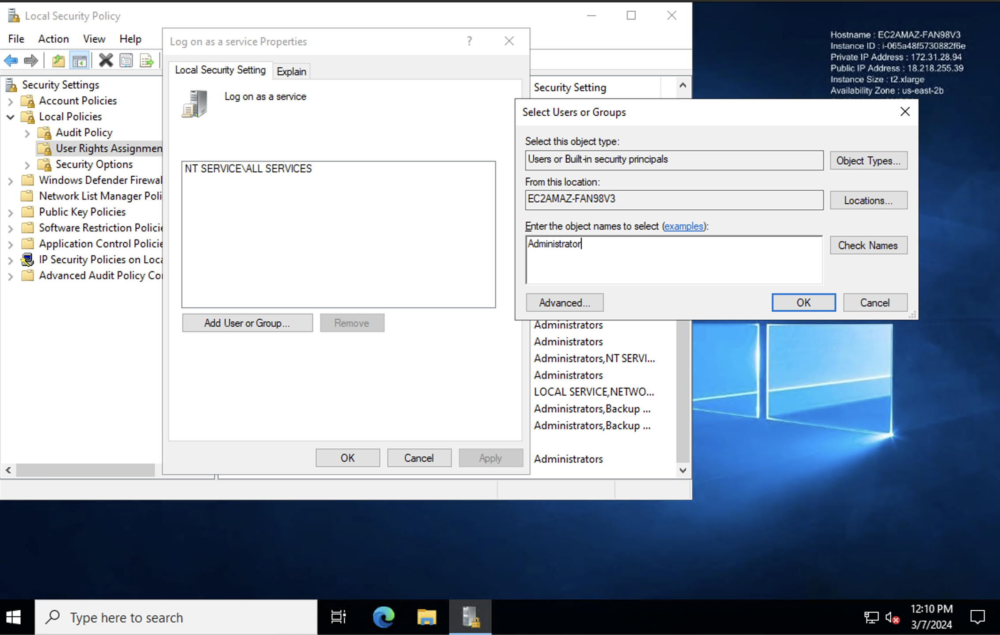
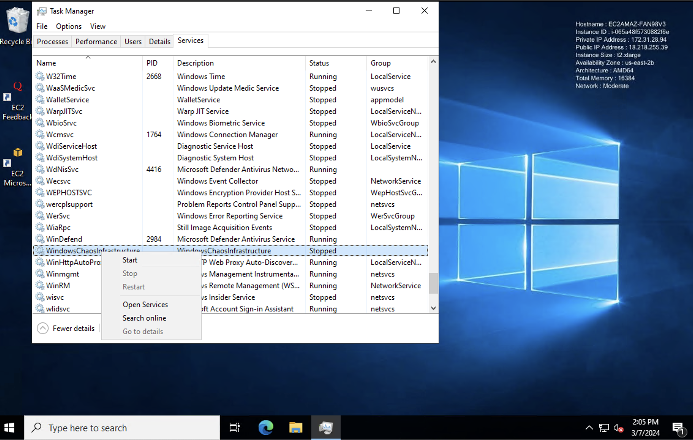
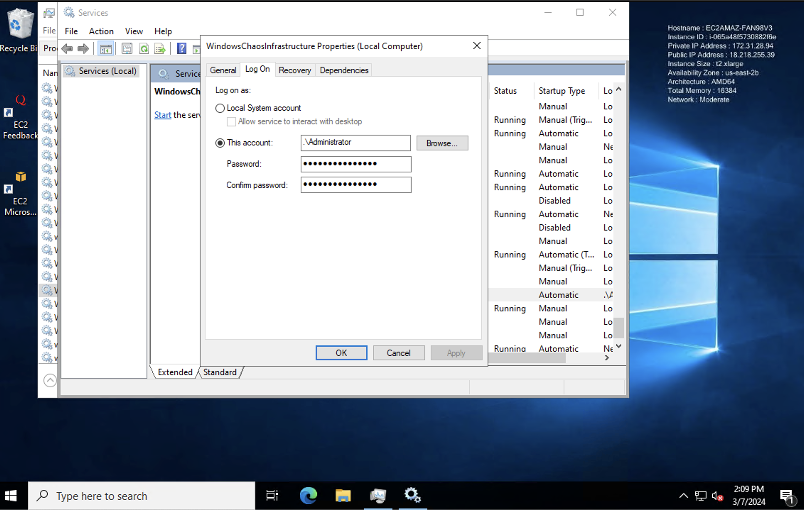

# Troubleshooting Guide

This comprehensive guide helps you quickly resolve common issues in Harness Chaos Engineering.

## Quick Reference

### Common Issues by Category
- **[Infrastructure Connection](#kubernetes-infrastructure-troubleshooting)** - Can't connect to chaos infrastructure
- **[Experiment Failures](#fault-and-experiment-related-troubleshooting)** - Experiments stuck or failing
- **[Windows Issues](#windows-chaos-infrastructure-troubleshooting)** - Windows-specific problems
- **[Discovery Problems](#discovery-agent-troubleshooting)** - Service discovery not working
- **[Known Limitations](#known-issues)** - Current platform limitations

### Essential Debug Commands

```bash
# Check infrastructure status
kubectl get pods -n <namespace>

# View infrastructure logs
kubectl logs -f <pod-name> -n <namespace>

# Describe problematic pods
kubectl describe pod <pod-name> -n <namespace>

# Check experiment status
kubectl get chaosengines -n <namespace>
```

### Emergency Procedures

**Experiment Stuck in Production:**
1. Stop the experiment immediately from UI
2. Check target application health
3. Review blast radius settings
4. Contact support if critical

**Infrastructure Unresponsive:**
1. Check cluster resources: `kubectl top nodes`
2. Restart chaos infrastructure pods
3. Verify network connectivity
4. Check firewall/security groups

---

## Kubernetes Infrastructure Troubleshooting

### Unable to Connect to Kubernetes Infrastructure Server

**Severity:** High | **Time to Fix:** 10-30 minutes | **Difficulty:** Beginner

Most times, chaos infrastructure errors are due to issues with the chaos infrastructure setup.

**Quick Diagnosis:**
- Infrastructure pods not running
- Network connectivity issues
- Authentication problems

**Solution Steps:**

If you are unable to connect to the Kubernetes infrastructure server, try the following:

* Use **ping** on the subscriber or any other pod to test if the response times for app.harness.io or another URL are reasonable and consistent.
* Use traceroute on app.harness.io to check the network route.
* Use **nslookup** to confirm that the DNS resolution is working for app.harness.io.
* Connect using the IP address for app.harness.io (you can get the IP address using `nslookup`). For example, `http://35.23.123.321/#/login`.
* Check for local network issues, such as proxy errors or NAT license limits.
* For some cloud platforms, like AWS EC2, ensure that the security groups allow outbound traffic on HTTPS 443.

### Connection Fails After Namespace Setup

**Severity:** Medium | **Time to Fix:** 5-15 minutes | **Difficulty:** Beginner

When you set up the namespace and pods and connect to the Kubernetes infrastructure, it fails to connect.

**Symptoms:**
- Infrastructure shows as "Disconnected" in UI
- Pods are running but not communicating
- Timeout errors in logs

**Troubleshooting Checklist:**

1. Check the status of your chaos infrastructure on your cluster:
   ```bash
   kubectl get pods -n <namespace_name>
   ```

2. Check the chaos infrastructure logs:
   ```bash
   kubectl logs -f <pod-name> -n <namespace_name>
   ```

3. If the chaos infrastructure is not in a healthy state:
   ```bash
   kubectl describe pods <pod-name> -n <namespace_name>
   ```

Check the logs of all pods in the namespace.

### Cluster in GCP Has Un-schedulable Pods

GCP might throw an error stating that a cluster has pods that can't be scheduled. This may occur if you don't have sufficient space in your Kubernetes cluster.


**Workaround:**

If your Kubernetes cluster isn't big enough and doesn't have [autoscaling](https://cloud.google.com/kubernetes-engine/docs/how-to/scaling-apps#autoscaling_deployments) enabled, it can't run the delegate (the remote component that helps access your K8s cluster and inject faults).

To fix this issue:
1. Add more space or turn on autoscaling
2. Wait for the cluster to restart
3. Reconnect to the cluster
4. Re-run the following command:
   ```bash
   kubectl apply -f harness-chaos-enable.yml
   ```

## Discovery Agent Troubleshooting

If the Discovery Agent is unable to discover services:

1. **Check Pod Status**: Fetch the pods in the dedicated namespace in your target cluster. For example, if you have created a namespace `harness-chaos` in your target cluster:
   ```bash
   kubectl get pods -n harness-chaos
   ```

2. **Get Pod Metadata**: If you see a particular pod failing or in some erroneous state:
   ```bash
   kubectl describe pod <Pod-Name> -n harness-chaos
   ```

3. **View Pod Logs**: View the logs of that particular pod:
   ```bash
   kubectl logs -f <Pod-Name> -n harness-chaos
   ```

4. **Check Delegate Logs**: If the logs suggest that no resources were found in the dedicated namespace, check the logs of delegates installed:
   ```bash
   kubectl get pods -n harness-delegate-ng
   ```

## Probe Related Troubleshooting

### Environment Variable and Secret Usage in Command Probe Source Mode

You can use secrets and environment variables in the **source mode** of the command probe using the manifest in the following manner:

```yaml
source:
  env:
  - name: name
    value: test
  volumes:
  - name: volume-secret
    secrets:
    - name: vm-credentials
  volumeMount:
  - name: volume-secret
    mountPath: /etc/volume-secret
```

## Fault and Experiment Related Troubleshooting

### Memory Stress Fault StressNG Flag Usage

You can use the `stressNGFlags` attribute to provide additional flags to the stress-ng command used in the memory stress fault. For example:

```yaml
apiVersion: litmuschaos.io/v1alpha1
kind: ChaosEngine
metadata:
  name: engine-nginx
spec:
  engineState: "active"
  annotationCheck: "false"
  appinfo:
    appns: "default"
    applabel: "app=nginx"
    appkind: "deployment"
  chaosServiceAccount: litmus-admin
  experiments:
  - name: pod-memory-stress
    spec:
      components:
        env:
        - name: MEMORY_CONSUMPTION
          value: '500'
        - name: TOTAL_CHAOS_DURATION
          value: '60'
      definition:
        chaos:
          experiment: linux-memory-stress
          stressChaos/inputs:
            duration: 30s
            workers: 1
            memory: 5m
            stressNGFlags: "--vm-populate"
```

:::tip
The `--vm-populate` in the above manifest populates the memory, thereby stressing it. It is an example to demonstrate how you can utilize the `stressNGFlags` flag attribute.
:::

### Executing an Experiment Moves it to QUEUED State

If your experiment moves to a QUEUED state:

1. Check if there are sufficient resources available in the cluster.
2. Check the logs of the control plane components, such as Chaos Manager and Kubernetes IFS.

### Experiment Directly Moves to ERROR State with No Execution Data

If you execute a chaos experiment but it directly moves to the ERROR state without providing any execution data, it means that the experiment was successfully sent to the subscriber, but the subscriber failed to start the experiment.

To verify this:
1. Go to **Chaos Experiments** in the UI and navigate to the experiment you created.

    

2. Select the `⋮` icon and select **View runs**. Navigate to the specific run, select the `⋮` icon, and then select **View Run Report**.

    

**Debug Steps:**

1. As the first step, check the workflow controller logs.
   - If the logs suggest that the experiment run name exceeds the limit, change/reduce the length of the experiment name.

2. If the experiment doesn't have a label as an instance ID (aka infrastructure ID), check if you deployed the experiment manually or generated it from the UI (frontend).

### Experiment Step Node is in PENDING State

If one of the experiment step nodes is in a PENDING state, check:
- Resource availability in the cluster
- Node scheduling constraints
- Pod security policies
- Network policies that might be blocking communication

### Live Logs of an Experiment Result in an Error

**Debug Steps:**
If you try to access the live logs of your experiment run but you receive an error instead or nothing shows up:

* Check the sidecar container of the experiment pod to know the status of the container.

## Windows Chaos Infrastructure Troubleshooting

:::info Windows Troubleshooting Quick Start
**Before you begin:**
- Ensure you're running as Administrator
- Check Windows version compatibility (64-bit required)
- Verify user account permissions
:::

### Service Created but in Stopped State

**Error Message:**
```
The service did not start due to a logon failure.
```

**Solution (Method 1) - Grant Logon as a Service Permission:**

1. Open Local Security Policy.
2. Navigate to User Rights Assignment.

    

3. Find "_Log on as a service_" and add the user to this policy.

    

4. Apply and save the changes.
5. Start the Service: Restart the WindowsChaosInfrastructure service from the Services tab in Task Manager.
6. Check Logs: If the issue persists, refer to the log file at `C:\\HCE\Logs` for more details.

**Solution (Method 2) - Manual Service Configuration:**

1. Open Task Manager (Ctrl + Shift + Esc).

    

   - Press Ctrl + Shift + Esc to open the Task Manager or search Task Manager.
   - Switch to the "Services" tab.

2. Locate the service.

    

   - Find the "WindowsChaosInfrastructure" service.
   - Right-click on the service and select "Open Services".

3. Modify Service Properties:
   - In the Services window, locate "WindowsChaosInfrastructure" again.
   - Right-click on it and choose "Properties".
   - Go to the "_Log On_" tab.

4. Provide User Credentials.

    

   - Enter the credentials of the user account that should run the service.
   - Select **Apply**. You should receive a confirmation that the account has been granted logon as a service right.

5. Start the Service: Apply the changes and start the service. The service should now enter a running state.

### Installation Failed with "The Specified Service Already Exists"

**Error Message:**
```
The specified service already exists.
```

**Solution:**
- Run the uninstallation script to remove the previous installation.
- Manually remove the previous installation:
  - Delete the service: `sc delete WindowsChaosInfrastructure`
  - Remove the chaos directory: `C:\\HCE`
- Reinstall: After cleanup, re-run the installation script.

### Installation Failed with "Account Name is Invalid"

**Error Message:**
```
The account name is invalid or does not exist, or the password is invalid for the account name specified.
```

**Solution:**
- Verify account name: Ensure that the account name provided in the `-AdminUser` flag is correct and exists on the system.
- Correct Syntax: Use the correct syntax, for example, `.\\Administrator` for the local administrator account.

### Service Fails to Create with Exit Code 216

**Solution:**
- **Check Windows version:** The error indicates incompatibility with the Windows version. Currently, only 64-bit versions are supported. Support for 32-bit versions is planned for future releases.

### Default Command Fails with "Could not create SSL/TLS secure channel"

**Solution:**

Force TLS 1.2 by adding the following line to the beginning of your command:

```powershell
[Net.ServicePointManager]::SecurityProtocol = [Net.SecurityProtocolType]::Tls12
```

**Example:**
```powershell
powershell -Command "& { [Net.ServicePointManager]::SecurityProtocol = [Net.SecurityProtocolType]::Tls12; Invoke-WebRequest -Uri 'https://app.harness.io/public/shared/tools/chaos/windows/1.32.0/install.ps1' -OutFile 'install.ps1' -UseBasicParsing; .\install.ps1 -AdminUser '.\uditgaurav' -AdminPass 'password@123' -InfraId '59cedc73-c544-432a-99e7-ec20b2fc73c0' -AccessKey 'ow03gxzvkjdck9ws5jjmznu2gzx7h0ep' -ServerUrl 'https://shubhamch.pr2.harness.io/chaos/mserver/api' }"
```

## Known Issues

### Incorrect Upgrade Prompt

The **Upgrade now** button appears even when the Kubernetes infrastructure is on the latest version due to the API not returning the correct update status.

### Copy to Clipboard Issue

If you try to access the Harness Self-Managed Enterprise Edition (SMP) portal over an HTTP-based connection, the **Copy to clipboard** facility will not work. This facility works only when you access SMP over an HTTPS-based connection.

### Status Timeout Check Issue

For faults such as node network loss, kubelet service kill, the default status check timeout is 180 seconds. If you have specified your chaos experiment duration to be less than 180 seconds, the chaos experiment can fetch the status of the helper pod once the duration is complete, and this will be within the timeout threshold. If the duration of the experiment is more than 180 seconds, the status check times out even before the fault completes, and results in the fault erroring out.

**Solution:** Increase the status check timeout duration so that the experiment completes and then fetching the status of helper pods.

### Enable/Disable Linux Resilience Probe

Similar to the Kubernetes probe, you can enable or disable a Linux probe from the probe table. But when you do so, two fields (that have empty values), `type` and `attempt`, are also added to the Linux probe.

When you manually edit a Linux resilience probe manifest for parameters `type` and `attempt`, the edited values will not reflect in the updated manifest. Instead, the manifest reflects values from the database.

**Example:**

For a Linux experiment, if you have a probe named `abc`:

```yaml
probe:
  - name: abc
    mode: SOT
```

When you enable or disable the probe, the parameters reflect as follows:

```yaml
probe:
  - name: abc
    type: ""
    runProperties:
      attempt: 0
    mode: SOT
```

## Windows Chaos Infrastructure Limitations

### Integration With Pipeline

Harness CE platform provides [native integration for chaos experiments with the CD module](/docs/chaos-engineering-new/integrations/cicd/jenkins). We currently don't support the integration of Windows chaos experiments with Harness CD pipelines.

### GameDay Support

Harness CE currently offers [GameDay](../guides/gamedays) support for orchestrating and running multiple Kubernetes experiments across various infrastructures in a coordinated manner. However, GameDay support for Windows chaos experiments is not yet available.

### Inclusion in ChaosGuard Policies

[ChaosGuard](../guides/governance/rbac) is a Harness CE feature that enhances the security and control of chaos experiments. Currently, ChaosGuard policies don't support Windows chaos experiments.

### Scheduled or Cron Experiments

Currently, Windows chaos experiments do not support scheduled or cron-based executions; you can't set experiments to run automatically at specified intervals.

### Auto Upgrade Support

The Windows Chaos infrastructure currently doesn't support auto-upgrades. For every upgrade, you need to manually upgrade by uninstalling the current infrastructure first, using the provided uninstallation script, and then re-installing it with the desired infrastructure version.

### Known Limitations of Resilience Probes

* Command probes in the **source** mode for Kubernetes is available for both SMP and Harness CE SaaS.
* Command probes in the **source** mode is not available for Linux in Harness CE SaaS.
* In SMP (self-managed platform), command probe in the **source** mode is only available for Linux.

For further assistance, please refer to the [documentation](/docs/chaos-engineering-new/) or contact [Harness Support](mailto:support@harness.io).

## Additional Resources

- [Key Concepts](../key-concepts)
- [Integration Guides](../integrations/cicd/jenkins)
- [Security Best Practices](../security/)
