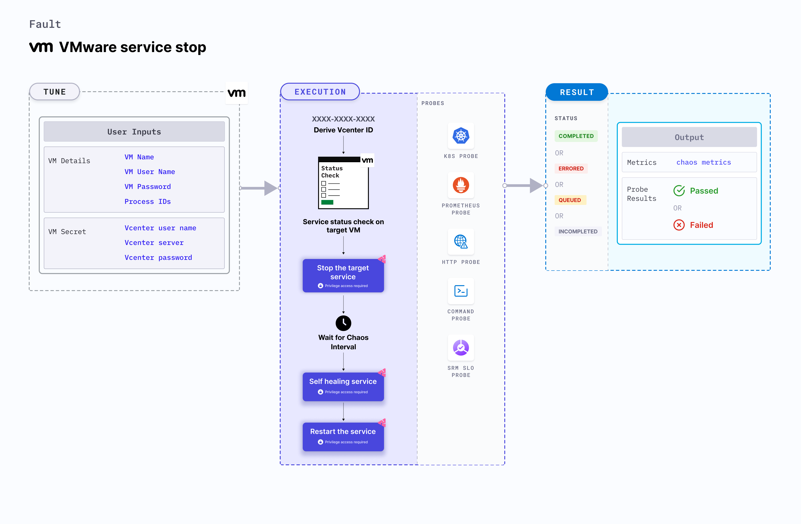

VMware service stop stops the target system services running on a Linux OS based VMware VM. It determines the performance and resilience of the application (or service) running on the VMware VMs.



## Use cases

- VMware service stop determines the resilience of an application to random halts.
- It determines how efficiently an application recovers and restarts the services.

### Prerequisites
- Kubernetes > 1.16 is required to execute this fault.
- Execution plane should be connected to vCenter and host vCenter on port 443.
- The VM should be in a healthy state before and after injecting chaos.
- VMware tool should be installed on the target VM with remote execution enabled.
- The target processes should exist within the VM.
- Appropriate vCenter permissions should be provided to access the hosts and the VMs.
- Kubernetes secret has to be created that has the Vcenter credentials in the `CHAOS_NAMESPACE`. VM credentials can be passed as secrets or as a `ChaosEngine` environment variable. Below is a sample secret file:

```yaml
apiVersion: v1
kind: Secret
metadata:
  name: vcenter-secret
  namespace: litmus
type: Opaque
stringData:
    VCENTERSERVER: XXXXXXXXXXX
    VCENTERUSER: XXXXXXXXXXXXX
    VCENTERPASS: XXXXXXXXXXXXX
```

### Mandatory tunables

   <table>
      <tr>
        <th> Tunable </th>
        <th> Description </th>
        <th> Notes </th>
      </tr>
      <tr>
        <td> VM_NAME </td>
        <td> Name of the VM where the target processes reside. </td>
        <td> For example, <code>ubuntu-vm-1</code>. </td>
      </tr>
      <tr>
          <td> VM_USER_NAME </td>
          <td> Username of the target VM.</td>
          <td> For example, <code>vm-user</code>. </td>
      </tr>
      <tr>
          <td> VM_PASSWORD </td>
          <td> User password for the target VM. </td>
          <td> For example, <code>1234</code>. Note: You can take the password from secret as well. </td>
      </tr>
      <tr>
        <td> SERVICE_NAMES </td>
        <td> Name of the target service. </td>
        <td> For example, <code>nginx</code>. For more information, go to <a href="#service-name"> service name.</a></td>
      </tr>
    </table>

### Optional tunables

   <table>
      <tr>
        <th> Tunable </th>
        <th> Description </th>
        <th> Notes </th>
      </tr>
      <tr>
        <td> SELF_HEALING_SERVICES </td>
        <td> Set to <code>enable</code> if the target service is self-healing. </td>
        <td> Defaults to <code>disable</code>. For more information, go to <a href="#self-healing-services"> self-healing services.</a></td>
      </tr>
      <tr>
        <td> TOTAL_CHAOS_DURATION </td>
        <td> Duration that you specify, through which chaos is injected into the target resource (in seconds). </td>
        <td> Defaults to 30s. For more information, go to <a href="/docs/chaos-engineering/chaos-faults/common-tunables-for-all-faults#duration-of-the-chaos"> duration of the chaos. </a></td>
      </tr>
      <tr>
        <td> CHAOS_INTERVAL </td>
        <td> Time interval between two successive instance terminations (in seconds). </td>
        <td> Defaults to 30s. For more information, go to <a href="/docs/chaos-engineering/chaos-faults/common-tunables-for-all-faults#chaos-interval"> chaos interval. </a></td>
      </tr>
      <tr>
        <td> SEQUENCE </td>
        <td> Sequence of chaos execution for multiple instances. </td>
        <td> Defaults to parallel. Supports serial sequence as well. For more information, go to <a href="/docs/chaos-engineering/chaos-faults/common-tunables-for-all-faults#sequence-of-chaos-execution"> sequence of chaos execution.</a></td>
      </tr>
      <tr>
        <td> RAMP_TIME </td>
        <td> Period to wait before and after injecting chaos (in seconds). </td>
        <td> For example, 30s. For more information, go to <a href="/docs/chaos-engineering/chaos-faults/common-tunables-for-all-faults#ramp-time"> ramp time. </a></td>
      </tr>
      <tr>
      <td>DEFAULT_HEALTH_CHECK</td>
      <td>Determines if you wish to run the default health check which is present inside the fault. </td>
      <td> Default: 'true'. For more information, go to <a href="/docs/chaos-engineering/chaos-faults/common-tunables-for-all-faults#default-health-check"> default health check.</a></td>
      </tr>
    </table>

### Self-healing services
It specifies whether the target service has the ability to self-heal. It is self-healing if it is set to `enable`. Its default value is `disable`. Tune it by using the `SELF_HEALING_SERVICES` environment variable.

Use the following example to tune this:

[embedmd]:# (./static/manifests/vmware-service-stop/vmware-service-stop-self-healing.yaml yaml)
```yaml
# Service Stop in the VMware VM
apiVersion: litmuschaos.io/v1alpha1
kind: ChaosEngine
metadata:
  name: engine-nginx
spec:
  engineState: "active"
  chaosServiceAccount: litmus-admin
  experiments:
    - name: VMware-service-stop
      spec:
        components:
          env:
            # Name of the VM
            - name: VM_NAME
              value: 'test-vm-01'
            # Name of service
            - name: SERVICE_NAME
              value: 'nginx'
            # Self-heling ability
            - name: SELF_HEALING_SERVICES
              value: 'enable'
```

### Service name
It specifies the name of the target service running on a particular VM. Tune it by using the `SERVICE_NAME` environment variable.

Use the following example to tune this:

[embedmd]:# (./static/manifests/vmware-service-stop/vmware-service-stop.yaml yaml)
```yaml
# Service Stop in the VMware VM
apiVersion: litmuschaos.io/v1alpha1
kind: ChaosEngine
metadata:
  name: engine-nginx
spec:
  engineState: "active"
  chaosServiceAccount: litmus-admin
  experiments:
    - name: VMware-service-stop
      spec:
        components:
          env:
            # Name of the VM
            - name: VM_NAME
              value: 'test-vm-01'
            # Name of service
            - name: SERVICE_NAME
              value: 'nginx'
```
