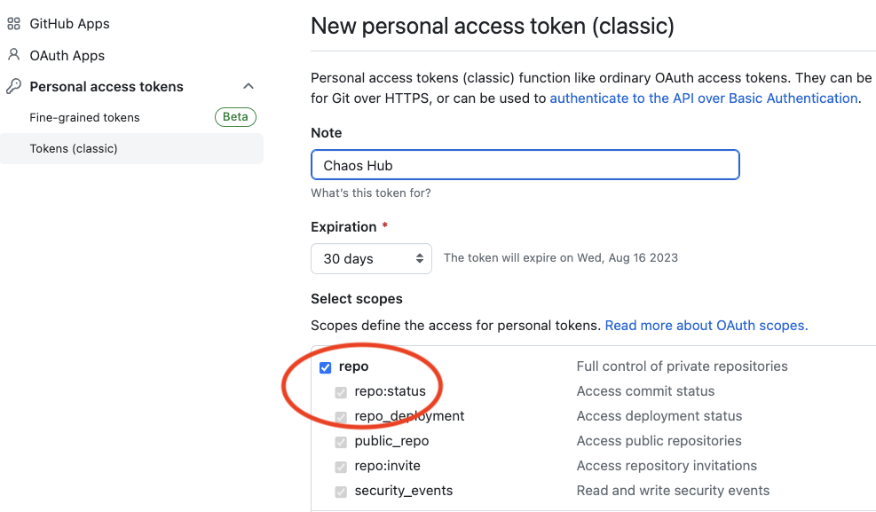
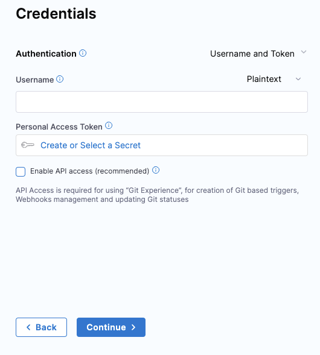

A chaos hub is a collection of experiment templates and faults you can use to launch chaos experiments. CE provides a default **Enterprise Chaos Hub** that includes a wide array of templates and faults out of the box. You can also add custom chaos hubs to maintain and distribute private faults and experiments within your organization.

This topic shows how to add and connect a custom chaos hub. 

## Prerequisites

1. Be sure you have a git repository for your custom chaos hub, where you will store experiments and faults. The repository must include two folders: `experiments` and `faults`. Here's an example:

	

1. Generate a personal access token [from GitHub](https://github.com/settings/tokens) to access and sync your repository with Harness. The token must have at least the **repo** scope.

	

## Add a custom chaos hub

To add a custom chaos hub:

1. In Harness, navigate to the **Chaos > ChaosHubs**, and then select **+ New ChaosHub**.

1. Enter a **Name** for the hub, and optionally, add a **Description** and **Tags**.

1. Select **Continue**.

1. In the Git Connection screen, add a new Git connector to access and sync your repository with Harness. 

	

	1. Select the field **ChaosHub Connector**. This displays existing Git connectors listed under separate tabs for Project, Organization, and Account scopes. 

		

	1. Select **New Connector**, and then choose **GitHub Connector**.

	1. In the Overview screen, enter a **Name** and optional description and tags, and then select **Continue**.

		The Details screen is displayed.

		

	1. In the Details screen, for **URL Type**, select **Repository**. 

		You can select **Account** instead if you want to create an account-scoped GitHub connector. This may be used for connecting multiple Chaos Hubs from a single GitHub account. 

	1. For **Connection Type**, select **HTTP**. 

	1. In **GitHub Repository URL**, enter the URL of your custom chaos hub repository.

		If you selected **Account** for **URL Type**, fill out these fields instead:

		* In **GitHub Account URL**, enter the account URL for your custom chaos hub repository.  

		* In **Test Repository**, enter any repository name from your GitHub account to validate the connection.

	1. Select **Continue**.

		The Credentials screen is displayed.

		

1. On the Credentials screen, enter the **Username** (in plain text) for authenticating with your GitHub repo.

1. In **Personal Access Token**, select **Create or Select a Secret**.

	This displays all the secrets in separate tabs for Project, Organization, and Account scopes. 

	

1. Select **New Secret Text**.

	

1. In the Add new Encrypted Text screen, fill out the fields as follows:

	1. In **Secret Name**, enter a name for this secret.
	1. In **Secret Value**, enter a personal access token (PAT) generated from [GitHub](https://github.com/settings/tokens).

		Ensure that the token has at least a [**repo**](#prerequisites) scope. 

1. Select **Save**, and then on the Credentials screen, select **Continue**.

	

	This adds your GitHub repo connector and initializes the PAT for authentication. 

1. In the Connect to provider screen, select **Connect through Harness Platform**, and then select **Save and Continue**.

	This starts a connection test, which validates that Harness is able to access the Git repository with the given configuration. 

	

1. When the test is successful, select **Finish**.	

	The Git Connection screen is displayed. 

	

1. In **Hub Repository Branch**, enter the repository branch in which the Chaos Hub files exist. 
1. Select **Connect Hub**, and then select **Finish**.

	Your new custom chaos hub appears in the **ChaosHubs** page.

## Next steps

Now you can add and launch experiments in your custom chaos hub, or add YAML fault and experiment definitions directly in your chaos hub GitHub repo, and then sync it with Harness. Head to [Manage custom chaos hubs](/docs/chaos-engineering/configure-chaos-experiments/chaos-hubs/manage-hub) for details.
