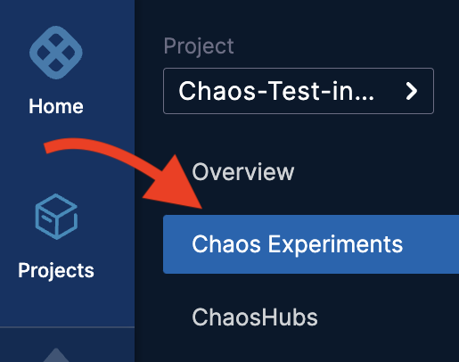
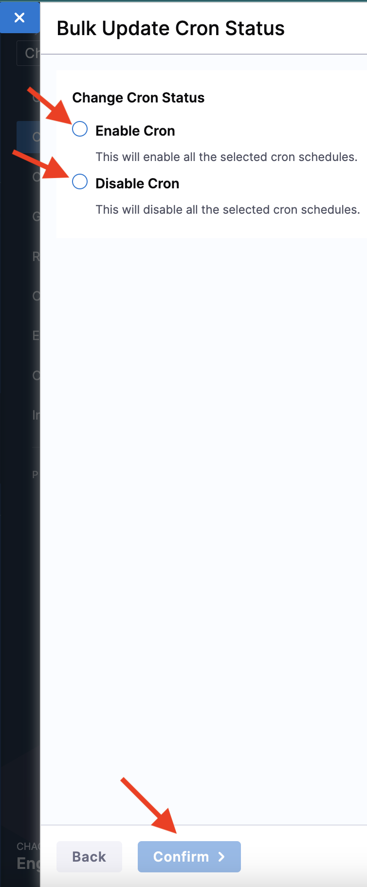
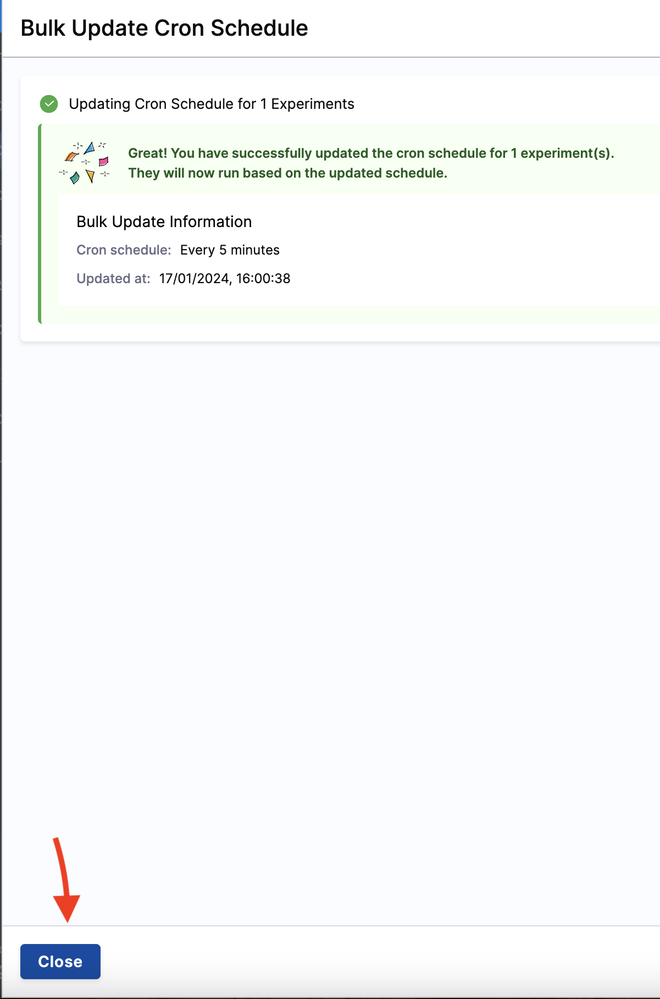

import Tabs from '@theme/Tabs';
import TabItem from '@theme/TabItem';

You can edit an existing chaos experiment to update the experiment's metadata, faults, schedule, etc. This section describes three actions:
1. Editing an experiment
2. Update old experiment manifests
3. Bulk updating cron schedules

## Edit a chaos experiment

Described below are the steps to edit a chaos experiment. 

### Step 1: Click Edit experiment

On the **Chaos Experiments** page, select the **`⋮`** icon against the name of the experiment you want to edit and select **Edit Experiment**.

### Step 2: Make changes and save

You can either update the changes to the same experiment and save it or create a copy of the experiment and then apply the changes to it.

## Execute experiment with advanced options

You can execute the chaos experiment with advanced security options: **runAsUser** or **runAsGroup**. Both the options allow privileged or restricted access to experiment pods.

1. **runAsUser**: Specifies the user ID used to start all the processes in the experiment pod containers. Default user ID is 1000.

2. **runAsGroup**: Specifies the group ID used to start all the processes in the experiment pod containers instead of a user ID.

To select one of the options, 

### Step 1: Navigate to your experiment

* Click **Experiment builder** tab. Click **Advanced Options** on the right side of the screen.

### Step 2: Select the option and save

* Click **Security** tab and select/unselect one or both the options.

### Step 3: Save the changes

Click **Save**.

## Update old experiment manifests

When you upgrade the chaos infrastructure, you also need to update the images in the experiment manifest (yaml file) corresponding to the updated chaos infrastructure. The upgraded images should match the images in the Enterprise Chaos Hub. 

### Which image version should you use?

To determine the latest version of images, navigate to Enterprise Chaos Hub, and search for **chaos-go-runner**. The value associated with **chaos-go-runner** in the manifest in Enterprise Chaos Hub is the latest version. 

To update the experiment manifest, follow the steps below.

### Step 1: Navigate to Chaos Experiments page

### Step 2: Select experiment

Select the experiment whose manifest you wish to update, and click the **Experiment Builder** tab.

### Step 3: Click YAML to edit 

The **VISUAL** is usually displayed, click the **YAML** to edit it. Click **Edit Yaml**.

### Step 4: Search instances of chaos-go-runner

Find **chaos-go-runner** in the manifest and replace the corresponding version with the latest version.

### Step 5: Click Save

Once you update the images, click **Save** at the top right.

:::tip
When you create a new experiment, the images in the experiment manifest are configured to match the images in the Enterprise Chaos Hub.
:::

The steps mentioned earlier will update the experiment manifests to match the version in the Enterprise Chaos Hub. 

## Bulk update cron schedules

You can update multiple cron-scheduled chaos experiments in one go. One important aspect is that you can **bulk update** multiple cron schedules to a **single value**, that is, the cron schedules you select to update will all update to a single common value. You **can't** map different cron schedules to their respective values while performing a bulk update.
You can: 
1. Bulk disable active schedules
2. Bulk enable inactive cron schedules
3. Bulk stop running experiments

To enable/disable a cron schedule,

### Step 1: Click Bulk update

Once you click **Bulk update** at the top right of the **Chaos Experiments** page, you will see two options: 
1. Reschedule cron 
2. Enable/disable cron

Select one of the above based on your requirements.

:::tip
You can bulk update (reschedule or enable/disable) not more than 20 experiments in one go.
:::

### Step 2: Select experiments

Select one or more experiments that you wish to reschedule or enable/disable.

### Step 3: Perform the bulk update on selected experiments

Based on your choice between rescheduling or enabling (or disabling) a cron schedule, you will see one of the screens.

<Tabs>
  <TabItem value="Reschedule">

You can change the schedule of the experiments by changing the values, and click **Confirm**.

 </TabItem>
  <TabItem value="Enable/disable">

You can select one of the options (enable cron or disable cron), and click **Confirm**.

</TabItem>
</Tabs>

### Step 4: Click close

You will see a confirmation message on your screen about the updated schedule. Click **Close**.

