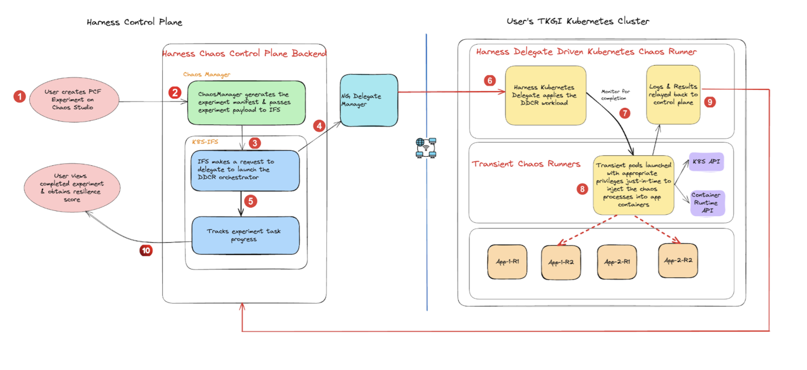

This topic walks you through Chaos V2 and how it facilitates quick onboarding and optimizes chaos experiments.

### What is Chaos V2?

ChaosV2 is a beta product in HCE that allows for quick onboarding and optimized chaos execution for microservices-based targets on Kubernetes.
The features described below help achieve quick onboarding and optimized chaos experiment execution.
The diagram below describes the high-level flow of how to discover services and create network maps.

    

### Features of Chaos V2
- Automated Kubernetes [service discovery](/docs/chaos-engineering/features/service-discovery/intro-service-discovery) and workloads with network traffic patterns between them through a transient discovery agent.
- [Automated](/docs/chaos-engineering/onboarding/guided-onboarding#choose-between-automatic-and-customizable-network-map-creation) and [guided](/docs/chaos-engineering/features/network-maps/intro-network-map#create-a-network-map) creation of network maps that represent a fully functional application within the cluster (which comprises of several constituent microservices).
- Chaos experiment recommendation for a given network map based on the workload specification and its lineage in terms of network traffic.
- Reuse of the Harness Delegate for chaos experiment execution on the user cluster without a dedicated (or separate) chaos agent.

### Experiment recommendations
Experiments are auto-created based on levels (or categories) you select. The default setting is that HCE creates all the recommended experiments for the selected network map.

    

### Delegate Driven Chaos Injection (DDCI)

The schematic diagram below describes how chaos experiments are executed in chaos V2. Chaos V2 highlights the use of Harness Delegate which eliminates the need for a dedicated chaos agent, which simplifies the experiment orchestration mechanism.

    

Go to [permissions required](/docs/chaos-engineering/features/chaos-v2/permissions) to know the detailed list of permissions to execute DDCR-based Kubernetes faults.

The diagram below describes the detailed flow of control for an example chaos experiment- [pod DNS chaos](/docs/chaos-engineering/chaos-faults/kubernetes/pod/pod-dns-error).

    
