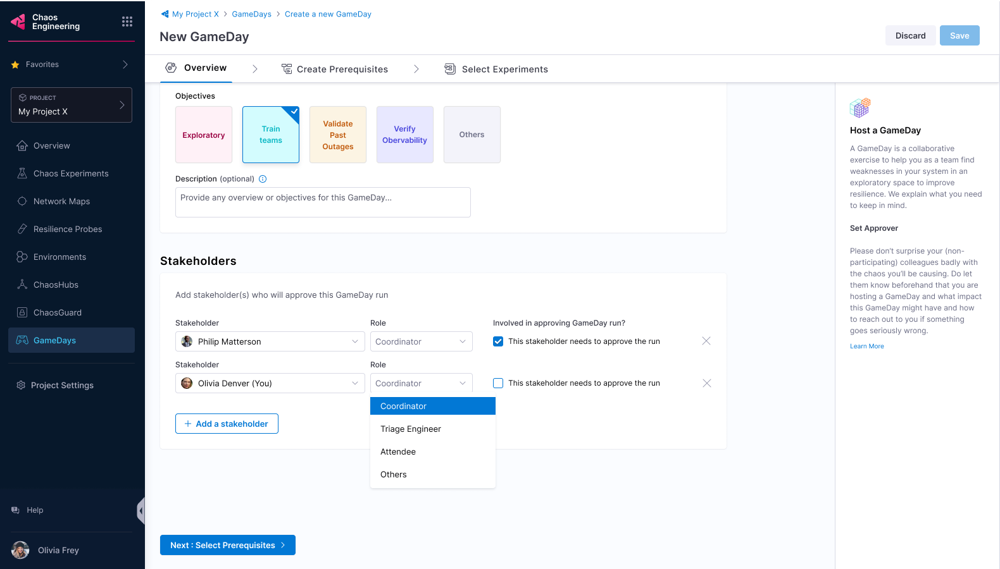
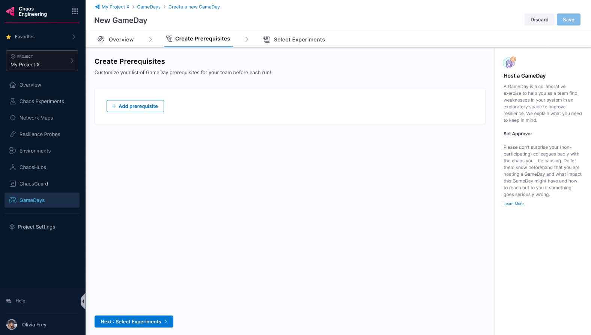
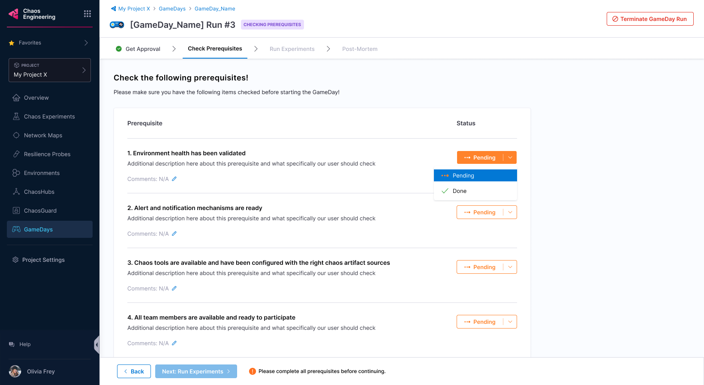
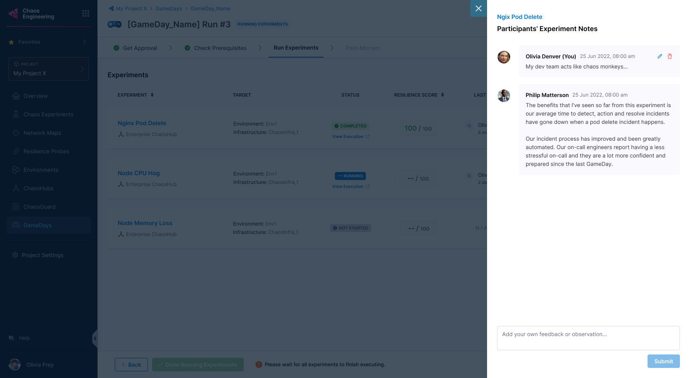

This section describes how to create and execute [GameDay V2](/docs/chaos-engineering/features/gameday/introduction-to-gameday.md).

### Why GameDay V2?
GameDay V2 introduces additional layers of control, such as stakeholder role, their permission to execute a GameDay, prerequisites and so on.

- If you are an existing HCE user, head to [GameDay V1](/docs/chaos-engineering/features/gameday/run-gameday.md) to create and execute a GameDay.

- Fulfill the [prerequisites](/docs/chaos-engineering/features/gameday/run-gameday#prerequisites) and [plan your GameDay](/docs/chaos-engineering/features/gameday/run-gameday#plan-your-gameday) before creating one.

:::tip
GameDay requires an active chaos infrastructure. If you don't have one, go to [create a new infrastructure](http://localhost:3003/docs/chaos-engineering/features/chaos-infrastructure/connect-chaos-infrastructures#step-2-add-a-chaos-infrastructure) to create one.
:::

### Start a GameDay run

If you have created your GameDay earlier, select **Start New Run** to run the GameDay; otherwise, [create a GameDay](#create-a-gameday).

 

### Create a GameDay

1. Select **+New GameDay**.

    

### Add stakeholder and role

2. Add stakeholder names, their roles, and whether they are required to approve a GameDay run. Anyone can approve or reject a GameDay run. Select **Next: Select Prerequisites**.

    

### Create prerequisites

You can create prerequisites for your GameDay to:
 * Validate environment health.
 * Check the availability of relevant chaos tools.
 * Check if the chaos tools are configured with the right chaos artefact sources.
 * Check the availability of the team members.

3. Select **+ Add prerequisite**.

    

4. Enter a title and a description (optional). Select **Save**.

    

### Select experiments

5. Select **Next: Select Experiments** to select chaos experiments to execute.

    

6. Select an environment, an infrastructure type, an infrastructure, and a ChaosHub. Select the chaos experiment and select **Add Experiment to GameDay**.

    

7. Select **Save** (or **Discard** if you don't want to proceed). You can add a new experiment, edit or delete existing experiments in this step.

    

### Check prerequisites

8. Once the stakeholders approve the GameDay run, you can proceed.

    

:::info note
- A stakeholder can reject the run and state reasons in the comments.

 
:::

9. Select **Next: Check prerequisites** to validate whether the prerequisites you mentioned earlier have been fulfilled.

    

10. You can verify if the prerequisites are fulfilled, and check them. If one of them is not fulfilled, you will not be able to execute the experiments.

    

:::tip
- You can add comments about the prerequisite validation.
 
:::

### Execute experiments

11. Once all the prerequisites are fulfilled, select **Next: Run experiments**.

    

12. Once all the experiments complete execution, select **Done Running Experiments**.

    

:::info note
- Select **Terminate GameDay Run** to stop GameDay execution. Select **Terminate this run** to confirm.

 

- Select **Add/View Notes** to note your findings about experiments in the GameDay.

 
:::

13. Once the experiments complete execution, select **Complete GameDay Run**. You can view the summary of the runs and the run observations.

    

:::info note
- Select **Done Running Experiments** to complete the run. If your chaos experiments have faults that have not run, they will be marked **Skipped**.

 
:::

## Conclusion

Congratulations on scheduling (or running) your GameDay! Based on the results, you can take steps to improve the resilience of your application.