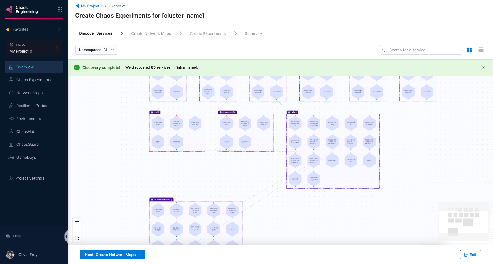
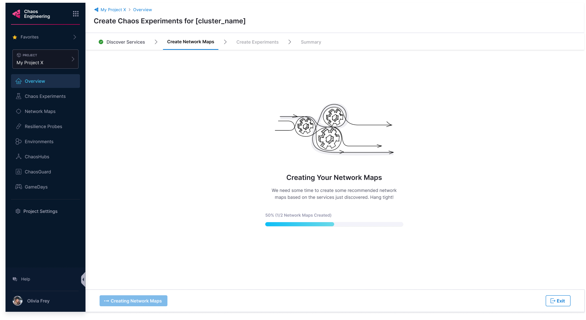
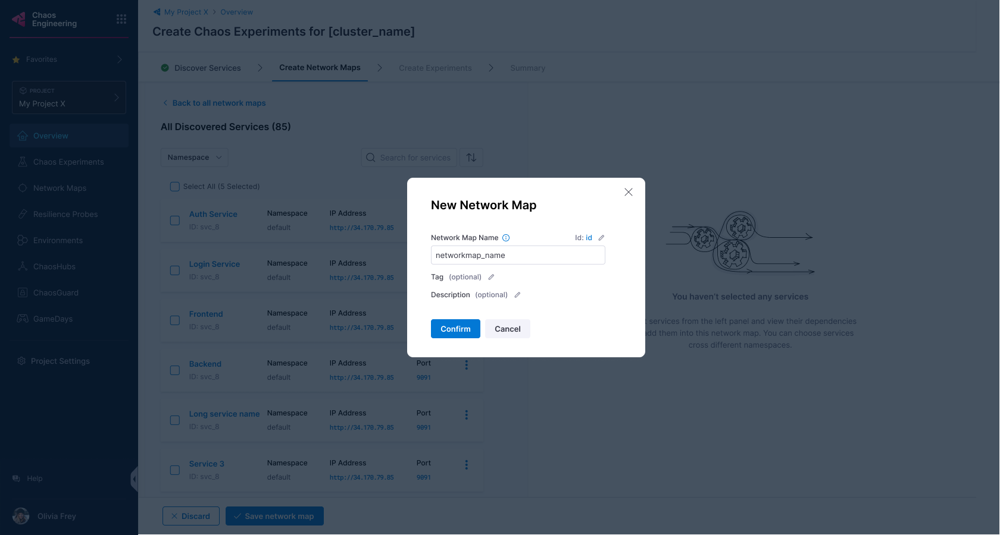
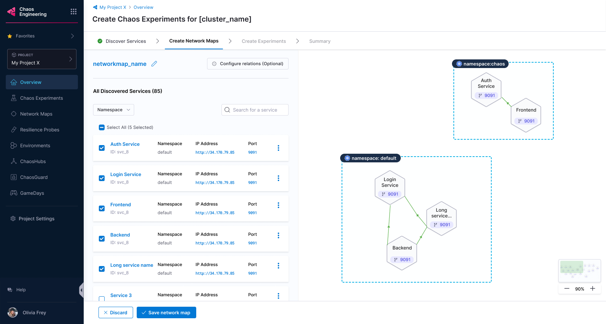
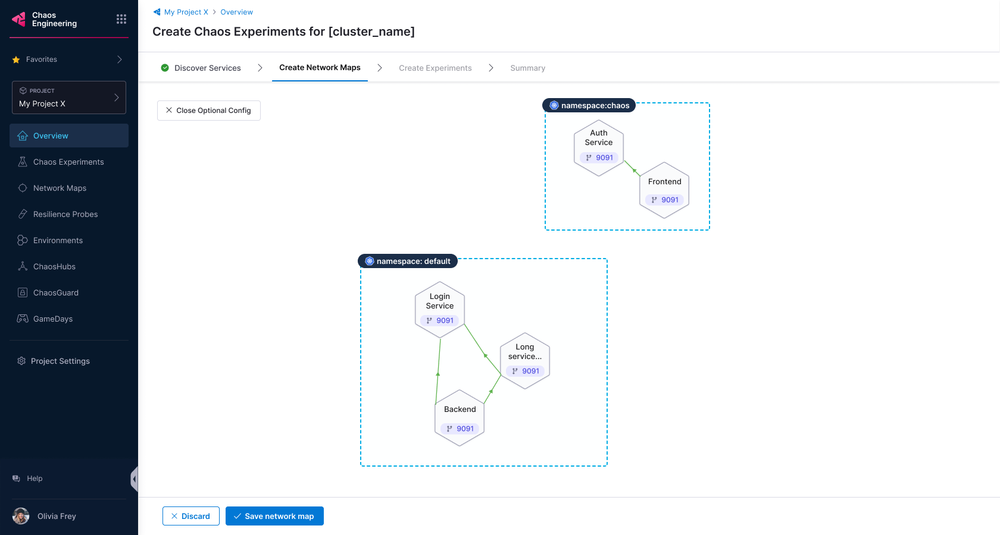
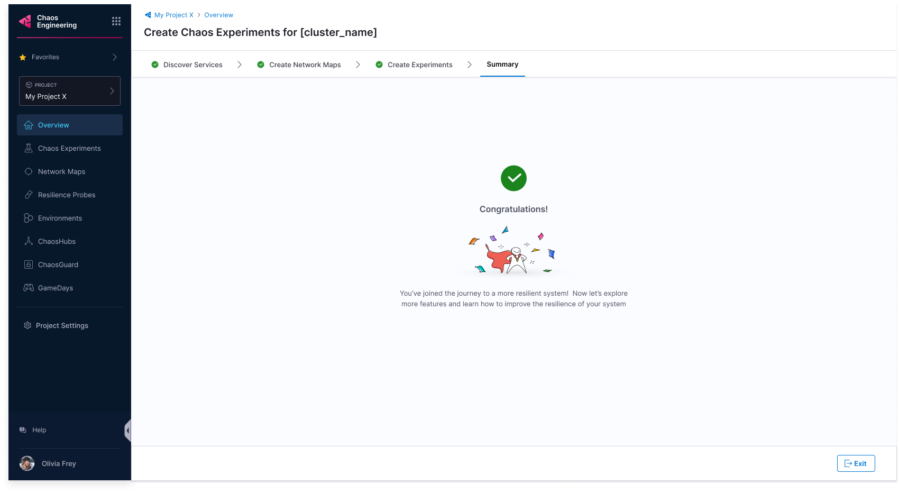
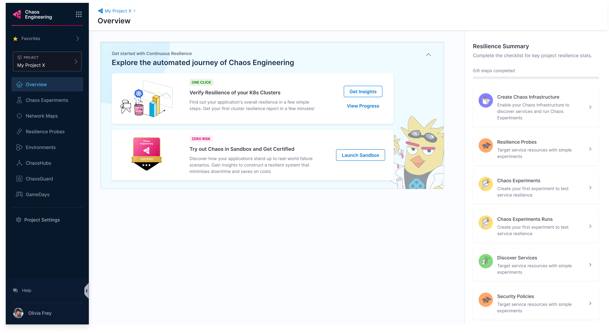
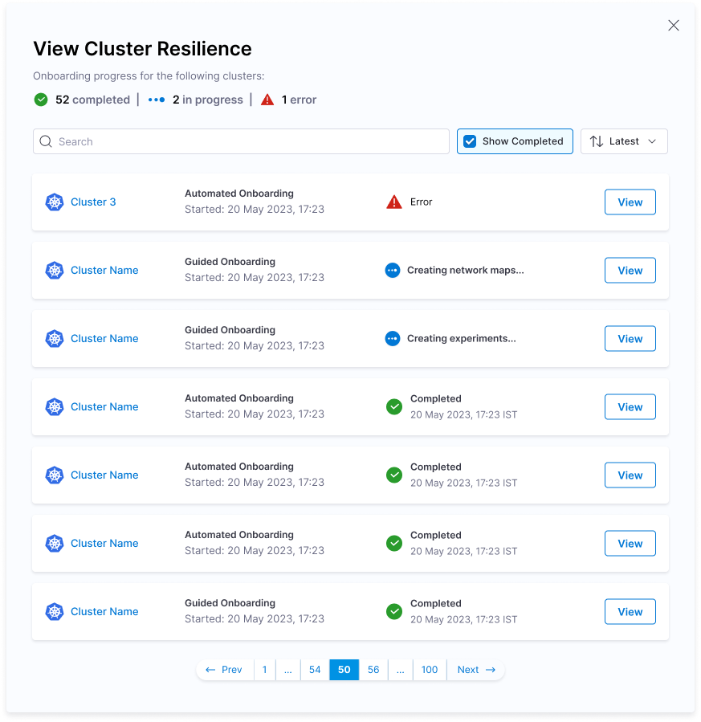

import Tabs from '@theme/Tabs';
import TabItem from '@theme/TabItem';

This topic describes the following operations:
1. Create an environment and an infrastructure with single clicks.
2. Automatically discover services on your cluster.
3. Create network maps (with a single click).
4. Choose the chaos experiments to run.
5. View the resilience of chaos experiments.

## Before you begin

* [What is chaos engineering?](/docs/chaos-engineering/get-started/overview)
* [Onboarding overview](/docs/chaos-engineering/get-started/onboarding/hce-onboarding.md)
* [HCE single-click onboarding](/docs/chaos-engineering/get-started/onboarding/single-click-onboarding.md)

## Steps to discover services, create network maps, and execute chaos experiments

1. Navigate to **Chaos** module and click **Overview** to find the onboarding option.

    

### Choose between automatic and customizable experiment creation

2. In this topic, you will create network maps and execute chaos experiments, so select **No, I will choose**.

    

### Select an environment

3. As the first step, select an environment from a list of environments and click **Next**.

    

### Select an infrastructure
4. It may take a while to set up the environment. In the second step, select an infrastructure from the list of infrastructure and click **Next**.

    

5. The next step verifies some permissions by running pre-configured checks, after which you can click **Next**.

    

### Customize Discovery Agent

6. HCE creates the discovery agent that will automatically discover services for your application. The next step (optional) collects information about blocked namespaces, service discovery periods, etc.

:::tip
If you want to customize the discovery agent, navigate to project settings and create a discovery agent. Enter a **Discovery Agent Name** and **Tags** (optional).

    
:::

7. Once you complete the steps mentioned earlier, HCE looks for services in your cluster (which may take a while).

    

### Create Network Maps

8. Once HCE discovers the services, the UI lists them for your reference. Click **Create Network Maps**.

    

9. HCE prompts you to select one of the options- whether you wish to create network maps automatically or not.

### Choose between automatic and customizable network mao creation

<Tabs>
 <TabItem value="Automatic">

9a. Select **Yes** to automatically create network maps. Click **Create Network Maps**.

    

9b. You will find network map recommendations from HCE based on the discovered services.

    

</TabItem>

<TabItem value="Customize">

9a. Select **No** to customize network map creation and click **Create Network Maps**.

    

9b. Enter a **Network Map Name**, **Tag** (optional), and **Description** (optional). Click **Confirm**.

    

9c. This creates network maps and lists them on the UI.

    

9d. To select and save some or all the created network maps, click **Save network map**.

    

</TabItem>
</Tabs>

### Create chaos experiments

10. HCE lists the network maps for you to choose from. Select one and click **Next: Create Chaos Experiments**.

    

11. You can choose between **Basic**, **Intermediate**, and **Advanced** chaos experiments (categorized based on their blast radius). Click **Create Experiments** to initiate the process.

    

12. Based on your choice, HCE creates chaos experiments and lists the network maps associated with the experiments on the UI. Click **Complete** or **Exit**.

    

### Execute chaos experiments

13. Click **Run** to execute the chaos experiments.

    

14. Congratulations! You have successfully:

 - Discovered services
 - Created network maps
 - Created chaos experiments
 - Executed the chaos experiments
    

### View resilience score

Once the experiments you selected complete their execution, you can see the resilience score of these experiments.

You can check the resilience summary once you fulfill the checklist requirements.

 

You can click **View** to see the progress of different clusters executing various chaos experiments.

 

## Next steps

Don't forget to check other walkthroughs! Some of them are right here.

* [Run your first chaos experiment](/docs/chaos-engineering/get-started/tutorials/first-chaos-engineering.md)
* [Executing experiments in a sandbox](/docs/chaos-engineering/certifications/run-experiments-in-sandbox.md)
* [Create chaos experiments from scratch](/docs/chaos-engineering/get-started/tutorials/chaos-experiment-from-blank-canvas.md)
