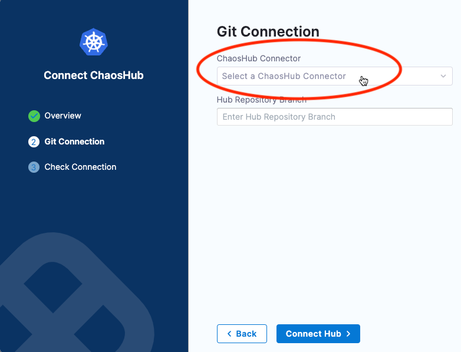
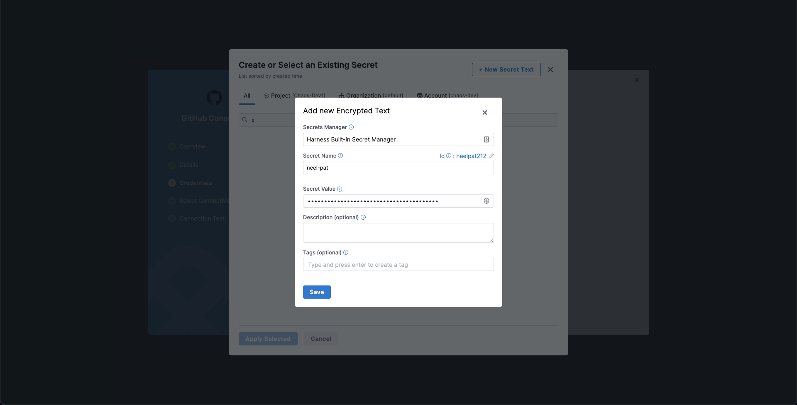
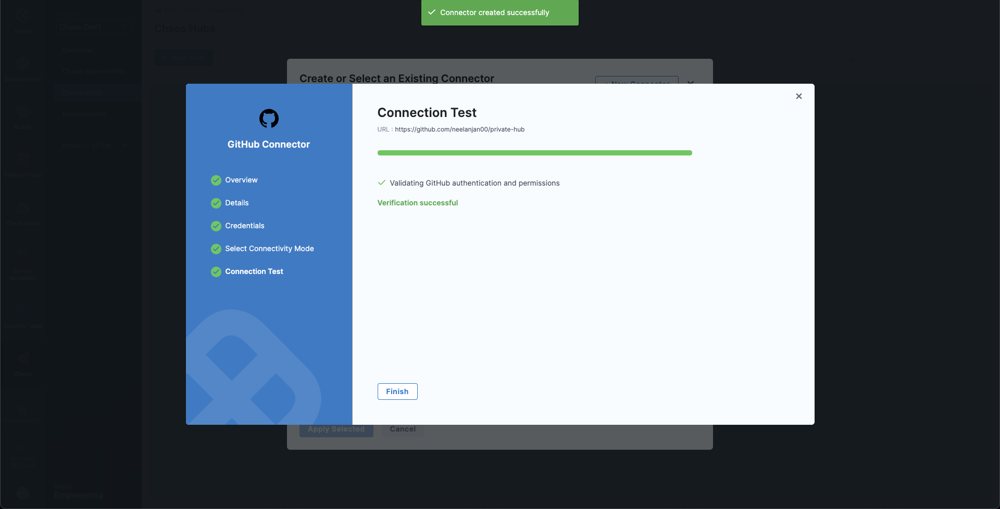

import Tabs from '@theme/Tabs';
import TabItem from '@theme/TabItem';

This topic describes how to add and connect a custom ChaosHub.

## Prerequisites for Adding a Custom ChaosHub

1. Make sure you have a Git repository for your custom ChaosHub, where you will store experiments and faults. The repository must include two folders: `experiments` and `faults`. Here's an example repo:

	

1. [Generate a personal access token](https://docs.github.com/en/authentication/keeping-your-account-and-data-secure/managing-your-personal-access-tokens#creating-a-personal-access-token-classic) [from GitHub](https://github.com/settings/tokens) to access and sync your repository with Harness. The token must have at least the **repo** scope.

	

## Add a Custom ChaosHub

<Tabs>
  <TabItem value="Interactive guide">

<iframe
	src="https://app.tango.us/app/embed/a8a0fd9f-46ba-47f6-ab36-9fb1a446caa6"
	style={{minHeight:'640px'}}
	sandbox="allow-scripts allow-top-navigation-by-user-activation allow-popups allow-same-origin"
	title="Creating a New ChaosHub and Connector in Harness"
	width="100%"
	height="100%"
	referrerpolicy="strict-origin-when-cross-origin"
	frameborder="0" webkitallowfullscreen="webkitallowfullscreen" mozallowfullscreen="mozallowfullscreen"
	allowfullscreen="allowfullscreen"></iframe>

</TabItem>

<TabItem value="Step-by-step guide">

1. In your Harness project, navigate to the **Chaos > ChaosHubs**, and then select **+ New ChaosHub**.

1. Enter a **Name** for the hub and optionally add a **Description** and **Tags**.

1. Select **Continue**.

1. On the Git Connection screen, add a new Git connector to access and sync your repository with Harness.

	

	1. In the **ChaosHub Connector** field. you'll see existing Git connectors listed under separate tabs for Project, Organization, and Account scopes.

		

	1. Select **New Connector**, and then choose **GitHub Connector**.

	1. In the Overview screen, enter a **Name** and optional description and tags, and then select **Continue**.

		The Details screen is displayed.

		

	1. In the Details screen, for **URL Type**, select **Repository**.

		You can select **Account** if you want to create an account-scoped GitHub connector. This can be used for connecting multiple ChaosHubs from a single GitHub account.

	1. For **Connection Type**, select **HTTP**.

	1. In **GitHub Repository URL**, enter the URL of your custom ChaosHub repository.

		If you selected **Account** for **URL Type**, fill out these fields instead:

		* In **GitHub Account URL**, enter the account URL for your custom ChaosHub repository.

		* In **Test Repository**, enter any repository name from your GitHub account to validate the connection.

	1. Select **Continue**.

		The Credentials screen appears.

		

1. On the Credentials screen, enter the **Username** (in plain text) for authenticating with your GitHub repository.

1. In **Personal Access Token**, select **Create or Select a Secret**.

	This displays all the secrets in separate tabs for Project, Organization, and Account scopes.

	

1. Select **New Secret Text**.

	

1. In the **Add new Encrypted Text** screen, fill out the fields as follows:

	1. In **Secret Name**, enter a name for this secret.
	1. In **Secret Value**, enter a personal access token (PAT) generated from [GitHub](https://github.com/settings/tokens).

		Ensure that the token has at least a [**repo**](#prerequisites) scope.

1. Select **Save**, and then on the Credentials screen, select **Continue**.

	

	This adds your GitHub repository connector and initializes the PAT for authentication.

1. In the **Connect to provider** screen, select **Connect through Harness Platform**, and then select **Save and Continue**.

	This starts a connection test to validate that Harness can access the Git repository with the given configuration.

	

1. When the test is successful, select **Finish**.

	The Git Connection screen appears.

	

1. In **Hub Repository Branch**, enter the repository branch in which the ChaosHub files are located.
1. Select **Connect Hub**, and then select **Finish**.

	Your new custom ChaosHub appears on the **ChaosHubs** page.

</TabItem>
</Tabs>

:::info note
To share your custom ChaosHub with another Harness project, add the hub to the other project by following the same procedure.
:::

## Next steps

You can add and launch experiments in your custom ChaosHub, or add YAML fault and experiment definitions directly in your ChaosHub GitHub repository, and then sync it with Harness. For more details, go to [Manage ChaosHub](/docs/chaos-engineering/use-harness-ce/chaoshubs/manage-hub).
