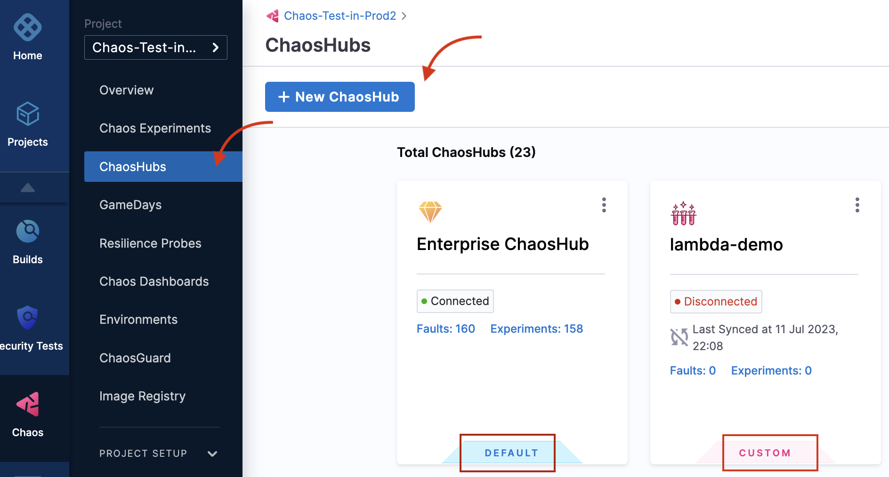
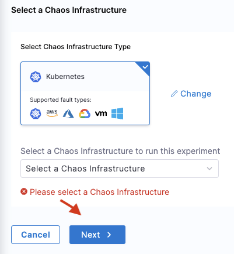
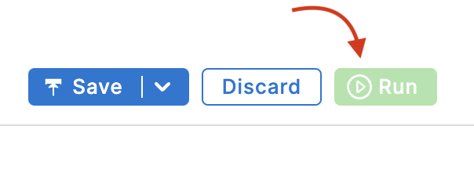

This section explains how to save and manage experiments in your custom ChaosHub(s) and how to sync your ChaosHub GitHub repository with Harness. For setup instructions, see [Add a Custom ChaosHub](/docs/chaos-engineering/guides/chaoshubs/add-chaos-hub).

## View ChaosHubs

The experiments in various ChaosHubs are templates that you can launch after specifying some details.

To view the default and custom ChaosHubs:

1. In Harness, navigate to **Chaos > ChaosHubs**.

	This page lists the default Enterprise ChaosHub and any custom ChaosHubs.

	

1. Select the ChaosHub you want to view.

	The experiments below are in a custom hub. By default, all experiments are displayed. You can select a tag (circled below) to filter the experiments.

	

	The experiments below are in the default Enterprise ChaosHub, organized by platform/technology.

	

## Add Experiments to a Custom ChaosHub

When you add an experiment to a custom ChaosHub, it's saved as a template from which you can [launch](#launch-an-experiment-from-a-custom-chaos-hub) the experiment after specifying some details.

To add an experiment to a custom ChaosHub:

1. [Create an experiment](/docs/chaos-engineering/guides/experiments/create-experiments).

1. In the Chaos Experiments page, find the experiment you want to add to a custom ChaosHub, select the **More options** icon (**⋮**), and then select **Add to ChaosHub**.

	

1. On the Save to ChaosHub screen, verify the **Name**, **Description** and **Experiment Category Tag**.

	To add a new tag, type its name and then press the Enter/Return key.

	

	:::tip
	Including **Experiment Category Tag(s)** helps organize your experiments. When you [view](#view-chaos-hubs) the custom ChaosHub, you can see all experiments or filter them by tag.
	:::

1. In the **Hub** field, choose the custom ChaosHub you want to save the experiment, and then select **Apply**.

1. Select **Save**.

	This saves your experiment as a template in a custom ChaosHub.

:::info note
You can also save an experiment as a template to a custom ChaosHub while [creating the experiment](/docs/chaos-engineering/guides/experiments/create-experiments) in Chaos Studio. The **Save** button saves the experiment itself so that it appears on the Chaos Experiments page. Selecting the **down-arrow** next to **Save** lets you add the experiment as a template to a custom ChaosHub.

:::

## Sync Harness with a ChaosHub Git repository

When you [connect a custom ChaosHub](/docs/chaos-engineering/guides/chaoshubs/add-chaos-hub), you can add and edit experiments in that hub in either Harness or the custom hub's GitHub repository.
Changes made in Harness sync automatically with your repository. However, when you make changes in your repository, you need to sync them with Harness using the UI.

To sync your custom ChaosHub's Git repository with Harness:

1. In Harness, navigate to **Chaos > ChaosHubs**.
1. Select the **More options** icon (**⋮**) for the hub you want to sync, and then select **Sync Hub**.

	

## Launch an Experiment from a ChaosHub

You can launch experiments from either the default Enterprise ChaosHub or from custom hubs.

:::info note
Launching an experiment from a hub is different from running one directly from the Chaos Experiments page. The experiments in ChaosHubs are templates, so when you launch them, you'll need to provide additional details. On the other hand, experiments on the Chaos Experiments page execute immediately, as configured.
:::

To launch an experiment from a ChaosHub:

1. In Harness, go to **Chaos > ChaosHubs**. Select the hub from which you want to launch an experiment.

	

1. Find the experiment you want to launch, and then select **Launch Experiment**.

	

1. Choose a chaos infrastructure, and then select **Next**. You can change the infrastructure type if needed.

	

1. This takes you to the **Experiment Builder** where you can configure the faults in the experiment. You can add,remove or rearrange faults as needed.

	

1. Select **Run** to execute the experiment.

	

:::tip
You can also save your customized experiment as a template in a ChaosHub by selecting the **Save** button.

	
:::

## Next steps

- Chaos Dashboard