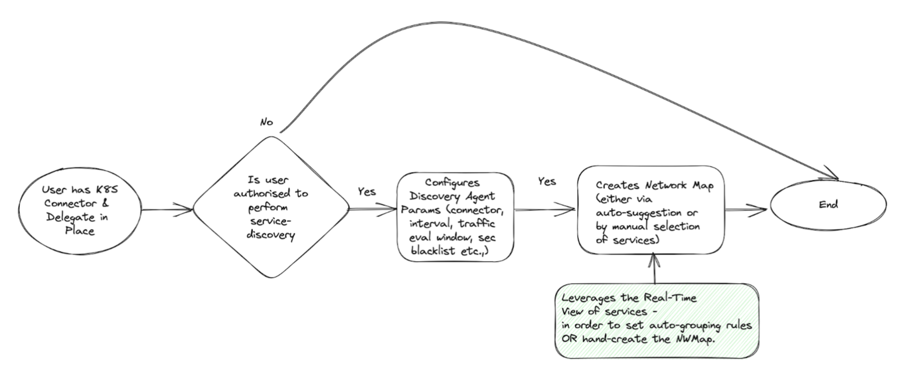
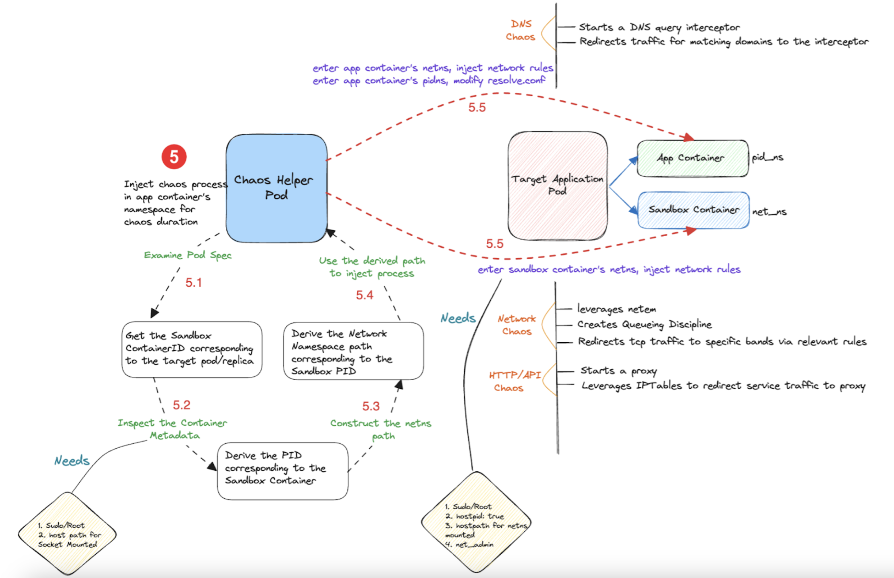
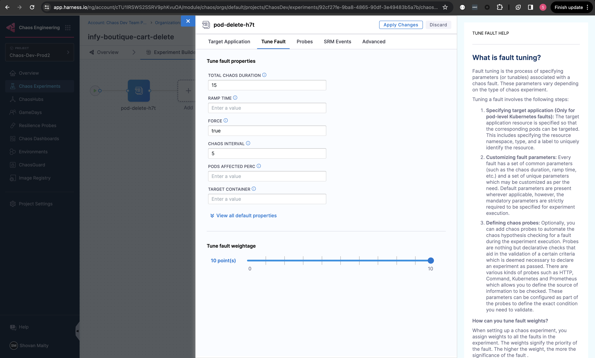

This topic walks you through Harness chaos infrastructure that uses Harness Delegate and how it facilitates quick onboarding and optimizes chaos experiments.

## What is Harness DDCI?

Harness Delegate-Driven Chaos Infrastructure (DDCI) is a beta product in HCE that allows for quick onboarding and optimized chaos execution for microservices-based targets on Kubernetes.
The features described below help achieve quick onboarding and optimized chaos experiment execution.
The diagram below describes the high-level flow of how you can [discover services](/docs/chaos-engineering/features/service-discovery/intro-service-discovery) and [create application maps](/docs/chaos-engineering/features/network-maps/intro-network-map).

    

### Experiment execution using DDCI

The schematic diagram below describes how chaos experiments are executed in Harness infrastructure using Harness Delegate, that is, using Harness DDCI. It highlights the use of Harness Delegate which eliminates the need for a dedicated chaos agent, which simplifies the experiment orchestration mechanism.

    

Go to [permissions required](/docs/chaos-engineering/onboarding/harness-infra/permissions) to know the detailed list of permissions to execute DDCR-based Kubernetes faults.

The diagram below describes the detailed flow of control (step 5 of the earlier diagram), for an example chaos experiment- [pod DNS chaos](/docs/chaos-engineering/chaos-faults/kubernetes/pod/pod-dns-error).

    

## Features of Harness DDCI
- Automated Kubernetes [service discovery](/docs/chaos-engineering/features/service-discovery/intro-service-discovery) and workloads with network traffic patterns between them through a transient discovery agent.
- [Automated](/docs/chaos-engineering/onboarding/guided-onboarding#choose-between-automatic-and-customizable-network-map-creation) and [guided](/docs/chaos-engineering/features/network-maps/intro-network-map#create-a-network-map) application map creation that represent a fully functional application within the cluster (which comprises of several constituent microservices).
- [Chaos experiment auto-creation](#auto-create-experiment) for a given [application map](/docs/chaos-engineering/features/network-maps/intro-network-map) based on the workload specification and its lineage in terms of network traffic.
- Reuse the Harness Delegate for chaos experiment execution on the user cluster without a dedicated (or separate) chaos agent.
- Application-level and application map level resilience scores.

### Auto-create experiment
Experiments are auto-created based on levels (or categories) you select during automated or guided onboarding. The default setting is that HCE creates all the recommended experiments for the selected application map.

    

### Speed of execution
Previously, chaos experiments would typically take more time (in the order of 4 minutes) whereas with Harness DDCI, you can complete experiment execution in less than half the time (in the order of 1.5 minutes).

The diagram below shows the execution time for experiments that use legacy Kubernetes infrastructure.

    

The diagram below shows the execution time for experiments that use Harness DDCI.

    

### Fault tunables
The number of tunables to specify in an experiment changes; Harness DDCI gives better control over the experiments since it provides advanced tunables.

The diagram below shows the tunables used in experiments that use legacy Kubernetes infrastructure..

    

The diagram below shows the tunables used in experiments that use Harness DDCI.

    

### Resilience score

Previously, resilience score was measured at the experiment level. With Harness DDCI, you can gain insights into an application along with its associated application map. This way, you can view the application-level resilience score and application map level resilience score.