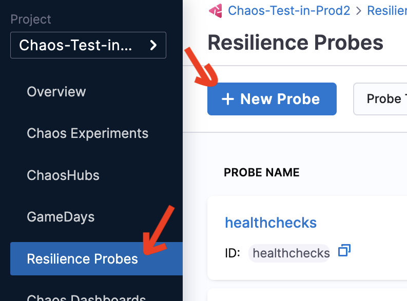
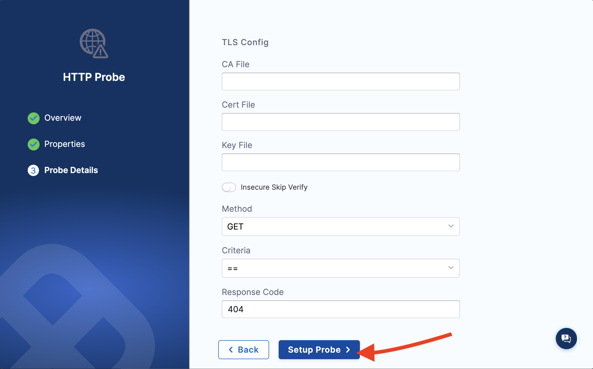
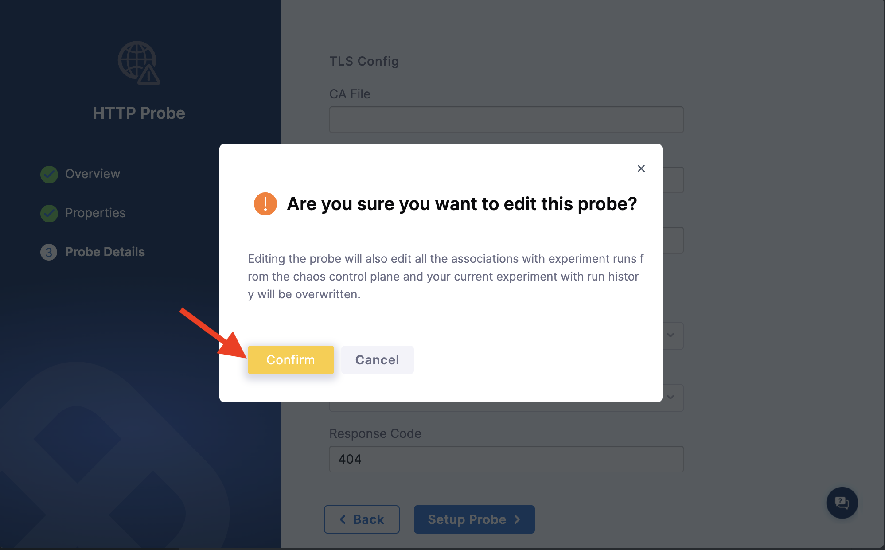

## Before you begin

- [Probes overview](./overview)
- [Configure probes](../../configure-chaos-experiments/probes/configure-and-add-probe)

This section discusses various operations that can be performed on [resilience probes](./overview).

## Create resilience probes

### Step 1: Navigate to Resilience Probes
Navigate to **Resilience Probes** and click **New Probe**.

### Step 2: Select the infrastructure and type
HCE allows you to create probes for two infrastructures, namely, Kubernetes and Linux. The type of probes allowed on each of these infrastructures is listed below.

| Kubernetes | Linux     |
|------------|-----------|
| HTTP       | HTTP      |
| Command    | Command   |
| DataDog    | DataDog   |
| Dynatrace  | Dynatrace |
| SLO        |           |
| Prometheus |           |

Based on the type of probe you select, enter the values to set up the probe.

**You can:**
- Use any number of probes within a chaos experiment.
- Use the same probes for two faults within the same chaos experiment.
- Use Kubernetes-based probes for Kubernetes experiments.
- Use Linux-based probes for Linux experiments.

**You can't:**
- Repeat the same probe multiple times in the same fault in the same experiment.

### Known limitations
Command probes in the **Source** mode is only available for Linux on the self-managed platform (SMP).

## Enable resilience probes

TO-DO

## Update resilience probes
You can update (or edit) a probe from within an experiment or from the **Resilience Probes** tab.

To update a resilience probe from within an experiment,

### Step 1: Navigate to Chaos experiment
Choose the experiment whose resilience probe/s you wish to update. Navigate to the **Experiment builder** section of the experiment.

### Step 2: Select Probes
Select **Probes** and click the three-dot menu next to the actual probe, and click **Edit probe**.

### Step 3: Edit the probe

When you click on **Edit probe**, the page navigates to the probe settings. You can't edit the name, but you can edit the **Description** and **Tags**.

Click **Configure properties** which takes you to the next page. You can edit the fields in this page. After updating the values, click **Configure details**.

This will take you to the next page where you can edit some more details, and click **Setup probe**.

Click **Confirm** to apply your changes to the resilience probes.

## Disable/delete resilience probes

TO-DO

## Resilience probes status matrix
Probe status is the single source of truth when executing a chaos experiment. The probe status in a chaos experiment can be in 4 different states.

- **AWAITED**: A probe status is in ‘awaited’ state until the fault is being executed, that is, the fault is still running. Once it has completed execution, it can be in the ‘passed’, ‘failed’ or ‘N/A’ state.
- **PASSED**: A probe status is considered ‘passed’ when the success criteria is met. 
- **FAILED**: A probe status is considered ‘failed’ when the success criteria is not met.
- **RUNNING**: A probe status is considered 'running' when the probe is currently in execution.
- **N/A**: A probe status is in the ‘N/A’ state when the result of the fault could not be determined.

## Chaos hub support

Not available yet

## Force delete resilience probes

When a probe is force deleted, it will not be available for use. You will lose history of that probe, but experiment runs that used the probe will contain the history of the probe.

TO-DO

## Resilience probes support
Resilience probes are supported by the following features:
- Resilience Tab
- Chaos Studio
- Experiments/Run Reports
- Linux and Kubernetes experiments
- GameDays
- Sandbox environment

## Default/System resilience probes

- You can create system (default probes) at the project level only once. 
- Once you create a default probe, you can't delete or disable or update it.
- Default probes are inline.

### Image registry support
- You can configure the image registry which will be used by the default probes. If you haven't configured a probe yet, the experiment will use default image registry. 
- HCE doesn't probe image registry support at the moment for default probes.

## Legacy probes support (Backward compatibility)
Users can still use legacy probes.
TO-DO

Existing Experiments should keep working.

## Audit integration

There are no audit events for resilience probes.

## Access control permissions division

ACL is mapped to the experiment ACL. 

## License

Resilience probes are not a part of any subscription, and hence you don't have any limit on the number of probes you can create. With respect to usability, 1,000 probes can be executed in a month.