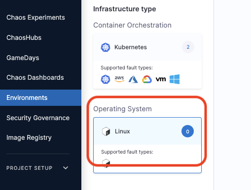
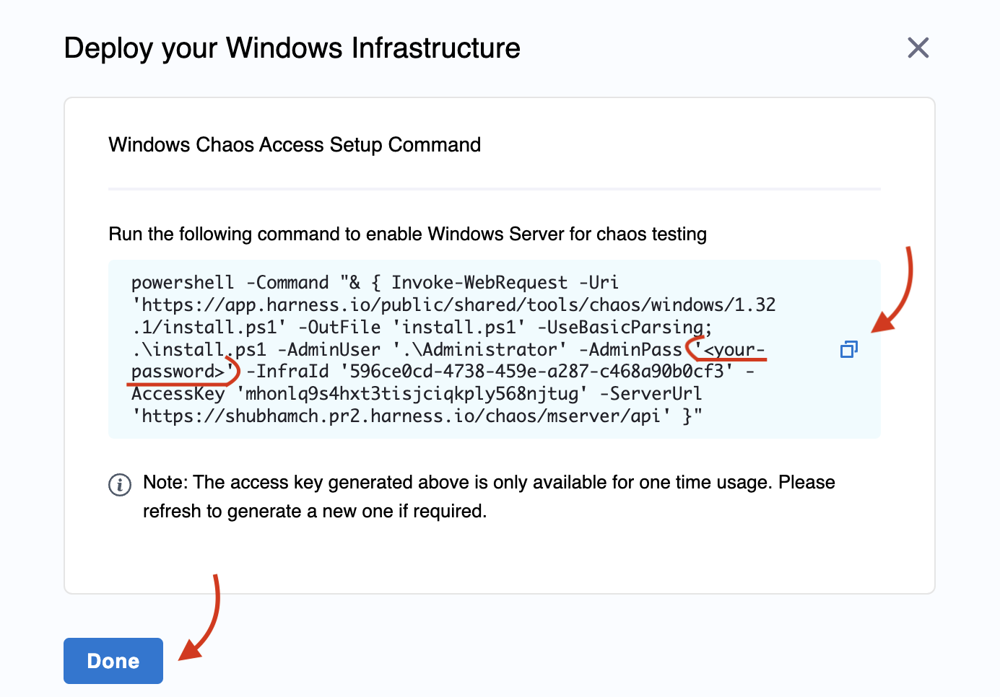

import Tabs from '@theme/Tabs';
import TabItem from '@theme/TabItem';

This topic describes how you can enable and disable a Harness Delegate to use with chaos experiments.

## Before you begin, review the following:

- [Chaos infrastructure and different types](/docs/chaos-engineering/concepts/chaos101#chaos-infrastructure).
- [Why is a chaos infrastructure required?](/docs/chaos-engineering/use-harness-ce/infrastructures/)

## Install Infrastructure

You can install chaos infrastructure as a Kubernetes service, as a Linux daemon, or as a Windows agent, based on the targets. Before creating an infrastructure, [create an environment](/docs/chaos-engineering/use-harness-ce/experiments/create-experiments#create-environment) because a chaos infrastructure is created within an environment.

:::tip
If you want to delete your environment, remove the environment references, that is, the infrastructure(s) associated with it first.
:::

### Enable Chaos

<Tabs>

<TabItem value="Dedicated Kubernetes Chaos Infrastructure">

#### Using Dedicated Chaos Infrastructure

You can enable chaos **on existing infrastructure** that uses a Harness cluster connector (also known as Harness Kubernetes connector) or **on new infrastructure**.

:::tip
You can choose between Kubernetes and Kubernetes (Harness infrastructure). The former is a dedicated infrastructure whereas the latter uses Harness Delegate.
:::

To enable chaos on an existing Harness Kubernetes connector:

1. Go to **Chaos > Environments**, and then select the environment you want to add chaos infrastructure to.

1. On the environment details page, select **+ Enable Chaos**.

1. On the next screen, select where to add chaos infrastructure, and then select **Continue**.

<Tabs>
<TabItem value="On Existing Infrastructure">

1. If you selected **On Existing Infrastructures**, on the next screen, select any connector under the **Project**, **Organization**, or **Account** scope. Select **Continue**.

    

  :::info note
  A Harness Kubernetes connector with:
    * **Cluster-wide read/write access** can be used to set up chaos infrastructure in cluster scope and namespace scope.
    * **Specific namespace access** can be used to set up a chaos infrastructure in that specific Kubernetes namespace scope only.
    * **Cluster-wide read access** cannot be used to set up a chaos infrastructure.
  :::

2. The **Configure Chaos Infrastructure** screen appears. Select the installation type, access type, namespace, and service account name. Select **Next**.

  Under **Choose Access Type**, choose one of the following modes.

    * **Cluster Wide:** This mode of infrastructure installation allows targeting resources across the entire cluster, in all the namespaces, as part of an experiment.
    * **Namespace Mode:** This mode of infrastructure installation allows targeting resources only in the namespace where the chaos infrastructure is deployed.

  By default, chaos is installed in the `hce` namespace and uses `hce` service account, which you can configure under the K8s cluster details.

  Optionally, you can specify the node selectors and Kubernetes toleration for chaos infrastructure deployment.

:::tip
- There can only be one cluster-wide chaos infrastructure per cluster.
- There may be multiple namespace-scoped chaos infrastructures per cluster.
:::

    

3. The **Deploying your Infrastructure** screen appears. If you're deploying **on existing infrastructure**, select **Done**. This is your final step. Harness installs the chaos infrastructure on your behalf.

</TabItem>
<TabItem value="On New Infrastructure">

1. If you're deploying on **new infrastructure**, provide a name for the new infrastructure, a **Description** (optional) and a **Tag** (optional). Select **Next**.

2. On the **Configure Chaos Infrastructure** screen, provide details like the installation type, access type, namespace, and service account name. Select **Next**.

3. Copy the given command(s), download the installation manifest YAML and run it on the terminal, based on cluster-wide or namespace access.

    * **For cluster-wide access:**

      1. Select **Download**, and then copy and run the `kubectl` command shown on your screen to install the chaos infrastructure. Select **Done**.

          

    * **For namespace access:**

      1. Run the first `kubectl` command to create the target namespace.
      1. Run the second `kubectl` command to apply the chaos CRDs.
      1. Select **Download**, and then copy and run the third command to install the chaos infrastructure. Select **Done**.

          

</TabItem>
</Tabs>

</TabItem>

<TabItem value="Linux">

#### On Linux infrastructure

:::info note
If you're installing the chaos infrastructure alongside SElinux, you must add a policy module to enable `timedatectl`. SElinux is enabled by default in distributions such as **CentOS**, **SUSE Linux**, **RHEL**, and **Fedora** among others.

<details>

If you have enabled SELinux for your OS, you must add a policy module prior to the installation of the infrastructure to access `timedatectl`, which is used in the **linux-time-chaos** fault.

To add the policy module:

1. Create the file `timedatectlAllow.te` in your Linux machine as follows:

  ```te

  module timedatectlAllow 1.0;

  require {
          type systemd_timedated_t;
          type initrc_t;
          class dbus send_msg;
  }

  #============= systemd_timedated_t ==============
  allow systemd_timedated_t initrc_t:dbus send_msg;

  ```

1. Install the utilities that will help in compiling and packaging the policy module for your system. Here, we're using the yum package manager to install them:

  ```bash
  sudo yum install -y policycoreutils-python checkpolicy
  ```

1. After the installation of these packages, compile the policy module with the following command:

  ```bash
  sudo checkmodule -M -m -o timedatectlAllow.mod timedatectlAllow.te
  ```

  This creates the binary policy module file `timedatectlAllow.mod`.

1. Use the policy module file from the previous step to create a policy module package:

  ```bash
  sudo semodule_package -o timedatectlAllow.pp -m timedatectlAllow.mod
  ```

  This creates the policy module package file `timedatectlAllow.pp`.

1. Add the package file from the previous step alongside the other SELinux modules in your system:

  ```bash
  sudo semodule -i timedatectlAllow.pp
  ```

The SELinux policy module is now added, and you can proceed to install the infrastructure.

</details>
:::

To enable chaos on Linux:

1. Go to **Chaos > Environments**, and then select the environment you want to add chaos infrastructure.

1. In the environment details page, under **Infrastructure type**, select **Linux**, and then select **+ Enable Chaos**.

    

1. On the next screen, enter a **Name** for the infrastructure, and optionally, a **Description** and **Tags**. Select **Next**.
You can also specify [different values](/docs/chaos-engineering/concepts/chaos101#chaos-infrastructure) for the infrastructure.

    

1. On the next screen, copy the command to set up Linux chaos access, select **Done**, and then execute the copied command on your Linux machine.

</TabItem>
<TabItem value="Windows">

#### On Windows

:::important
Ensure that you have fulfilled the [prerequisites](/docs/chaos-engineering/use-harness-ce/chaos-faults/windows/prerequisites.md) before connecting to a Windows chaos infrastructure.
:::

1. Go to **Environments** and click **Windows**. click **Enable chaos**.

    

2. Add name (mandatory), and an admin user ("Administrator"). Select **Next**.

3. Copy the command generated. The [prerequisites](/docs/chaos-engineering/use-harness-ce/chaos-faults/windows/prerequisites.md) discusses how you can configure a password. If you have a password, replace it in the `<your-password>` placeholder. Execute this command on your terminal (remember to open the command prompt as an admin if you are not an admin by default). Click **Done** once you finish the execution.

    

This displays the following updates about the installation on your terminal.

```
    Directory: C:\


Mode                 LastWriteTime         Length Name
----                 -------------         ------ ----
d-----          3/7/2024   7:48 AM                HCE
Downloading Testlimit...
Extracting Testlimit...
Accepting Testlimit EULA...
Testlimit EULA accepted.
Downloading windows-chaos-infrastructure binary...
Config file created at C:\\HCE\config.yaml


    Directory: C:\HCE\Logs


Mode                 LastWriteTime         Length Name
----                 -------------         ------ ----
-a----          3/7/2024   7:51 AM              0 windows-chaos-infrastructure.log
[SC] CreateService SUCCESS
Service created and started successfully.

```
</TabItem>

<TabItem value="Helm template">

#### Use Helm Template to Install Chaos Infrastructure

HCE provides Helm support to install chaos infrastructure, in addition to installing with the help of a manifest (as explained earlier).

To use Helm to install a chaos infrastructure,

1. Navigate to **Chaos Experiments** -> **Environment**. Select **New environment** and create an environment and install or upgrade chaos infrastructure. To enable chaos in an existing environment, click the environment.

    

2. Click **Enable chaos**.

    

3. You can use Helm commands to enable chaos on new infrastructure only. Click **On new infrastructures** and **Continue**. Add a name, description (optional), and a tag (optional). Click **Next**.

    

4. Choose the installation type as **Helm**, and one of the access types (namespace or cluster-wide). Specify namespace and service account.

    

5. Depending on the type of access you choose, you will see a set of commands. If you select namespace type, you will need to enter some advanced input values. Click **Next**.

    

6. You will see the following commands that you need to execute on your terminal. Once you are done, click **Completed Command Execution**.

    

7. If you select the namespace scope, you will see some commands that you need to execute on your terminal. One you are done, click **Completed Command Execution**.

</TabItem>

</Tabs>

### Harness Terraform Provider

You can [create Harness Delegate (DDCR)](https://registry.terraform.io/providers/harness/harness/latest/docs/resources/chaos_infrastructure) using [Harness Terraform provider](https://developer.harness.io/docs/platform/automation/terraform/harness-terraform-provider-overview/).

## Validate Chaos Infrastructure Installation

After adding chaos infrastructure, Harness takes some time to set up all the chaos infrastructure resources. On the UI, if you navigate to **Environments** -> **Windows** (or Kubernetes or Linux), you can see the connection status is `CONNECTED`.


That's it! Now you have a dedicated chaos infrastructure and you're all set to inject chaos into your infrastructure.

## Disable Chaos Infrastructure

Disabling a chaos infrastructure removes it from the environment where it resides. It also removes the infrastructure services from the Kubernetes cluster.

Go to the **Environments** under the **Chaos** tab, that lists all the environments created under the current project. Select the environment that has the chaos infrastructure to be deleted.

Based on the infrastructure you have used, you can follow the steps to disconnect [Kubernetes](#remove-kubernetes-infrastructure), [Linux](#remove-linux-infrastructure), and [Windows](#remove-windows-infrastructure) infrastructure, respectively.

  

<Tabs>
<TabItem value="Kubernetes">

#### Kubernetes

1. Select the `⋮` icon against the chaos infrastructure name and select **Disable**.

    

2. Execute the commands displayed in the modal from your terminal to remove the chaos infrastructure components. Finally, select **Confirm**.

</TabItem>
<TabItem value="Linux">

#### Linux

1. Select the `⋮` icon against the chaos infrastructure name and select **Disable**.

    

2. Copy the command displayed in the modal, and execute it in your Linux machine to uninstall the chaos infrastructure components. Finally, select **Confirm**.

</TabItem>
<TabItem value="Windows">

#### Windows

1. Select the `⋮` icon against the chaos infrastructure name and select **Disable**.

    

2. Copy the command displayed in the modal, and execute it in your Windows machine terminal to uninstall the chaos infrastructure components. Finally, select **Confirm**.

</TabItem>
</Tabs>

With that, the chaos infrastructure will be disabled.
