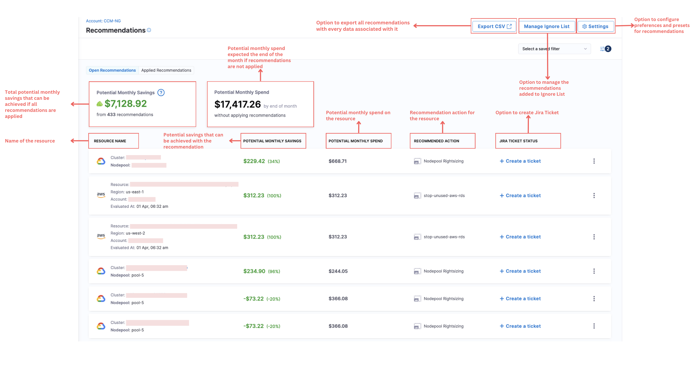
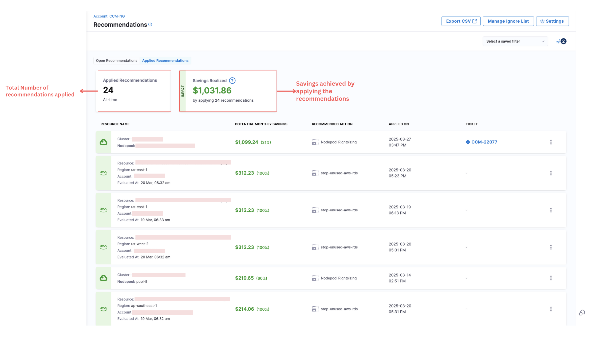
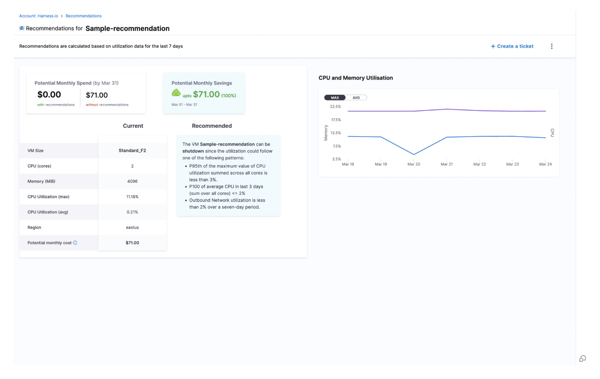
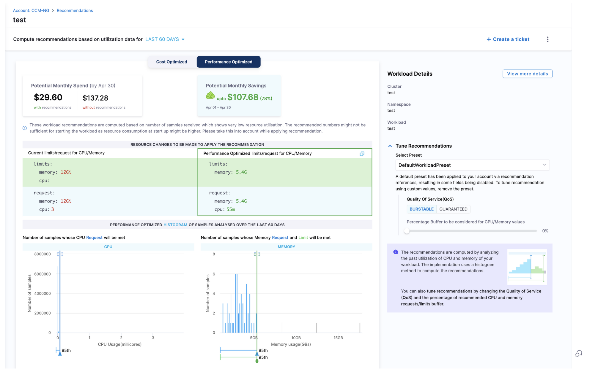
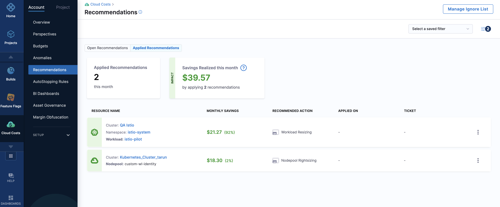
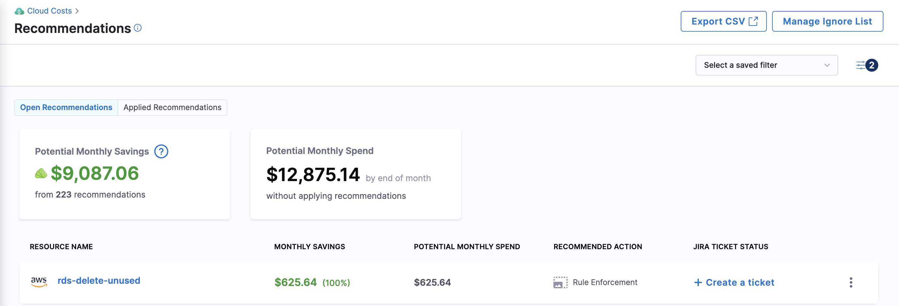

:::note
After you enable CCM, it may take up to 48 hours for the recommendations to appear in Cloud Costs. It depends on the time at which CCM receives the utilization data for the service. In **Cloud Costs**, go to the **Recommendations** page.
:::

<!-- ## Before you begin
To know how these recommendations are computed, see the following topics:
* [Optimize AWS ECS Costs with Recommendations](../1-ccm-recommendations/ecs-recommendations.md)
* [Optimize Kubernetes Costs with Node Pool Recommendations](../1-ccm-recommendations/node-pool-recommendations.md)
* [Optimize Kubernetes Costs with Workload Recommendations](../1-ccm-recommendations/workload-recommendations.md) -->

Harness CCM currently supports these types of recommendations:
- Azure VM
- AWS EC2 instances
- AWS ECS services
- Nodepool
- Workload
- Governance

## View recommendations

To view recommendations, click on the **Recommendations** tab in the navigation bar, which will take you to the homepage. On the Recommendations page, there are two tabs: Open Recommendations and Applied Recommendations. The Open Recommendations tab displays all available recommendations that have yet to be applied, while the Applied Recommendations tab shows the recommendations that have already been implemented.

### Open Recommendations

  <!--  -->

### Applied Recommendations

  <!--  -->

When you click on an individual recommendation, you’ll be able to view a detailed breakdown of the recommendation, including relevant insights, suggested actions, and any supporting information.

### Azure VM Recommendations
A highly effective way to reduce Azure VM costs is by optimizing VM utilization. By clicking on the Azure VM recommendation, you can view detailed information, as shown below:
  <!--  -->

### AWS EC2 Recommendations

<!--  -->

### AWS ECS Recommendations
<!--  -->
<!--  -->

### Nodepool Recommendations
<!--  -->

### Workload Recommendations
<!--  -->
<!--  -->

### Governance Recommendations
<!--  -->
Harness runs certain policies behind the scenes to generate recommendations for your governance-enabled Azure subscriptions, AWS accounts and GCP projects. These policies not only help to cut costs but also increase the efficiency of your system. On the Governance Overview page, Harness showcases recommendations that will benefit you to save costs on associated resources. You can click on any recommendation to view its details.

Please see the links below for details about Governance Recommendations:
- [Azure]
- [GCP]
- [AWS]

## Ignore list
You can put any EC2 instance, VM, Service, Nodepool, Workload, Governance recommendation in Ignored list. Adding resources to the Ignore list will stop Harness from displaying recommendations for those resources. You can view the Ignore list with details by clicking on "Manage Ignore List" on the overview page.

:::note
For Governance, we support [Granular Recommendations](https://developer.harness.io/docs/cloud-cost-management/use-ccm-cost-governance/asset-governance/aws/aws-recommendations#granular-recommendations). Owing to this, now, while adding a recommendation to Ignore List, users have the option to specify the scope at which the users want to ignore the recommendation. 
:::

To remove a recommendation from the ignore list, select **Manage Ignore List**. Then, select **Remove**.

## Apply recommendations

To apply recommendations, you need to raise a ticket in the ticketing tool that your organization uses. To configure the ticketing tool setup, perform the following steps: 
1. Navigate to **Cloud Costs** > **Setup** > **Default Settings**.
2. Expand **Cloud Cost Management**.
3. Under **Ticketing preferences**, select the **Ticketing tool** and the **Ticketing tool connector**. If you do not have an existing connector, [create a new one](#create-a-jira-or-servicenow-connector).

  The default ticketing tool is **Jira**. You can choose **ServiceNow** if that's the tool used in your organization.

4. Select **Save**.


:::note
 Switching your ticketing tool between Jira and ServiceNow results in the removal of the existing recommendation tickets. The status of the tickets changes to **Create a ticket**.
:::


Go to the **Recommendations** page and create tickets to apply recommendations.

Perform the following steps to raise a ticket to apply recommendations:

1. Select **Create a ticket**. In case you haven't set up your ticketing tool settings on the account level, you will see a prompt guiding you to access the **Default Settings** page to configure both the ticketing tool and the associated connector.


2. Enter the following ticket details:


import Tabs from '@theme/Tabs';
import TabItem from '@theme/TabItem';


<Tabs>
  <TabItem value="Cost Reporting" label="Jira">


* **Jira project** — Select the Jira project where you want to create a ticket. Go to [Create Jira Issues in CD Stages](/docs/continuous-delivery/x-platform-cd-features/cd-steps/ticketing-systems/create-jira-issues-in-cd-stages.md).
* **Issue type** — Select a Jira issue type from the list of types in the Jira project you selected. Go to [Create Jira Issues in CD Stages](/docs/continuous-delivery/x-platform-cd-features/cd-steps/ticketing-systems/create-jira-issues-in-cd-stages.md).
* **Ticket summary** — Add a summary of the issue.
* **Description** — Add a description for the issue.


</TabItem>
  <TabItem value="Cost Optimization" label="ServiceNow">


   * **Ticket Type** - Select the ticket type from the dropdown list. For example, change request, Data Management task, and so on. Based on the selected ticket type, you might need to enter more required inputs.
   * **Short Description** - Enter a brief description of the task. This is the title of the ticket.
   * **Description** - Enter a more detailed description about the recommendation.


</TabItem>
</Tabs>

  
The ticket is created. The status of the ticket changes to **To do**. You need to assign the ticket to apply the recommendations. After applying the recommendations, when the ticket status changes to **Done**, the recommendation is displayed in the **Applied Recommendations** tab. 
If you have not changed the ticket status to **Done** after applying the recommendation, you could use the **More actions** icon (three vertical dots), and then select **Mark as applied** to move the recommendation to the **Applied Recommendations** tab.
To view the recommendations that are applied, and the cost savings realized, select the **Applied Recommendations** tab.

   


### Create a Jira or ServiceNow connector
1. In the **Overview** step, enter the name. 
2. Optionally, enter a short description and tags.
3. In the **Details** step, enter the base URL. For example, https://mycompany.atlassian.net. For more information, go to [Configuring the base URL](https://confluence.atlassian.com/adminjiraserver071/configuring-the-base-url-802593107.html).
4. Enter the email ID used to log in to your Jira account.
5. Create or select a Harness encrypted test secret for the API key. To create a secret, go to [Add and reference text secrets](/docs/platform/secrets/add-use-text-secrets).
6. In the **Delegates Setup** step, select one of the following options: 
   * **Use any available Delegate**: Select this option to let Harness choose a Delegate at runtime.
   When a task is ready to be assigned, the Harness Manager first validates its lists of Delegates to assign the task.
   The following information describes how the Harness Manager validates and assigns tasks to a Delegate:
     
      * **Heartbeats**: Running Delegates send heartbeats to the Harness Manager in one-minute intervals. If the Manager does not have a heartbeat for a Delegate when a task is ready to be assigned, it will not assign the task to that Delegate.
     
      * **Tags**: Go to [Use delegate selectors](../../../platform/delegates/manage-delegates/select-delegates-with-selectors.md).
       
      * **Allowlisting**: After a Delegate is validated for a task, it is allowlisted for that task. This Delegate is likely to be used again for that task. The allowlisting criteria is the URL associated with the task, such as a connection to a cloud platform, repo, or API. A Delegate is allowlisted for all tasks using that URL. The Time-To-Live (TTL) for the allowlisting is 6 hours, and the TTL is reset with each successful task validation.
     
      * **Blocklisting**: If a Delegate fails to perform a task, it is blocklisted for that task. This Delegate is not selected again to perform that task. TTL is five minutes. This is true even if there is only one Delegate and the Delegate is selected for that task with a Selector.

   * **Only use Delegates with all the following tags**: Select this option to use specific Delegates using their Tags. 
   You only need to select one of a Delegate's Tags to select it. All Delegates with the Tag are selected. This option is useful when you have installed specific software on specific Delegates and want to ensure that your Pipeline uses those Delegates.
7. Select **Save and Continue**. The Connector is created and validated. 

You can create and use filters to select resources and recommendations.

You can filter by:

* **Resource Name** — The name of the resource being monitored.
* **Namespace** — A namespace in the cluster.
* **Cluster Name** — A cluster in your infrastructure.
* **Resource Type** — The type of resources for which the recommendation is displayed. Currently, CCM supports ECS service, node pool, and workload.
* **Savings** — Enter the minimum monthly savings. For example, all the recommendations with potential monthly savings of more than $1000.
* **Potential Spend** — Filter by forecasted monthly spend greater than the specified amount. For example, all the recommendations with forecasted monthly spend of more than $1000.

The recommendation for the selected resource is displayed.

Select a recommendation to view its details.

Within a recommendation, select the number of days to compute recommendations based on the utilization data. You can select the last day, 7 days, or 30 days.

You can use this information to optimize your resources to potentially reduce your monthly cloud costs.

#### ServiceNow ticket

<DocImage path={require('./static/servicenow_Example.png')} width="80%" height="80%" title="Click to view full size image" />

The Description field contains relevant information about the recommendation for which this ticket was created. Harness CCM retrieves the following data from ServiceNow:

When a user opens the dialog box to create a ServiceNow ticket, a request is made to obtain all possible ticket types. Here is a sample response:

```json
{
    "status": "SUCCESS",
    "data": [
        {
            "key": "asset_reclamation_request",
            "name": "Asset Reclamation Request"
        },
        {
            "key": "asset_task",
            "name": "Asset Task"
        },
        {
            "key": "business_app_request",
            "name": "Business Application Request"
        }
    ]
}
```

Once the user selects a ticket type, another request retrieves the fields associated with that ticket type to determine the required fields. Here is a sample response:

```json
{
    "data": [
        {
            "key": "parent",
            "name": "Parent",
            "required": false,
            "schema": {
                "array": false,
                "typeStr": "",
                "type": "unknown",
                "customType": null,
                "multilineText": false
            },
            "internalType": null,
            "allowedValues": [],
            "readOnly": false,
            "custom": false
        },
        {
            "key": "made_sla",
            "name": "Made SLA",
            "required": false,
            "schema": {
                "array": false,
                "typeStr": "boolean",
                "type": "boolean",
                "customType": null,
                "multilineText": false
            },
            "internalType": null,
            "allowedValues": [],
            "readOnly": false,
            "custom": false
        }
    ]
}
```

When the user clicks "Create Ticket," an API call is made to ServiceNow to create the ticket with the provided inputs. Additionally, there is an internal call that periodically checks if the ticket has been closed. Based on this status, the recommendation is moved to the applied state.

## Export recommendations data

You can export your Recommendations as comma-separated values (CSV) files. Exporting allows you to use the data in other software. Export respects the filters applied by the user in the filter panel.

### Limitations

- Only comma-separated values files (CSV) are supported.
- The maximum number of rows allowed in one export is 10,000 rows.
- The more rows you export, the slower the export will be.

### Create a Recommendations Export

1. Open Recommendations.

  
2. Click **Export CSV**.

3. Enter a name for the CSV file.

4. In **Export rows up to**, enter the number of rows you want exported. The number of rows should be greater than or equal to 1.

5. Click **Download**. The file is downloaded to your computer.

### **Recommendations Filtering Support**  

Harness provides filtering support for recommendations based on cloud account identifiers and Kubernetes attributes. This allows for better cost optimization insights while maintaining alignment with perspective-based RBAC settings.


### **Filtering Support for Recommendations**  

- **AWS EC2**: Filtering is supported on AWS Account ID. Nested Cost Categories are not supported.  

- **AWS ECS**: Filtering is supported on AWS Account ID. Nested Cost Categories are not supported.  

- **Azure VM**: Filtering is not supported.  

- **Kubernetes**: Filtering is supported on Labels and Cluster Name. Nested Cost Categories are not supported.  

- **Governance Recommendations**:

  -   **AWS**: No filtering support.  
  -   **Azure**: No filtering support.  
  -   **GCP**: No filtering support.  

:::note

Filtering support for recommendations extends to **RBAC configurations based on perspective folder access settings**, ensuring that cost-saving suggestions are appropriately scoped to the right teams. 

:::