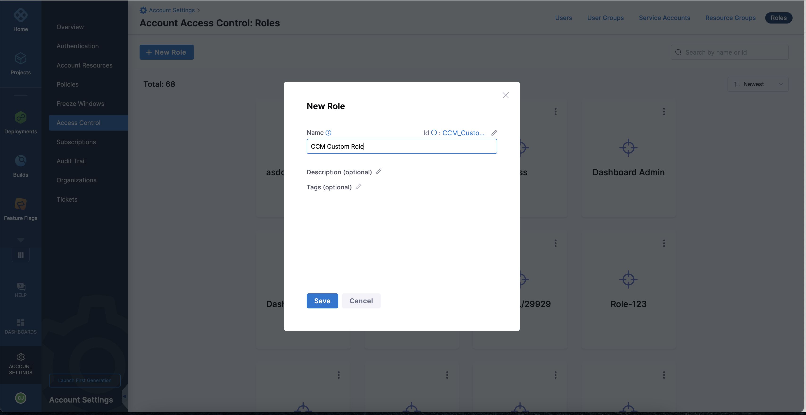
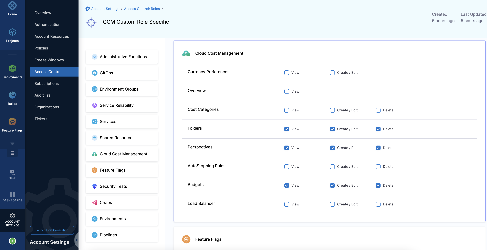
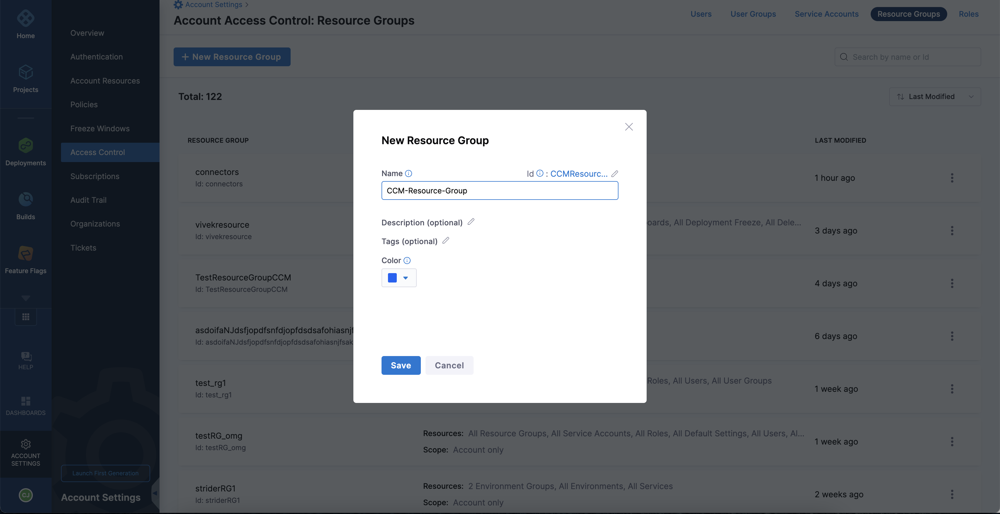
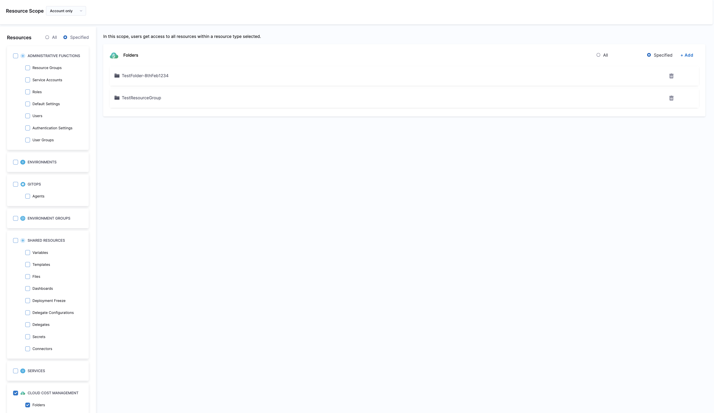
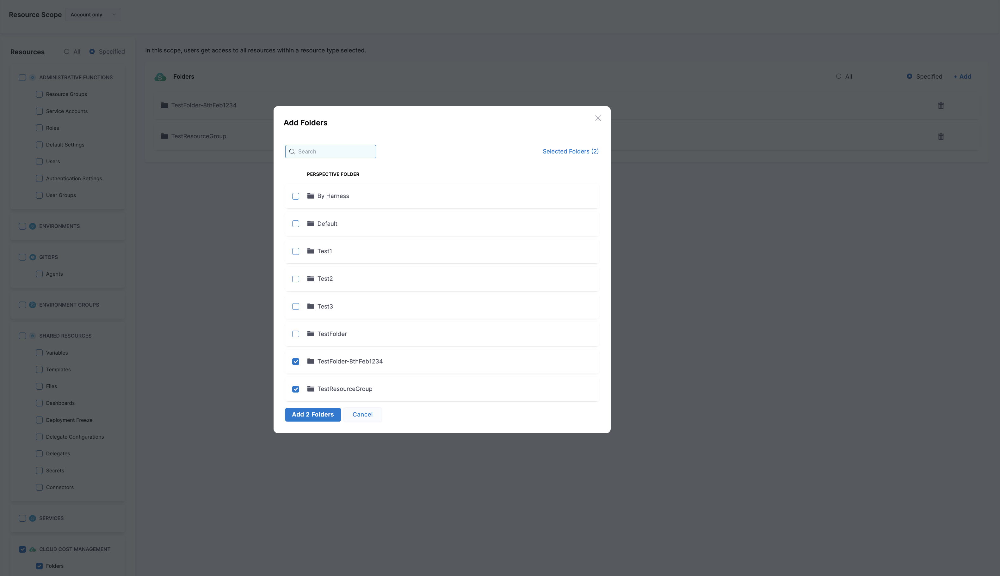
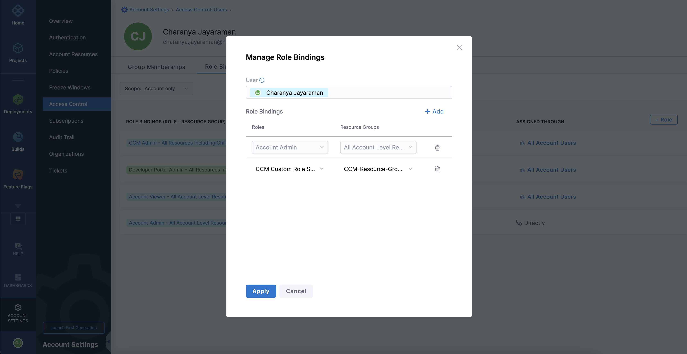

# Manage access control for CCM perspective folders

You can now manage access to Perspective folders by assigning Resource Groups to users bound by the roles assigned to them.

Perform the following steps to restrict access to a Resource Group:

1. In **Harness**, go to **Account Settings**.
2. Select **Access Control**.
3. Select **Roles**.
4. Click **+ New Role** to create a custom role with the following permissions. For example, CCM Custom Role. 
   
     
     
     
     

5. Create another custom role with a different set of permissions. 
   
      

6. Select **Resource Groups**.
7. Click **+ New Resource Group** to create a new resource group.

    

8.  Select **Account only** in the **Resource Scope** dropdown list.
9.  In the **Resources** pane, select **Cloud Cost management** > **Folders**. 
    
      
	
10.  To restrict access to specific folders, select **Specified** and then click **Add**. 
    
      

11. Add the selected folders and save the resource group settings.
12. To bind the **Role** with the **Resource Group**, go to the **Users** tab on the **Access Control** page.
13. Select the user you want to restrict access to.
14. Click **Manage Roles**. 
15. Click **Add** in the **Manage Role Bindings** window.
16. Select the **Role** and the newly created **Resource Group** to restrict access to folders.
17. Select another **Role** and **Resource Group** to provide access to all other resources.
18. Click **Apply**. 
    
      

In Harness, the **Perspectives** page shows only the folders that the user has been granted access to. This means that the user cannot see or interact with any folder that they do not have permission to access.

A user can create **Budgets** for Perspectives only within the folders that they have been granted access to. For more information about Budgets, go to [Create a Budget](/docs/cloud-cost-management/use-ccm-cost-governance/ccm-budgets/create-a-budget).

Similarly, on the **Anomalies** page, the visibility of the anomalies could be divided in four cases as explained in the table below:

| **Use Case** | **Behaviour** |
| --- | --- |
| User has both Anomalies View Permission & Perspective View Permission | User would be able to view all the anomalies based on Anomalies View Permission |
| User has Anomalies View Permission but does not have Perspective View Permission | User would be able to view all the anomalies based on Anomalies View Permission |
| User does not have Anomalies View Permission but has Perspective View Permission | Anomalies would be filtered based on Perspective View Permission which uses perspective rules for filtering |
| User do not have either Anomalies View Permission or Perspective View Permission | User won't be able to see any anomalies |

For more information about Anomalies, go to [Detect Cloud Cost Anomalies](/docs/cloud-cost-management/use-ccm-cost-reporting/anomaly-detection).

Similarly, on the **Recommendations** page, the visibility of the recommendations could be divided in four cases as explained in the table below:

| **Use Case** | **Behaviour** |
| --- | --- |
| User has both Recommendations View Permission & Perspective View Permission | User would be able to view all the recommendations based on Recommendations View Permission |
| User has Recommendations View Permission but does not have Perspective View Permission | User would be able to view all the recommendations based on Recommendations View Permission |
| User does not have Recommendations View Permission but has Perspective View Permission | Recommendations would be filtered based on Perspective View Permission which uses perspective rules for filtering |
| User do not have either Recommendations View Permission or Perspective View Permission | User won't be able to see any recommendations |

For more information, go to [Recommendations](/docs/cloud-cost-management/use-ccm-cost-optimization/ccm-recommendations/home-recommendations).

A user with folder restrictions does not have permission to create new folders. This means that the user can only work within the existing folder structure that has been set up for them by an administrator.

