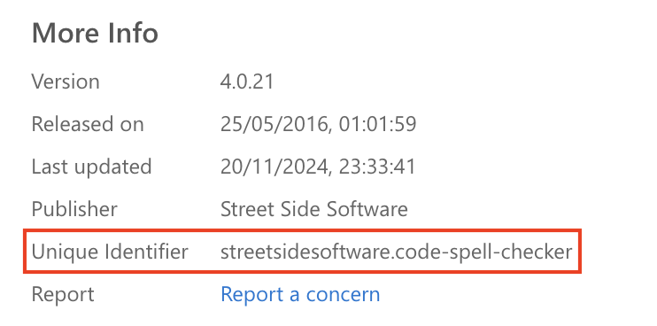

This guide explains how to configure your Gitspace to automatically install extensions during setup. Let’s dive into the details.

## What is “extensions”?
```extensions``` refer to a **Visual Studio Code-specific** property used to automate the installation of extensions in your Gitspace. This property is an array of extension IDs that specifies which extensions should be installed when the Gitspace is created.

Since ```"extensions"``` is a Visual Studio Code-specific property, it must be added under the ```"vscode"``` section within the ```"customizations"``` property.

## Adding “extensions” to devcontainer.json
Here’s how to add the ```extensions``` property to your ```devcontainer.json``` configuration:
```
"customizations": {
  "vscode": {
    "extensions": ["streetsidesoftware.code-spell-checker"]
  }
}
```
You can find the ```extension ID``` in the **“More info”** section of the official extension documentation.


## Verifying the Setup
After adding this property, you can verify the setup by reviewing the container logs during the creation of a Gitspace via the Harness UI.


## Behavior in VS Code Browser
Once your Gitspace is created and started in the VS Code Browser, the specified extensions (as defined in devcontainer.json) will be pre-installed in your browser IDE within the Gitspace.


## Behavior in VS Code Desktop
When using VS Code Desktop, the specified extensions will not be pre-installed automatically. Instead, you’ll be prompted with a recommendation to install them upon starting your Gitspace. This is the default behavior for extensions in the VS Code Desktop environment.
