:::info

Harness CDE is now available in public beta. To enable it on your account, contact your sales representative or reach out to the team at cde-interest@harness.io 

:::

Harness CDE provides a seamless integration with VS Code, making it easy to connect to your Gitspaces remotely. With the Gitspaces VS Code extension, you can access and manage your Gitspaces directly within your VS Code desktop IDE. This guide will walk you through the steps to install, set up, and start developing in your Gitspaces using this extension.

## Pre-requisites 
Before starting out, ensure that you have the following:
1. VS Code Desktop installed [(Install VS Code Desktop)](https://code.visualstudio.com/download)
2. Gitspaces VS Code extension installed (Refer to the steps below)
3. [Remote - SSH](https://marketplace.visualstudio.com/items?itemName=ms-vscode-remote.remote-ssh) and [Dev containers](https://marketplace.visualstudio.com/items?itemName=ms-vscode-remote.remote-containers) extensions installed and enabled in VS Code Desktop

## Installing the Gitspaces VS Code Extension
To install the Gitspaces VS Code extension, here’s what you need to do:
1. Open VS Code and go to the Extensions marketplace.

    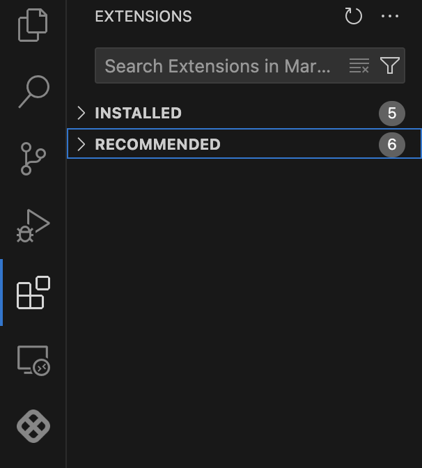

2. Search for [“Gitspaces VS Code Extension”](https://marketplace.visualstudio.com/items?itemName=harness-inc.gitspaces). You can install and configure the Gitspaces VS Code extension to use it on your VS Code Desktop App(>=v1.81.0). (“Harness Gitspaces” is our open source extension)

    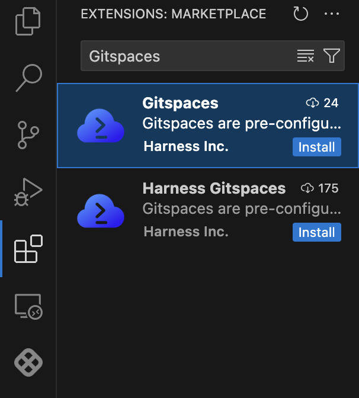

3. Once it appears, just click Install.

    

4. You can also configure the base URL by navigating to the Settings tab and updating the Host URL.

    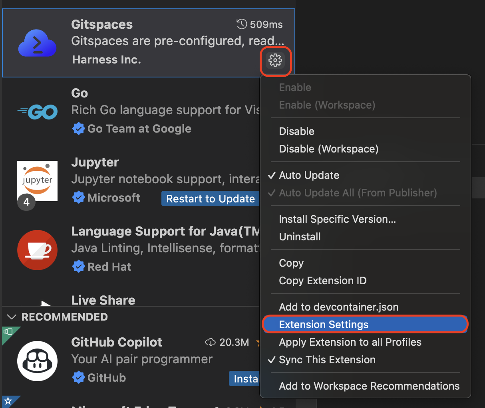
    

## Signing in
After installing the prerequisites, follow these steps to sign in to your Gitspaces account within VS Code:
1. Open VS Code, click on the Gitspaces icon in the activity bar, and select "Sign in." 
    
    Alternatively, open the Command Palette (Ctrl+Shift+P) and type "Gitspace". Choose “Gitspace: Login” from the options. 
    

2. A dialog will appear asking to open your browser for Gitspaces authentication. Click “Allow” and “Open” to proceed. 

    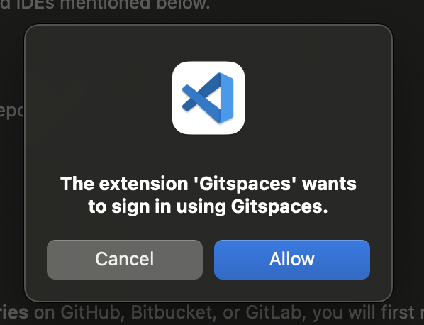 
    

3. You'll be redirected to your browser to authorize Gitspaces (log in if necessary). After authorization, you’ll be taken back to VS Code.

    

4. To verify your account, check the Accounts icon in the activity bar where your Gitspace account should now be listed.

    

## Opening a Gitspace
Here’s how to create and open a Gitspace in VS Code:
1. Start by creating a Gitspace in your Harness UI [(check the quickstart guide for more details)](https://developer.harness.io/docs/cloud-development-environments/get-started/getting-started-with-cde)

    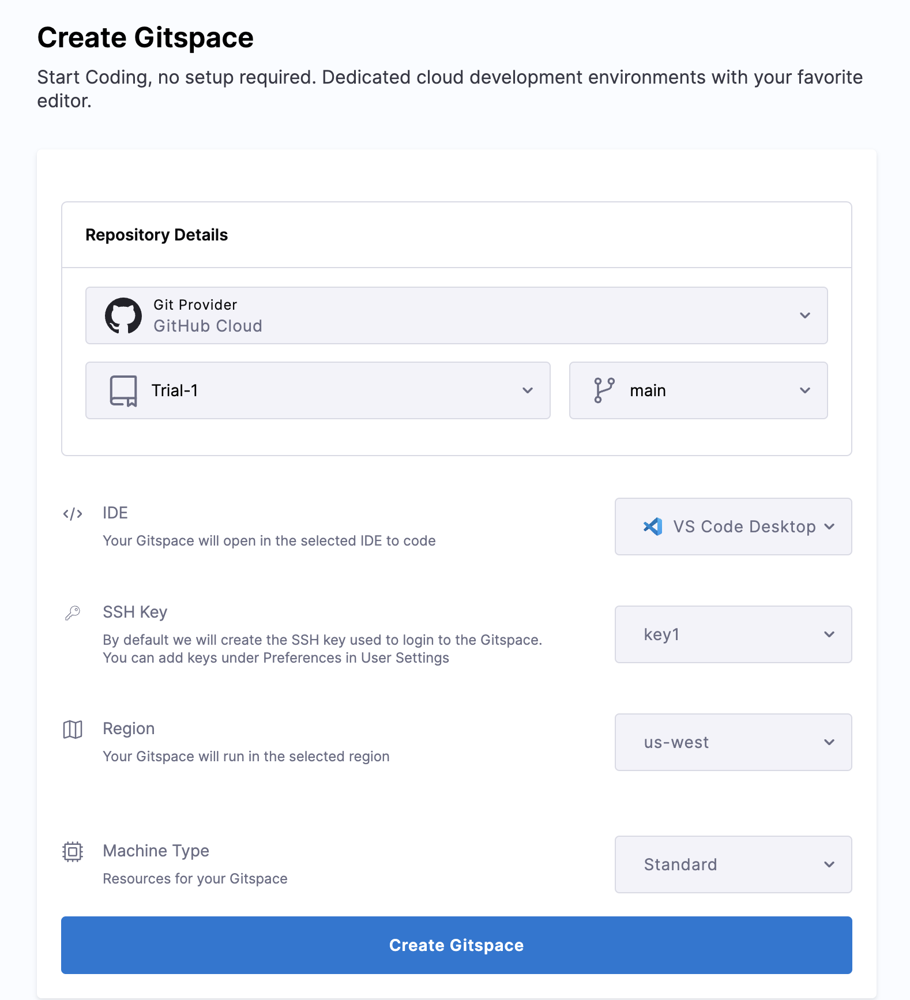

2. After the Gitspace is created, click "Open in VS Code Desktop" from the Harness UI.

    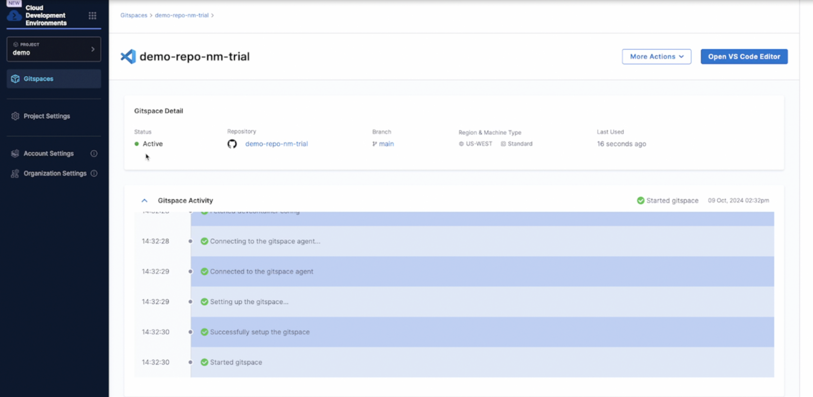

3. You’ll be asked for permission to open VS Code Desktop. Click “Open.”

    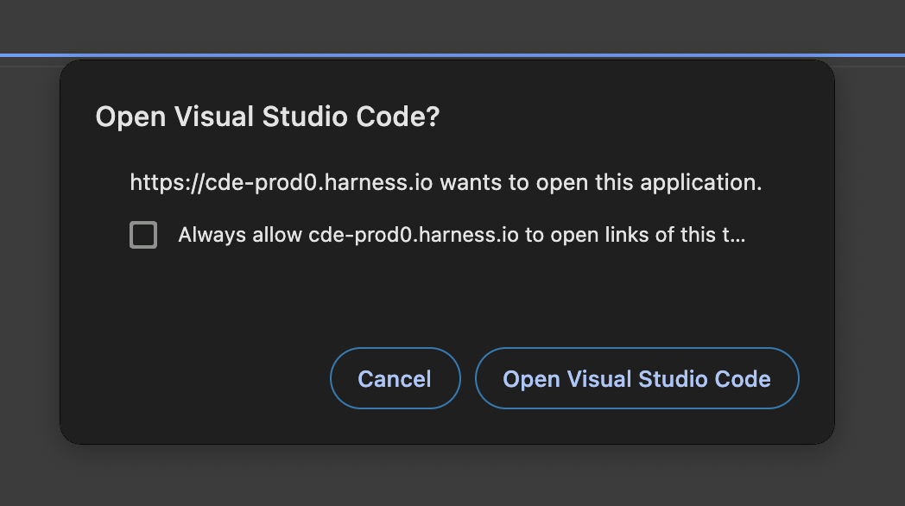

4. If the Gitspaces extension isn’t installed, VS Code will prompt you to install it. Click “Allow” and “Open” to proceed.

    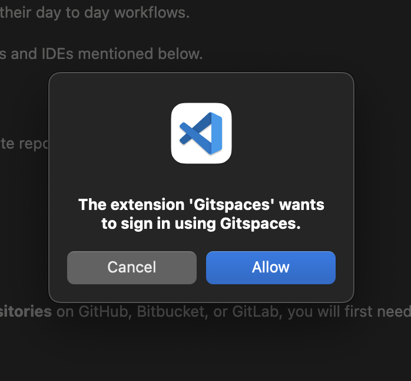
    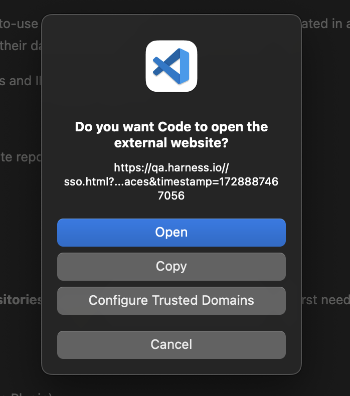

5. VS Code may also ask you to install remote development extensions like Remote SSH and Dev Containers. Follow the prompts to add them if necessary.

6. Once all extensions are installed, you’ll be prompted to open the Gitspace inside your VS Code IDE. Click “Open.”

    

7. Now, you’re all set. 

## Connecting to your Gitspace
To connect to a Gitspace with VS Code Desktop, you have two options: either use an SSH key or a temporary password.
1. SSH Key:
You can create a new SSH key using `ssh-keygen` [(learn more here on how to create an SSH key)](https://git-scm.com/book/en/v2/Git-on-the-Server-Generating-Your-SSH-Public-Key). This generates a pair of keys (public and private). Copy the public key and paste it into the "SSH key" field while setting up a Gitspace (as shown in the picture below). This will enable you to establish a remote connection to the Gitspace via SSH. If you prefer not to use an SSH key, you can use the temporary password method outlined below.

    
    
2. Temporary Password:
If you do not wish to connect via an SSH key, you can use a temporary password. During Gitspace creation, simply leave the "SSH key" field blank. A temporary password will be generated automatically for the remote connection. After the Gitspace is created, you'll be redirected to VS Code desktop and prompted to copy the temporary password. Paste it and follow the prompts to establish the remote connection. 

    

## Managing your Gitspace 
Once connected, you can easily manage your Gitspaces directly from within VS Code. Here’s how:
1. Click the Gitspaces icon in the activity bar to view all your Gitspaces in the sidebar.
Select any Gitspace to open and start working on it. 

    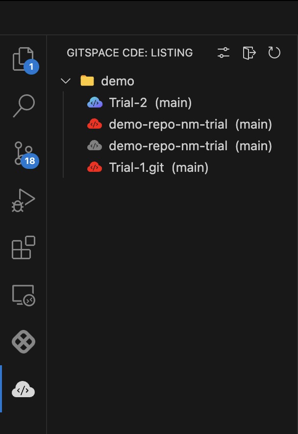

2. Use the start icon to launch a Gitspace and the stop icon to end a session. The arrow icon indicates opening a Gitspace, and the square icon stops it.

    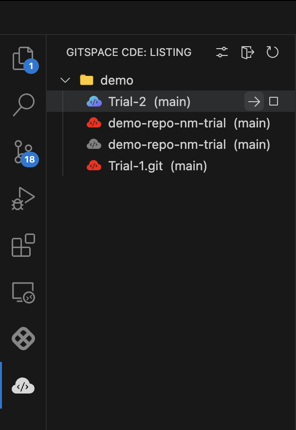

With these simple steps, you’re all set to manage and develop in your Gitspaces using the VS Code Gitspaces extension. It simplifies remote development and makes working with your Gitspaces smooth and efficient.

