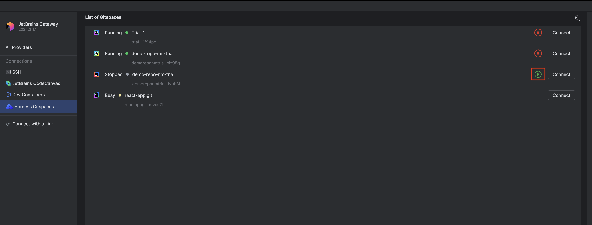
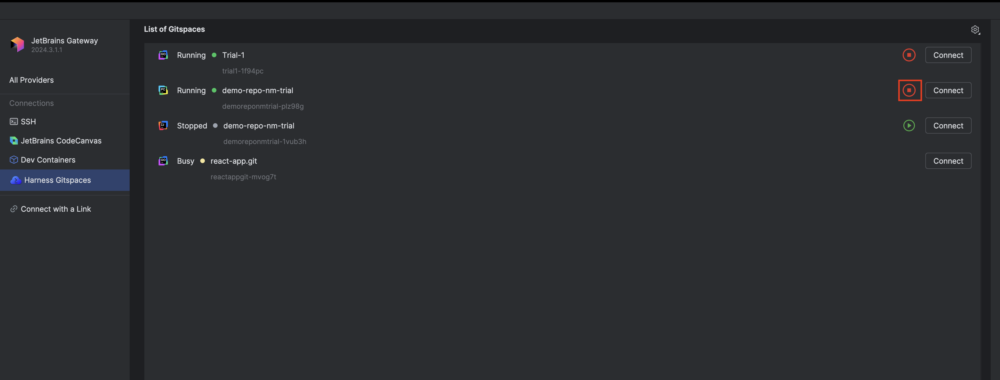

Harness CDE supports seamless and efficient remote development in **JetBrains IDEs** using **JetBrains Gateway**. 

The following JetBrains IDEs are supported for remote development:
- IntelliJ IDEA
- PyCharm
- PhpStorm
- GoLand
- CLion
- Rider
- RubyMine
- Webstorm

## JetBrains Gateway Plugin  

**JetBrains Gateway** is a lightweight desktop application that allows you to work remotely with **JetBrains IDEs** without downloading the full IDE. It connects to a remote server, fetches the necessary backend components, and opens your project in a **JetBrains client**.  

With the **JetBrains Gateway Plugin**, you can seamlessly access and manage your **Gitspaces** created in JetBrains IDEs. This plugin ensures smooth navigation and efficient development within your IDE.  

## Pre-Requisites  

#### Install JetBrains Gateway  
Before proceeding, ensure that **JetBrains Gateway** is installed on your device.  

#### Recommended Gitspace Configuration  
Refer to this section to understand the **recommended Gitspace requirements** for optimal performance when connecting to your Gitspace in JetBrains IDEs.  

## Installing the Plugin  

Follow these steps to install the **Harness Gitspace Plugin**:  

1. **Download the latest version** of the Harness Gitspace Plugin package.  
2. **Install and open** JetBrains Gateway.  

3. Click the **settings icon** in the bottom-left corner of the application.  

4. Select **"Manage Providers."**  

5. In the **Installed Plugins** section, click the **settings icon** on the right and choose **"Install Plugin from Disk."**  

6. Locate and **select the downloaded Harness Gitspaces Plugin package.**  
7. A warning will appear indicating that this is a third-party plugin (Harness Gitspaces Plugin) and not a JetBrains plugin. Click **"Accept."**  

8. That’s it! You will now see the plugin successfully installed in your **JetBrains Gateway connections.**  

 

## Configuring the Plugin
Now that you've successfully installed the plugin, you can configure it in **JetBrains Gateway** using the following steps:  

1. Click on **"Harness Gitspaces"** from the sidebar connections.  
2. You will be prompted to configure the app URL in JetBrains Gateway. Enter: **"https://app.harness.io"** and click **"Connect"**  

3. You will be redirected to the **Harness platform** to sign in. Enter your credentials to log into your account.  

4. That’s it! Once configured, you can view all your **Gitspaces** created in JetBrains IDEs directly within the **JetBrains Gateway** application. 

## Managing Your Gitspaces  

You can access and manage your **Gitspaces** (only those created in JetBrains IDEs) directly within the **JetBrains Gateway** application.  

### Access Your Gitspaces  

You can connect to your **Gitspaces** directly from the **Gateway** application:  

1. **For an actively running Gitspace**, click on **"Connect."** This will connect you to your remote Gitspace within your selected IDE.  
2. **For a stopped Gitspace**, clicking on **"Connect"** will redirect you to the **Harness Gitspaces UI**, where you can check its details.  

:::info  
**Note:** While a Gitspace is transitioning between **started and stopped states**, its status in the application will be displayed as **"Busy."** This indicates that the Gitspace is undergoing the transition.  
:::  

### Start Your Gitspaces  

You can start your **stopped Gitspaces** directly from **JetBrains Gateway**:  
- Click the **Green Start** icon to start your Gitspace.  To open your Gitspace in your preferred IDE, refer to the IDE-specific documentation. For example, here’s how you can connect to your [Gitspace in IntelliJ IDEA](/docs/cloud-development-environments/ides/intellij#open-the-gitspace-in-intellij).

- This icon will be visible **only if your Gitspace is stopped**.  

### Stop Your Gitspaces  

You can stop your **active Gitspaces** directly from **JetBrains Gateway**:  
- Click the **Red Stop** icon to stop it from running.  

- This icon will be visible **only if your Gitspace is currently active**.  

