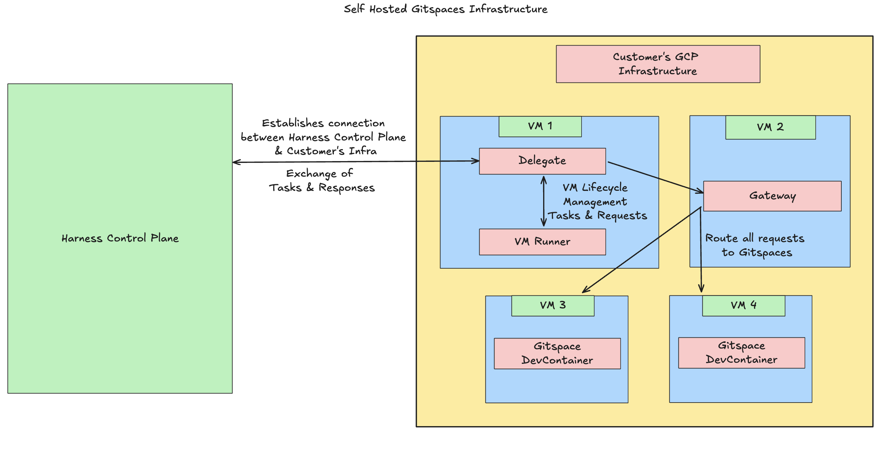

## Fundamentals

**Self-Hosted Gitspaces** are on-demand remote development environments hosted within your organization’s infrastructure. These environments come pre-configured for instant coding and provide an added layer of security by offering **full control** over infrastructure and data. This reduces the risk of external data exposure and prevents source code from being cached or accessed by third-party cloud services.

### Self Hosted vs Harness Hosted Gitspaces 
Harness-Hosted Gitspaces are fully managed by Harness and reduce the setup complexity for end users. However, as organizations grow and adopt stricter security and compliance standards, **Harness-Hosted Gitspaces may introduce the following enterprise challenges**:

* **Security & Data Sovereignty**: Lack of full control over source code and developer data.
* **Customization Limitations**: Hosted solutions may not support deep customization of tooling and environment setup.
* **Latency Issues**: Hosted regions are fixed, potentially causing performance problems for globally distributed teams.

In contrast, **Self-Hosted Gitspaces** solve these issues by offering complete infrastructure control. 

| Use Case                  | Self-Hosted Gitspaces                      | Harness-Hosted Gitspaces           |
| ------------------------- | ------------------------------------------ | ---------------------------------- |
| **Infrastructure**        | Managed by Customer       | Managed by Harness                 |
| **Security & Compliance** | Full control by customer                   | Shared responsibility model        |
| **Source Code**           | Stored within customer infra               | Stored and cached in Harness |
| **Data Residency**        | Customer-defined and governed              | Stored in Harness Cloud         |
| **Latency/Location**      | Global flexibility based on customer infra | Limited to predefined regions      |

### Key Concepts 
There are a few key concepts that form the foundation of how Self Hosted Gitspaces operate: 
- [Harness Control Plane](/docs/cloud-development-environments/self-hosted-gitspaces/fundamentals.md#harness-control-plane)
- [Delegate](/docs/cloud-development-environments/self-hosted-gitspaces/fundamentals.md#delegate)
- [VM Runner](/docs/cloud-development-environments/self-hosted-gitspaces/fundamentals.md#vm-runner)
- [CDE Gateway](/docs/cloud-development-environments/self-hosted-gitspaces/fundamentals.md#gateway)
- [Terraform Registry](/docs/cloud-development-environments/self-hosted-gitspaces/fundamentals.md#terraform-registry)

Read more about all these [key concepts](/docs/cloud-development-environments/self-hosted-gitspaces/fundamentals.md). 

### Architecture Overview
Self-Hosted Gitspaces consist of two core components:

* **Harness Control Plane**
* **Customer’s Cloud Infrastructure (e.g., GCP)**

Read more about the [self hosted gitspaces architecture](/docs/cloud-development-environments/deep-dive-into-gitspaces/self-hosted-architecture.md). 

## Get Started with Self Hosted Gitspaces
### Prerequisites
You need to follow these prerequisites to get started with self-hosted Gitspaces:

| **Prerequisite**    | **Description** | **Documentation Guide** | 
| -------- | ------- | ---------- | 
| **Enable APIs in GCP Project** | Your GCP Project (where your have created your GCP VM Instance) should have the following APIs enabled:  <ul><li>[Cloud Resource Manager API](https://cloud.google.com/resource-manager/reference/rest) - api/cloudresourcemanager.googleapis.com</li><li>[Compute Engine API](https://cloud.google.com/compute/docs/reference/rest/v1) - api/compute.googleapis.com</li><li>[Certificate Manager API](https://cloud.google.com/certificate-manager/docs/reference/certificate-manager/rest) - api/certificatemanager.googleapis.com</li><li>[Identity and Access Management (IAM) API](https://cloud.google.com/iam/docs/reference/rest) - api/iam.googleapis.com</li><li>[Cloud DNS API](https://cloud.google.com/dns/docs/reference/rest/v1) - api/dns.googleapis.com</li></ul>   | [Guide](https://cloud.google.com/endpoints/docs/openapi/enable-api) |
| **Service Account** | You must have a Service Account with the "Owner" permission in the same GCP Project where you have your GCP VM Instance.| [Guide](https://cloud.google.com/iam/docs/service-accounts-create) | 
| **Service Account Key** | You must create and download a Service Account Key in the same GCP Project and service account, this key is usually in the form of a **JSON** or **P12 file**, which contains the credentials necessary for the service account to authenticate. | [Guide](https://cloud.google.com/iam/docs/keys-create-delete) | 
| **Terraform / OpenTofu** | You must have Terraform/OpenTofu installed on your machine with internet access (please ensure you have the SA key downloaded here) | [Guide](https://developer.hashicorp.com/terraform/tutorials/aws-get-started/install-cli) |
| **DNS Propogation** | You must verify that the domain or subdomain you use for self hosted Gitspaces has been properly delegated and that DNS propogation has completed. | [Docs](https://www.catchpoint.com/dns-monitoring/dns-delegation) | 

### Get Started with Self-Hosted Gitspaces

This is a quick guide to help you set up and launch your Self-Hosted Gitspaces. Follow the steps below:

#### 1. Go Through the Prerequisites and Fundamentals

Before you begin setup, it’s important to understand the **underlying architecture** and **concepts of Self-Hosted Gitspaces**. 

🔗 Make sure to review the following **documentation** thoroughly:

- [Self-Hosted Gitspaces Architecture](/docs/cloud-development-environments/deep-dive-into-gitspaces/self-hosted-architecture.md)  
- [Fundamental Concepts](/docs/cloud-development-environments/self-hosted-gitspaces/fundamentals.md)  
- [Prerequisites](/docs/cloud-development-environments/self-hosted-gitspaces/fundamentals.md#prerequisites)  

#### 2. Configure Gitspace Infrastructure via Harness UI

Start by configuring your **Gitspace infrastructure via the Harness UI**. This allows you to input your infrastructure details like Project ID, regions, etc., which will be referenced later during provisioning.

🔗 [Configure Gitspace Infrastructure via Harness UI](/docs/cloud-development-environments/self-hosted-gitspaces/steps/gitspace-infra-ui.md)

#### 3. Configure and Set Up the Terraform Module

Once the infrastructure is configured in the UI, proceed to initialize and apply the **Harness Gitspaces Terraform Module**. This module will **create all required GCP infrastructure** and will set up VM instances for the CDE Gateway. 

🔗 [Set Up Terraform Module](/docs/cloud-development-environments/self-hosted-gitspaces/steps/gitspace-infra-terraform.md)

#### 4. Set Up Runner and Install Delegate

After provisioning, install the **Runner and Delegate** on your GCP VM Instance. This ensures the Harness Control Plane can communicate with your infrastructure to create and manage Gitspaces.

🔗 [Set Up Runner and Install Delegate](/docs/cloud-development-environments/self-hosted-gitspaces/steps/runner-delegate.md)

#### 5. Create Machines & Gitspaces

Once the setup is complete, you can begin by **creating machines** and **Gitspaces** directly. 

🔗 [Create Machines](/docs/cloud-development-environments/manage-gitspaces/create-gitspaces.md)