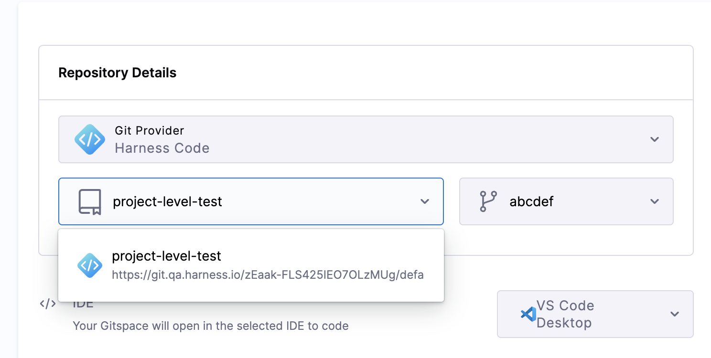

Follow the instructions below to create a Gitspace:

1. Click on **+New Gitspace**. To create a **Gitspace** using the [sample app](https://github.com/harness-community/demo-repo-nm). You have two options to create Gitspace:

import Tabs from '@theme/Tabs';
import TabItem from '@theme/TabItem';

<Tabs queryString="Create Gitspace">
<TabItem value="using-harness-code" label="Using Harness Code">

2. Select the **Repository** from the dropdown, followed by updating the **branch**. 

</TabItem>
<TabItem value="other-git-repositories" label="Other Git Repositories">

1. You can add a public or private repository URL for supported [git providers](/docs/cloud-development-environments/whats-supported#git-providers).

2. For **public repositories**, the URL must strictly follow this format: https://git-provider.com/organisation/repository (e.g., for GitHub: https://github.com/harness-community/demo-repo-nm). Any extra text after this may cause an error.

3. If OAuth is configured, you’ll be able to select from a list of **private repositories** you have access to.

4. By default the **branch** selected would be **main** which you can change according to your choice.

</TabItem>
</Tabs>

### Select IDE
Move back to the CDE Create Gitspace window and select your preferred IDE from the given options. 

### Select Region 
Select the **region** in which you want to provision your CDE. 

### Select Machine 
Select the machine type to be either **Standard** or **Large**. 

It will take few minutes to provision the Gitspace and you could see all the steps and logs involved. 

Now you can your Gitspace in the selected IDE and start developing. 