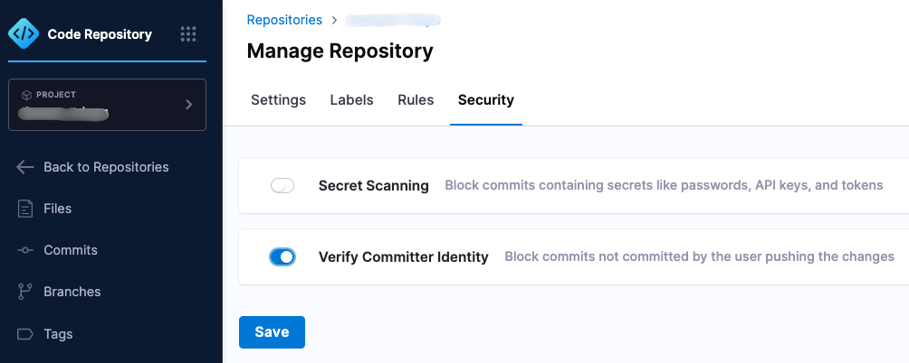

In Harness Code, you can enable security features to protect your code and prevent secrets or vulnerabilities from being pushed to your Git repositories. Blocking secrets and vulnerabilities from being introduced into your repos is crucial for securing your codebase.

## Enable Secret Scanning

You can use the Harness Code built-in [Gitleaks](https://github.com/gitleaks/gitleaks) integration to prevent hardcoded secrets like passwords, API keys, and tokens from being introduced into your Git repository during a push. This reduces the potential to leak valuable IP or compromise security. By scanning every push, your secrets are never added to the repository history, reducing the chance of a leak and preventing the need to rewrite Git history.

You can enable secret scanning for individual repositories. Once enabled on a repo, any push event to that repo that contains a commit matching a [recognized secret pattern](https://github.com/gitleaks/gitleaks/blob/master/config/gitleaks.toml) is denied.

:::warning

Harness Code Secret Scanning scans *only new/changed code* in commits that users attempt to push *after* you enable Secret Scanning on a repo. Secrets in existing/unchanged code aren't detected.

:::

To enable Secret Scanning:

1. Go to the repository where you want to enable secret scanning and select **Settings**.
2. Select the **Security** tab.
3. Enable **Secret Scanning**.
4. Select **Save**.
5. Repeat to enable Secret Scanning on additional repos.

### Bypass or ignore detected secrets

:::warning

Bypassing/ignoring detected secrets is not recommended unless you are certain the detected secret doesn't represent a potential vulnerability, such as test data containing fake secrets.

:::

Harness Code Secret Scanning uses [Gitleaks](https://github.com/gitleaks/gitleaks). If you want to bypass Gitleaks and knowingly commit a recognized secret, you have two options:

* Add `gitleaks:allow` as a comment in your code.
* Create a `.gitleaksignore` file.

For more information and usage instructions for these options, go to the [Gitleaks README](https://github.com/gitleaks/gitleaks?tab=readme-ov-file#additional-configuration).

## Enable Vulnerability Scanning

In Harness Code, you can prevent vulnerable code from being introduced into your Git repository during a push. Harness Code checks your code against a database of known OSV vulnerabilities. If there are any matches, Harness Code can block the push or display a warning message to the code author.

You can enable Vulnerability Scanning for individual repositories, and you can choose whether to warn or block detected vulnerabilities. Because some vulnerabilities have a lower severity, you might not want to block every vulnerability. Instead, you can configure Harness Code to warn the code author, rather than block the push.

Once enabled on a repo, any push event to that repo that contains a commit matching a recognized vulnerability pattern is blocked or logged, according to your configuration.

:::warning

Harness Code Vulnerability Scanning scans *only new/changed code* in commits that users attempt to push *after* you enable Vulnerability Scanning on a repo. Vulnerabilities in existing/unchanged code aren't detected.

:::

To enable Vulnerability Scanning:

1. Go to the repository where you want to enable vulnerability scanning and select **Settings**.
2. Select the **Security** tab.
3. Enable **Vulnerability Scanning**.
4. Select whether to **Detect** (warn/log) or **Block** vulnerabilities.
5. Select **Save**.
6. Repeat to enable Vulnerability Scanning on additional repos.

## Enable OPA with Harness Policy As Code

You can enable OPA policies for your Harness Code repos with Harness Policy As Code. You can configure policies for the **Repository** entity type to enforce those policies on your Harness Code repos.

For more information and instructions, go to [Harness Policy as Code overview](/docs/platform/governance/policy-as-code/harness-governance-overview.md).

## Verify Committer and User Match

This security setting in Harness Code Repository enforces commit email verification. This setting can be enabled under **Repository** → **Manage Repository** → **Security**.

When enabled, users can only push new commits if the committer email matches their email on their Harness user account. If the committer email does not match, the push is blocked.

:::note

Users can still create and push a new branch with commits that were not authored by them, as long as those commits already exist in the repository.

:::

