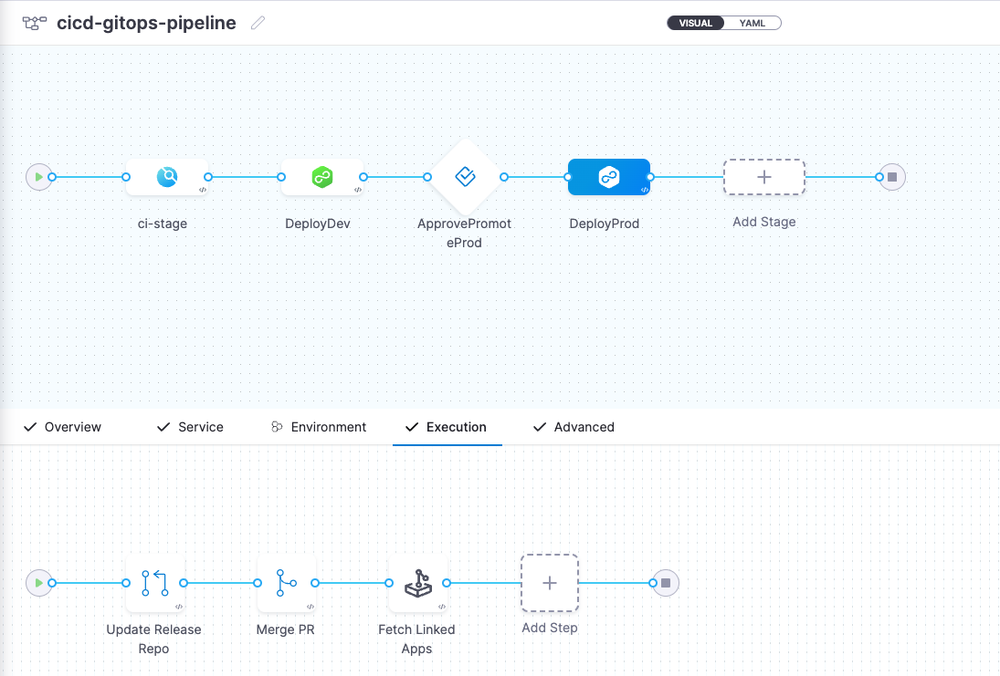
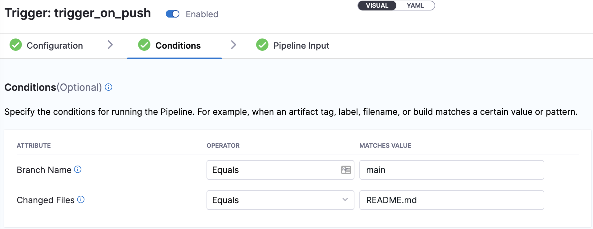
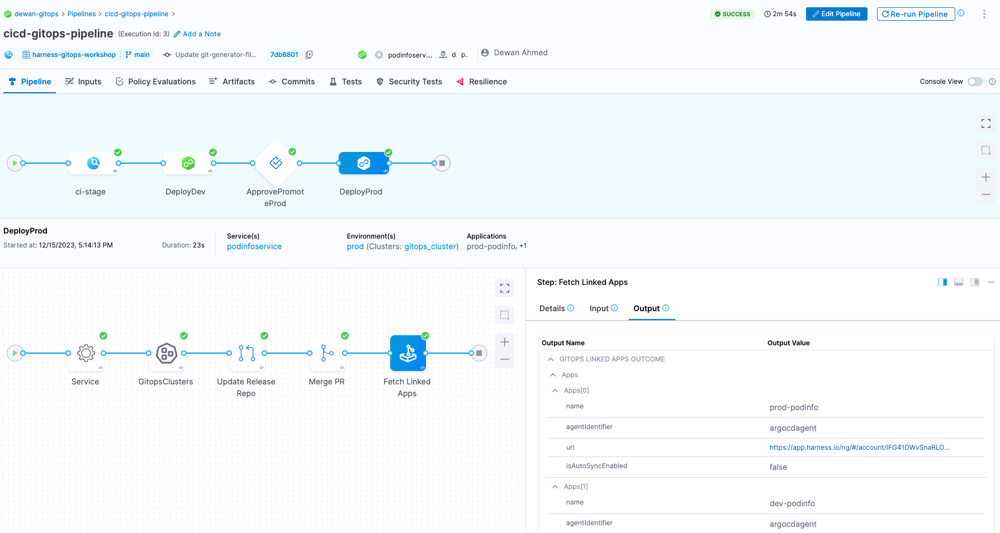

<CTABanner
  buttonText="Learn More"
  title="Continue your learning journey."
  tagline="Take a Continuous Delivery & GitOps Certification today!"
  link="/certifications/continuous-delivery"
  closable={true}
  target="_self"
/>

In this tutorial, we'll use Harness CI, CD, and GitOps to demonstrate an end-to-end software delivery process - from build to deployment following GitOps principles.

The diagram below shows a GitOps-driven CI/CD pipeline. The process involves building the application, pushing it to a Docker registry, and deploying it to a Kubernetes cluster. The pipeline features distinct stages for development and production environments, with an approval step to promote artifacts from dev to prod, ensuring thorough review and validation of changes.


:::info

Interested in doing this tutorial together? Harness now offers a hands-on lab where we guide you
through this exercise and more.

* [CI/CD DevDays lab material and guide](https://harness-developer-hub.s3.us-east-2.amazonaws.com/labs/Harness_CI_CD_Dev_Days_Lab_Guide.pdf)
* [Sign up for CI/CD DevDays](https://www.harness.io/events/harnessdevdays)

:::

## Prerequisites

- A Harness free plan. If you don't have one, [sign up for free](https://app.harness.io/auth/#/signup/?&utm_campaign=cd-devrel).
- A GitHub account. [Fork the Harness GitOps Workshop repo](https://github.com/harness-community/harness-gitops-workshop/fork) to your own GitHub account.
- A Docker Hub account.
- A Kubernetes cluster. A setup like [k3d](https://k3d.io/) will be suitable.
- [Install the Harness CLI](/docs/platform/automation/cli/install/) and [log in](/docs/platform/automation/cli/install/#configure-harness-cli).

## Required setup and configurations

In order to interact with your code repository (GitHub) and image registry (Docker Hub), the Harness platform needs to authenticate to these providers on your behalf. [Connectors](/docs/category/connectors/) in Harness help you pull in artifacts, sync with repos, integrate verification and analytics tools, and leverage collaboration channels.

In this section, you'll create two [secrets](https://developer.harness.io/docs/platform/secrets/add-use-text-secrets/) and two connectors for GitHub and Docker Hub. But before that, you'll need to create two personal access tokens (PAT) for GitHub and Docker Hub. Check out [the GitHub docs](https://docs.github.com/en/authentication/keeping-your-account-and-data-secure/managing-your-personal-access-tokens) and [the Docker Hub Docs](https://docs.docker.com/security/for-developers/access-tokens/) on how to create personal access tokens. For GitHub, you need to ensure that the token has read/write access to the content, pull requests (PRs), and webhooks for your forked repository.

Once you're authenticated using the Harness CLI, clone your *forked* GitHub repo, replacing GITHUB_USERNAME with your actual GitHub user. Navigate to the **cli-manifests** directory. 

```shell
git clone https://github.com/GITHUB_USERNAME/harness-gitops-workshop
cd harness-gitops-workshop/cli-manifests
```

Let's next create two secrets - one for GitHub PAT and another for Docker Hub PAT. Be sure to replace the placeholder values (GITHUB_PAT and DOCKERHUB_PAT) with the actual secret values. 

```shell
harness secret apply --token GITHUB_PAT --secret-name "github_pat"
harness secret apply --token DOCKERHUB_PAT --secret-name "docker_secret"
```

From your project setup, click on **Secrets**, and you should see the newly created secrets added to the Harness Built-in Secrets Manager. 

Now, let's create connectors for GitHub and Docker Hub.

To create a GitHub connector, execute the following:

```shell
harness connector --file github-connector.yaml apply
```

Enter your GitHub username and press **Enter**.

Run the following to create a Docker Hub Connector:

```shell
harness connector --file docker-connector.yaml apply
```

Enter your Docker Hub username and press **Enter**.

## Build the CI stage

Next, let's create the Continuous Integration (CI) pipeline that will do the following:

- Clone the repository
- Run OWASP tests
- If tests pass, will create a build, and push the container image to your docker registry

Make sure that you're in the `cli-manifests` directory and update `cipipeline.yaml` to replace **DOCKER_USERNAME** with your docker username.

Execute the following command to create the `cicd-gitops-pipeline` with the CI stage:

```bash
harness pipeline --file cipipeline.yaml apply
```

Enter your Docker Hub username when prompted and press **Enter**.

Click **Run** and then **Run Pipeline** to start the pipeline execution. A successful pipeline execution will produce a new image with the **latest** tag under the **harness-gitops-workshop** repository on your docker image registry.

The OWASP scan step used within the CI stage is part of the [Harness Security Testing Orchestration (STO)](https://www.harness.io/products/security-testing-orchestration) module. This step enables you to scan your code repositories and ingest results from [OWASP Dependency-Check](https://owasp.org/www-project-dependency-check/) for detecting publicly disclosed vulnerabilities present within a project's dependencies. For this example, `fail_on_severity` is initially set to none, but you have the flexibility to adjust it to any severity threshold, such as critical or high. If any vulnerabilities of severity, for instance, critical, are found during the OWASP scan, the pipeline execution can be immediately terminated, and the findings reported via a notification.

## Create the ApplicationSet

For this section, you will need to have a Kubernetes cluster. Execute the following command to verify if you are connected to a Kubernetes cluster:

```bash
kubectl cluster-info
```

### Create a GitOps Agent

A Harness GitOps Agent is a worker process that runs in your environment, makes secure, outbound connections to Harness, and performs all the GitOps tasks you request in Harness.

1. Select **Deployments**, and then select **GitOps**.

2. Select **Settings**, and then select **GitOps Agents**.

3. Select **New GitOps Agent**.

4. For this workshop, you'll create a new GitOps agent. When prompted with **Do you have any existing Argo CD instances?**, choose **No**, and then select **Start** to install the Harness GitOps Agent.

5. In **GitOps Operator**, select **Argo** to use Argo CD as the GitOps reconciler. Harness also offers Flux as the GitOps reconciler.

6. In **Namespace**, enter the namespace where you want to install the Harness GitOps Agent. For this tutorial, let's use the `default` namespace to install the Agent and deploy applications.

7. Select **Continue**. The **Download YAML** or **Download Helm Chart** settings appear.

Download the Harness GitOps Agent script using either the YAML or Helm Chart options. The YAML option provides a manifest file, and the Helm Chart option offers a Helm chart file. Both can be downloaded and used to install the GitOps agent on your Kubernetes cluster. The third step includes the command to run this installation. Run that command against your cluster.

8. Select **Continue** and verify the Agent is successfully installed and can connect to Harness Manager.

9. On your terminal, execute the following command to set the GitOps agent identifier you created earlier as a shell variable:

```bash
export AGENT_NAME=<GITOPS_AGENT_ID>
```

:::info

The ID of the GitOps agent might not be the same as its name.

:::

### Create a GitOps Cluster

A Harness GitOps Cluster is the target deployment cluster that is compared to the desire state. Clusters are synced with the source manifests you add as GitOps Repositories.

Create a Harness GitOps Cluster by executing the following command:

```bash
harness gitops-cluster --file gitops-cluster.yaml apply --agent-identifier $AGENT_NAME
```

### Create a GitOps Repository

A Harness GitOps Repository is a repo containing the declarative description of a desired state. The declarative description can be in Kubernetes manifests, Helm Chart, Kustomize manifests, etc.

Open `cli-manifests/gitops-repo.yaml` on your code editor and replace `GITHUB_USERNAME` with your GitHub username. Create a Harness GitOps Repository by executing the following command:

```bash
harness gitops-repository --file gitops-repo.yaml apply --agent-identifier $AGENT_NAME
```

### Create Harness GitOps Application using ApplicationSet

GitOps Applications manage GitOps operations for a given desired state and its live instantiation. A GitOps Application collects the Repository (what you want to deploy), Cluster (where you want to deploy), and Agent (how you want to deploy).

Let's examine the YAML manifest for this:

```YAML
gitops:
  name: gitops-application
  projectIdentifier: default_project
  orgIdentifier: default
  type: application
  application:
    metadata:
      clusterName: gitops_cluster
      labels:
        harness.io/serviceRef: ""
        harness.io/envRef: ""
    spec:
      source:
        repoURL: https://github.com/GITHUB_USERNAME/harness-gitops-workshop
        path: configs/git-generator-files-discovery
        targetRevision: main
      destination:
        server: https://kubernetes.default.svc
        namespace: default
  agentIdentifier: AGENT_NAME
  clusterIdentifier: gitopscluster
  repoIdentifier: gitopsrepo
```

This manifest brings together the Harness GitOps Agent, the Harness GitOps Repository, and the Harness GitOps Cluster. Under **spec --> source**, you can see the repoURL, path, and branch from which the ApplicationSet definition is fetched. **spec --> destination** denotes the target Kubernetes cluster and namespace. In this workshop, you will create the ApplicationSet CRD in the same namespace where the GitOps Agent is installed, i.e., the `default` namespace.

Let's examine **configs/git-generator-files-discovery/git-generator-files.yaml**:

```YAML
apiVersion: argoproj.io/v1alpha1
kind: ApplicationSet
metadata:
  name: podinfo
spec:
  generators:
    - git:
        repoURL: https://github.com/GITHUB_USERNAME/harness-gitops-workshop.git
        revision: HEAD
        files:
        - path: "configs/git-generator-files-discovery/cluster-config/**/config.json"
  template:
    metadata:
      name: '{{cluster.namespace}}-podinfo'
    spec:
      project: ARGO_PROJECT_ID
      source:
        repoURL: https://github.com/GITHUB_USERNAME/harness-gitops-workshop.git
        targetRevision: HEAD
        path: "configs/git-generator-files-discovery/apps/podinfo"
      destination:
        server: '{{cluster.address}}'
        namespace: '{{cluster.namespace}}'
      syncPolicy:
        syncOptions:
        - CreateNamespace=true
```

The [Git file generator](https://argocd-applicationset.readthedocs.io/en/stable/Generators-Git/#git-generator-files) is a subtype of the Git generator. The Git file generator generates parameters using the contents of JSON/YAML files found within a specified repository. `template.spec.project` refers to the Argo CD project ID that is mapped to your Harness project. 

Navigate to **GitOps > Settings > GitOps: Agents** to find the project ID. Update the project in `git-generator-files.yaml` in your **GitHub forked repo** with the ID you see there.


Also replace **GITHUB_USERNAME** in the `git-generator-files.yaml` file with your actual GitHub user.

Create a Harness GitOps Application by executing the following command:

```bash
harness gitops-application --file gitops-app.yaml apply --agent-identifier $AGENT_NAME
```

Enter your GitHub user when prompted, then type **Enter**.

Under **GitOps: Applications**, click on **gitops-application** and click **Sync**, then **Synchronize**. The ApplicationSet CRD should create two Argo CD applications - one in the `dev` namespace and the other in the `prod` namespace.

Navigate back to **GitOps > Applications**. Repeat the previous step to sync your dev and prod apps. All applications should now be synced and healthy.


## Create the PR Pipeline

Harness Pipelines define steps needed to built, test and deploy your application. You described your deployment using the GitOps entities you set up previously. You will now create a pipeline that performs the following steps:

- Runs an OWASP security scan to identify publicly disclosed vulnerabilities
- Compiles the **podinfo** source code
- Builds an publishes the updated app to Docker Hub
- Creates and merges GitHub Pull Request of any configuration changes to the dev environment
- Enforces a manual approval to proceed in deploying to to prod
- Creates and merges a GitHub Pull Request of any configuration changes to the prod environment

Harness pipelines require a [delegate](https://developer.harness.io/docs/platform/delegates/delegate-concepts/delegate-overview/) to execute pipeline tasks. You'll need a delegate token as well. You can [reuse the default delegate token or create a new token](https://developer.harness.io/docs/platform/delegates/secure-delegates/secure-delegates-with-tokens/).

You can find your Harness account ID in any Harness URL, for example:

```shell
https://app.harness.io/ng/#/account/ACCOUNT_ID/home/get-started
```

Export Harness account ID and delegate token values as environment variables:

```shell
export HARNESS_ACCOUNT_ID=YOUR_HARNESS_ACCOUNT_ID
export DELEGATE_TOKEN=YOUR_HARNESS_DELEGATE_TOKEN
```

Run the following commands to install the delegate in your cluster (the same cluster in which you have the agent installed).

```
helm repo add harness-delegate https://app.harness.io/storage/harness-download/delegate-helm-chart/
helm repo update harness-delegate
helm upgrade -i helm-delegate --namespace harness-delegate-ng --create-namespace \
  harness-delegate/harness-delegate-ng \
  --set delegateName=helm-delegate \
  --set accountId=$HARNESS_ACCOUNT_ID \
  --set delegateToken=$DELEGATE_TOKEN \
  --set managerEndpoint=https://app.harness.io/gratis \
  --set delegateDockerImage=harness/delegate:23.11.81601 \
  --set replicas=1 --set upgrader.enabled=true
```

Then navigate to **Project Setup > Delegates** and see your delegate check into Harness.

Next, run the following commands to create your environment and service entities.

```
harness environment --file environment-dev.yaml apply
harness environment --file environment-prod.yaml apply
harness service --file service.yaml apply
```

After applying the manifests, navigate to the **Environments** tab. Click on **dev** environment, then **GitOps Clusters**, and then **+ Select Cluster(s)**. Map your **gitops_cluster** to this environment. Do the same for the **prod** environment.

Run the following command to update pipeline with CD stages. Enter your Docker and GitHub usernames when prompted.

```bash
harness pipeline --file prpipeline.yaml apply
```

The full pipeline should look as follows in the Harness Pipeline Studio:



Finally, [create a trigger](https://developer.harness.io/docs/platform/triggers/triggering-pipelines/) to run the PR pipeline when new code is committed to the **main** branch of your GitHub forked repo. Since some of the GitOps steps also commit to the **main** branch to update the release repo manifest, it's essential to add specific conditions to prevent an infinite loop. Here, **README.md** serves as an example. In practice, you may choose a condition based on any change to the application source code.



## Test the setup

There are two ways to trigger the pipeline:

* Commit a change any non-`configs` file (such as a `README.md`) to the `main` branch of your GitOps workshop repo (`https://github.com/YOUR_GITHUB_USERNAME/harness-gitops-workshop`) to trigger the PR pipeline. Notice that the codebase commit SHA is tracked throughout the pipeline, from the image SHA to the `config.json` of the deployed applications.
* Select **Run Pipeline** in the Harness UI. Optionally, you can provide any updates to environment config variables.

A successful pipeline execution shows a successful status for each stage in the pipeline.


