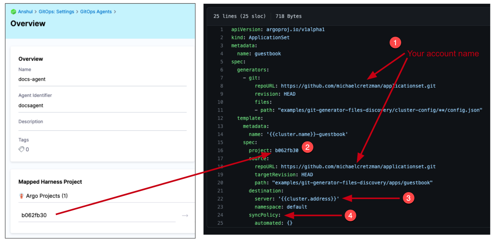
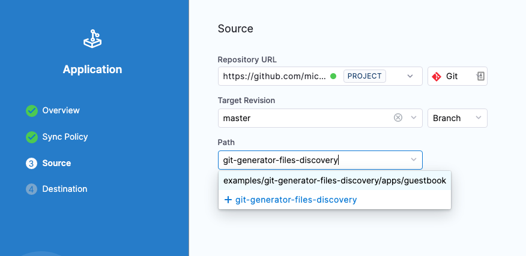
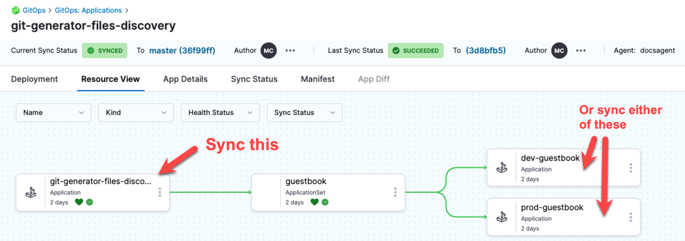

This topic walks you through creating a GitOps ApplicationSet in Harness.

## Prerequisites

To set up an ApplicationSet, you'll need the following:

* Create a [Harness GitOps agent](/docs/continuous-delivery/gitops/connect-and-manage/install-a-harness-git-ops-agent) to create the ApplicationSet.
* Create 2 target GitOps [clusters](/docs/continuous-delivery/gitops/get-started/harness-cd-git-ops-quickstart#step-3-add-a-harness-gitops-cluster). Dev and prod are used to deploy the child applications.
* GitHub account. You will be cloning the Argo Project's [ApplicationSet repo](https://github.com/argoproj/applicationset) and using one of its examples.
* Create a [Harness GitOps repository](/docs/continuous-delivery/gitops/get-started/harness-cd-git-ops-quickstart#step-2-add-a-harness-gitops-repository) with the Argo Project's ApplicationSet repo. We will be using one of its [examples](https://github.com/argoproj/applicationset/tree/master/examples).

## Step 1: Updating manifests in Git

The following example uses a [Git generator](https://argo-cd.readthedocs.io/en/stable/operator-manual/applicationset/Generators-Git/) and is in [Argo project’s public repository](https://github.com/argoproj/applicationset/tree/master/examples/git-generator-files-discovery).

1. Clone the repo and update `git-generator-files.yaml` with the following YAML keys/values and then save the changes.

    ```yaml
    apiVersion: argoproj.io/v1alpha1  
    kind: ApplicationSet  
    metadata:  
      name: guestbook  
    spec:  
      generators:  
        - git:  
            repoURL: https://github.com/<YOUR_ACCOUNT_NAME>/applicationset.git  
            revision: HEAD  
            files:  
            - path: "examples/git-generator-files-discovery/cluster-config/**/config.json"  
      template:  
        metadata:  
          name: '{{cluster.name}}-guestbook'
          labels: 
            harness.io/envRef: '{{envTag}}'
            harness.io/serviceRef: '{{serviceTag}}'
            harness.io/buildRef: '{{releaseTag}}'
        spec:  
          project: <PROJECT_ID_IN_AGENT_PAGE>  
          source:  
            repoURL: https://github.com/<your account name>/applicationset.git  
            targetRevision: HEAD  
            path: "examples/git-generator-files-discovery/apps/guestbook"  
          destination:  
            server: '{{cluster.address}}'  
            namespace: default  
          syncPolicy:  
            automated: {}
    ```
    To get the project Id, go to **GitOps Agents** and find the Argo Project Id you want to use to create the ApplicationSet.

    
2. Navigate to `applicationset/examples/git-generator-files-discovery/cluster-config/engineering/dev/config.json`. 
3. Replace `"address": "https://1.2.3.4"` with the Endpoint IP address for the **dev** target cluster. Ensure that you use the `https://` scheme. 
    Note that this cluster must be created beforehand.
4. Repeat step 2 for the **prod** target cluster by modifying the file `applicationset/examples/git-generator-files-discovery/cluster-config/engineering/prod/config.json`

Here is an example:

<DocImage path={require('./static/harness-git-ops-application-set-tutorial-34.png')} width="60%" height="60%" title="Click to view full size image" />  

:::note

Both JSON and YAML formats are supported for ApplicationSets.

:::

### Step 2: Creating the ApplicationSet app

1. Similar to how you create a regular application in Harness GitOps, select **Applications**, and then select **New Application**.
2. Enter a name, choose the agent, leave the default **Sync Policy** settings, and select **Continue**.
3. In **Source**, enter the following settings and then select **Continue**.
    1. **Repository URL**: select the GitOps repository you added earlier.
    2. **Target Revision**: select **master**.
    3. **Path**: enter **examples/git-generator-files-discovery**.
    
      

4. In **Destination**, select the **cluster and namespace in which the GitOps agent is installed**.

### Step 3: Sync the ApplicationSet app

You can sync from 2 places: **Application** view or PR pipeline. For syncing via the PR pipeline, please refer to [Sync GitOps applications](/docs/continuous-delivery/gitops/use-gitops/sync-gitops-applications).

From the **Application** view, you can sync the Harness ApplicationSet application or the individual Applications independently.



If you configure automatic syncing in the ApplicationSet template, then the applications are synced automatically. See `syncPolicy.automated` in the following example.

```yaml
  template:  
    metadata:  
      name: '{{cluster.name}}-guestbook'  
    spec:  
      project: 191b68fc  
      source:  
        repoURL: https://github.com/johndoe/applicationset.git  
        targetRevision: HEAD  
        path: "examples/git-generator-files-discovery/apps/guestbook"  
      destination:  
        server: '{{cluster.address}}'  
        namespace: default  
      syncPolicy:  
        automated: {}
```

## Troubleshooting

### ArgoCD AppSet “Degraded” Status with Project-Scoped Repos

**What you see**  
You’ll find your GitOps ApplicationSet marked **Degraded**, with errors such as:  
- `unable to checkout git repo … authentication required:`  
- `Repository not found`  
- `ApplicationGenerationFromParamsError`

**Why it happens**  
ArgoCD v2.x doesn’t support ApplicationSets using **project-scoped** repo credentials. If your repository secret includes a `data.project` field, the AppSet controller can’t authenticate and fetch your manifests — so it stays Degraded.

**How to fix it**  
1. Edit your Git repository Secret in the ArgoCD namespace.  
2. Remove the `data.project` key (so it isn’t limited to a single ArgoCD project).  
3. Save and let ArgoCD reconcile. Your ApplicationSet should recover and deploy normally.