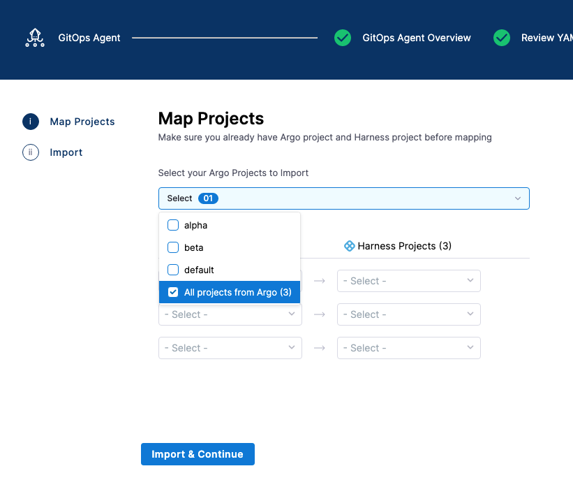
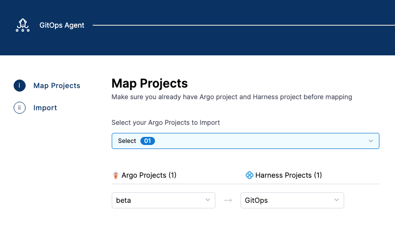

This topic describes how to add and manage multiple Argo CD projects within one Harness Project.

When you install a Harness GitOps Agent, Harness can import your existing Argo CD entities into Harness GitOps. We call this Bring Your Own Argo CD (BYOA).

With a non-BYOA setup, Harness installs Argo CD for you when you install a Harness GitOps Agent. For more information, go to [Install a Harness GitOps Agent](/docs/continuous-delivery/gitops/use-gitops/install-a-harness-git-ops-agent.md).

In addition, when you install the Harness GitOps Agent in your existing Argo CD cluster, you can map Argo CD projects to Harness Projects. Harness will import all the Argo CD project entities (applications, clusters, repos, etc) and create them in Harness automatically.

Also, whenever new entities are created in mapped Argo CD projects, they are added to Harness automatically.

## Install the GitOps Agent at the account or org level

To map Argo CD projects to Harness Projects, you need to install the Harness GitOps Agent at the Harness account or org level. Then you can map the Argo CD projects to any of the Harness Projects in the account or org.

If you install the GitOps Agent at the Harness Project level, you can only map to the current Project.

In the following example, we will install the Agent at the Harness account level.

## Mapping Argo CD projects to Harness Projects

The following sections describe how to map Argo CD projects to Harness Projects when installing a new Agent. Mapping Argo CD projects in an existing Agent is covered in [Adding new mappings to existing Agent](#adding_new_mappings_to_existing_agent).

The following steps show you how to install a GitOps Agent into an existing Argo CD namespace and then map your existing projects to your Harness Project.

1. In your Harness account, click **Account Settings**.
2. click **GitOps**, and then click **Agents**.
   
   

3. Click **New GitOps Agent**.
4. In **Agent Installation**, in **Do you have any existing Argo CD instances**, click **Yes**, and then click **Start**.
   
   

5. In **Name**, enter a name for your agent, such as **byoa-agent**.
6. In **Namespace**, enter the namespace where Argo CD is hosted. The default is **argocd**.
   
   

7. Click **Continue**.
8. In **Review YAML**, click **Download & Continue**.
9.  Log into the cluster hosting Argo CD.
10. Run the install command provided in the Agent installer, such as `kubectl apply -f gitops-agent.yml -n argocd`. You'll see output similar to this:
    ```bash
    serviceaccount/byoa-agent-agent created  
    role.rbac.authorization.k8s.io/byoa-agent-agent created  
    clusterrole.rbac.authorization.k8s.io/byoa-agent-agent created  
    rolebinding.rbac.authorization.k8s.io/byoa-agent-agent created  
    clusterrolebinding.rbac.authorization.k8s.io/byoa-agent-agent created  
    secret/byoa-agent-agent created  
    configmap/byoa-agent-agent created  
    deployment.apps/byoa-agent-agent created  
    configmap/byoa-agent-agent-upgrader created  
    role.rbac.authorization.k8s.io/byoa-agent-agent-upgrader created  
    rolebinding.rbac.authorization.k8s.io/byoa-agent-agent-upgrader created  
    serviceaccount/byoa-agent-agent-upgrader created  
    cronjob.batch/byoa-agent-agent-upgrader created
    ```
1.  Back in the Harness GitOps Agent installer, click **Continue**.
   
   The Agent has registered with Harness.
   
   

2.  Click **Continue**. The **Map Projects** settings appear.

<details>
<summary>BYOA for Argo CD version v2.8.0 or higher </summary>

### New BYOA Installation

If your existing Argo CD installation has version v2.8.0 or higher, you will need to set `redis.compression` as **none** in the ConfigMap `argocd-cmd-params-cm`.

```bash
apiVersion: v1
kind: ConfigMap
data:
  redis.compression: none
metadata:
  labels:
    app.kubernetes.io/name: argocd-cmd-params-cm
    app.kubernetes.io/part-of: argocd
  name: argocd-cmd-params-cm
  namespace: your-argo-namespace
```

After making this change, please restart your `argocd-application-controller` and `argocd-repo-server` pods. Once this is done, you may continue to install the Harness GitOps Agent using the steps mentioned earlier.

### Upgrade Argo CD version for an Existing Installation
If you are upgrading your Argo CD version in an existing BYOA installation, you will also need to set `redis.compression` as **none** in the ConfigMap `argocd-cmd-params-cm`.
Additionally, you will need to edit the network policy `argocd-repo-server-network-policy` for your repo server component to allow communication with `argocd-applicationset-controller`.

```bash
apiVersion: networking.k8s.io/v1
kind: NetworkPolicy
metadata:
  name: argocd-repo-server-network-policy
  namespace: your-argo-namespace
spec:
  ingress:
  - from:
    - podSelector:
        matchLabels:
          app.kubernetes.io/name: argocd-application-controller
    - podSelector:
        matchLabels:
          app.kubernetes.io/name: argocd-applicationset-controller
    - podSelector:
        matchLabels:
          app.kubernetes.io/name: gitops-agent
    ports:
    - port: 8081
      protocol: TCP
  - from:
    - namespaceSelector: {}
    ports:
    - port: 8084
  podSelector:
    matchLabels:
      app.kubernetes.io/name: argocd-repo-server
  policyTypes:
  - Ingress
```

</details>

## Map Projects

To map your existing Argo CD projects to Harness Projects, you simply select the Argo CD projects you want to use, and select the corresponding Harness Project to map.

1. In **Map Projects**, in **Select your Argo Projects to Import**, click the Argo CD projects you want to map.
   
   

2. In each row, select the Argo project and corresponding Harness Project.
   
   
   
   Do not map the same Argo CD project to multiple Harness Projects.

3. Click **Import & Continue**.
   
   The Argo CD projects are imported.

   Here's an example where the Argo CD applications, repositories, repository certs, and clusters are imported.

   

1. Click **Finish**. The mapping is displayed in the Agent details.
   
   
   
2. Click **Save**.

## Verify mapping

Next, look in the mapped Harness Project to see the imported Argo CD entities.

1. In your Harness Project, click **GitOps**, and then click **Applications**.
   You can see the imported application.
   
   

2. Click **Settings**, and then click **Repositories**.
   You can see the imported repositories.
3. Click **Settings**, and then click **Clusters**.
   You can see the imported clusters.

Do the same for any other mapped project entities.

## Adding new mappings to existing Agent

You can add new mappings to an existing Agent in the Agent's **Mapped Harness Project** settings.

1. In Harness, open an existing Agent.
2. Click **Edit**. In this example, I already have the Argo CD project **alpha** mapped to the Harness Project **GitOps**.
   
   
   
   Let's add a new mapping.

3. In **Mapped Harness Project**, click **Add**.
4. In **Map Projects**, in **Select your Argo Projects to Import**, select the new Argo CD project to map. Do not select a project you have already mapped.
5. Map the new Argo CD project to a Harness Project and click **Import & Continue**.
   Do not re-map an existing mapping. Harness will throw an error.
   
   

6. When the import is complete, click **Finish**.  

Both projects are now mapped.


## Adding Argo CD entities to Harness automatically

When an Agent contains Argo CD project mappings to a Harness Project, any new entities added to the Argo CD project are added to the mapped Harness Project automatically.

Try adding a new Argo CD repository to the mapped Argo CD project.

Once it's saved in Argo CD, go to Harness and look at the GitOps Repositories in the mapped Harness Project. A new repo is added.

### Automatically added Argo CD repositories

When adding Argo CD repositories, Harness automatically generates the name of Repository when it's added to Harness. This is necessary because Argo CD has no name setting for its repos.

The process for generating the name is: take the repo name, remove any dashes, and then add an underscore and a unique suffix.

For example, the Argo CD repo `https://github.com/argoproj/gitops-engine.git` is named `gitopsengine_kmjzyrbs` in Harness


### Make sure that your Argo CD entities are visibile in the Harness UI

In some Argo CD versions, you are not required to specify a project for your entities. However, for the entities to be visible in the Harness UI, you must associate the entities with a project. 

If you are unable to edit an entity from the Argo CD UI, you can edit that entity in the cluster so that they have a project and other required values. The entities are stored in different formats in the cluster. For example, clusters, repositories, and repository credential templates are stored in `Secret`, and GnuPG keys and repository certificates are stored in `ConfigMap` in the namespace in which Argo CD is installed. 

Edit the respective secret of the entity and add the fields `project` and `name` in the `data` or `stringData` block. For examples, go to [Manage an Argo CD configuration by using Harness GitOps](/docs/continuous-delivery/gitops/connect-and-manage/manage-argo-configs.md#git-configuration-files).


## Creating GitOps Clusters with multiple projects

When you have multiple Argo CD projects mapped to your Harness Project, you can choose which Argo CD project to use when you create a new GitOps Cluster in your Harness Project.

By default, in the Argo CD console, when you create a cluster it is not associated with an Argo CD project. You can add the cluster using the `argocd cluster add` CLI and its `--project` option.

1. Go to the Harness Project that is mapped to multiple Argo CD projects.
2. In **Deployments**, click **GitOps**, and then click **Settings**.
3. Click **Clusters**.
4. Click **New Cluster**.
5. Enter a name for the Cluster.
6. In **GitOps Agent**, select the Agent where you set up the mappings. The **Project** setting appears.
   
   If the Agent has only 1 Argo CD project mapped, the **Project** setting is not shown.

7. In **Project**, select the Argo CD project with the cluster you want to import.
   
   

8. Click **Continue**.
9.  Complete the regular steps for adding the resource.

When you are done, the Cluster will appear in the GitOps Cluster list.

## Creating GitOps Repositories with multiple projects

When you have multiple Argo CD projects mapped to your Harness Project, you can choose which Argo CD project to use when you create a new GitOps Repository in your Harness Project.

1. Go to the Harness Project that is mapped to multiple Argo CD projects.
2. In **Deployments**, click **GitOps**, and then click **Settings**.
3. Click **Repositories**.
4. Click **New Repository**.
5. Select a repo type.
6. Enter a name for the Repository.
7. In **GitOps Agent**, select the Agent where you set up the mappings. The **Project** setting appears.
   
   If the Agent has only 1 Argo CD project mapped, the **Project** setting is not shown.

8. In **Project**, select the Argo CD project with the repo you want to import.
   
   

9.  Enter the **Repository URL** and click **Continue**. You might have multiple repos in that Argo CD project. So the Repository URL is required.
10. Complete the regular steps for adding the resource.

When you are done, the Repository will appear in the GitOps Repositories list.

## Creating GitOps Applications with multiple projects

When you have multiple Argo CD projects mapped to your Harness Project, you can choose which Argo CD project to use when you create a new GitOps Application in your Harness Project.

1. Go to the Harness Project that is mapped to multiple Argo CD projects.
2. In **Deployments**, click **GitOps**, and then click **Applications**.
3. Click **New Application**.
4. Enter a name for the new Application.
5. In **GitOps Agent**, select the Agent where you set up the mappings. The **Project** setting appears.
   
   If the Agent has only 1 Argo CD project mapped, the **Project** setting is not shown.

6. In **Project**, select the Argo CD project with the application you want to import.
   
   

7. Select/create the Harness Service and Environment, and then click **Continue**.
8. Complete the regular steps for adding the resource.

When you are done, the Application will appear in the GitOps Applications list.

## Notes

* Harness honors Argo CD project permissions. If the project selected for the Harness Application does not have permission for the repository or cluster, then Harness will return a permission error. You will need to go into Argo CD and adjust the projects **scoped repositories** and **destinations**.
* A non-BYOA setup does not support multiple Argo CD mappings to a single Harness Project. A non-BYOA setup is a setup where Harness installs Argo CD for you when you install a Harness GitOps Agent.
* If you need to uninstall a GitOps Agent, you can use `kubectl delete` with the same manifest you used to install it. For example, `kubectl delete -f gitops-agent.yml -n argocd`.

