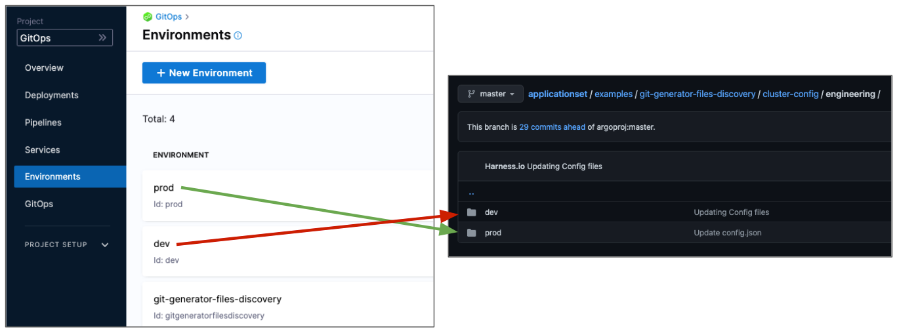
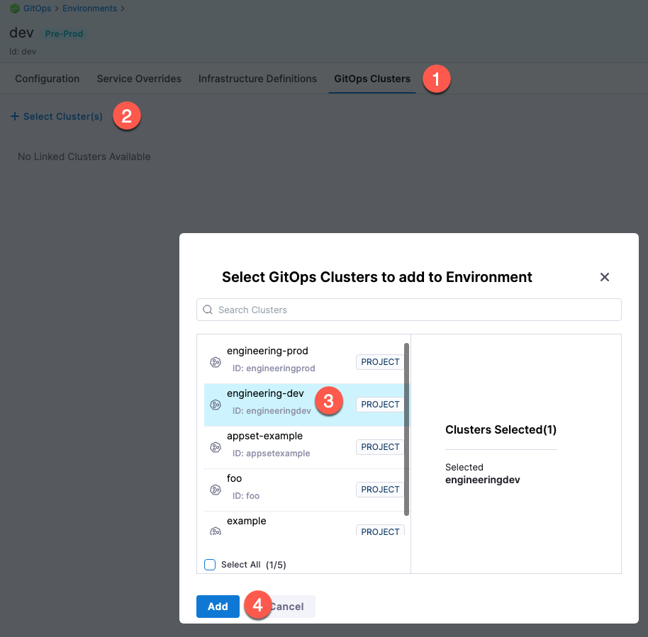
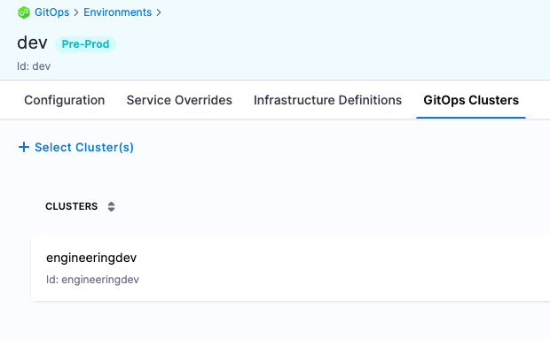
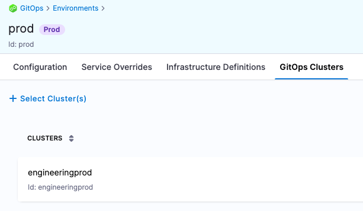
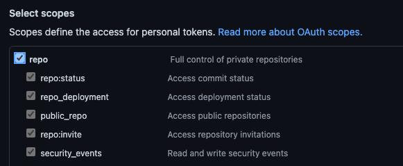
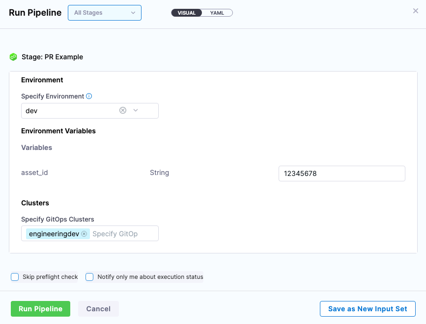

:::note

Currently, this feature is behind the feature flags `ENV_GROUP`, `NG_SVC_ENV_REDESIGN`, and `OPTIMIZED_GIT_FETCH_FILES` `MULTI_SERVICE_INFRA`. Contact [Harness Support](mailto:support@harness.io) to enable the feature.

:::

This topic shows you how to create a Harness PR pipeline in Harness GitOps to make changes to one of an ApplicationSet's target environments.

Often, even though your ApplicationSet syncs one microservice/application to multiple target environments, you might want to change a microservice in just one of the target environments, such as a dev environment. A Harness PR Pipeline enables you to do this.

:::tip Important

This topic builds on the ApplicationSet created in [Harness GitOps ApplicationSets](/docs/continuous-delivery/gitops/applicationsets/harness-git-ops-application-set-tutorial.md). Ensure you have read that topic and, ideally, have set up an ApplicationSet in Harness before creating a PR pipeline.

:::

<details>
<summary>ApplicationSets and PR pipelines summary</summary>

A typical GitOps Application syncs a source manifest to a destination cluster. If you have multiple target clusters, you could create separate GitOps Applications for each one, but that makes management more challenging. Also, what if you want to sync an application with 100s of target clusters? Managing 100s of GitOps Applications is not acceptable.

To solve this use case, Harness supports ApplicationSets.

### ApplicationSets

An ApplicationSet uses an ApplicationSet controller to automatically and dynamically generate applications in multiple target environments. A GitOps ApplicationSet is similar to a GitOps Application but uses a template to achieve application automation using multiple target environments.

ApplicationSet is supported in your cluster using a [Kubernetes controller](https://kubernetes.io/docs/concepts/architecture/controller/) for the `ApplicationSet` [CustomResourceDefinition](https://kubernetes.io/docs/tasks/extend-kubernetes/custom-resources/custom-resource-definitions/) (CRD). You add an ApplicationSet manifest to a Harness GitOps Application just like you would add a typical Deployment manifest. At runtime, Harness uses the ApplicationSet to deploy the application to all the target environments' clusters.


#### Template parameters

ApplicationSets use generators to generate parameters that are substituted into the `template:` section of the ApplicationSet resource during template rendering.

There are many types of generators. For the list, go to [Generators](https://argocd-applicationset.readthedocs.io/en/stable/Generators/) from Argo CD docs.Generators support parameters in the format `{{parameter name}}`.

For example, here's the template section of a guestbook List generator that uses `{{cluster.name}}` and `{{cluster.address}}`:


```yaml
  template:  
    metadata:  
      name: '{{cluster.name}}-guestbook'  
    spec:  
      project: 191b68fc  
      source:  
        repoURL: https://github.com/johndoe/applicationset.git  
        targetRevision: HEAD  
        path: "examples/git-generator-files-discovery/apps/guestbook"  
      destination:  
        server: '{{cluster.address}}'  
        namespace: default  
      syncPolicy:  
        automated: {}
```

The values for these parameters will be taken from the cluster list config.json `cluster.name` and `cluster.address`:

```yaml
{  
  "releaseTag" : "k8s-v0.4",  
  "cluster" : {  
    "owner" : "cluster-admin@company.com",  
    "address" : "https://34.133.127.118",  
    "name" : "dev"  
  },  
  "asset_id" : "12345678"  
}
```

After substitution, this guestbook ApplicationSet resource is applied to the Kubernetes cluster:

```yaml
apiVersion: argoproj.io/v1alpha1  
kind: Application  
metadata:  
  name: dev-guestbook  
spec:  
  source:  
    repoURL: https://github.com/johndoe/applicationset.git  
    path: examples/git-generator-files-discovery/apps/guestbook  
    targetRevision: HEAD  
  destination:  
    server: https://34.133.127.118  
    namespace: default  
  project: 191b68fc  
  syncPolicy:  
    automated: {}
```

### Create PR Pipelines

When you deploy a Harness PR Pipeline, you simply indicate what target environment application you want to update and the config.json keys/values you want changed, such as release tags. Harness creates the pull request in your Git repo and merges it for you. Now, the target environment application has the new keys/values.


#### Wave deployments

You often hear the term wave deployments used when PR Pipelines are discussed.

A wave deployment is a deployment strategy in Continuous Delivery that involves releasing changes to a portion of users at a time, rather than all users at once. Typically, this is done using separate cloud regions for each target environment.

Wave deployments help reduce the risk of deployment failures and allow for quick recovery. The changes are rolled out in waves, typically starting with a group of users in one region and gradually expanding to the entire user base across all regions. This approach allows for a more controlled and monitored rollout of changes, improving the overall quality and stability of the deployment process.

With Harness GitOps, you can implement wave deployments by creating multiple environments for your application: one environment for each cloud region. Then, gradually promote changes from one environment to the next. This way, you can test changes in a safe and controlled manner before releasing them to the entire user base.

PR Pipelines support the wave deployments practice by allowing you to change a microservice in each target environment as needed.

</details>

## Before you begin

This topic extends Harness GitOps features covered in the following topics:

* [Harness GitOps Basics](/docs/continuous-delivery/gitops/get-started/harness-git-ops-basics.md)
* [Harness CD GitOps Tutorial](/docs/continuous-delivery/gitops/get-started/harness-cd-git-ops-quickstart.md)
* [Harness GitOps ApplicationSets](/docs/continuous-delivery/gitops//applicationsets/harness-git-ops-application-set-tutorial.md)

Review these topics before proceeding.

## Create a PR pipeline

When you deploy a Harness PR pipeline, you indicate the target environment application and the config.json keys/values you want changed. Harness creates the pull request in your Git repo and merges it for you. Once complete, the target environment application has the new keys/values.


For the PR Pipeline, we'll create two Harness environments, dev and prod. These names are the same as the folder names in the repo:



We use the same names so that when we select a Harness environment we can pass along the same name as the target folder.

Next, we'll create a Harness service that points to the config.json files in these directories.

The path to the config.json files in the service will use the expression <+env.name>: `examples/git-generator-files-discovery/cluster-config/engineering/<+env.name>/config.json`.

At runtime, this expression resolves to the Harness environment you selected.

When you run the pipeline, you'll select which environment to use, dev or prod, and Harness will use the corresponding repo folder and update that application only.

### Create Harness environments for each target environment

First, let's create the **dev** environment.

1. In your Harness Project, click **Environments**.
2. Click **New Environment**.
3. Enter the following and click **Save**:
	1. **Name:** **dev**.
	2. **Environment Type:** **Pre-Production**.

The new environment is created.

#### Create variable for JSON key-value pair

Next, we'll add a variable for the JSON key-value we will be updating.

1. In **Advanced**, in **Variables**, click **New Variable Override**.
2. In the variable **Name**, enter **asset\_id** and click **Save**.  
   
   The `asset_id` name is a key-value in the config.json files for both dev and prod:
   
   

3. For variable **Value**, select **Runtime Input**:
   
   
   
   Later, when you run the pipeline, you'll provide a new value for this variable, and that value will be used to update the config.json file.

#### Select GitOps clusters to add to environment

Next, we'll link the Harness GitOps clusters for dev with the dev environment. Once you link GitOps clusters to an environment, you can then select from an environment's linked GitOps clusters when you select the environment in a pipeline.

1. Click **GitOps Clusters**.
2. Click **Select Cluster(s)**.
3. Select **engineering-dev**.
4. Click **Add**.



The Harness GitOps cluster is now linked to the environment.



#### Repeat the process for the prod environment

1. Create a new environment named **prod**.
2. Add the same `asset_id` variable to the prod environment.
3. Link the **engineering-prod** GitOps cluster to the environment.



### Create the PR pipeline

To create the pipeline, we'll simply create a new service that includes the manifest you want deployed and select the dev environment you created earlier.

1. In your Harness project, click **Pipelines**.
2. Click **Create a Pipeline**.
3. In **Create new Pipeline**, enter the name **PR Pipeline**, and then click **Start**.
4. Click **Add Stage**, and select **Deploy**.
   
   

5. Enter the following and click **Set Up Stage**:
	1. **Stage Name:** enter **PR Example**.
	2. **Deployment Type:** select **Kubernetes**.
	3. Enable the **GitOps** option.
  
  

   The stage is created and the service settings appear.

### Create the service

The Harness service represents what you're deploying. In this case, we're deploying a config.json file.

1. In **Select Service**, click **New Service**.
2. In **Name**, enter **PR Example**.
3. In **Manifests**, click **Add Release Repo Manifest**.
4. In **Release Repo Store**, select one of the following repositories.  

```mdx-code-block
import Tabs from '@theme/Tabs';   
import TabItem from '@theme/TabItem';
```
```mdx-code-block
<Tabs>
<TabItem value="GitHub" label="GitHub" default>
```

Add a Harness Github connector to configure the location for Harness to fetch the config.json file. 

To add a Harness Github connector:

1. In **Github Connector**, select **New Github Connector**.
2. Enter the following Github connector settings:
    1. **Name:** enter **gitops-github**.
    2. **URL Type:** select **Repository**.
    3. **Connection Type:** select **HTTP**.
    4. **GitHub Repository URL:** enter the HTTP URL for repo you used for your ApplicationSet, such as `https://github.com/johnsmith/applicationset.git`.
    5. **Authentication:** select **Username and Token**. For the token, you'll need to use a Personal Access Token (PAT) from Github. If you are logged into Github, just go to <https://github.com/settings/tokens>.
    6. Ensure the PAT has the **repo** scope selected.
   
       
   
       You will store the PAT in a [Harness Text Secret](/docs/platform/tecrets/add-use-text-secrets). For details on Secrets Management, go to [Harness Secrets Management Overview](/docs/platform/tecrets/tecrets-management/harness-secret-manager-overview).
    
    7. Select **Enable API access** and use the same Harness secret.
    
    For more information, go to the [GitHub connector settings reference](/docs/platform/connectors/code-repositories/ref-source-repo-provider/git-hub-connector-settings-reference).
3. Select **Continue**.
4. In **Connect to the provider**, select **Connect through Harness Platform**., and then click **Save and Continue**.
5. When the **Connection Test** in complete, click **Continue**.

```mdx-code-block
</TabItem>
<TabItem value="Bitbucket" label="Bitbucket">
```
Add a Harness Bitbucket connector to configure the location from which Harness can pull the config.json file. 

To add a Bitbucket connector:

1. In **Bitbucket Connector**, select **New Bitbucket Connector**.
2. Enter the following Bitbucket connector settings:
    1. **Name:** enter **gitops-bitbucket-cloud**.
    2. **URL Type:** select **Repository**.
    3. **Connection Type:** select **HTTP**.
    4. **GitHub Repository URL:** enter the HTTP URL for repo you used for your ApplicationSet, such as `https://bitbucket.org/johnsmith/applicationset.git`.
    5. **Authentication:** select **Username and Token**. For the token, use a Personal Access Token (PAT) from Bitbucket. If you are logged into Bitbucket, go to [HTTP access tokens](https://confluence.atlassian.com/bitbucketserver/http-access-tokens-939515499.html). You must provide an account-level app password or token. Repo-level tokens are not supported.
   
       Store the PAT in a [Harness Text Secret](/docs/platform/tecrets/add-use-text-secrets). For details on Secrets Management, go to [Harness Secrets Management Overview](/docs/platform/tecrets/tecrets-management/harness-secret-manager-overview).
    
    6. Select **Enable API access** and use the same Harness secret.
    
    For more information, go to [Bitbucket connector settings reference](/docs/platform/connectors/code-repositories/ref-source-repo-provider/bitbucket-connector-settings-reference).
3. Select **Continue**.
4. In **Connect to the provider**, select **Connect through Harness Platform**, and then click **Save and Continue**.
5. After the Connection Test is complete, click **Continue**.

```mdx-code-block
</TabItem>    
</Tabs>
```

### Specify manifest details

Now we'll define the manifest to use for the PR pipeline. We'll use the path to the config.json files. We'll use the expression `<+env.name>` in the path so that we can dynamically select the path based on the Harness environment we select: **dev** or **prod**.

1. In **Manifest Details**, enter the following settings and then click **Submit**.
	1. **Manifest Name:** enter **config.json**.
	2. **Git Fetch Type:** select **Latest from Branch**.
	3. **Branch:** enter the name of the main branch (master, main, etc).
	4. **File Path:** enter `examples/git-generator-files-discovery/cluster-config/engineering/<+env.name>/config.json`.  
	
  Note the use of `<+env.name>`.
  
  

2. Back in **New Service**, click **Save**.

  the service is added to the pipeline.

  

1. Click **Continue** to add the environment.

### Add Environment Runtime Input

For the stage environment, we'll use a Harness runtime input. When you run the pipeline, Harness will prompt you for a value for the environment. You can select the environment you want to use for the PR.

1. Set **Specify environment or environment group** as a runtime input.
   
   

2. Click **Continue**.

## Review execution steps

In **Execution**, Harness automatically adds the following steps.

:::note

You don't have to edit anything in these steps. The step are ready to run.

:::

### Update Release Repo

This step fetches your JSON files, updates them with your changes, performs a commit and push, and then creates the PR.  
 
There is an option to provide a custom PR title. If you don't provide a PR title, Harness creates the PR with the title **Harness: Updating config overrides**.  

This step supports hierarchical variables. If you specify a dot-separated variable in this step, it creates or updates a nested variable.  

You can also enter variables in this step to update key-value pairs in the config file you are deploying.  

If there is a matching variable name in the variables of the Harness service or environment used in this pipeline, the variable entered in this step will override them. 

If an empty or blank value is provided for a variable, it will be disregarded, and no updates will be made to the JSON or YAML file for that specific variable.


### Merge PR

This step simply merges the new PR.

### Revert PR

This step reverts the commit passed and creates a new PR. Use this step if you want to run any tests or automation on the pipeline and then revert the commit done by the **Update Release Repo** step.
  
The Revert PR step uses the commitId of the Update Release Repo step as input. The commitId can be an expression, runtime input, or a static value. For example, `<+pipeline.stages.deploy.spec.execution.steps.updateReleaseRepo.updateReleaseRepoOutcome.commitId>`. 

The Revert PR step creates a new branch and creates a commit to revert the changes done in the Update Release Repo step commit. 

You can create another Merge PR step to merge the Revert PR step. 

:::info Limitation

You can create a maximum of two Merge PR steps in a stage.

:::

## Run and verify the PR pipeline

Now your PR pipeline is ready.

1. Click **Save**, and then click **Run**.
2. In **Run Pipeline**, in **Specify Environment**, select the **dev** Environment.
3. In **Environment Variables**, for **asset\_id**, enter the value `12345678`.
4. In **Specify GitOps Clusters**, select the **engineeringdev** cluster.
   
   

5. Click **Run Pipeline**.

  You can review the deployment steps in real-time.

  

  Here's an example of each step:

  * Service:
  ```bash
  Starting service step...  
  Processing service variables...  
  Applying environment variables and service overrides  
  Processed service variables  
  Processed artifacts and manifests  
  Completed service step
  ```

  * GitOps Clusters:
  ```bash
  Environment(s): {dev}   
    
  Processing clusters at scope PROJECT  
  Following 1 cluster(s) are present in Harness Gitops  
  Identifiers: {engineeringdev}   
    
  Following 1 cluster(s) are selected after filtering  
  Identifiers: {engineeringdev}   
    
  Completed
  ```

  * Update Release Repo:
  
  

  * Merge PR:
  ```bash
  PR Link: https://github.com/wings-software/gitops-pipeline-demo/pull/155  
  Pull Request successfully merged  
  Commit Sha is bcd4f2f73a47b74dba54habbcd10a6679ed99a  
  Done.
  ```

  * Revert PR:  
  ```bash
  Setting git configs
  Using optimized file fetch
  Created revert PR https://github.com/wings-software/gitops-pipeline-demo/pull/156
  Done.
  ```

  * Merge PR_1:   
  ```bash
  PR Link: https://github.com/wings-software/gitops-pipeline-demo/pull/156
  Pull Request successfully merged
  Commit Sha is da3c393560bf5e831a7b4fa123456c1eafb989ac
  Done.
  ```
  
  
6. Check the repo to see that the config.json file for the dev environment has been updated with the new **asset\_id** value:

  

Congratulations! You PR Pipeline was successful.

