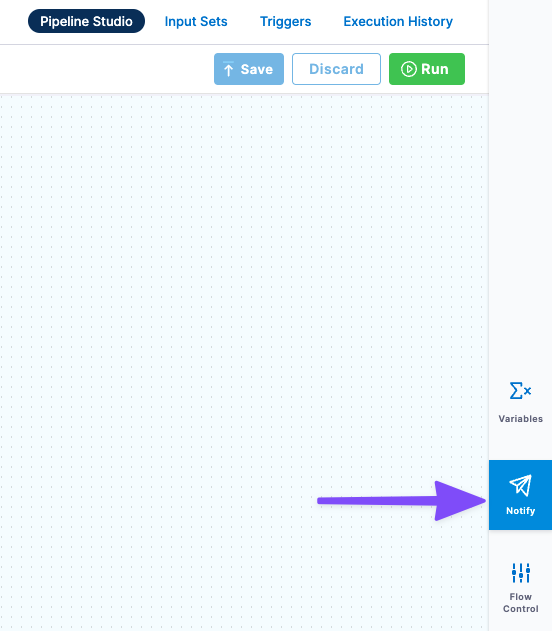
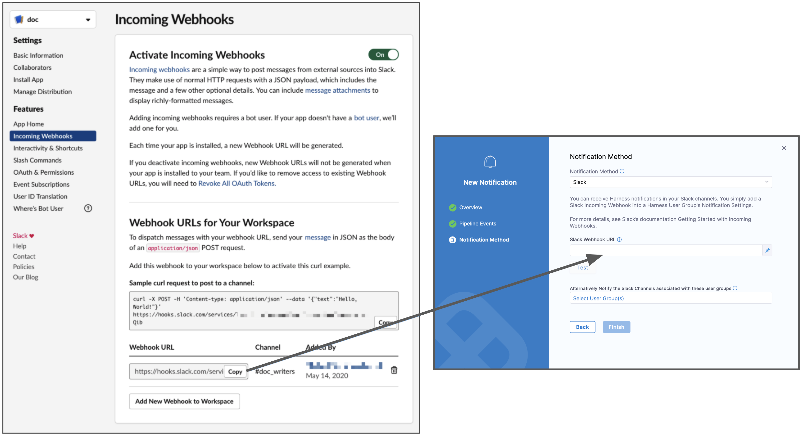
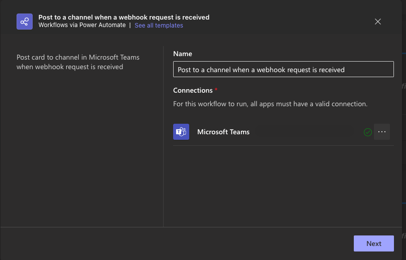
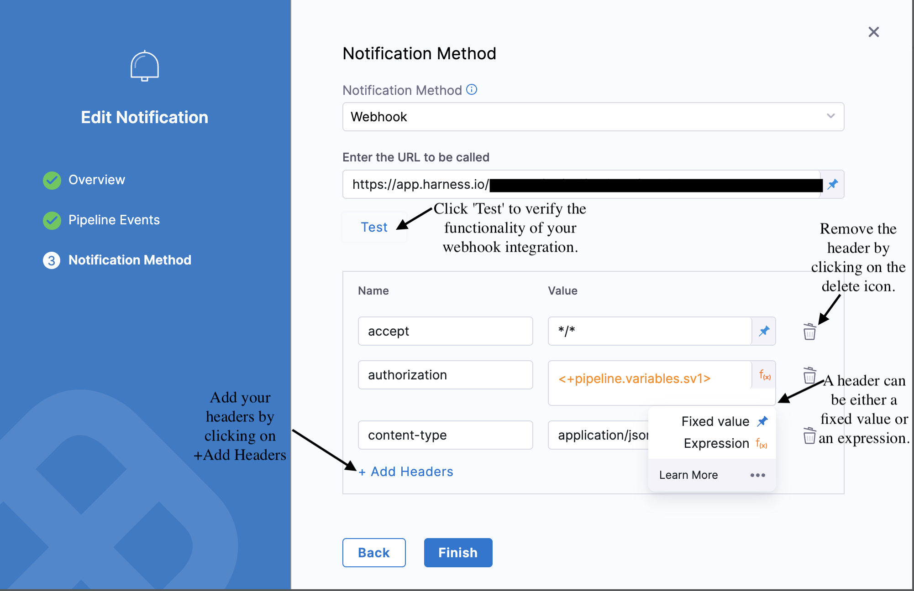
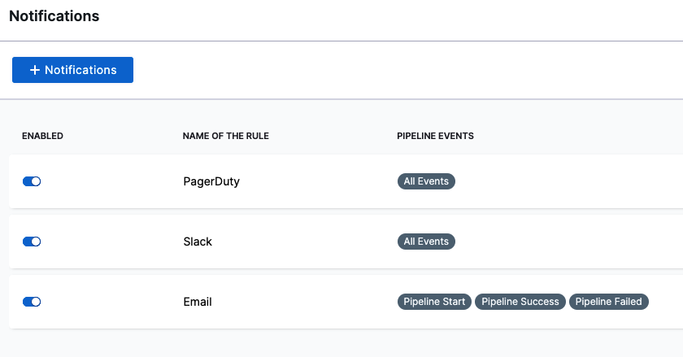

import Tabs from '@theme/Tabs';
import TabItem from '@theme/TabItem';

This topic describes how to notify users of different pipeline events using popular notification methods.

You can send pipeline event notifications using email and popular communication and incident management platforms.

Event notifications are set up using **Notification Rules** in your pipeline. You select the types of events to send, and then select how you want to send notifications. When those events occur, Harness sends event information to those channels and recipients.

This topic describes how to set up **Notification Rules** in your pipeline.

You can set notifications preferences on user groups also. Go to [Manage user groups](/docs/platform/role-based-access-control/add-user-groups) for more information.


## Limitations

Currently, Harness supports several communication and incident management platforms. If you don't see yours, contact Harness.

:::info note
It's important to note most of the **Notification Rule** settings, including the **Slack Webhook URL**, cannot be specified using runtime inputs. This information must be provided before the pipeline execution begins. However, you can use expressions to provide this information. Refer to the Input options available in the respective **Notification Rule** settings for more information.

:::

## Requirements

To create or enable a notification rule, a user must belong to a user group with a role that has the pipeline **Create/Edit** permission.

## Add a notification rule

In your pipeline, select **Notify**.



To create a new notification rule, select **Notifications**. The **Notification Rule** settings appear.

Enter a name for the notification rule. You might want to edit the name after you've selected the events that trigger the rule.

Select **Next**.

## Select events

In **Pipeline Events**, select the events that will trigger the notification.

You can select events for the pipeline or stages.

If you select the stage events, you can select which stages to use.


Select **Continue**.

There are different communication and incident management platforms to use for the notification rule. Their settings are described below.

The events are self-explanatory, but there are a few considerations:

* If you select both **Pipeline End** and **Pipeline Success**, you'll get two notifications.
* **Pipeline Pause** only applies to a manual pause of the pipeline execution. Pending approval steps don't trigger the pipeline pause event.

## Email notifications

For email notifications, simply type in the email addresses that you want to notify.

Enter multiple addresses as a comma-separated list. For example, `john.doe@example.io,qateam@example.io`.

Here's an example of an email notification for the pipeline Start event:


Along with the start date and who triggered the pipeline, the email includes a link to the pipeline execution in Harness.

## Slack notifications

For Slack notifications, you simply create a webhook in Slack and paste it into the **Slack Webhook URL** setting in the notification rule.

Follow the steps in Slack documentation for creating a Slack app, selecting your channel, and creating a webhook: [sending messages using incoming webhooks](https://api.slack.com/messaging/webhooks).

When you are done, you'll have a webhook that looks something like this:


Copy the webhook.

You either paste the Webhook into **Slack Webhook URL** or add it as an [encrypted text](/docs/platform/secrets/add-use-text-secrets) in Harness and reference it here.

For example, if you have a text secret with the identifier `slackwebhookURL`, you can reference it like this:​


```bash
<+secrets.getValue("slackwebhookURL")>​
```

You can reference a secret within the Org scope using an expression with `org`:​


```bash
<+secrets.getValue("org.your-secret-Id")>​​
```

You can reference a secret within the Account scope using an expression with `account`:​


```bash
<+secrets.getValue(“account.your-secret-Id”)>​​​
```


## PagerDuty notifications

For PagerDuty notifications, enter the key for a PagerDuty account or service or add it as an [encrypted text](/docs/platform/secrets/add-use-text-secrets) in Harness and reference it in **PagerDuty Key**. Harness will send notifications using this key.

For example, if you have a text secret with the identifier `pagerdutykey`, you can reference it like this:​


```bash
<+secrets.getValue("pagerdutykey")>​
```
You can reference a secret within the Org scope using an expression with `org`:


```bash
<+secrets.getvalue("org.your-secret-Id")>
```

You can reference a secret within the Account scope using an expression with `account`:


```bash
<+secrets.getvalue("account.your-secret-Id")>
```

You can copy or paste this key from PagerDuty's **Configuration** > **Services** > **Service Details** dialog > **Integrations** tab, as shown below.


For details, see PagerDuty's documentation on [creating integrations](https://support.pagerduty.com/docs/services-and-integrations).

## Microsoft Teams notifications

To set up notifications in Microsoft Teams, you’ll need a webhook URL linked to the channel where you want to receive notifications.

### Step 1: Create a Webhook in Microsoft Teams

1. In Microsoft Teams, right-click the team name where you want to send notifications, and select **Workflows** from the menu.

  

2. In the **Workflows** section, select **Post to a channel when webhook request is received**.

  

3. Provide a name for the webhook, then click **Next**.

  

4. Select the **Team** and **Channel** where you’d like to receive notifications, then click **Add Workflow**.

  

5. A webhook URL will be generated. Copy this URL for use in Harness.

  

### Step 2: Use the Webhook URL in Harness

In Harness, in **Notification Method** settings, enter the webhook URL for your Microsoft Teams channel in **Microsoft Teams Webhook URL** or add it as an [encrypted text](/docs/platform/secrets/add-use-text-secrets) and reference it here.

For example, if you have a text secret with the identifier `teamswebhookURL`, you can reference it like this:​

```bash
<+secrets.getValue("teamswebhookURL")>​​
```

You can reference a secret within the Org scope using an expression with `org`:

```bash
<+secrets.getValue("org.teamswebhookURL")>​
```

You can reference a secret within the Account scope using an expression with `account`:​

```bash
<+secrets.getValue("account.teamswebhookURL")>​​
```

## Webhook Notifications

Use Webhook notifications to inform an external application of an event. 

Select the Webhook notification method, and then enter the URL to be called when the event occurs. 

You can also use expressions to compose this URL. For example, `https://companyurl.notify.com/execution=-<+pipeline.executionId>`. 

Note that the expression must be evaluated in the context of the event. For example, stage related expressions may not be valid for pipeline start events. 

### Add Custom Headers
Webhook notification method allows you to add custom headers consisting of key-value pairs.

Some important points to note:-
1. You can add a header by clicking on ``+ Add Header``.
2. You can delete a header by clicking on delete icon.
3. A header can either be a ``Fixed value`` or an ``Expression``.
4.  You can test your webhook integeration by clicking on ``Test``.



Sample pipeline YAML with a webhook notification method, consisting of custom headers:- 
```yaml
notificationRules:
    - name: test
      identifier: test
      pipelineEvents:
        - type: AllEvents
        - type: PipelineStart
        - type: PipelineEnd
        - type: PipelineSuccess
        - type: PipelineFailed
        - type: StageFailed
        - type: StageSuccess
        - type: StageStart
        - type: StepFailed
      notificationMethod:
        type: Webhook
        spec:
          webhookUrl: https://app.harness.io/gateway/ng/api/projects/Quality_Assurence?accountIdentifier=ACCOUNT_ID&orgIdentifier=QE_Team
          headers:
            accept: "*/*"
            authorization: <+pipeline.variables.sv1>
            content-type: application/json
            Status: <+pipeline.status>
            Version: v1
            Content-Encoding: gzip
            Client-ID: <+pipeline.executionId>
            If-Match: xyz
      enabled: true
```
:::info note
1. Please note that you should be able to include custom headers while creating custom webhook notifications channel(s) as well as while updating the existing ones.
2. For a `Stage Start` event (such as during a deployment stage), the notification summary will include unresolved expressions for services, infrastructure, and environments. This is intentional, as the notification is sent before all references are fully resolved, preventing any potential errors in resolution from causing the stage execution to fail.
:::

For example, a Slack notification when the pipeline completes as well as when it is successful looks something like this:


The webhook call is made as a POST request, and includes a JSON object containing the properties of the triggered event.

If you are using a custom webhook trigger in webhook notification method and if your Pipeline setting **Mandate Authorization for Custom Webhook Triggers** is **true** then you need to pass the API key in the header.


### JSON for webhook notifications

<Tabs>
<TabItem value="Pipeline Start">

```json
{
  "eventData": {
    "accountIdentifier": "ACCOUNT_ID",
    "orgIdentifier": "default",
    "projectIdentifier": "PROJECT_ID",
    "pipelineIdentifier": "PIPELINE_ID",
    "pipelineName": "PIPELINE_NAME",
    "planExecutionId": "PIPELINE_EXECUTION_ID",
    "executionUrl": "https://app.harness.io/ng/#/account/ACCOUNT_ID/cd/orgs/default/projects/PROJECT_NAME/pipelines/PIPELINE_NAME/executions/PIPELINE_EXECUTION_ID/pipeline",
    "pipelineUrl": "https://app.harness.io/ng/#/account/ACCOUNT_ID/cd/orgs/default/projects/PROJECT_NAME/pipelines/PIPELINE_NAME/pipeline-studio",
    "eventType": "PipelineStart",
    "nodeStatus": "started",
    "triggeredBy": {
      "triggerType": "MANUAL",
      "name": "NAME",
      "email": "EMAIL_ID"
    },
    "moduleInfo": {},
    "startTime": "Tue Aug 20 08:14:46 GMT 2024",
    "startTs": 1724141686
  }
}
```
</TabItem>
<TabItem value="Pipeline End">

```json
{
  "eventData": {
    "accountIdentifier": "ACCOUNT_ID",
    "orgIdentifier": "default",
    "projectIdentifier": "PROJECT_ID",
    "pipelineIdentifier": "PIPELINE_ID",
    "pipelineName": "PIPELINE_NAME",
    "planExecutionId": "PIPELINE_EXECUTION_ID",
    "executionUrl": "https://app.harness.io/ng/#/account/ACCOUNT_ID/cd/orgs/default/projects/PROJECT_NAME/pipelines/PIPELINE_NAME/executions/PIPELINE_EXECUTION_ID/pipeline",
    "pipelineUrl": "https://app.harness.io/ng/#/account/ACCOUNT_ID/cd/orgs/default/projects/PROJECT_NAME/pipelines/PIPELINE_NAME/pipeline-studio",
    "eventType": "PipelineEnd",
    "nodeStatus": "completed",
    "triggeredBy": {
      "triggerType": "MANUAL",
      "name": "NAME",
      "email": "EMAIL_ID"
    },
    "moduleInfo": {},
    "startTime": "Tue Aug 20 08:19:31 GMT 2024",
    "startTs": 1724141971,
    "endTime": "Tue Aug 20 08:19:42 GMT 2024",
    "endTs": 1724141982
  }
}
```

</TabItem>
<TabItem value="Pipeline Success">

```json
{
  "eventData": {
    "accountIdentifier": "ACCOUNT_ID",
    "orgIdentifier": "default",
    "projectIdentifier": "PROJECT_ID",
    "pipelineIdentifier": "PIPELINE_ID",
    "pipelineName": "PIPELINE_NAME",
    "planExecutionId": "PIPELINE_EXECUTION_ID",
    "executionUrl": "https://app.harness.io/ng/#/account/ACCOUNT_ID/cd/orgs/default/projects/PROJECT_NAME/pipelines/PIPELINE_NAME/executions/PIPELINE_EXECUTION_ID/pipeline",
    "pipelineUrl": "https://app.harness.io/ng/#/account/ACCOUNT_ID/cd/orgs/default/projects/PROJECT_NAME/pipelines/PIPELINE_NAME/pipeline-studio",
    "eventType": "PipelineSuccess",
    "nodeStatus": "completed",
    "triggeredBy": {
      "triggerType": "MANUAL",
      "name": "NAME",
      "email": "EMAIL_ID"
    },
    "moduleInfo": {},
    "startTime": "Tue Aug 20 08:22:42 GMT 2024",
    "startTs": 1724142162,
    "endTime": "Tue Aug 20 08:22:53 GMT 2024",
    "endTs": 1724142173
  }
}
```

</TabItem>
<TabItem value="Pipeline Failed">

```json
{
  "eventData": {
    "accountIdentifier": "ACCOUNT_ID",
    "orgIdentifier": "default",
    "projectIdentifier": "PROJECT_ID",
    "pipelineIdentifier": "PIPELINE_ID",
    "pipelineName": "PIPELINE_NAME",
    "planExecutionId": "PIPELINE_EXECUTION_ID",
    "executionUrl": "https://app.harness.io/ng/#/account/ACCOUNT_ID/cd/orgs/default/projects/PROJECT_NAME/pipelines/PIPELINE_NAME/executions/PIPELINE_EXECUTION_ID/pipeline",
    "pipelineUrl": "https://app.harness.io/ng/#/account/ACCOUNT_ID/cd/orgs/default/projects/PROJECT_NAME/pipelines/PIPELINE_NAME/pipeline-studio",
    "eventType": "PipelineFailed",
    "nodeStatus": "failed",
    "triggeredBy": {
      "triggerType": "MANUAL",
      "name": "NAME",
      "email": "EMAIL_ID"
    },
    "moduleInfo": {},
    "startTime": "Tue Aug 20 08:25:04 GMT 2024",
    "startTs": 1724142304,
    "endTime": "Tue Aug 20 08:25:18 GMT 2024",
    "errorMessage": "Shell Script execution failed. Please check execution logs.",
    "endTs": 1724142318
  }
}
```

</TabItem>
<TabItem value="Stage Failed ">

```json
{
  "eventData": {
    "accountIdentifier": "ACCOUNT_ID",
    "orgIdentifier": "default",
    "projectIdentifier": "PROJECT_ID",
    "pipelineIdentifier": "PIPELINE_ID",
    "pipelineName": "PIPELINE_NAME",
    "planExecutionId": "PIPELINE_EXECUTION_ID",
    "stageIdentifier": "qq",
    "executionUrl": "https://app.harness.io/ng/#/account/ACCOUNT_ID/cd/orgs/default/projects/PROJECT_NAME/pipelines/PIPELINE_NAME/executions/PIPELINE_EXECUTION_ID/pipeline",
    "pipelineUrl": "https://app.harness.io/ng/#/account/ACCOUNT_ID/cd/orgs/default/projects/PROJECT_NAME/pipelines/PIPELINE_NAME/pipeline-studio",
    "stepName": "qq",
    "stageName": "qq",
    "eventType": "StageFailed",
    "nodeStatus": "failed",
    "triggeredBy": {
      "triggerType": "MANUAL",
      "name": "NAME",
      "email": "EMAIL_ID"
    },
    "startTime": "Tue Aug 20 08:28:13 GMT 2024",
    "startTs": 1724142493,
    "endTime": "Tue Aug 20 08:28:23 GMT 2024",
    "errorMessage": "Shell Script execution failed. Please check execution logs.",
    "endTs": 1724142503
  }
}
```

The above JSON is for a specific stage, If you choose all stages three times the webhook will be triggered. In this case we have two stages qq and qs and both failed and two times the notification was triggered. 


</TabItem>

<TabItem value="Stage success">

```json
{
  "eventData": {
    "accountIdentifier": "ACCOUNT_ID",
    "orgIdentifier": "default",
    "projectIdentifier": "PROJECT_NAME",
    "pipelineIdentifier": "PIPELINE_NAME",
    "pipelineName": "PIPELINE_NAME",
    "planExecutionId": "PIPELINE_EXECUTION_ID",
    "stageIdentifier": "qq",
    "executionUrl": "https://app.harness.io/ng/#/account/ACCOUNT_ID/cd/orgs/default/projects/PROJECT_NAME/pipelines/PIPELINE_NAME/executions/PIPELINE_EXECUTION_ID/pipeline",
    "pipelineUrl": "https://app.harness.io/ng/#/account/ACCOUNT_ID/cd/orgs/default/projects/PROJECT_NAME/pipelines/PIPELINE_NAME/pipeline-studio",
    "stepName": "qq",
    "stageName": "qq",
    "eventType": "StageSuccess",
    "nodeStatus": "completed",
    "triggeredBy": {
      "triggerType": "MANUAL",
      "name": "NAME",
      "email": "EMAIL_ID"
    },
    "startTime": "Tue Aug 20 08:38:40 GMT 2024",
    "startTs": 1724143120,
    "endTime": "Tue Aug 20 08:38:44 GMT 2024",
    "endTs": 1724143124
  }
}
```

The above JSON is for a specific stage, If you choose all stages three times the webhook will be triggered. In this case we have two stages qq and qs and both are passed successfully and two times the notification was triggered. 


</TabItem>

<TabItem value="Stage Started">

```json
{
  "eventData": {
    "accountIdentifier": "ACCOUNT_ID",
    "orgIdentifier": "default",
    "projectIdentifier": "PROJECT_NAME",
    "pipelineIdentifier": "PIPELINE_NAME",
    "pipelineName": "PIPELINE_NAME",
    "planExecutionId": "DRWqd-imSA2wi8xPmoaOjQ",
    "stageIdentifier": "qs",
    "executionUrl": "https://app.harness.io/ng/#/account/ACCOUNT_ID/cd/orgs/default/projects/PROJECT_NAME/pipelines/PIPELINE_NAME/executions/DRWqd-imSA2wi8xPmoaOjQ/pipeline",
    "pipelineUrl": "https://app.harness.io/ng/#/account/ACCOUNT_ID/cd/orgs/default/projects/PROJECT_NAME/pipelines/PIPELINE_NAME/pipeline-studio",
    "stepName": "qs",
    "stageName": "qs",
    "eventType": "StageStart",
    "nodeStatus": "started",
    "triggeredBy": {
      "triggerType": "MANUAL",
      "name": "NAME",
      "email": "EMAIL_ID"
    },
    "moduleInfo": {},
    "startTime": "Tue Aug 20 09:03:09 GMT 2024",
    "startTs": 1724144589
  }
}
```

The above JSON is for a specific stage, If you choose all stages three times the webhook will be triggered. In this case we have two stages qq and qs and both stages started so two times the notification was triggered. 


</TabItem>

<TabItem value="Step Failed">

```json
{
  "eventData": {
    "accountIdentifier": "ACCOUNT_ID",
    "orgIdentifier": "default",
    "projectIdentifier": "PROJECT_NAME",
    "pipelineIdentifier": "PIPELINE_NAME",
    "pipelineName": "PIPELINE_NAME",
    "planExecutionId": "OmbdztM2Qvqh7ZwM06FY4A",
    "stageIdentifier": "qq",
    "stepIdentifier": "ShellScript_1",
    "executionUrl": "https://app.harness.io/ng/#/account/ACCOUNT_ID/cd/orgs/default/projects/PROJECT_NAME/pipelines/PIPELINE_NAME/executions/OmbdztM2Qvqh7ZwM06FY4A/pipeline",
    "pipelineUrl": "https://app.harness.io/ng/#/account/ACCOUNT_ID/cd/orgs/default/projects/PROJECT_NAME/pipelines/PIPELINE_NAME/pipeline-studio",
    "stepName": "ShellScript_1",
    "eventType": "StepFailed",
    "nodeStatus": "failed",
    "triggeredBy": {
      "triggerType": "MANUAL",
      "name": "NAME",
      "email": "EMAIL_ID"
    },
    "startTime": "Tue Aug 20 09:12:09 GMT 2024",
    "startTs": 1724145129,
    "endTime": "Tue Aug 20 09:12:10 GMT 2024",
    "errorMessage": "Shell Script execution failed. Please check execution logs.",
    "endTs": 1724145130
  }
}
```

The above JSON is for a specific stage, If you choose all stages three times the webhook will be triggered. In this case we have two stages qq and qs and both stages started so two times the notification was triggered. 


</TabItem>

</Tabs>


## Notify Slack channels in user groups

If you have Harness user groups that have Slack webhooks set up in their **Notification Preferences**, you can select those groups and Harness will notify them in addition to the Email, Slack, or PagerDuty settings.

Go to [send notifications using Slack](/docs/platform/notifications/send-notifications-using-slack) for more information.

## Enable or disable notification rules

Once you've created notification rules, you can enable and disable them in the **Notifications** page.



