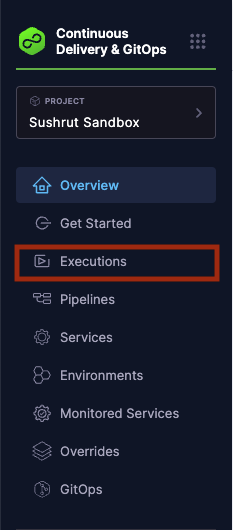

This topic describes how to view the execution history pipelines, how to navigate to it, and what information is contained within.

## Where Can I Find Execution History?

You can find the execution history of your pipeline or all pipelines in a project in the following places in the Harness UI.

### Executions Tab

You can view the execution history of all pipelines for a given project in the **Executions** tab in the left navigation of the Harness UI:

### Pipelines Tab

You can view the execution history of all pipelines for a given project in the **Pipelines** tab also. 

In the Harness UI left navigation, select **Pipelines**. A list of pipelines created under the project appears. 

Select the more actions button on the right for the pipeline of your choice, and then select **View Executions**.

### Pipeline Studio

You can view the execution history of a specific pipeline using Pipeline Studio.

In the Harness UI left navigation, select **Pipelines**, and then select the pipeline for which you want to view the execution details. 

Select the **Execution History** option on the top right corner of the page to view the execution details.

## Execution Reference

Each execution has the following information displayed for it. Each execution also has more information if you click the arrow on the left of it and open the dropdown. 

* **Pipeline Name**
    - The name of the pipeline and execution ID.
    - When expanded, this column also shows the name of each stage in the pipeline. 
* **Status**
    - Shows the status of the execution. The options are `SUCCESS`, `FAILED`, `ABORTED`, `EXPIRED`.
    - When expanded, this column shows the status of each stage as an emoji. You can hover over the emoji for more information.
* **Service**
    - Shows the services used in the pipeline. For pipelines with more than one service, a `+X` modifier will be displayed where `X` is the number of additional services. 
    - When expanded, this column shows the services used in each individual stage of the pipeline.
    - Hover over the service name to see the artifact attached to the service. 
* **Environment**
    - Shows the infrastructure used in the pipeline. For pipelines with more than one associated environment, a `+X` modifier will be displayed where `X` is the number of additional environments.
    - When expanded, this column shows the environment for each individual stage of the pipeline.
    - Hover over the environment name to see the infrastructure associated with the environment.
* **Trigger** (This column is unlabeled)
    - This column shows the origin of each execution.
* **Execution Start Time**
    - Shows the user, method, and start time of the execution.
* **More details** 
  The more details icon for each pipeline offers additional execution actions:
    - Add Execution Notes
    - View Execution
    - Edit Pipeline
    - [Re-run Pipeline](/docs/platform/pipelines/resume-pipeline-deployments/)
    - [Abort Pipeline](/docs/platform/pipelines/abort-pipeline/#aborting-a-pipeline)
    - [View Compiled YAML](/docs/platform/pipelines/view-and-compare-pipeline-executions/#view-compiled-yaml)
    - [Compare Pipeline](/docs/platform/pipelines/view-and-compare-pipeline-executions/#compare-executions)
    - [Download Logs](/docs/platform/pipelines/download-logs/)

