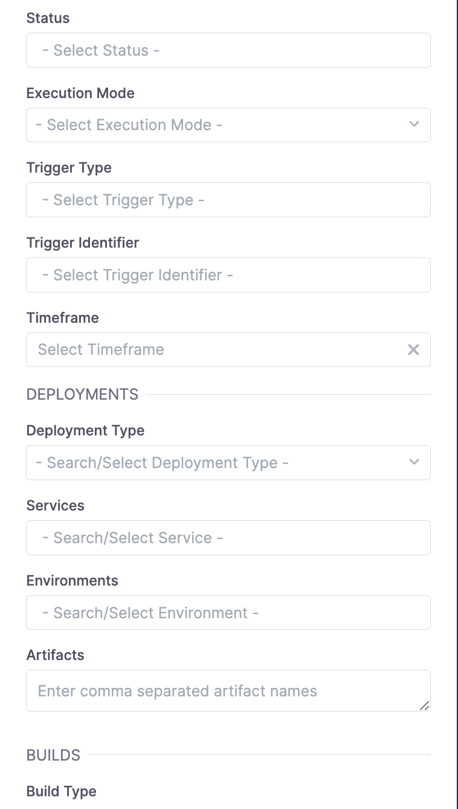
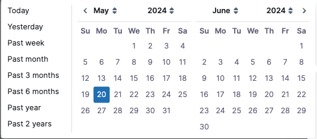
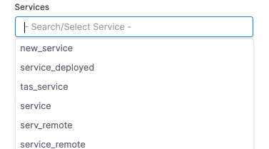

This topic describes how to navigate to the execution history of pipelines and what information is contained within.

## Where Can I Find Execution History?

You can find the execution history of your pipeline or all pipelines in a project in the following places in the Harness UI.

### Executions Tab

You can view the execution history of all pipelines for a given project in the **Executions** tab in the left navigation of the Harness UI:

### Pipelines Tab

You can view the execution history of all pipelines for a given project in the **Pipelines** tab also. 

In the Harness UI left navigation, select **Pipelines**. A list of pipelines created under the project appears. 

Select the more actions button on the right for the pipeline of your choice, and then select **View Executions**.

### Pipeline Studio

You can view the execution history of a specific pipeline using Pipeline Studio.

In the Harness UI left navigation, select **Pipelines**, and then select the pipeline for which you want to view the execution details. 

Select the **Execution History** option on the top right corner of the page to view the execution details.

## Execution Reference

Each pipeline execution displays the following information.

* **Pipeline Name**
    - The name of the pipeline and execution ID.
    - When expanded, this column also shows the name of each stage in the pipeline. 
* **Status**
    - Shows the status of the execution. The options are `SUCCESS`, `FAILED`, `ABORTED`, `EXPIRED`.
    - When expanded, this column shows the status of each stage as an emoji. You can hover over the emoji for more information.
* **Service**
    - Shows the services used in the pipeline. For pipelines with more than one service, a `+X` modifier will be displayed where `X` is the number of additional services. 
    - When expanded, this column shows the services used in each individual stage of the pipeline.
    - Hover over the service name to see the artifact attached to the service. 
* **Environment**
    - Shows the infrastructure used in the pipeline. For pipelines with more than one associated environment, a `+X` modifier will be displayed where `X` is the number of additional environments.
    - When expanded, this column shows the environment for each individual stage of the pipeline.
    - Hover over the environment name to see the infrastructure associated with the environment.
* **Trigger** (This column is unlabeled)
    - This column shows the origin of each execution.
* **Execution Start Time**
    - Shows the user, method, and start time of the execution.
* **More details** 
    The more details icon for each pipeline offers additional execution actions:
    - Add Execution Notes
    - View Execution
    - Edit Pipeline
    - [Retry Pipeline](/docs/platform/pipelines/failure-handling/resume-pipeline-deployments)
    - [Abort Pipeline](/docs/platform/pipelines/failure-handling/abort-pipeline)
    - [View Compiled YAML](/docs/platform/pipelines/executions-and-logs/view-and-compare-pipeline-executions/#view-compiled-yaml)
    - [Compare Pipeline](/docs/platform/pipelines/executions-and-logs/view-and-compare-pipeline-executions/#compare-executions)
    - [Download Logs](/docs/platform/pipelines/executions-and-logs/download-logs)

## Filter execution

You can filter executions using the filters in `Execution History` or in `Execution` tab.

You can filter execution based on **Status**, **Execution Mode**, **Trigger Type**, **Trigger Identifier**, **Timeframe**, **Deployment Type**, **Services**, **Environments**, **Artifacts** or **Build Type**.

### Status

Filter execution based on Status of Pipeline Execution.

It includes:

- Aborted
- Aborted By Freeze
- Expired
- Failed
- Not Started 
- Paused
- Queueud
- Running
- Success
- Suspended
- Resource Waiting
- Async Waiting
- Skipped
- Task Waiting
- Timed Waiting
- Errored
- Ignore Failure
- Discontinuing
- Approval Rejected
- Intervention Waiting 
- Approval Waiting
- Pausing 
- Input Waiting
- Wait Step Running
- Queued License Limit Reached
- Queued Execution Concurrency Reached

### Execution Mode

Filter pipeline execution based on Execution mode:-

- **Default**: It shows the latest executions(of any retry) and normal execution(without retries) and rollbacks.
- **All**: It lists the old retries as well for the retried executions along with the default ones.
- **Rollback**: It only lists those executions which were executed in the rollback mode.

### Trigger Type

Filter execution based on type of trigger.

It includes:

- MANUAL
- WEBHOOK
- WEBHOOK_CUSTOM
- SCHEDULE_CRON
- ARTIFACT
- MANIFEST

### Trigger Identifer

You can mention your trigger identifer to filter pipeline execution triggered by that Trigger.

### Timeframe

Filter pipeline execution based on TimeFrame.

### Deployment Type

Filter execution based on Deployment Type that was used in the pipeline.

It includes:

- Kubernetes
- Native Helm
- SSH
- WinRM
- Serverless Lambda
- Azure Web Apps
- Deployment Templates 
- Amazon ECS
- Spot Elasticgroup
- Tanzu Application Service
- AWS Lambda
- AWS Sam

### Services

You can filter the pipeline execution based on deployed services; select your services from the dropdown menu.

### Environments

You can filter execution based on the environment where you have deployed your service.

### Artifacts

Filter execution based on Artifacts.

### Build Type

Filter execution based on Build Type.

It includes:

- Pull Request/ Merge Request
- Branch
- Tag