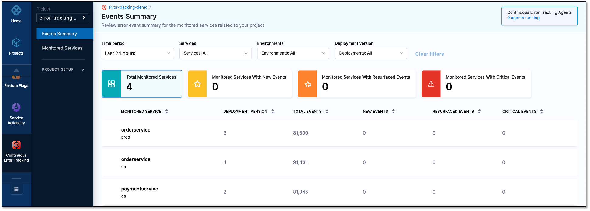
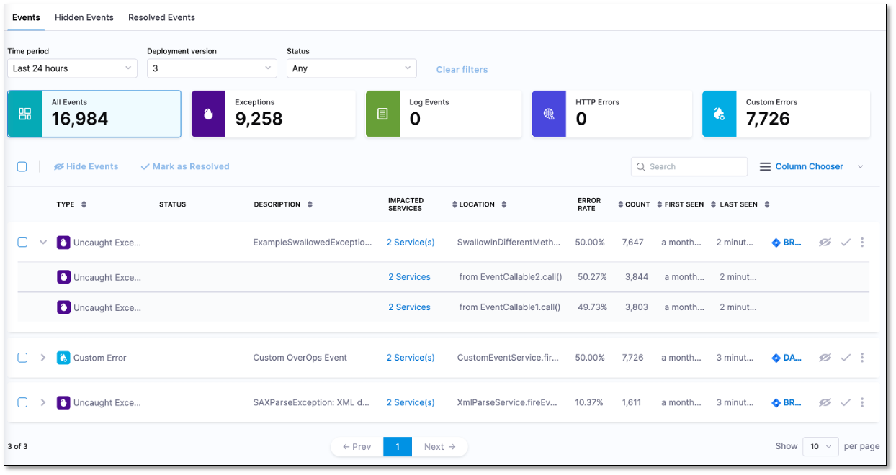
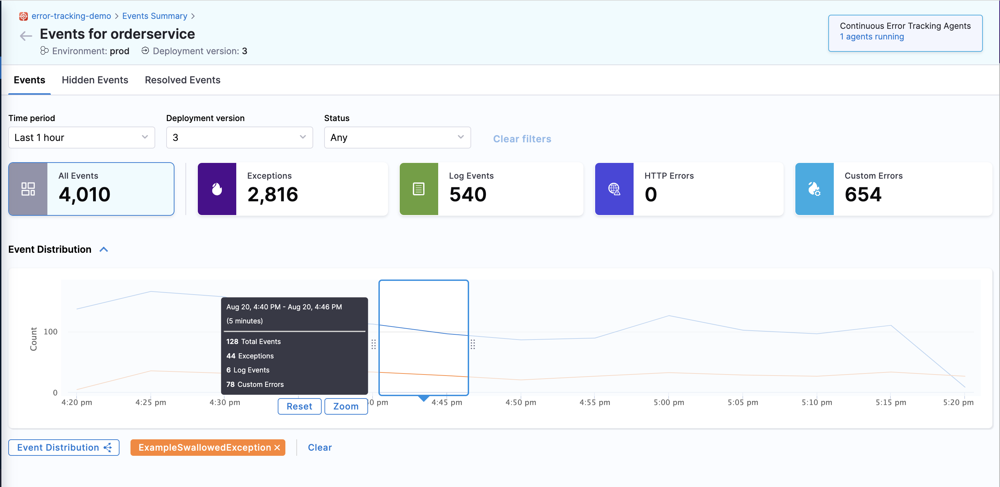

The Continuous Error Tracking Events dashboard displays a comprehensive list of all the monitored services and events.

To go to the Events dashboard, in Harness, go to **Continuous Error Tracking**, and then select **Events Summary**.



By default, the dashboard displays the data for the last 24 hours time period. You can customize the dashboard using the following filters:

* **Time period**: Choose a period for which you want to see the data. The default option is **Last 1 hour**.
* **Services**: Choose a service to see its data. You can select multiple services. The default option is **All**.
* **Environment**: Choose an environment to see its data. You can select multiple environments. The default option is **All**.
* **Deployment version**: Choose a deployment version in order to view the data associated with the monitored services of that specific version. You can select multiple deployment versions. The default option is **All**.

Based on the filter settings, the dashboard displays the total number of services being monitored by Continuous Error Tracking and the number of services that have generated new events. An event is considered as new if it is observed for the first time in a monitored service.


## View Event List

The Event List screen displays a summary of the total events, exceptions, log events, HTTP errors, and custom errors. It also displays a list of all the events. Each row provides deep contextual information about the event type, its location in the code, and impact in terms of volume and spread across the service. You can customize the Event List screen using the following filters:

* **Time period**: Choose a period for which you want to see the events. The default option is **Last 24 hours**.
* **Deployment version**: Choose a deployment version in order to view the events associated with that specific version.

To view the Event List, do the following:

1. On the Events dashboard, select a monitored service. The list of events captured by that monitored service is displayed.



The Event List displays the following information:

* **Type**: Displays the event type. The event type can be one of the following:
  * Caught Exception - Exceptions captured and handled by the user’s service.
  * Uncaught Exception - Exceptions that were not captured by the user’s service.
  * Swallowed Exception - Exceptions that were captured but ignored by the user’s service.
  * Log Error	- Events logged as errors in the user’s service.
  * Log Warning - Events logged as warnings in the user’s service.
  * HTTP Error - HTTP communication errors.
  * Custom Error - Events that occur in the custom SDK. 

* **Description:** Name of the event. In case of an exception, this is the exception class name. For example, AmazonException, NullPointerException, and so on. You can see the complete exception message of an event by hovering over the **Description** field.

* **Location**: Service class and method in which the event occurred. You can also view the actual line of code in which the error occurred even if the error was caused by a third party or core JDK framework. This can help you quickly identify the root cause of the error. Event location can also be filtered according to packages.

* **Count**: Number of times the event has occurred in the selected time period. This value indicates the severity of the event.

* **Error Rate**: Percentage of time the event occurs in comparison to all the calls made to the event's location. This is calculated by dividing the number of occurrences by the total number of calls to that location.

* **First Seen:** Time when the event was first detected in the environment.

* **Last Seen:** Last time this event was detected in the environment. This value indicates whether the event is still impacting your application.

* **Impacted Services:** List of monitored services in which the event was detected. For example, Producer-Service, Consumer-Service, Web-frontend, and so on.


## Event Distribution Graph

A key element in the dashboard is the interactive graph. It displays a visual representation of the event volume present in the current timeframe and view.```

### View Event Distribution Graph
The Event Graph illustrates the historical performance of specific metrics. To view the graph, select the Event Distribution collapsible button. This displays the trend for the total count of errors across the chosen time interval.
    

### Add an event to the Event Distribution Graph
To add a new event to the graph, click on the "+" icon located in the last column and add the event. When you add an event from the event list, it gets instantly displayed on the chart. A comparison of both series helps you assess the impact of the selected errors on the overall error count.```
    
    

### Display top events on the graph:
  To plot the top events on the graph you can select the **Event Distribution** split series icon. This will plot the top contributors as series on the graph. This enables you immediately see which ones have the most impact and may need to be dealt with first.
    

### Removing Event from the Event Graph:
  
  * **Remove a Single Event**:  You can remove a single event from the Event Graph by clicking again on the same icon.
    

  * **Remove All Events**: You can remove all the event from the graph by selecting **Clear**
    

### Selecting Graph Timeframes:
  You can further customize the graph by changing the timeframes by following the two methods described below:

  * **Time period:**  Choose a period for which you want to see the data. The default option is **Last 1 hour**.

  * **Time Slice:** Click on the graph and a small time slice pane will open. You can expand that time slice or shrink it to fit your required time frame.
    

### Collapsing the Event Graph:
  The Event Graph also lets you collapse it so that it's not displayed on the screen, and then  it when needed as shown in the image below


## Next steps

Get to the root cause of events in production and lower environments using [Automated Root Cause (ARC)](./cet-arc.md).