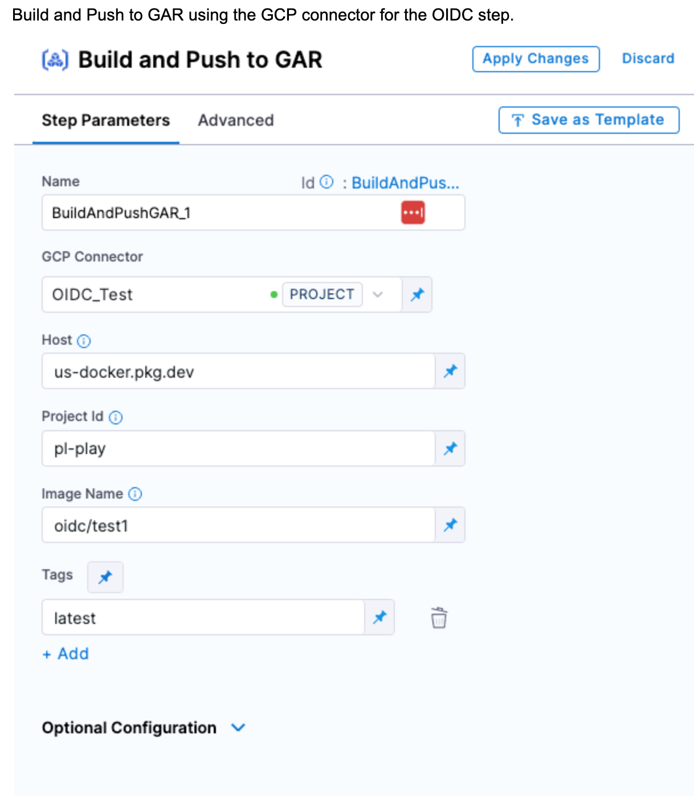

[GCP connectors](/docs/platform/connectors/cloud-providers/connect-to-google-cloud-platform-gcp) that use OpenID Connect (OIDC) allow Harness to communicate directly with GCP through OIDC. This option uses OIDC authentication to access public cloud resources without secrets or credentials. If accessing Google cloud resources, you can use [workload identity federation (WIF)](https://cloud.google.com/iam/docs/workload-identity-federation) to grant short term access to the Harness GCP connector.

To configure OIDC with GCP WIF for builds on [Harness Cloud build infrastructure](/docs/continuous-integration/use-ci/set-up-build-infrastructure/use-harness-cloud-build-infrastructure), you need to:

<!-- no toc -->
1. [Set up a GCP workload identity provider.](#set-up-the-gcp-workload-identity-provider)
2. [Set up a Harness GCP connector.](#set-up-the-gcp-connector)
3. [Set up your pipelines to use your OIDC-enabled connector.](#set-up-your-pipelines-to-use-oidc)

This topic assumes you have experience with [GCP workload identity providers](https://cloud.google.com/iam/docs/workload-identities).

## Set up the GCP workload identity provider
### Identity Provider and Pool configuration
 Set up an [identity provider](https://cloud.google.com/iam/docs/manage-workload-identity-pools-providers#manage-providers) in the workload identity federation (WIF) with the following configuration:

   * Name: Enter any name.
   * Issuer: `https://app.harness.io/ng/api/oidc/account/YOUR_HARNESS_ACCOUNT_ID>`.  See below for more details, depending on your environment
   * Attribute mapping:
      * `Google.subject = assertion.sub`
      * `attribute.account_id = assertion.account_id`

You can get your Harness account ID from any Harness URL, such as `https://app.harness.io/ng/#/account/ACCOUNT_ID/home/get-started`.

import IssuerURI from '../shared/issueruri.md'
<IssuerURI />

### Grant Access to the Service Account
2. Grant access using the connected service accounts for GAR:
   1. Select the service account that has push/pull permissions for GAR. (or any other [necessary permissions](https://developer.harness.io/docs/platform/connectors/cloud-providers/ref-cloud-providers/gcs-connector-settings-reference/))
   2. Select principles (identities that can access the service account). Select **Only identities matching the filter**, and then select `account_id = YOUR_HARNESS_ACCOUNT_ID`.

## Set up the GCP connector

1. Create or edit a Harness [GCP connector](/docs/platform/connectors/cloud-providers/connect-to-google-cloud-platform-gcp.md#create-a-gcp-connector).
2. In the connector's **Details** settings, select **OIDC** authentication, and provide the OIDC WIF details:

   - **Workload Pool ID:** This identifies the workload pool created in GCP, and it is the `Pool ID` value.
   - **Provider ID:** This identifies the OIDC provider configured in GCP, and it is the `Provider ID` value.
   - **Project ID:** The project number of the GCP project that is used to create the workload identity federation.
   - **Service Account Email:** This is the service account that you linked to your workload identity pool in [Set up the GCP workload identity provider](#set-up-the-gcp-workload-identity-provider).

   For information about these values, go to the GCP documentation on [Managing workload identity pools](https://cloud.google.com/iam/docs/manage-workload-identity-pools-providers#pools), [Managing workload identity pool providers](https://cloud.google.com/iam/docs/manage-workload-identity-pools-providers#manage-providers), and [Creating and managing projects](https://cloud.google.com/resource-manager/docs/creating-managing-projects).

   

3. In the connector's **Connectivity Mode** settings, select **Connect through Harness Platform for OIDC workflow**.
4. Select **Save and Continue** to run the connection test. If the test succeeds, select **Finish**.

   The connection test confirms that your connector's configuration is minimally valid.

   For troubleshooting guidance, go to [Troubleshoot GCP connector errors](/docs/platform/connectors/cloud-providers/connect-to-google-cloud-platform-gcp#troubleshoot-gcp-connector-errors).

After configuring the OIDC connection and role, when you run a build that uses your OIDC-enabled GCP connector, Harness can retrieve the temporary credentials from the GCP Security Token Service (STS).

## Set up your pipelines to use OIDC

Configure your [CI pipelines](../use-ci/prep-ci-pipeline-components) to use your OIDC-enabled GCP connector. To do this, select your OIDC-enabled GCP connector anywhere that you would normally use a GCP connector, such as in a [Build and Push to GAR step](/docs/continuous-integration/use-ci/build-and-upload-artifacts/build-and-push/build-and-push-to-gar.md).

For example:

1. [Create a pipeline](../use-ci/prep-ci-pipeline-components.md#create-a-harness-ci-pipeline) and [add a Build stage](../use-ci/set-up-build-infrastructure/ci-stage-settings.md#add-a-build-stage-to-a-pipeline).
2. Configure the Build stage to [use Harness Cloud build infrastructure](../use-ci/set-up-build-infrastructure/use-harness-cloud-build-infrastructure.md#use-harness-cloud).

3. Add a [Build and Push to GAR step](../use-ci/build-and-upload-artifacts/build-and-push/build-and-push-to-gar.md) to the Build stage.

   For the step's **GCP Connector**, select your OIDC-enabled GCP connector.

   

4. Save and run the pipeline.

   The Build and Push step's logs show that the pipeline uses Google STS to exchange tokens and access GAR.

   
