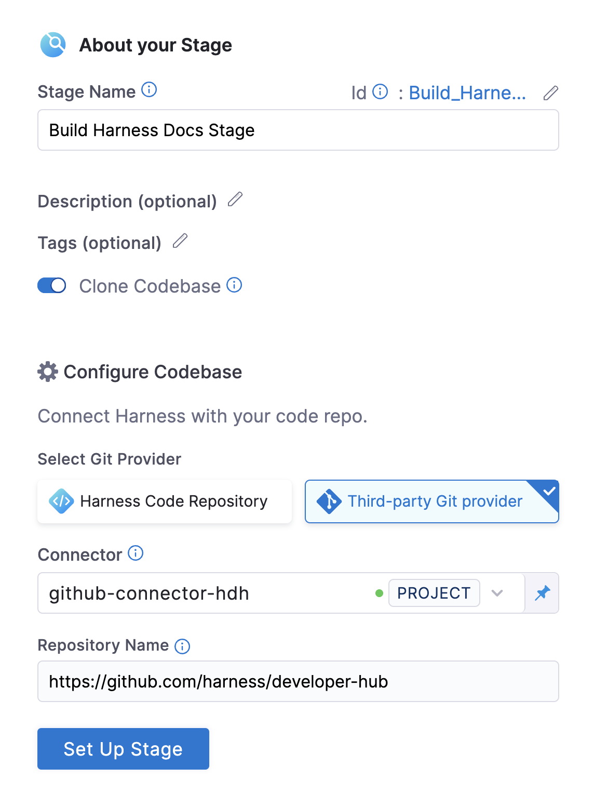
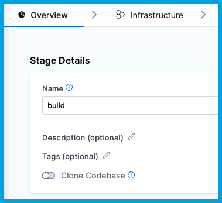

```mdx-code-block
import Ssc from '/docs/continuous-integration/shared/scm-status-checks.md';
```

CI pipelines build and test code that is pulled from a Git code repository. When you add a Build stage to a CI pipeline, you can select a [code repo connector](#code-repo-connectors) that connects to the Git account or repository where your code is stored. This can be referred to as the *default codebase* for the build. This topic explains how to configure codebase settings for CI pipelines and Build stages.

This topic assumes you have an understanding of the [CI pipeline creation process](../prep-ci-pipeline-components.md).

## Code repo connectors

Harness uses code repo connectors to connect to third-party Git providers, such as Bitbucket, GitHub, GitLab, and others. You don't need a code repo connector for repositories in the [Harness Code Repository module](/docs/code-repository).

For third-party SCM providers, you can create code repo connectors for entire accounts or specific repositories. You can view a list of your saved connectors in **Connectors** under **Project Setup**. The following topics provide more information about creating code repo connectors:

* Azure Repos: [Connect to Azure Repos](/docs/platform/connectors/code-repositories/connect-to-a-azure-repo)
* Bitbucket: [Bitbucket Connector Settings Reference](/docs/platform/connectors/code-repositories/ref-source-repo-provider/bitbucket-connector-settings-reference)
* GitHub: [GitHub connector settings reference](/docs/platform/connectors/code-repositories/ref-source-repo-provider/git-hub-connector-settings-reference)
* GitLab: [GitLab Connector Settings Reference](/docs/platform/connectors/code-repositories/ref-source-repo-provider/git-lab-connector-settings-reference)
* Other Git providers:
  * [Git connector settings reference](/docs/platform/connectors/code-repositories/ref-source-repo-provider/git-connector-settings-reference)
  * [Connect to an AWS CodeCommit Repo](/docs/platform/connectors/code-repositories/connect-to-code-repo)

The CodeCommit, Azure, Bitbucket, GitHub, and GitLab connectors have authorization settings as required by their respective providers. The Git connector can connect with any provider using basic authentication over HTTPS.

If you prefer to use the YAML editor, you can [create connectors in YAML](../../../platform/connectors/create-a-connector-using-yaml.md).

## Configure the default codebase

When you add a **Build** stage to a CI pipeline, you can select a [code repo connector](#code-repo-connectors) that connects to the Git account or repository where your code is stored. The first codebase declared in a pipeline becomes the pipeline's *default codebase*.

1. In the Pipeline Studio, select **Add Stage**, and then select **Build**.
2. Enter a **Stage Name**. **Description** and **Tags** are optional.
3. Make sure **Clone Codebase** is enabled. This tells Harness to clone the codebase into the build environment before running the steps in the stage.
4. To clone a repo from the [Harness Code Repository module](/docs/code-repository), select **Harness**. To clone a repo from a third-party SCM provider, select **Third party provider**.
5. For **Connector**, select or create a [code repo connector](#code-repo-connectors). This is not required for the Harness Code Repository module.
6. If **Repository Name** is not automatically populated, specify a repository to use for this pipeline. You can also set this field to `<+input>` to specify a repo at runtime.
7. Select **Set Up Stage**.

If you need to change the connector or other default codebase settings, go to [Edit the default codebase configuration](#edit-the-default-codebase-configuration). If you don't want every stage to clone the default codebase, go to [Disable Clone Codebase for specific stages](#disable-clone-codebase-for-specific-stages).



<details>
<summary>YAML example: Default codebase configuration</summary>

```yaml
pipeline:
  name: tutorial example
  identifier: tutorial_example
  projectIdentifier: default
  orgIdentifier: default
  tags: {}
  properties:
    ci:
      codebase:
        connectorRef: YOUR_CODEBASE_CONNECTOR_ID
        repoName: YOUR_GIT_REPO
        build: <+input>
```

</details>

<details>
<summary>YAML example: Harness Code Repository codebase configuration</summary>

This configuration is for repositories in the [Harness Code Repository module](/docs/code-repository).

```yaml
pipeline:
  name: tutorial example
  identifier: tutorial_example
  projectIdentifier: default
  orgIdentifier: default
  tags: {}
  properties:
    ci:
      codebase:
        repoName: YOUR_HARNESS_CODE_REPO_NAME
        build: <+input>
```

</details>

## Disable Clone Codebase for specific stages

After defining the default codebase in the first Build stage, when you add subsequent stages to the pipeline, you can disable **Clone Codebase** for individual stages. You might disable **Clone Codebase** if the codebase is not needed for the stage's operations, or you need to use specific `git clone` arguments (such as to [clone a subdirectory instead of an entire repo](./clone-subdirectory.md)). You can also [clone multiple code repos in a pipeline](./clone-and-process-multiple-codebases-in-the-same-pipeline.md).

In the Visual editor, you can disable **Clone Codebase** in the stage's **Overview** tab.

<!--  -->

<docimage path={require('./static/disable-clone-codebase-visual.png')} />

In the YAML editor, set `cloneCodebase` to `false` in the `stage.spec`.

```yaml
    - stage:
        name: build
        identifier: build
        description: ""
        type: CI
        spec:
          cloneCodebase: false
```

For more information about Build stage settings, go to [CI Build stage settings](../set-up-build-infrastructure/ci-stage-settings.md).

## Edit the default codebase configuration

```mdx-code-block
import Tabs from '@theme/Tabs';
import TabItem from '@theme/TabItem';
```
```mdx-code-block
<Tabs>
  <TabItem value="Visual" label="Visual">
```

To edit a pipeline's default codebase configuration, select **Codebase** on the right side panel of the Pipeline Studio's Visual editor.

<!--  -->

<docimage path={require('./static/create-and-configure-a-codebase-03.png')} />

```mdx-code-block
  </TabItem>
  <TabItem value="YAML" label="YAML" default>
```

To edit a pipeline's default codebase configuration in the YAML editor, edit the `codebase` section. For example:

```yaml
pipeline:
  name: tutorial example
  identifier: tutorial_example
  projectIdentifier: tutorial_test
  orgIdentifier: default
  tags: {}
  properties:
    ci:
      codebase:
        connectorRef: YOUR_CODEBASE_CONNECTOR_ID
        build: <+input>
        depth: 0
        sslVerify: true
        prCloneStrategy: MergeCommit
        resources:
          limits:
            memory: 500Mi
            cpu: 400m
```

```mdx-code-block
  </TabItem>
</Tabs>
```

In addition to changing the **Connector** (`connectorRef`) or **Repository Name** (`repoName`), you can edit the following advanced settings.

### Depth

The number of commits to fetch when the pipeline clones the codebase repo.

For manually-triggered builds, the default depth is `50`. This means each `git clone` operation fetches the 50 most recent commits. For all other trigger types, the default depth is `0`, which fetches all commits from the relevant branch.

For more information, go to the [git clone documentation](https://git-scm.com/docs/git-clone).

### SSL Verify

If **True**, which is the default value, the pipeline verifies your Git SSL certificates. The build fails if the certificate check fails. Set this to **False** only if you have a known issue with the certificate and you are willing to run your builds anyway.

If you want to use self-signed certificates in a Kubernetes Cluster build infrastructure, go to [Configure a Kubernetes Build Farm to use Self-Signed Certificates](../set-up-build-infrastructure/k8s-build-infrastructure/configure-a-kubernetes-build-farm-to-use-self-signed-certificates.md)

### Pull Request Clone Strategy

When a build is triggered by a pull request, this setting determines the branch to use for the artifact after the repo is cloned.

If this is set to **Merge Commit** (which is the default setting), the pipeline tries to merge the pull request branch with the target branch before building the artifact. This guarantees that the artifact includes all commits in both the pull request and the target branch. The disadvantage is that this can take more time and result in build failures: If the merge fails, then the build fails.


If this is set to **Source Branch**, the pipeline builds the artifact from the latest commit in the pull request branch. This can be faster and less likely to result in build failures; however, it might not include some commits in the target branch.


### Set Container Resources

Set maximum resource limits for the containers that clone the codebase at runtime:

* **Limit Memory:** The maximum memory that the container can use. You can express memory as a plain integer or as a fixed-point number using the suffixes `G` or `M`. You can also use the power-of-two equivalents `Gi` and `Mi`. The default is `500Mi`.
* **Limit CPU:** The maximum number of cores that the container can use. CPU limits are measured in CPU units. Fractional requests are allowed; for example, you can specify one hundred millicpu as `0.1` or `100m`. The default is `400m`. For more information, go to [Resource units in Kubernetes](https://kubernetes.io/docs/concepts/configuration/manage-resources-containers/#resource-units-in-kubernetes).

## Branch protection and checks

<Ssc />

## Troubleshooting

### Improve codebase clone time

If cloning your codebase takes more time than expected, try setting **Limit Memory** to `1Gi`.

If codebase cloning takes longer than expected when the build is triggered by a pull request, set **Pull Request Clone Strategy** to **Source Branch** and set **Depth** to `1`.

You could also use specific `git clone` arguments instead of cloning the entire default codebase or using built-in cloning strategy, as explained in [Clone a subdirectory](./clone-subdirectory.md).

### The same Git commit is not used in all stages

If your pipeline has multiple stages, each stage that has **Clone codebase** enabled will clone the codebase during stage initialization. If your pipeline uses the generic [Git connector](/docs/platform/connectors/code-repositories/ref-source-repo-provider/git-connector-settings-reference) and a commit is made to the codebase after a pipeline run has started, it is possible for later stages to clone the newer commit, rather than the same commit that the pipeline started with.

If you want to force all stages to use the same commit ID, even if there are changes in the repository while the pipeline is running, you must use a [code repo connector](#code-repo-connectors) for a specific SCM provider, rather than the generic Git connector.

### Git fetch fails with invalid index-pack output when cloning large repos

The following `git fetch` error might cause a pipeline to fail during build initialization when cloning the [codebase](/docs/continuous-integration/use-ci/codebase-configuration/create-and-configure-a-codebase.md): `fetch-pack: invalid index-pack output`.

This can occur with large code repos and indicates that the build machine might have insufficient resources to clone the repo.

To resolve this, edit the pipeline's YAML and allocate `memory` and `cpu` resources in the `codebase` configuration. For example:

```yaml
properties:
  ci:
    codebase:
      connectorRef: YOUR_CODEBASE_CONNECTOR_ID
      repoName: YOUR_CODE_REPO_NAME
      build:
        type: branch
        spec:
          branch: <+input>
      sslVerify: false
      resources:
        limits:
          memory: 4G ## Set the maximum memory to use. You can express memory as a plain integer or as a fixed-point number using the suffixes `G` or `M`. You can also use the power-of-two equivalents `Gi` and `Mi`. The default is `500Mi`.
          cpu: "2" ## Set the maximum number of cores to use. CPU limits are measured in CPU units. Fractional requests are allowed; for example, you can specify one hundred millicpu as `0.1` or `100m`.
```

### Initial Git clone fails due to missing plugin

This error can occur in build infrastructures that use a Harness Docker Runner, such as the [local runner build infrastructure](/docs/continuous-integration/use-ci/set-up-build-infrastructure/define-a-docker-build-infrastructure.md) or the [VM build infrastructures](/docs/category/set-up-vm-build-infrastructures).

If Git clone fails during stage setup (the **Initialize** step in build logs) and the runner's logs contain `Error response from daemon: plugin \"<plugin>\" not found`, this means a required plugin is missing from your build infrastructure container's Docker installation. The plugin is required to configure Docker networks.

To resolve this issue:

1. On the machine where the runner is running, stop the runner.
2. Set the `NETWORK_DRIVER` environment variable to your preferred network driver plugin, such as `export NETWORK_DRIVER="nat"` or `export NETWORK_DRIVER="bridge"`.
3. Restart the runner.

### Pipeline status updates aren't sent to PRs

Harness uses the pipeline's codebase connector to send status updates to PRs in your Git provider. Make sure that you have [configured a default codebase](#edit-the-default-codebase-configuration) and that it is using the correct code repo connector.
