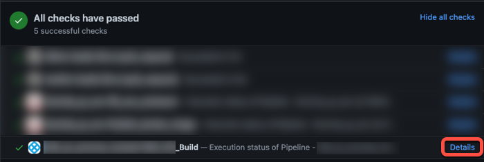
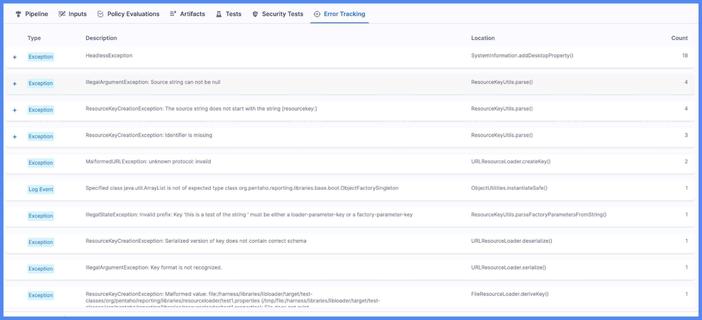
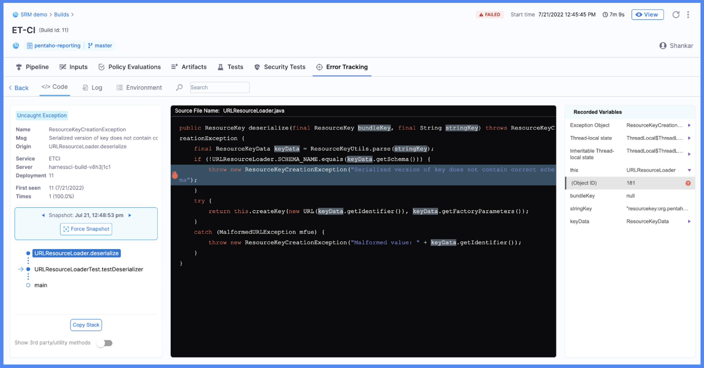

From the **Builds** page, you can inspect past builds and monitor the progress of ongoing builds.

The **Builds** page provides the following information about current and past builds:

* **Pipeline Name:** The name of the pipeline that ran and the build number (**Execution Id**). Select the pipeline name to go to the [Build details page](#build-details).
* **Status:** The build status, such as running, failed, or success.
* **Trigger:** How the build started, whether by a webhook trigger or manually. Builds triggered by webhooks can include [source code repository links](#source-code-repository-links).
* **Executed By:** The name of the user that started the build.
* **Runtime:** How long the build ran.

## Build details

On the **Build details** page, you can investigate a variety of details about a specific build.

* **Pipeline:** This tab shows the build stages and steps. Select a step to investigate logs, inputs, outputs, and errors (if any) for that steps.
* **Inputs**: This tab lists pipeline-level inputs. Step-level inputs are reported in the step details on the **Pipeline** tab.
* **Artifacts:** This tab provides links to artifacts, such as images or reports, produced during the build. Availability of artifact details depends on the upload location, build configuration, or build infrastructure. For an example and more information, go to [View tests - Publish reports to the Artifacts tab](./set-up-test-intelligence/viewing-tests.md#publish-reports-to-the-artifacts-tab).
* **Commits:** If applicable, this tab provides a list of commits that triggered the build, along with [source code repo links](#source-code-repository-links).
* **Tests:** Test results from **Run** or **Run Tests** steps. For more information, go to [View tests](./set-up-test-intelligence/viewing-tests.md).
* **Policy Evaluations**, **Security Tests**, and **Error Tracking**: These tabs report [Error Tracking](#error-tracking-run-tests-step) information and information from other Harness modules and features, such as [Harness Policy As Code](/docs/platform/Governance/Policy-as-code/harness-governance-quickstart#step-6-review-policy-evaluations), if these are enabled and included in the pipeline.

:::tip

When troubleshooting failed builds, switch to **Console View** to allocate more screen space to logs. Once you've identified a potential cause, select **Edit Pipeline** to go directly to the Pipeline Studio.

:::

## Source code repository links

Builds triggered by webhooks can include a link to the PR or commit that started the build.

Similarly, if a pull request triggers a build, you can follow the **Details** link from the PR's Git status to the build details page in Harness.

## Dashboards

For information about Harness dashboards, go to the Platform documentation on [Dashboards](/docs/platform/Dashboards/dashboards-overview).

## Error Tracking (Run Tests step)

If you [enabled error tracking in the Run Tests step](./set-up-test-intelligence/configure-run-tests-step-settings.md#do-you-want-to-enable-error-tracking-java), a list of code error events are reported on the **Error Tracking** tab. For each event, the following are reported:

* Event **Type** and **Description**.
* **Location** in the code.
* Impact (**Count**) in terms of volume and spread across your application.

<!--  -->

<docimage path={require('./static/ci-builds-et.png')} />

The following event types are reported:

* Caught Exception: Exceptions that were captured and resolved by the application.
* Uncaught Exception: Exceptions that were not captured by the application.
* Swallowed Exception: Exceptions that were captured but ignored by the application.
* Log Error: Events logged as errors in the application.
* Log Warnings: Events logged as warnings in the application.
* HTTP Errors: HTTP communication errors.

:::tip

Select the event's **Location** to open the [Automated Root Cause Analysis (ARC) page](/docs/continuous-error-tracking/getting-started/cet-arc) where you can view the source code, stack, variable state, and log statements leading to the error. This helps you analyze, troubleshoot, and remediate errors faster.

<!--  -->

<docimage path={require('./static/ci-builds-et-arc.png')} />

:::
