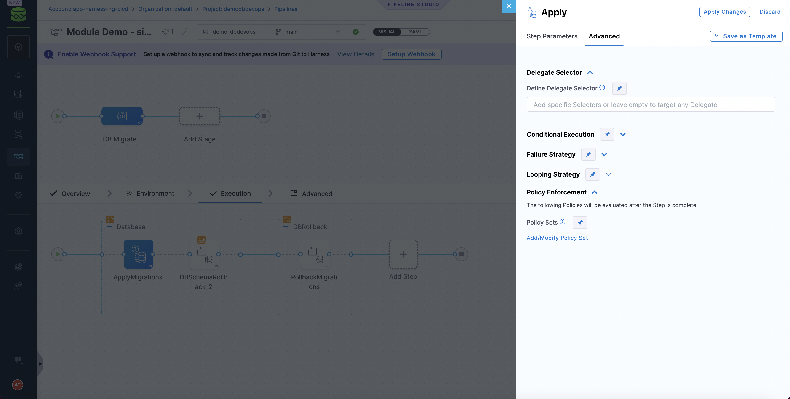

# Using Rego for Database devops Steps

## Introduction
This guide explains how to use **Harness Policy Agent** to enforce policies on **DataBase Devops** steps. Rego is a declarative policy language used by Open Policy Agent (OPA) for policy-based control.

## Prerequisites
- Basic knowledge Rego

## Writing a Rego Policy for Database Devops Steps
A Rego policy can validate that changesets conform to specific rules, such as enforcing naming conventions or restricting certain SQL operations.

### Example Policy: Restricting `DROP TABLE`
Go to DB Governance section and create a new policy


```rego
package db_sql
policies := [
{
        “error_message”: “Dropping of table is not allowed.“,
        “rules”: [
            {
                “types”: [
                    “jdbc:sqlserver”,“jdbc:mysql”,“jdbc:postgresql”,“jdbc:oracle:thin”
                ],
                “regex”: [
                    “drop”
                ]
            }
        ]
}
]
deny[msg] {
    some i,j,k,l
    policy := policies[i];
    type := input.dbInstance.type;
    rule := policy.rules[j];
    type = rule.types[_];
    regex.match(lower(concat(“”,[“.*“,rule.regex[k],“.*“])),lower(input.sqlStatements[l]));
    msg := concat(“”,[“Policy violation:\n The following sql statement:\n”,input.sqlStatements[l],“\n\n Matches the following regex: \n”,rule.regex[k]])
}
```

## create a custom policy set and attach above policy

)

## attach the policy set in Database Devops step configuration



## Validating Liquibase Steps with OPA
Run the OPA policy check against the changeset during pipeline run:


If a violation occurs, OPA will output a message indicating the problem (e.g., "Dropping tables is not allowed: users") and result in error / warning as per configuration.


