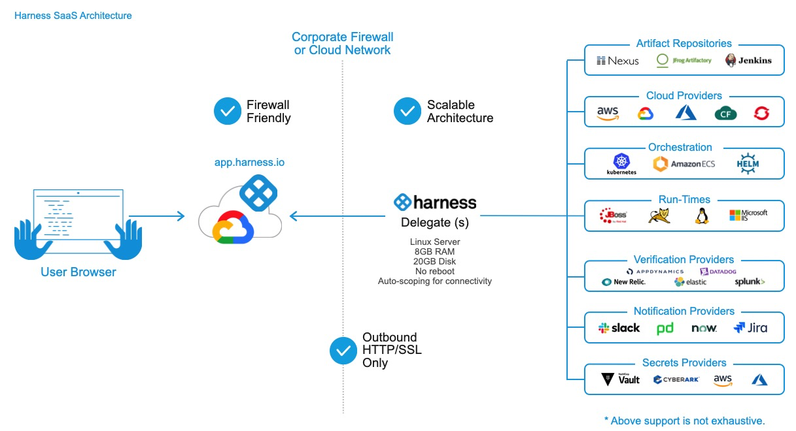
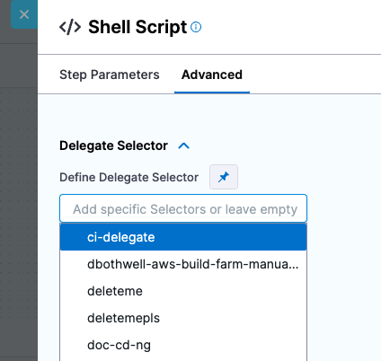
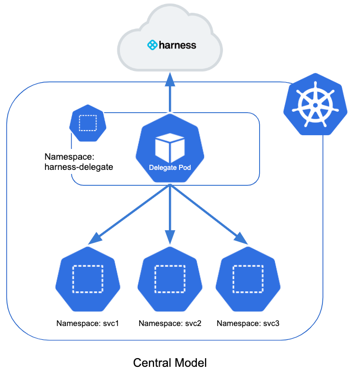
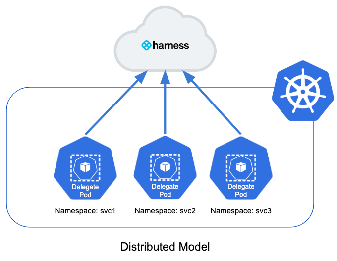

This topic addresses some frequently asked questions about Harness Delegates.

### What is the Harness Delegate?

The Harness Delegate is a service you run in your local network or VPC to connect all of your artifact, infrastructure, collaboration, verification, and other providers with Harness Manager.

Harness Platform has two major components:

* **Harness Manager:** Harness Manager is where your deployment configuration is stored and your pipelines are managed and executed. Harness Manager is available either as SaaS (running in the Harness cloud) or as Self-Managed (running in your infrastructure).
* **Harness Delegate:** The Harness Delegate is software you install in your environment that connects to Harness Manager and performs tasks by connecting to your container orchestration platforms, artifact repositories, monitoring systems, etc.



### How is the delegate updated?

There are two options, automatic and manual.

#### Delegate automatic updates

The delegate updates automatically. The delegate installation also installs a **Watcher** program that checks the Harness cloud periodically for new versions.

Watcher ensures there is exactly one delegate process of each published version running.

If there is a published version that is not running, Watcher downloads the JAR file for that version securely over HTTPS, installs it, and updates the delegate connection to Harness Manager. There is no downtime.

#### Delegate manual updates

You update the delegate. When you install a delegate by downloading the delegate YAML file from Harness, you select the manual update option.

The delegate is upgraded using a ring methodology commonly used in software release management.

Delegate images are on [Docker Hub](https://hub.docker.com/r/harness/delegate-immutable/tags) and are tagged by version.

The delegate image is signed. You can check it by running this command (with the current version number):

```
docker trust inspect --pretty harness/delegate:yy.mm.verno
```
### Can I use the same YAML to create an automatically updated and manually updated delegate?

No. The YAML specifications for the two types are different.

### Can I create my own delegate?

Yes. For more information, go to [Build custom delegate images with third-party tools](/docs/platform/delegates/install-delegates/build-custom-delegate-images-with-third-party-tools.md).

### How does Harness Manager identify delegates?

All delegates are identified by your Harness account ID in the delegate YAML.

Depending on the type of delegate, there are additional factors.

- For delegates running on virtual machines, such as Docker delegates running on an AWS EC2 instance, the delegate is identified by the combination of host name and IP address.

   Therefore, if the host name or IP address changes on the VM, Harness Manager cannot identify the delegate. The private IP address is used. The delegate connects to Harness Manager; Harness Manager does not initiate a connection to the delegate. Therefore, the public IP address of the delegate is typically not required.

- For Kubernetes delegates, the IP address can change (for example, when a pod is rescheduled). Consequently, Kubernetes delegates are identified by a suffix using a unique six letter code in their host name (the first six letters in your account ID).

### What data does the delegate send to Harness Manager?

The delegate and Harness Manager (through SaaS) establish a Secure WebSocket channel (WebSocket over TLS) to send new delegate task event notifications (not the tasks themselves) and exchange connection heartbeats. If the WebSocket connection is unstable, outbound-only, [polling-based](../platform/delegates/delegate-reference/delegate-environment-variables/#poll_for_tasks) task fetch is the alternative approach.
* **Heartbeat:** The delegate sends a [heartbeat](https://en.wikipedia.org/wiki/Heartbeat_(computing)) to let Harness Manager know that it is running.
* **Deployment data:** The information from the API executions the delegate performs are sent to Harness Manager for display in pages such as the **Deployments** page.
* **Time series and log data for Continuous Verification:** The delegate connects to the verification providers you have configured and sends their data to Harness Manager for display in Harness Continuous Verification.

### Can I add IP addresses for Harness Delegate to an allowlist?

Yes. For more information, go to [Allowlist Harness domains and IPs](../platform/references/allowlist-harness-domains-and-ips.md).

### Do I need separate delegates for different isolated environments?

No. Delegates connect to Harness Manager and are tested for connectivity to resources and tasks.

Harness connectors only use delegates that can connect to their resources and perform their tasks.

You could even have a delegate in one cloud platform use a resource in a separate cloud platform so long as there is connectivity.

### Can I change the delegate log file path?

It is not possible to configure the delegate logs path. However, you can create a symlink for the `delegate.log` files and store them in a different directory using the `INIT_SCRIPT` environment variable. To do this, simply replace `YOUR_PATH` with the directory where you want to store your log files in the example below.

```yaml
- name: INIT_SCRIPT
          value: "mkdir YOUR_PATH && ln -s YOUR_PATH/newdelegate.log delegate.log"
```

After you create your delegate, you can verify your log file path.

```
root@d1delegate-pxxdbf-0:/opt/harness-delegate# ls delegate.log
delegate.log
root@d1delegate-pxxdbf-0:/opt/harness-delegate# ls YOUR_PATH/*
YOUR_PATH/newdelegate.log
```

### Can I customize delegate logging?

Yes, you can create a custom `logback.xml` file and mount it in your delegate container or build a custom container. For more information, go to [Customize delegate logging](/docs/platform/delegates/manage-delegates/customize-delegate-logging).

### Can I remove sensitive information from logs?

Yes, you can remove sensitive information from logs in the Harness UI using regular expressions. For more information, go to [Hide log information based on regex patterns](/docs/platform/delegates/manage-delegates/hide-logs-using-regex).

## Delegate installation

For delegate installation instructions, go to [Delegate installation overview](/docs/platform/delegates/install-delegates/overview).

### What types of delegates are there?

Harness provides different types of delegates to give you flexibility in how you manage deployments.

You are not limited to using a delegate of the same type as your deployment platform, although that is more complicated to set up initially.

For information on delegate types, go to [Delegate image types](/docs/platform/delegates/delegate-concepts/delegate-image-types).

### Where do I install the Harness Delegate?

* **Evaluating Harness:** When evaluating Harness, you might want to install the delegate locally. Ensure that it has access to the artifact sources, deployment environments, and verification providers you want to use with Harness.
* **Development, QA, and Production:** The delegate should be installed behind your firewall and in the same VPC as the microservices you are deploying. The delegate must have access to the artifact servers, deployment environments, and cloud providers it needs.

### When do I install the Harness Delegate?

You can set up or select an existing delegate inline as you model your pipelines.

### How many delegates do I need to run?

A typical installation includes one delegate for every 300-500 service instances across applications.

### Can I automate delegate installation?

Yes. You can use a simple script to support scenarios where you want to name, configure, and install a Harness Kubernetes delegate from a repository.

Developers often need to create delegates in multiple clusters in their environments (Dev, UAT, SIT, Stage, Prod, and so on). This script method gives developers a quick alternative to using the manual process in Harness Manager.

For more information, go to [Automate delegate installation](../platform/delegates/install-delegates/automate-delegate-installation.md).

### What happens when a delegate is disconnected?

When a delegate is disconnected, Harness applies a Time-To-Live (TTL) policy:

- Delegate – 6 hours: If a disconnected delegate doesn't reconnect within 6 hours, it is considered expired and will no longer appear on the Delegate page in the Harness UI.

- Delegate Group – 7 days: If a delegate group has no active delegates for 7 consecutive days, the group is considered inactive and will be removed from the Harness UI.

## Delegate requirements

### What are the delegate system requirements?

:::danger delegate resources
Memory and CPU requirements are for the delegate only. Your delegate host/pod/container requires additional computing resources for its operating system and other services, such as Docker or Kubernetes.

The resource requirements for the delegate container depend on the type of tasks or executions. For instance, CI-only delegates can handle hundreds of parallel pipelines. However, for CD Terraform tasks, a single task might require a 2Gi container due to Terraform's memory requirements. Each Terraform command needs at least 500MB of memory.
 :::

### What are the delegate network requirements?

To learn more, go to [Delegate requirements](../platform/delegates/delegate-concepts/delegate-requirements.md) and [Permissions and ports for Harness connections](../platform/references/permissions-and-ports-for-harness-connections.md).

### What are the delegate access requirements?

* The Harness Delegate does not require root account access, but the Kubernetes and Docker delegates run as root by default. This is to enable the delegate to install applications using the INIT environment variable in the delegate YAML. If you do not need to install applications, then you can use a non-root account or install the application without the delegate.
* If you do not run the delegate as root, be aware that you cannot install any software using a delegate.

For more information, go to [Build custom delegate images with third-party tools](/docs/platform/delegates/install-delegates/build-custom-delegate-images-with-third-party-tools.md).

### What are the delegate limitations for deployments?

* The daily deployment limit is 100 deployments every 24 hours. The hourly limit is 40 deployments and is designed to detect any atypical upsurge of deployments. Contact [Harness Support](mailto:support@harness.io) to increase this limit.
* You might need to install multiple delegates depending on how many Continuous Delivery tasks you do concurrently, and on the compute resources you are providing to each delegate. Typically, you will need one delegate for every 300-500 service instances across your applications.

### Is there a limit on the number of tasks a Harness delegate can handle concurrently?

Yes, by default, a Harness delegate can acquire up to 400 tasks concurrently. To allow the delegate to handle more than 400 concurrent tasks, set the environment variable [`DYNAMIC_REQUEST_HANDLING`](/docs/platform/delegates/delegate-reference/delegate-environment-variables/#dynamic_request_handling) to true. Also, ensure that the delegate has sufficient CPU and memory resources to support the increased load.

### Can I configure delegate proxy settings?

Yes. All of the delegate settings include proxy settings you can use to change how the delegate connects to Harness Manager.

:::info note
By default, the Harness Delegate uses HTTP and HTTPS in its `PROXY_SCHEME` settings. For more information, go to [Configure delegate proxy settings](../platform/delegates/manage-delegates/configure-delegate-proxy-settings.md).
:::

### How to Enable CPU Limit in the Delegate Helm Chart?

The Harness Delegate Helm chart supports setting custom resource limits for CPU and memory. However, these configurations are commented out by default in the `values.yaml` file. 

To enable them, simply uncomment the `resources` block and provide your desired values, as shown in the example below.:

```yaml
resources:
  limits:
    cpu: 1 
    memory: 2048Mi 
  requests:
    cpu: 1
    memory: 2048Mi
```
This ensures the delegate pod is scheduled with the appropriate compute resources in your Kubernetes cluster.

## Delegate selection

For an overview of delegate selection, go to [Use delegate selectors](/docs/platform/delegates/manage-delegates/select-delegates-with-selectors/).

### How does Harness Manager pick delegates for tasks?

When a task is ready to be assigned, Harness Manager first validates its list of delegates to see which delegate to assign.

The following information describes how Harness Manager validates and assigns tasks to a delegate:

* **Heartbeats:** Running delegates send heartbeats to Harness Manager in one-minute intervals. If Harness Manager does not have a heartbeat for a delegate when a task is ready to be assigned, it does not assign the task to that delegate.
* **Delegate selectors:** You can select specific delegates for each pipeline step using delegate selectors.



Delegate selectors use the tags you add to delegates. For more information, go to [Use delegate selectors](/docs/platform/delegates/manage-delegates/select-delegates-with-selectors/).
* **Allowlist:** After a delegate is validated for a task, it is added to an allowlist for that task and will likely be used again for that task. The criteria is the URL associated with the task, such as a connection to a cloud platform, repository, or API. A delegate is allowed to perform all tasks using that URL. The time-to-live (TTL) for the allow list is six hours; the TTL is reset with each successful task validation.
* **Deny list:** If a delegate fails to perform a task, that delegate is added to a deny list for that task and will not be tried again. The TTL for denial is 5 minutes. This is true if there is only one delegate and even if the delegate is selected for that task with a selector, such as with a shell script command in a workflow.

import Selector from '/docs/platform/shared/selector-infrastructure.md'

<Selector />

### Can I pick a delegate for a pipeline step?

Yes, for all pipeline steps you can use delegate selectors to select specific delegates for the step.


Delegate selectors use the tags you add to delegates. For more information, go to [Use delegate selectors](/docs/platform/delegates/manage-delegates/select-delegates-with-selectors/).

## Running scripts and installations on delegates

You can run scripts on Harness Delegate pods, hosts, and containers to install applications or run commands. For more information, go to [Common delegate initialization scripts](/docs/platform/delegates/delegate-reference/common-delegate-profile-scripts/).

### Can I run scripts on delegate hosts using Harness?

Yes. The delegate config file includes an `INIT` environment variable that you can use to run scripts.

You can run scripts when you first install the delegate, or add your scripts to an existing delegate and rerun its setup.

For more information, go to [Build custom delegate images with third-party tools](/docs/platform/delegates/install-delegates/build-custom-delegate-images-with-third-party-tools.md).

### Can I install software on delegate hosts using Harness?

Yes. For more information, go to [Build custom delegate images with third-party tools](/docs/platform/delegates/install-delegates/build-custom-delegate-images-with-third-party-tools.md).

### Can I use Harness secret expressions in a delegate script?

No. You can add your passwords, tokens, etc. to your scripts, but you cannot use [Harness text secrets](/docs/platform/secrets/add-use-text-secrets).

## Installing certificates on the delegate

You can install delegates with custom certificates. For more information, go to [Install delegates with custom certificates](/docs/platform/delegates/secure-delegates/install-delegates-with-custom-certs/).

### Can I import certificates on the delegate host?

Yes. By default, the delegate uses a trusted certificate to connect to the Harness Manager over HTTPS.

For Harness SaaS, you can add a self-signed certificates on the delegate host using a [delegate script](/docs/platform/delegates/install-delegates/build-custom-delegate-images-with-third-party-tools.md), or by simply importing the certificate on the host.

### Can I override the truststore of the delegate?

Yes. For more information, go to [Truststore override for delegates](/docs/platform/delegates/secure-delegates/trust-store-override-for-delegates).

## Copying and downloading artifacts by using the delegate

### How does the delegate download or copy an artifact to the target host?

For container-based deployments such as Kubernetes, the delegate pulls the artifact from a repository to the target container.

## Delegate and Kubernetes namespaces

### What Kubernetes namespace does the delegate use?

By default, the Harness Delegate deploys to all namespaces in a target Kubernetes cluster.

The delegate resides in a namespace in the target cluster with a service account attached to it. The service account uses a **ClusterRole** for permission to deploy to all namespaces in the cluster.



### Can I install the delegate in other namespaces?

Yes, you can use a distributed model.

This model places a delegate in each namespace in the cluster. It limits each delegate to deploying into its own namespace.

Here is the illustration of the distributed model:



In this model, each team uses their own delegate for their deployments into their own namespace.

The distributed model is more complex, but it prevents a team member from deploying into the wrong namespace.

You can target the delegate to specific namespaces buy editing its YAML file with a role, role binding, and service account limited to a specific namespace.

## Does the delegate support high availability (HA)?

Yes. For information on delegate HA, go to [Delegate high availability](/docs/platform/delegates/delegate-concepts/delegate-overview/#delegate-high-availability-ha).

## Resolving 401 errors on Delegates with IMDSv2 enforced
Administrators looking to enhance their security within AWS may look to [utilize IMDSv2 with their instances](https://docs.aws.amazon.com/AWSEC2/latest/UserGuide/configuring-instance-metadata-service.html).  IMDSv2 has several different methods of being applied, [including forcing enforcement](https://docs.aws.amazon.com/AWSEC2/latest/UserGuide/configuring-IMDS-new-instances.html).  If enforcement is applied, administrators may need to make some adjustments to the default rules to ensure Harness will work with the environment

In order to see the status of enforcement on a particular instance, admins can run the following in the AWS CLI:
```
aws ec2 describe-instances --region <region/zone> --instance-id <instanceID#> --query "Reservations[0].Instances[0].MetadataOptions" 
```

The following is a sample return of what admins can expect to see:
```
Output:
{ 
	"State": "applied", 
	"HttpTokens": "required", 
	"HttpPutResponseHopLimit": 2, 
	"HttpEndpoint": "enabled" 
}
```
The **HttpTokens** value set to **required** indicates that the environment is in an enforced IDMSv2 state instead of optional.

Therefore, administrators will need to be mindful of the **HttpPutResponseHopLimit**.  If the limit is set too low, then users and administrators may run into 401 errors when attempting to retrieve Metadata
```
 EC2RoleRequestError: no EC2 instance role found
 caused by: EC2MetadataError: failed to make EC2Metadata request

 status code: 401, request id:
```

Administrators should then look to increase the `HttpPutResponseHopLimit` until the error goes away.  This can be done by setting the options on the instance using the AWS CLI
```
aws ec2 modify-instance-metadata-options \
    --instance-id <instanceID#> \
    --http-tokens required \
    --http-put-response-hop-limit <NewHopLimit> \
    --http-endpoint enabled
```

## Troubleshooting the delegate

The most common problems with the delegate are:

* The delegate does not meet system, network, or access requirements. For more information, go to [Delegate requirements](../platform/delegates/delegate-concepts/delegate-requirements.md) and [Permissions and ports for Harness connections](../platform/references/permissions-and-ports-for-harness-connections.md).
	+ Keep in mind that the delegate host or node needs resources to host the delegate and other software. The delegate resource requirements should be factored in, but they are not the minimum requirements for the infrastructure.
* The delegate is not running.
* The delegate does not have required permissions. The delegate uses the credentials you enter in Harness connectors to connect to cloud providers, artifact servers, etc.
In most cases, this is a user account. In some cases, the host/pod/container running the delegate has a user, profile, or IAM account assigned to it, and the connector inherits those credentials.
The credentials used by the delegate must have the roles and permissions required to perform the task. For example, if the IAM user account used for an AWS connector does not have the roles required for EKS deployments, it will fail.
The deployment indicates which pipeline step failed because of delegate permission issues.
Go to the permissions required for the [Harness connector](/docs/category/connectors) used for the failed task.

For delegate troubleshooting, go to [Troubleshooting](/docs/category/troubleshooting).
