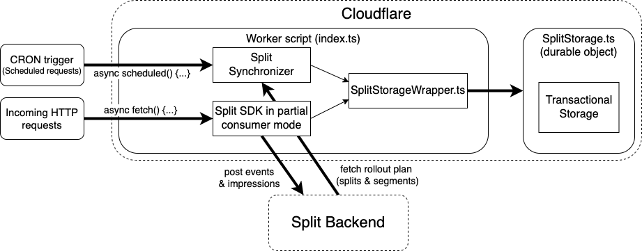

  <button hidden style={{borderRadius:'8px', border:'1px', fontFamily:'Courier New', fontWeight:'800', textAlign:'left'}}> help.split.io link: https://help.split.io/hc/en-us/articles/4505572184589-Cloudflare-Workers   ✘ images still hosted on help.split.io </button>

Running applications or business logic in a serverless environment has become prevalent. In these environments, the context in which logic runs is volatile, stateless, and can be reused multiple times by different applications. 

## Split’s Cloudflare Workers

Cloudflare Workers is a serverless application platform that runs on Cloudflare’s global cloud. Our JavaScript SDK runs on it by utilizing Cloudflare Workers’s stateful APIs, e.g. [Durable Objects store](https://developers.cloudflare.com/workers/runtime-apis/durable-objects/). This is done using the following three components:

* The storage wrapper 
* The [Split JavaScript Synchronizer](/docs/feature-management-experimentation/sdks-and-infrastructure/optional-infra/split-javascript-synchronizer-tools)
* The [JavaScript Browser SDK](/docs/feature-management-experimentation/sdks-and-infrastructure/client-side-sdks/browser-sdk#sharing-state-with-a-pluggable-storage)

The storage wrapper communicates with Cloudflare’s [Durable Object store](https://developers.cloudflare.com/workers/runtime-apis/durable-objects/), which is an external cache. The Synchronizer keeps the rollout plan, i.e., the set of feature flags and segment definitions, synchronized in the external cache, and the SDK runs in partial consumer mode to read feature flags and segments from the external cache to evaluate feature flags. 

In partial consumer mode, the SDK does not start the usual synchronization to keep internal definitions of feature flags and segments up to date. Instead, it uses the external cache to access them. A [cron trigger](https://developers.cloudflare.com/workers/platform/cron-triggers/) can be used in the Cloudflare Workers to periodically execute the synchronizer and then update the cache with the latest definitions of the feature flags and segments in your environment.

In regards to tracked events and impressions data, in _partial consumer_ mode, the SDK automatically sends them to Split cloud instead of storing them in the external cache, keeping the implementation friendly to serverless environments. 

The following data flow diagram shows an overall architecture of how the different components are orchestrated in the Cloudflare Workers serverless environment:

## Getting started 

The GitHub repository for the [Cloudflare Workers template](https://github.com/splitio/cloudflare-workers-template) contains the necessary steps to get started using this template.
