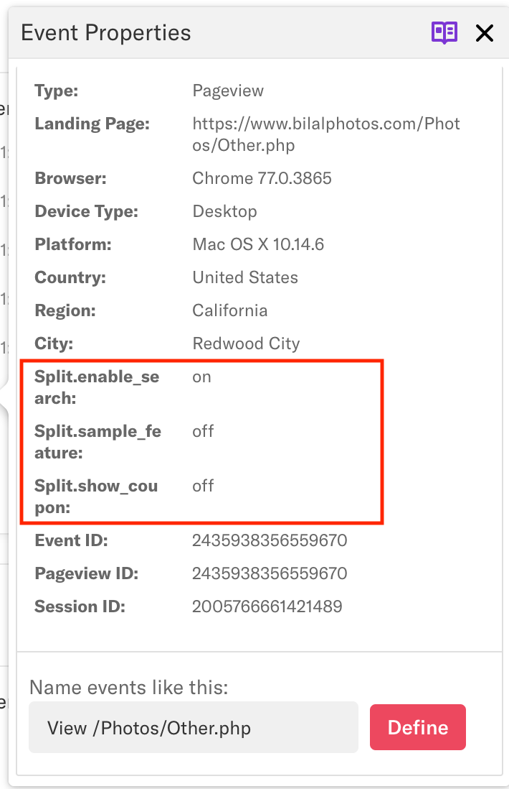
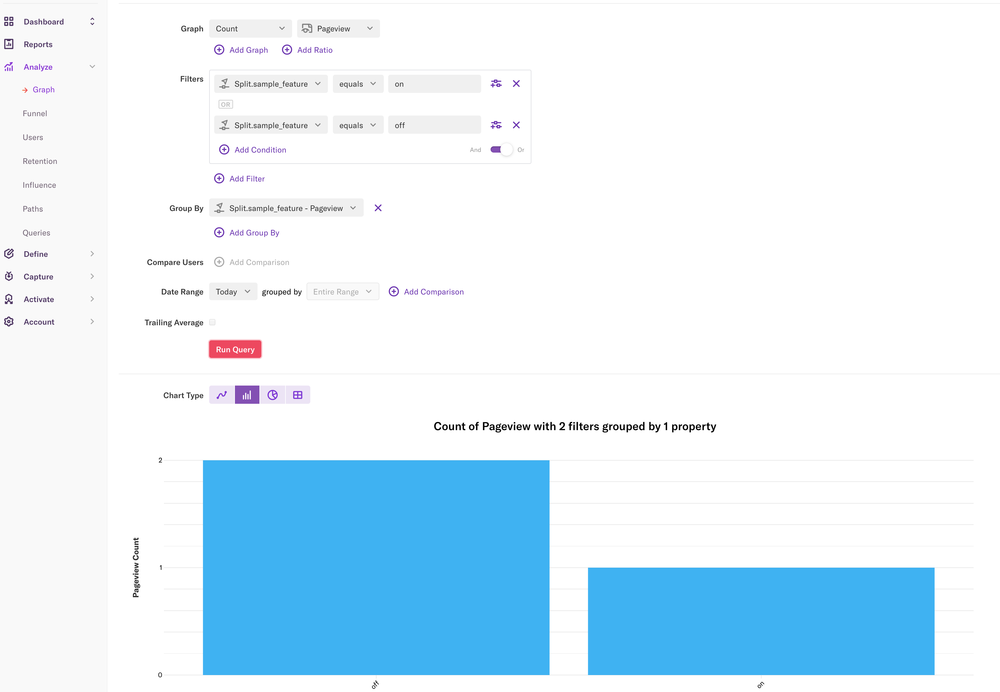

<p>
  <button style={{borderRadius:'8px', border:'1px', fontFamily:'Courier New', fontWeight:'800', textAlign:'left'}}> help.split.io link: https://help.split.io/hc/en-us/articles/360035207311-Heap </button>
</p>

## Split + Heap

Split impressions describe the treatment that each user receives when a feature flag is evaluated. Attach flag names and treatments as Heap events properties for a user's session.

## Prerequisites

To connect Heap to Split, you need the following, 

* Split’s JavaScript SDK evaluating feature flag treatments' client side
* Heap’s Web JavaScript snippet

## How to use

The following explains how to use Heap.

### Implement both libraries 

The code below implements both Split and Heap's JavaScript libraries, assuming both libraries are loaded in the header section. In this example, the Split SDK is wrapped with the class SplitIO. Be sure sure to update the key and authorizationKey fields in the factory initialization.

Split treatments are calculated for a list of feature flag names defined in an array variable splitNames. Be sure to update the array with the correct flag names.

### Evaluate treatments

Once the treatments are fetched, the script uses `heap.addEventProperties` to add the feature flag names as a property name and the respective treatments as the value.

### Add a prefix

A prefix of "split." is added to each feature flag name in the below example to make it easier to filter in Heap.

### Verify Split treatments as Heap event properties

Click a pageview event and view event properties.

<div style={{maxWidth:500}}>  </div>

### Analyze Heap data by Split treatments 

Create a graph of the count of page views filtering by Split feature flag names and treatments. Group by the flag name to see the count by treatment.



## Code

The source code referenced above can be found below:

```
<script>
userId="bob";
heap.identify(userId);
class SplitIO {
    constructor() {
        this.isSDKReady=false;
        this.factory = splitio({
            core: {
                authorizationKey: 'BROWSER API KEY',
                key: userId,
            },
            storage: {
            type: 'LOCALSTORAGE'
            },
        });
        this.client = this.factory.client();
        this.client.on(this.client.Event.SDK_READY, () => {
            this.isSDKReady=true;
        });
    }
    applyFeatureFlags(featureNames) {
        return this.client.getTreatments(featureNames);
    }
    destroySplit() {
        this.client.destroy();
        this.client=null;
    }
}

function calculateTreatments() {
    splitNames=["sample_feature", "show_coupon", "enable_search"];
    treatments = mySplit.applyFeatureFlags(splitNames);

    var split_treatments ={};
    for (var i = 0; i < splitNames.length; i++) {
        console.log(splitNames[i]+": "+treatments[splitNames[i]]);
        split_treatments["Split."+splitNames[i]] = treatments[splitNames[i]];
    }
    heap.addEventProperties(split_treatments);
}

var mySplit = new SplitIO();
if (!mySplit.isSDKReady) {
    console.log("Split not ready yet");
    mySplit.client.on(mySplit.client.Event.SDK_READY, () => {
        calculateTreatments();
    });
} else {
    calculateTreatments();
}
</script>
```
## About this integration

This is a third-party integration that has been tested by Split. Split does not own or maintain this integration. For more information, reach out to the [contributor](mailto:bilal@split.io.).

To learn more about all our integrations check out our integrations page. If you’d like a demo of Split, or help to implement any of our integrations, contact [support@split.io](mailto:support@#split.io).