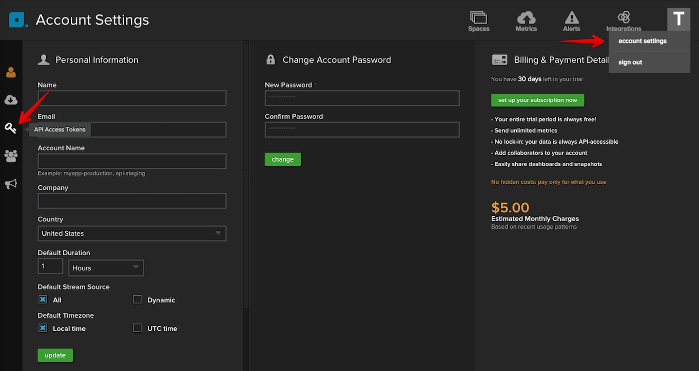
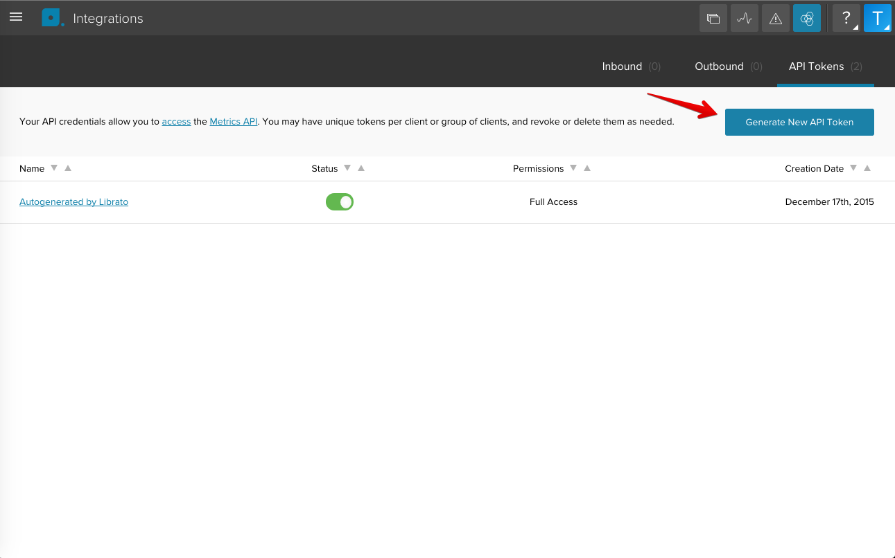
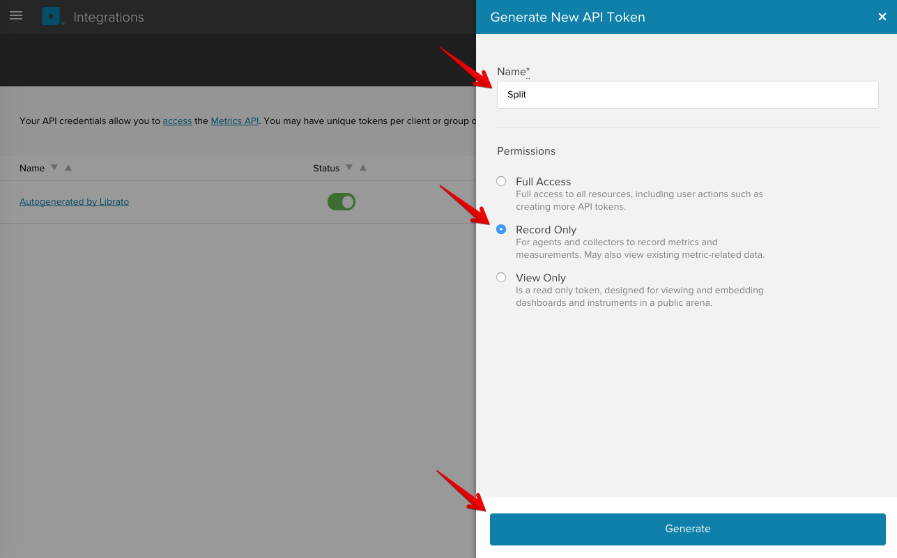
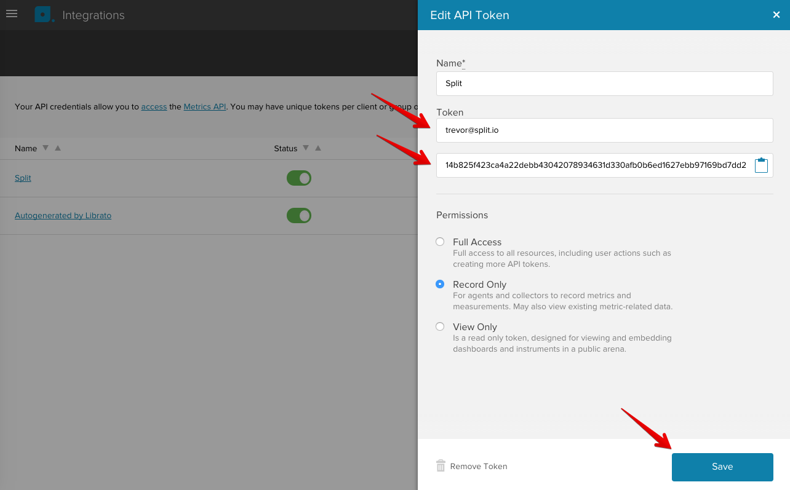
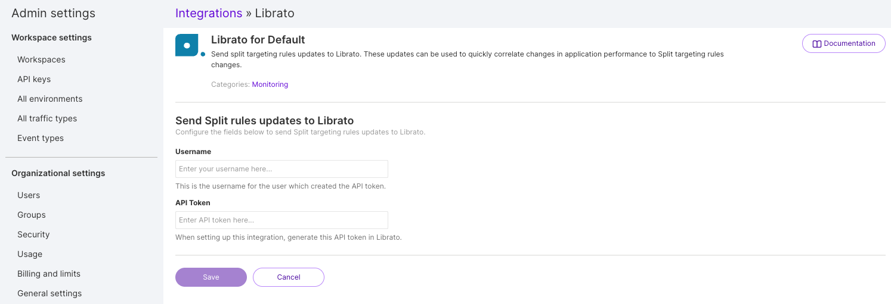

  <button style={{borderRadius:'8px', border:'1px', fontFamily:'Courier New', fontWeight:'800', textAlign:'left'}}> help.split.io link: https://help.split.io/hc/en-us/articles/360020950431-Librato </button>

Librato allows your team to collect, store, and visualize any metric across all levels of your application stack. Integrate Split data into Librato to monitor and measure the performance impact of Split changes.

If you have trouble completing the integration, contact us at [support@split.io](mailto:support@split.io).

## In Librato
 
1. Go to **Account Settings**.
2. Click **API Access Tokens**.

   

3. Click **Generate New API Token**.

   

4. Type in a **Name**, select **Record Only**, and then click **Generate**. 

   

5. Copy the **User name** and **API Token** for later use in Split, and then click **Save**. 

   

## In Split

1. Go to **Admin Settings**. click **Integrations** and navigate to the **Marketplace**.

   

2. Click **Add** next to **Librato** and select a workspace.

   

3. Paste the **Username** and **API Key** you copied in step 5.
4. Click **Save**.

Split notifications should now be flowing into Librato. If you have any issues with this integration, contact [support@split.io](mailto:support@split.io).