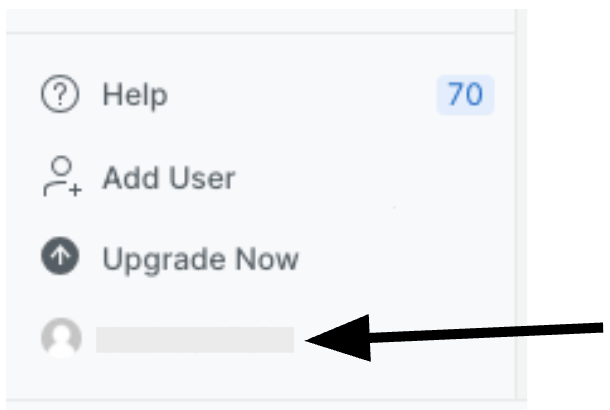

  <button hidden style={{borderRadius:'8px', border:'1px', fontFamily:'Courier New', fontWeight:'800', textAlign:'left'}}> help.split.io link: https://help.split.io/hc/en-us/articles/360020695432-New-Relic   ✘ images still hosted on help.split.io </button>

New Relic provides real-time application performance management. Integrate Split data into New Relic to monitor and measure the performance impact of Split changes.

If you have trouble completing the integration, contact us at [support@split.io](mailto:support@split.io).

## In New Relic
 
1. Go to **New Relic One** and click your name.

   
  

2. Select the **API Keys** option.

   
  

3. Select **Create a key**.

   

4. Create an **Ingest - Licence** key. 

   
  

5. Ensure you have copied down your Account ID (the number next to "**Account:**") and the key for use in Split.

## In Split

1. Click the **user's initials** at the bottom of the left navigation pane and click **Admin settings**.
2. Click **Integrations** and navigate to the Marketplace tab.

   

3. Find New Relic in the integrations list, click **Add** and select the Split project for which you would like to configure the integration.

   

4. Paste the **Account ID** and **Key** you copied in step 5 of the New Relic instructions.
5. Click **Save**.

Split notifications should now be flowing into New Relic. If you have any issues with this integration, contact [support@split.io](mailto:support@split.io).
