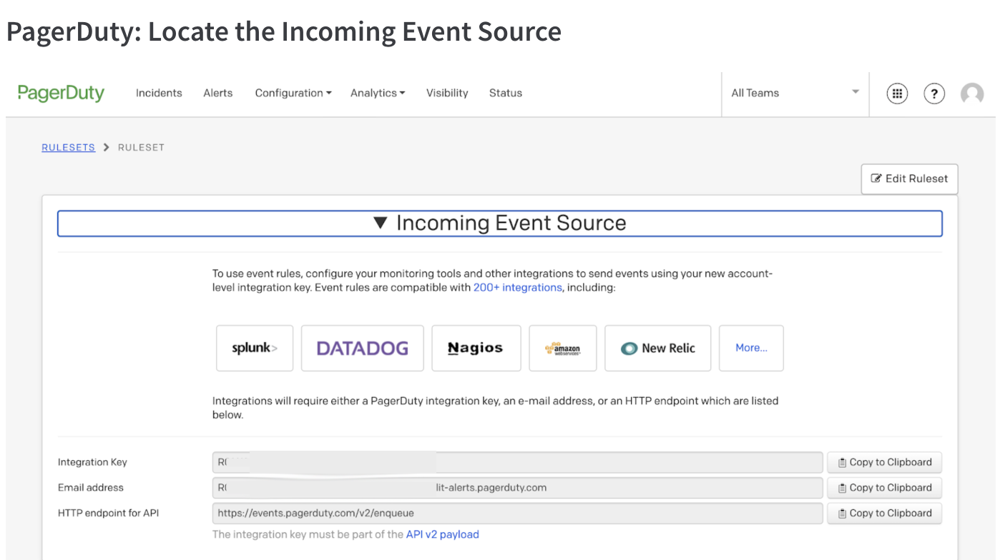
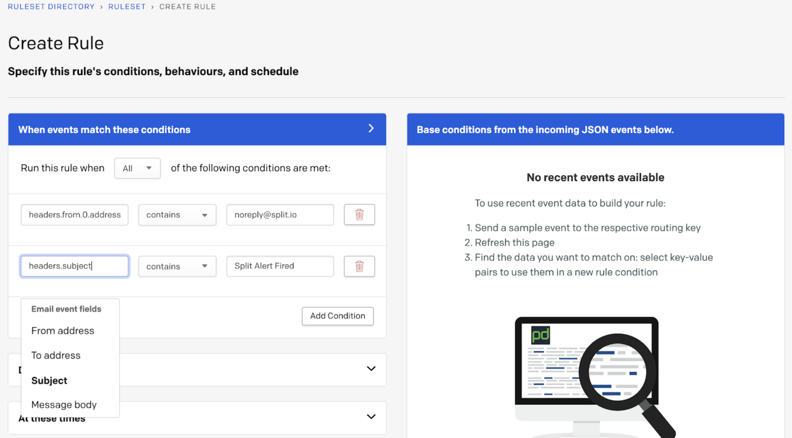
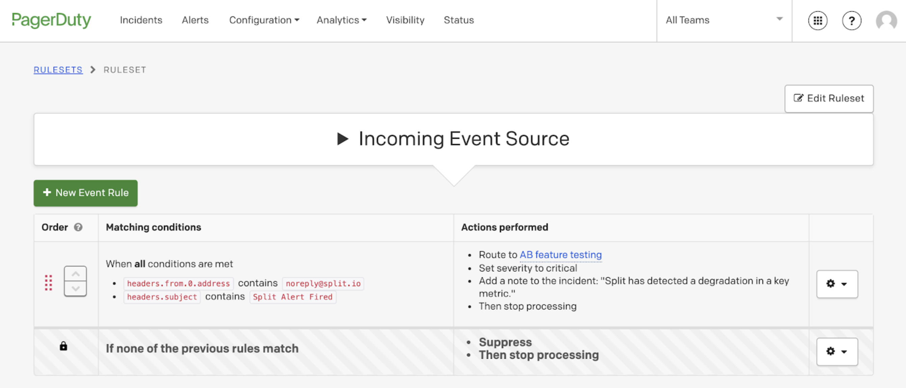
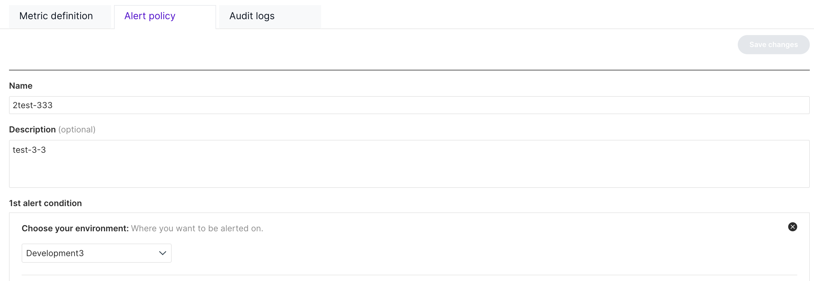
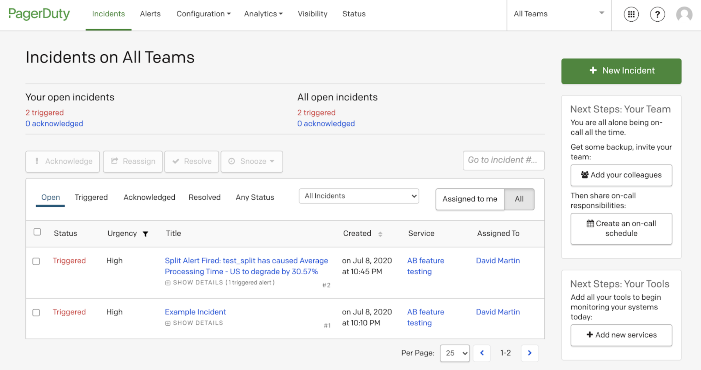
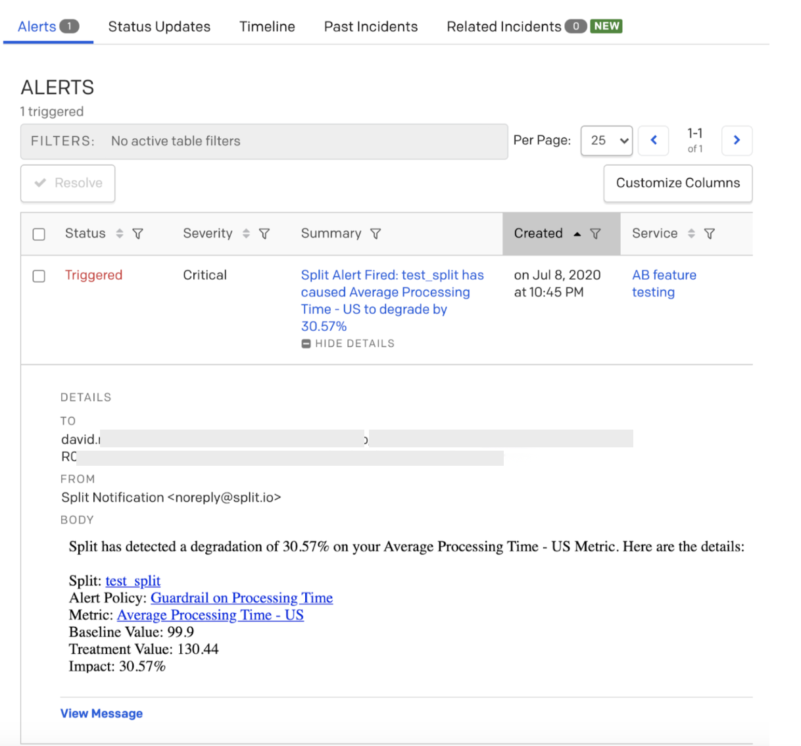

  <button style={{borderRadius:'8px', border:'1px', fontFamily:'Courier New', fontWeight:'800', textAlign:'left'}}> help.split.io link: https://help.split.io/hc/en-us/articles/360046246631-PagerDuty </button>

## Split + PagerDuty

PagerDuty is a leading provider of on-call management, incident response, and event intelligence. Split is uniquely suited to detect degradations in key metrics when features are rolled out. Configuring alerts in Split, you can be notified when a rollout impacts the metrics your team cares about.

Split sends alerts on degradation via email. PagerDuty can receive these emails and feed them into its modern incident response engine to be distributed for action as appropriate. The integration uses out-of-the-box features of both products.

## Prerequisites

To connect PagerDuty to Split, you need the following:

* PagerDuty
* Split platform edition with Split's monitoring pack

## How to Use

The following describe how to use PagerDuty with Split.

### Locate the incoming event source in PagerDuty

1. From PagerDuty’s main menu, go to Configuration and Event Rules.

2. Select the Default Global Ruleset or one of your choosing.

3. Open the Incoming Event Source to find a screen like the one shown as follows:

   

   A unique integration key and accompanying email address is shown. This is the email address you use with the Split alert policy. Copy the email address and save it for later.

### Create a rule in PagerDuty

1. Create a new rule to process the email alerts from Split. The rule can be simple.

   

2. Enter the following: 

* From address is “noreply@split.io”
* Subject contains “Split Alert Fired”

3. Save the rule.

   

The actions performed by my rule are to route to an appropriate service -- “AB feature testing” -- set the severity to critical and label the incident with a note that “Split has detected a degradation in a key metric”. You can specify whatever action you think is most appropriate; PagerDuty is incredibly flexible in its response to the alerts.

### Configure a metric alert policy in Split

1. Select a metric on which you would like to alert. The full details on configuring an alert policy are found in Split's [metric alerting guide](https://help.split.io/hc/en-us/articles/19832312225293-Configuring-metric-alerting).

   

2. Paste the email address you saved from PagerDuty containing your unique key as additional email save the changes.

You are now ready for your alert to fire to PagerDuty.

### Trigger an alert in Split

Split does not have a test button to trigger an alert. The simplest approach is to write a test program that generates fake users to create impressions and events that triggers an alert. Contact the [contributor](email:david.martin@split.io) for help and suggestions.

### Handle a Split incident in PagerDuty

If the integration is configured properly, a new alert email from Split appears as incidents in PagerDuty, per your rules configuration.

The full detail of the email message is also available in PagerDuty by drilling into the incident.

In this case, the test_split degraded the processing time by 30%.

You have successfully integrated Split alerts with PagerDuty.

## About this integration

This is a third-party integration that has been tested by Split. Split does not own or maintain this integration. For more information, contact the [contributor](mailto:david.martin@split.io).

To learn more about all our integrations, check out our integrations page. If you’d like a demo of Split or help to implement any of our integrations, contact support@split.io.