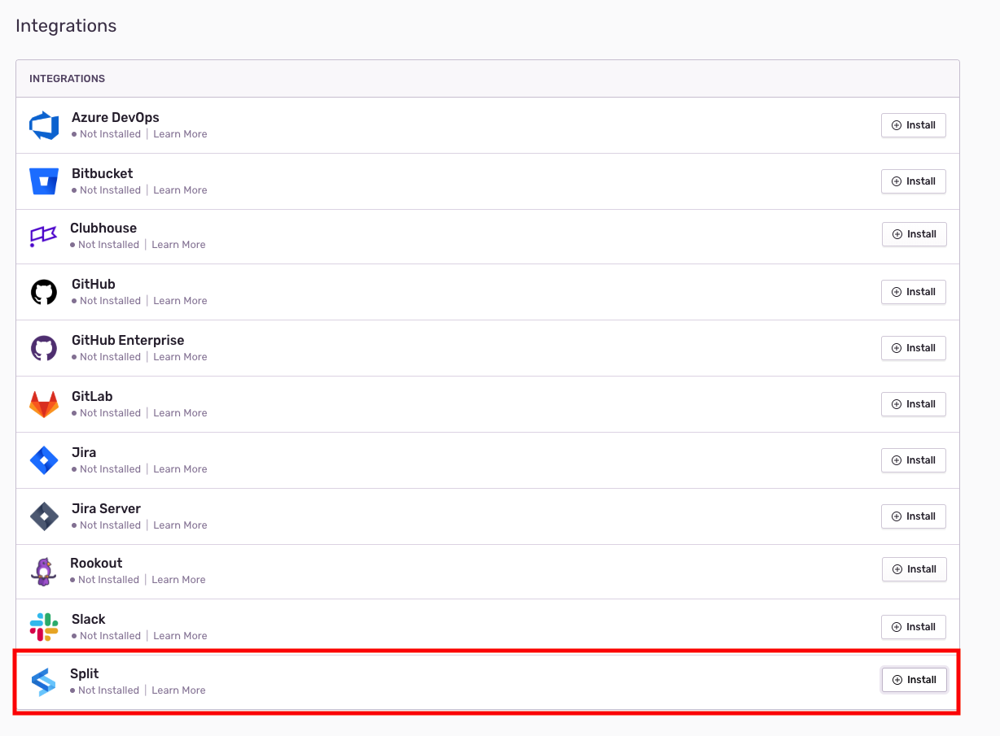
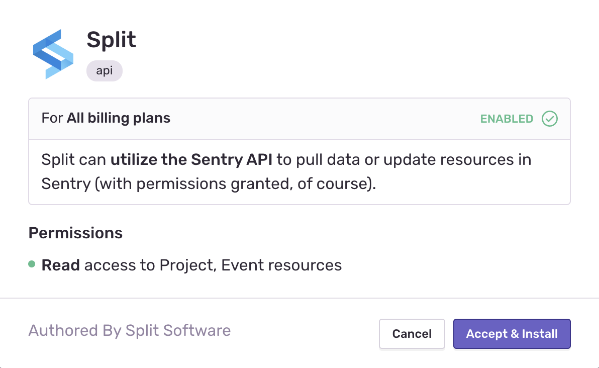
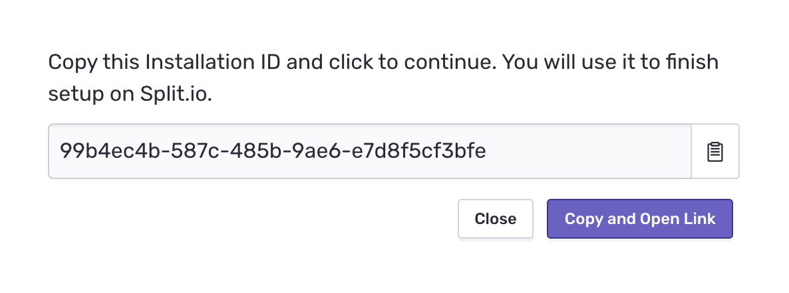
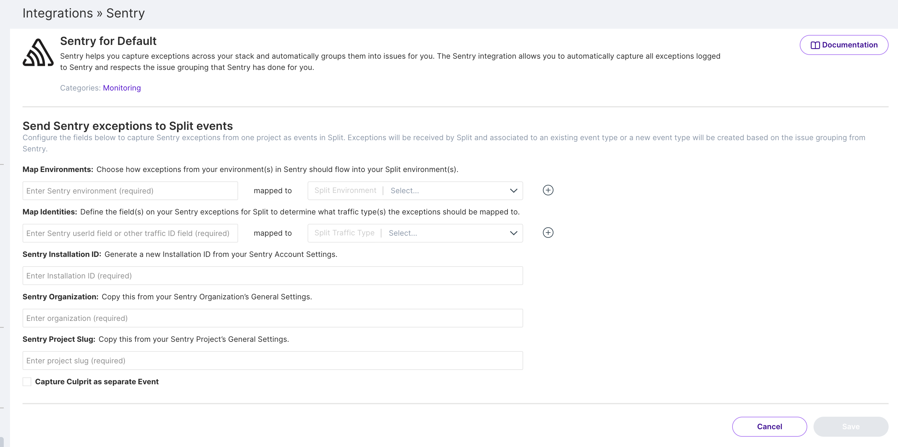

<p>
  <button hidden style={{borderRadius:'8px', border:'1px', fontFamily:'Courier New', fontWeight:'800', textAlign:'left'}}> help.split.io link: https://help.split.io/hc/en-us/articles/360029879431-Sentry </button>
</p>

:::info[Get access to the Sentry integration]
Reach out to your customer success manager or [support](mailto:support@split.io) and we’ll enable in your account.
:::


## Overview 

Sentry allows you to easily centralize all your exception and error tracking across your stack. By tracking exceptions via Sentry's API and libraries, you can leverage their grouping algorithms to review exceptions that are similar to each other in one place. They offer support for most platforms, including JavaScript, Node.js, PHP, .Net, Go, Python, and more.your integration in Split's dashboard.
your integration in Split's dashboard.

Use this integration to send exceptions from your Projects in Sentry to the Split platform. When configured, Split will quickly process and display [Sentry exception data](https://docs.sentry.io/error-reporting/capturing/) in the Split platform as [track events](https://help.split.io/hc/en-us/articles/360020585772-Track-events) for analysis. You can control what environments and traffic types you're capturing exceptions for in the Split dashboard without having to touch any code. 

## Setting up the integration

### Integration Requirements
In order to use this integration, you will need to:

* Be on Sentry's Business plan or above.
* [Send Environment data](https://docs.sentry.io/enriching-error-data/environments/?platform=javascript#how-to-send-environment-data) as part of your Sentry implementation. This is necessary in order to map your exceptions to the proper [Split environment](https://help.split.io/hc/en-us/articles/360019915771-Environments)
* [Send key data](https://docs.sentry.io/platforms/javascript/enriching-events/identify-user/) as part of your Sentry implementation. This is necessary in order to map your exceptions to the proper [Split traffic type](https://help.split.io/hc/en-us/articles/360019916311-Traffic-type) and to set the proper `key` for track events in Split.

### In Sentry

For each Sentry project that you want to integrate with Split, you will need copy and paste three things into Split's dashboard:

1. Install the Split Integration by navigating to Organization Settings > Integrations and clicking "Install" on that page. Accept and Install the integration and make sure to copy down the Installation ID that then gets shown.

   Select the Split Integration:

   

   Accept the Installation:

   <div style={{maxWidth:600}}>  </div>

   Copy the Installation ID to paste into Split:

   <div style={{maxWidth:600}}>  </div>

2. Copy your Sentry Organization Name. You can access this by clicking **Settings** in the left nav of your Sentry dashboard then clicking **General Settings** under the Organization section.

   

3. Copy your Sentry Project Slug. You can access this by clicking **Settings** in the left nav of your Sentry dashboard, then click **Projects** under the Organization section. Select your desired project from the list there and you can then grab the Project Slug from the **General Settings** section.

   

### In Split

1. Click the **profile button** at the bottom of the left navigation pane and click **Admin settings**.
2. Click **Integrations** and navigate to the Marketplace tab.
3. Find Sentry in the integration list, click **Add** and select the Split project for which you would like to configure the integration.

   

4. Configure the Sentry integration as follows:

   

   * **Map Environments**. Select how exceptions from your environment(s) in Sentry should flow into your Split environment(s). You can create a mapping for each environment you have in the Split project you're configuring this integration for. Use the '+' and '-' buttons to configure as many mappings as you want.

      The left side of the mappings are text fields where you should enter the exact names of your environments as you use them in your Sentry implementation when you log it in your code.

      For example, assume you have the following Sentry configuration within your application:

      <pre>import * as Sentry from '@sentry/browser';<br />Sentry.init(\{<br />  environment: 'staging',<br />\})</pre>

        Since the `environment` property is set to "staging", you would type "staging" into Split

        The right side of the mapping(s) are menu lists of all the environments in your project in Split. Select the Split environment(s) that you want to map to each Sentry environment. 

    * **Map Identities**. Determine how exceptions from your Project in Sentry should be mapped to different Split traffic types. You can create a mapping for each traffic type you have in the Split project you're configuring this integration for. Use the '+' and '-' buttons to configure as many mappings as you want. 

      The left side of the mapping(s) are text fields where you should enter in the exact key and path in your Sentry exceptions for your keys as you use them in your [Sentry implementation](https://docs.sentry.io/platforms/javascript/enriching-events/identify-user/) when you log it in your code. For example, if you had used the exact syntax shown in the linked Sentry article in your code, you would want to type "data.erroruser.id" into this field in Split. For more context, take a look through the example data mappings below as well as Sentry's example webhook errors [here](https://docs.sentry.io/workflow/integrations/integration-platform/webhooks/#error).

      The right side of the mapping(s) are drop down fields of all the traffic types in your project in Split. Select the Split traffic type(s) that you want to map to each Sentry identity. 

      * **Sentry Installation ID**. Paste the Installation ID here that you copied from above in Sentry's pop up modal.

      * **Sentry Organization**. Paste the Organization name here that you copied from above in Sentry.

      * **Sentry Project Slug**. Paste the Project Slug here that you copied from above in Sentry.

    * **Capture Culprit as separate Event**. If you have have specific Sentry Issues that come up consistently and want to be able to create metrics based on a specifc Sentry Issue - select this checkbox to capture an extra event for each exception sent from Sentry.

    Once you've configured the above fields, click **Save**. Split will then create a Service Hook for you on your Sentry project. At this point, your integration is now configured. Exceptions should start flowing in as track events and you will be able to define metrics as you need!

## Example data mappings

Below are some examples of how you might set up the integration depending on your Sentry implementation. For full examples of how Sentry formats data from their webhooks check out their docs [here](https://docs.sentry.io/workflow/integrations/integration-platform/webhooks/#error).

### Standard data mapping

Let's walk through what a Sentry integration setup might look like if you're using a Sentry JS project and are capturing exceptions from both a 'staging' and 'production' environment in that project.

#### 1. Sentry Exception Logs

Below are two example exceptions that you might log via the Sentry JS SDK.

Sample Exception in staging:

```js
import * as Sentry from '@Sentry/browser';

Sentry.init({
  environment: 'staging',
  dsn: 'YOUR_DSN'
});
Sentry.configureScope((scope) => {
  scope.setUser({
    id: 42,
    email: "john.doe@example.com"
  });
});
const x = Error('Test error');
Sentry.captureException(x);
```

Sample Exception in production:

```js
import * as Sentry from '@Sentry/browser';

Sentry.init({
  environment: 'production',
  dsn: 'YOUR_DSN'
});
Sentry.configureScope((scope) => {
  scope.setUser({
    id: 42,
    email: "john.doe@example.com"
  });
});
const x = Error('Test error');
Sentry.captureException(x);
```

#### 2. Split Sentry Integration

Below is a screenshot of how you could then configure your integration in Split's dashboard.


#### 3. Split Track Events

Below is a JSON representation of the events that would then be logged in Split from the sample exception examples above.

Sample Track event in staging:

```json
{
  ...
  "eventTypeId": "sentry_exception",
  ...
  "environmentName": "Staging",
  "trafficTypeName": "user",
  "key":"42",
  "timestamp": 1561499129336,
  ...
  "source": "Sentry",
  ...
}
```

Sample Track event in production:

```json
{
  ...
  "eventTypeId": "sentry_exception",
  ...
  "environmentName": "Production",
  "trafficTypeName": "user",
  "key": "42",
  "timestamp": 1561499129336,
  ...
  "source": "Sentry",
  ...
}
```

### Multiple traffic type data mapping

Let's walk through what a Sentry integration setup might look like if you're using a Sentry JS project and are capturing exceptions from a 'production' environment in that Sentry project. Additionally, lets assume that you build B2B software and you identify both an orgId and userId on all your exceptions so that you know what user's trigger an exception and what organization that user was part of.

#### 1. Sentry Exception Logs

Below is an example exception that you might log via the Sentry JS SDK.

```js
import * as Sentry from '@Sentry/browser';

Sentry.init({
  environment: 'production',
  dsn: 'YOUR_DSN'
});
Sentry.configureScope((scope) => {
  scope.setUser({
    id: 42,
    email: "john.doe@example.com"
    orgId: 55
  });
});
const x = Error('Test error');
Sentry.captureException(x);
```

#### 2. Split Sentry Integration Setup

Below is a screenshot of how you could then configure your integration in Split's dashboard.


#### 3. Split Track Events

Since you have multiple traffic types mapped, we will create one track event in Split for each mapping you've set. The events will be very similar except the `trafficTypeName` and `key` will be different based off of your mappings. Below is a JSON representation of the events that would then be logged in Split from the sample exception example above.

Sample Track event for your user traffic type:

```json
{
  "eventTypeId": "sentry_exception",
  ...
  "environmentName": "Production",
  "trafficTypeName": "user",
  "timestamp": 1561499129336,
  "key":"42",
  ...
  "source": "Sentry",
  ...
}
```

Sample Track event for your org traffic type:

```json
{
  "eventTypeId": "sentry_exception",
  ...
  "environmentName": "Production",
  "trafficTypeId": "98765",
  "trafficTypeName": "org",
  "key": "55",
  "timestamp": 1561499129336,
  ...
  "source": "Sentry",
  ...
}

```