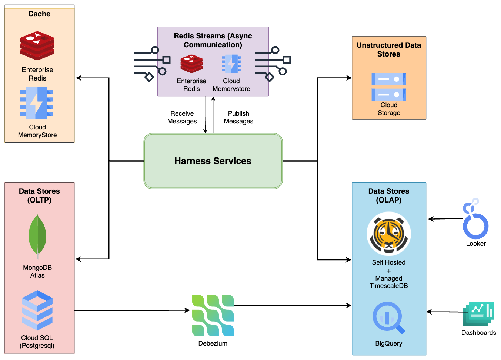

In this concise overview, we'll explore the fundamental workings of the Cloud Asset Governance feature, offering a high-level glimpse into its functionality.
At its core, the Cloud Asset Governance feature operates in an asynchronous mode, orchestrated by a central worker microservice. This worker leverages Cloud Custodian, a versatile tool, to execute a spectrum of actions within the target cloud account. The crux of its operations involves the execution of policies, and the subsequent results are stored systematically.

## Components and Flow:

### Worker Microservice:
The worker microservice takes center stage, acting as the engine of policy execution.
Cloud Custodian is seamlessly integrated into the worker, allowing it to enact a range of actions within the target cloud environment.

### Logging and Storage:
The output logs of policy executions find a home in a Google Cloud Storage (GCS) bucket.
Structured data, crucial for analysis and reporting, is stored in BigQuery.

### Job Queue:
Jobs are efficiently managed through a job queue, ensuring a systematic and organized execution of tasks.
The worker microservice consumes jobs from this queue, allowing for a streamlined and scalable process.

### Additional Services:
- CCM Manager: This service plays a pivotal role in coordinating and managing various aspects of the Cloud Asset Governance feature.
- Scheduler Service: Ensures timely and scheduled execution of tasks, maintaining the efficiency of policy enforcement.
- MongoDB: Acts as a robust repository for storing and managing metadata related to policies and their respective enforcements.

## Execution Flow:

- Job Assignment: The job queue is populated with tasks related to policy enforcement and governance actions.
- Worker Processing:The worker microservice, equipped with Cloud Custodian capabilities, retrieves and processes jobs from the queue.
- Policy Execution: Cloud Custodian executes policies, ensuring adherence to predefined rules and guidelines for cloud asset governance.
- Logging and Data Storage:
Output logs from policy executions are deposited in a designated GCS bucket, forming a comprehensive record of actions taken.
Structured data, containing valuable insights into policy outcomes, is stored in BigQuery for further analysis.
- Metadata Management: MongoDB plays a crucial role in managing metadata associated with policies and their respective enforcements, ensuring a centralized and organized storage.
- CCM Manager Oversight: The CCM Manager oversees the entire process, ensuring seamless integration and coordination among the different services involved.

In essence, this high-level overview encapsulates the intricate dance of components within the Cloud Asset Governance feature. With a focus on asynchronous execution, robust storage solutions, and efficient job management, this feature stands as a testament to streamlined cloud asset governance within a target cloud environment.
