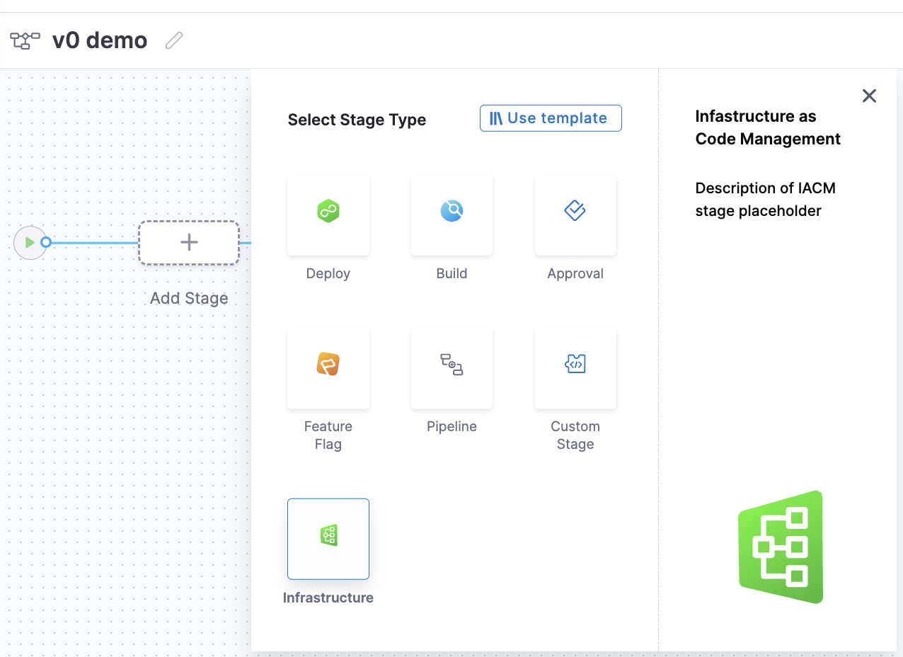
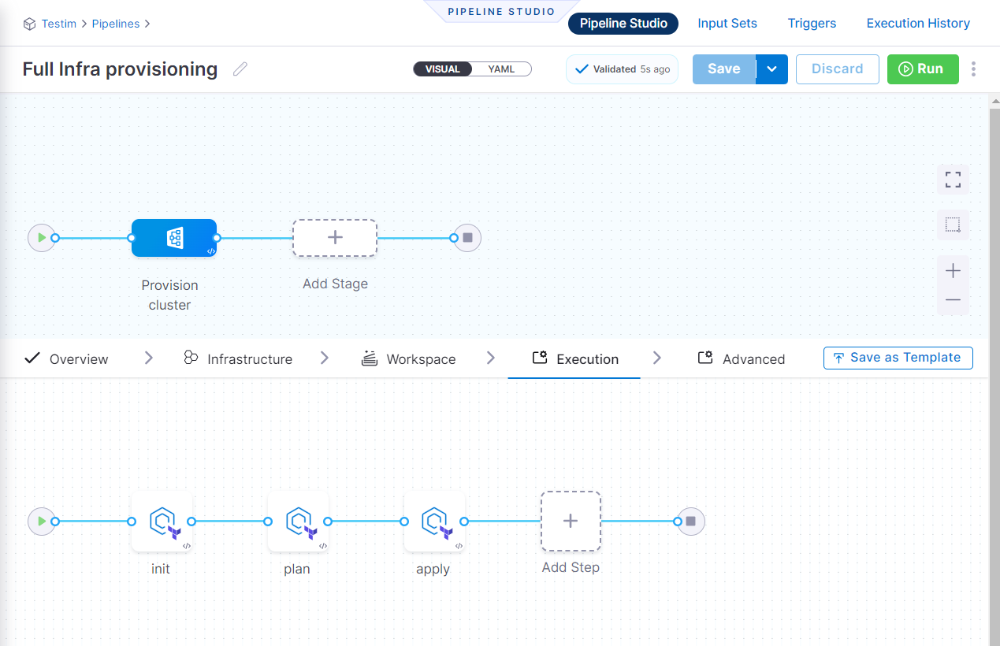

After you create a workspace, you can perform operations against the configuration, such as provisioning and destroying. You will use a Harness pipeline to provision and optionally destroy a workspace. 

## Provision a workspace

You can use the Harness Visual Editor or YAML to provision a workspace.


```mdx-code-block
import Tabs from '@theme/Tabs';
import TabItem from '@theme/TabItem';
```
```mdx-code-block
<Tabs>
  <TabItem value="Visual" label="Visual">
```

1. In the left pane, select **Pipelines**.
2. Select **+ Create a Pipeline** and set up a pipeline. 
3. In the **Select Stage Type** pane, select **Infrastructure**.

    

4. On the **Workspace** tab, select an existing workspace or select **+ Create New Workspace** to create a new workspace. 

    

5. Select the **Execution** tab, and then add the **IACM Terraform steps** for adding Terraform plugins. Five operations are supported: init/plan/apply/destroy/plan-destroy.

    * The steps required for provision are as follows: init, plan, and apply.

    * The init step initializes Terraform by downloading all the modules that are required and preparing the worker to perform the Terraform operations.

        * Third-party plugins that don’t need a plan can be included.
    
    * The plan step generates a Terraform plan. This Terraform plan is accessible to all the steps after the IaCM Terraform plan, and is accessible on “<+pipeline.stages.{nameofthestage}.spec.execution.steps.{nameofthestep}.output.outputVariables.parsedPlan>”

        * Third-party plugins that require a plan can be added here.

    * Lastly, the apply step will apply the plan generated in the previous step.

6. To create the Provision pipeline, follow these steps:

    a. Select **Add Step**.

    b. Select the **IACMTerraformPlugin**.

    c. Provide the Name and Timeout, and select the command `init`.

    d. Repeat the above steps for **plan** and **apply**.

    

    You should now have a stage with an init > plan > apply sequence. 

    

7. Select **Save**, and then select **Run Pipeline**. 

8. After the plan is created, switch to the **Resources** tab to see all the resources and Terraform outputs that will be generated once the plan is applied. You can see which resources will be added, changed, or removed from the state. 

9. Select **Resources** to see the attribute details. 

    The execution completed and the state was created. Harness IaCM provides state management, so the state was saved in the Harness backend. This implicit step happens behind the scenes during pipeline execution, and you don’t need to configure it. 

    You can also define a trigger to the pipeline to be executed when there is a change in the Terraform configuration.

```mdx-code-block
  </TabItem>
  <TabItem value="YAML" label="YAML" default>
```
Use the following sample and update the areas in brackets. 

```yaml
pipeline:
  name: <<PIPELINE NAME>>
  identifier: <<PIPELINE IDENTIFIER>>
  projectIdentifier: <<PROJECT IDENTIFIER>>
  orgIdentifier: <<ORG IDENTIFER>>
  tags: {}
  stages:
    - stage:
        name: testiacm
        identifier: testiacm
        description: ""
        type: IACM
        spec:
          platform:
            os: Linux
            arch: Amd64
          runtime:
            type: Cloud
            spec: {}
          workspace: <<WORKSPACE ID>>
          execution:
            steps:
              - step:
                  type: IACMTerraformPlugin
                  name: init
                  identifier: init
                  timeout: 5m
                  spec:
                    command: init
              - step:
                  type: IACMTerraformPlugin
                  name: plan
                  identifier: plan
                  timeout: 5m
                  spec:
                    command: plan
              - step:
                  type: IACMTerraformPlugin
                  name: apply
                  identifier: apply
                  timeout: 5m
                  spec:
                    command: apply
        tags: {}
```

```mdx-code-block
  </TabItem>
</Tabs>
```

## Destory a workspace

You can use the Harness Visual Editor or YAML to destroy, or tear down, a workspace. To destroy a pipeline, add the “init” , “plan-destroy”,  “destroy” step.

* Steps required for teardown are init, plan, and destroy, or init, plan-destroy.

* The init step initialises Terraform by downloading all the modules that are required and preparing the worker to perform the Terraform operations.

    * Third-party plugins that don’t need a plan can be included here.

* The plan-destroy step generates a Terraform plan. This Terraform plan is accessible to all the steps after the IaCM Terraform plan, and is accessible on “<+pipeline.stages.{nameofthestage}.spec.execution.steps.{nameofthestep}.output.outputVariables.parsedPlan>”.

    * Third-party plugins that require a plan can be added here.

* Lastly, the destroy step destroys the plan generated in the previous step.

```mdx-code-block
<Tabs>
  <TabItem value="Visual" label="Visual">
```

1. Select **Add Step**.

2. Select the **IACMTerraformPlugin**.

3. Provide the Name and Timeout, and select the command `init`.

4. Repeat the above steps for **plan-destroy** and **destroy**.

    

5. Select **Save**, and then select **Run Pipeline**. 

6. After the plan is created, switch to the **Resources** tab to see all the resources and Terraform outputs that will be generated once the plan is applied. You can see which resources will be added, changed, or removed from the state. 

7. Select **Resources** to see the attribute details. 

```mdx-code-block
  </TabItem>
  <TabItem value="YAML" label="YAML" default>
```
Use the following sample and update the areas in brackets. 

```yaml
pipeline:
  name: <<PIPELINE NAME>>
  identifier: <<PIPELINE IDENTIFIER>>
  projectIdentifier: <<PROJECT IDENTIFIER>>
  orgIdentifier: <<ORG IDENTIFER>>
  tags: {}
  stages:
    - stage:
        name: iacstage
        identifier: iacstage
        description: ""
        type: IACM
        spec:
          workspace: <<WORKSPACE ID>>
          platform:
            os: Linux
            arch: Amd64
          runtime:
            type: Cloud
            spec: {}
          execution:
            steps:
              - step:
                  type: IACMTerraformPlugin
                  name: init
                  identifier: init
                  spec:
                    command: init
                  timeout: 5m
              - step:
                  type: IACMTerraformPlugin
                  name: plan
                  identifier: plandestroy
                  spec:
                    command: plan-destroy
                  description: plan destroy
              - step:
                  type: IACMTerraformPlugin
                  name: destroy
                  identifier: destroy
                  spec:
                    command: destroy
                  description: destroy
                  timeout: 5m
        tags: {}
```

```mdx-code-block
  </TabItem>
</Tabs>
```