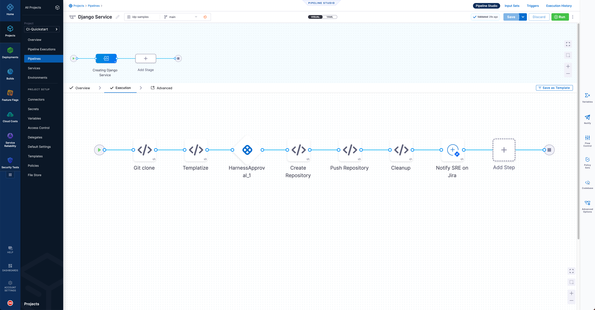

Service onboarding pipelines in Harness IDP (also known as Software Templates) is a feature for you to automate the process of new service creation inside your organization. As a platform engineer, you can create a template which asks for a few details from a developer and creates a new hello world repository for them with their basic setup like CI/CD taken care of. The syntax for template definition `template.yaml` is owned by [backstage.io](https://backstage.io/docs/features/software-templates/writing-templates) while the workflow runs on a Harness pipeline of your choice.

<!-- See it in action: Demo video -->

**To get started, check out the tutorial to [create your first service onboarding pipeline](../tutorials/create-your-first-service-onboarding-pipeline.md).**

## FAQs

### How can I register a new software template?

`Template` is another kind of entity that exists in the catalog. You can create a `template.yaml` and register the url in the catalog by following [the docs to register a new software component](../getting-started/register-a-new-software-component.md).
