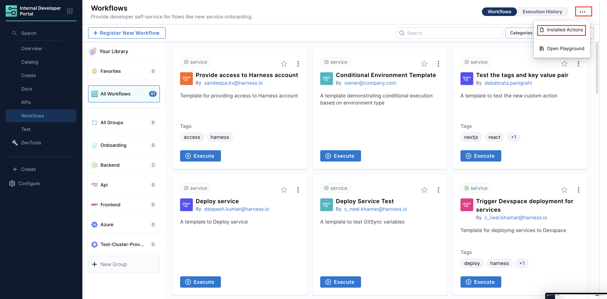
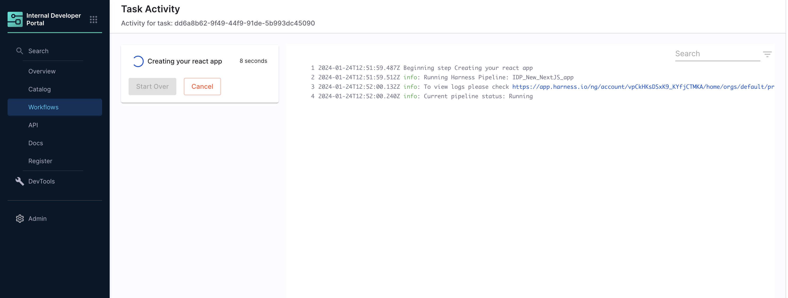
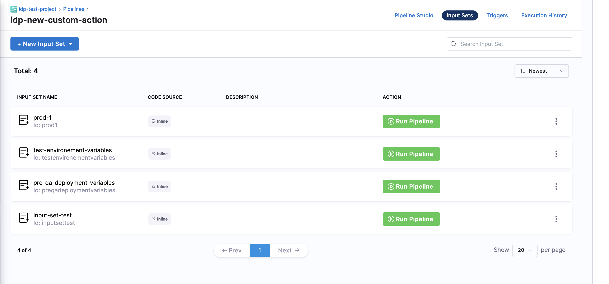
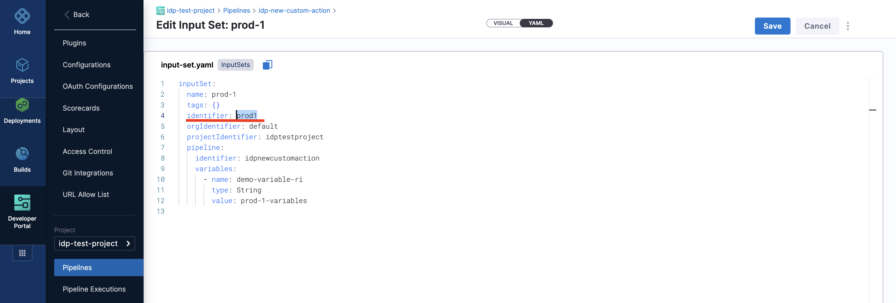
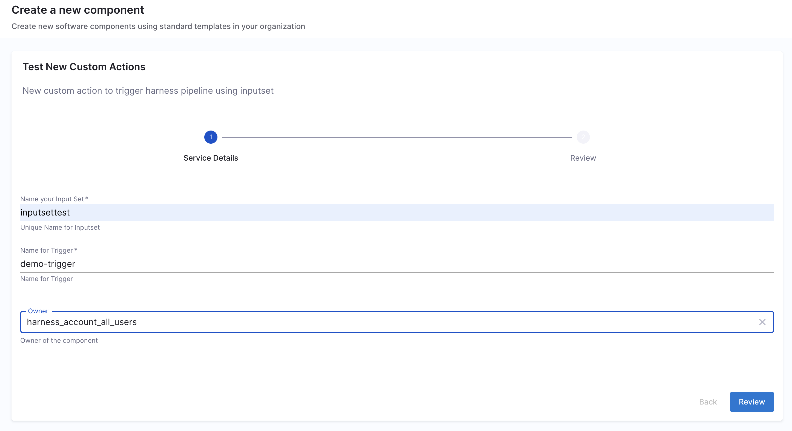

The backend of **Harness IDP workflows** consists of a library of steps and actions that define the workflow logic. 

**Workflow Actions** in IDP are integration points with third-party tools that take inputs from workflows and execute specific tasks based on user input. Workflows include built-in actions for fetching content, registering services in the catalog, and creating/publishing Git repositories.

## Defining Workflow Actions
You can configure the backend using the `spec.steps` field in your YAML configuration. These steps serve as core execution units, triggering actions and orchestrating pipelines. Input details from the frontend are passed to the backend, enabling task execution.

### YAML Syntax
```YAML
steps:
  - id: step_id
    name: Step Name
    action: action_name
    input:
      key: value
    output:
      key: value
```
#### YAML Breakdown
- `id` – A unique identifier for the step, used to reference it in later steps.
- `name` – A human-readable label for the step.
- `action` – Specifies the workflow action to execute (e.g., trigger:harness-custom-pipeline, publish:github).
- `input` – Defines the parameters required by the action. These vary depending on the action used.

Example (for `trigger:harness-custom-pipeline`):
```YAML
input:
  url: "https://app.harness.io/ng/account/..."
  inputset:
    project_name: ${{ parameters.project_name }}
    github_repo: ${{ parameters.github_repo }}
```
Here, `url` specifies the Harness pipeline, and `inputset` are the parameters provided by the user, to be used as an input for the pipeline mentioned in the URL. 
- `output` – Stores results from the action, which can be used in later steps.

Example (for storing a generated file path):
```YAML
output:
  filePath: '{{ steps.generate.outputs.file }}'
```
This allows other steps to reference the generated `filePath`.

## Supported Actions

You can find a list of all registered Workflow actions under:
1. Click on the **three dots** in the top right corner of the **Workflows** page. Select **Installed Actions**.

2. You'll be able to see all the supported actions here. 


Let's dive deeper into each supported action.  

### 1. `trigger:harness-custom-pipeline`

This action triggers a Harness pipeline using a provided URL and user-defined input variables. It supports various pipeline configurations, including:

- [IDP Stage](https://developer.harness.io/docs/internal-developer-portal/flows/idp-stage)

- [Deploy Stage](https://developer.harness.io/docs/platform/pipelines/add-a-stage#add-a-stage)

- [Custom Stage](https://developer.harness.io/docs/platform/pipelines/add-a-stage/#add-a-custom-stage) (Harness CD License or Free Tier required)

- [Pipeline Templates](https://developer.harness.io/docs/platform/templates/create-pipeline-template/)

- [codebase disabled](/docs/continuous-integration/use-ci/codebase-configuration/create-and-configure-a-codebase.md#disable-clone-codebase-for-specific-stages) Build Stage (Harness CI License required)

```YAML
##Example
...
steps:
  - id: trigger
    name: Creating your React app
    action: trigger:harness-custom-pipeline
    input:
      url: "https://app.harness.io/ng/account/..."
      inputset:
        project_name: ${{ parameters.project_name }}
        github_repo: ${{ parameters.github_repo }}
      apikey: ${{ parameters.token }}
      hidePipelineURLLog: true
    output:
      text:
        - title: Pipeline Execution
          content: "Execution URL: `${{ steps.trigger.output.url }}`"
```

#### Inputs

Here's a list of **inputs** required to use the action: 
| Name | Title | Description | Type |
|---------|----------------|------------------|----------------------|
| **url** *(Mandatory)*	| Pipeline URL	| URL of the pipeline you want to execute		| `string`|
| **inputset** *(Mandatory)*	| Pipeline Inputset	| Required input set for the pipeline to execute	| `object`|
| **apikey** 	| Harness x-api-key	| Harness Token to Authenticate Pipeline Execution | `string` |
| **apiKeySecret**	| Harness secret	| Harness secret to which contains x-api-key	| `string` |
| **hidePipelineURLLog** | Hide Pipeline URL	| Parameter to hide pipeline url from the execution logs	| `boolean` |
| **showOutputVariables** | Show Output Variables	| Parameter to show output variables exported from a pipeline from the execution logs	| `boolean` |

Let's dive into these **inputs** in detail: 
1. `url`: Pipeline execution URL

> Note: For pipelines using [Git Experience](https://developer.harness.io/docs/platform/git-experience/git-experience-overview) make sure your URL includes `branch` and `repoName` e.g., `https://app.harness.io/ng/account/accountID/module/idp/orgs/orgID/projects/projectID/pipelines/pipelineID?repoName=repo-name&branch=branch`

2. `inputset`: Key-value pairs of pipeline variables

In the YAML example above, under `inputset`, values such as `project_name` and `github_repo` are placeholders for pipeline variable names. You can use the reference format `<+pipeline.variables.VARIABLE_NAME>` directly within the `inputset` **key-value pairs**. For example, instead of simply specifying the variable name, you can reference the pipeline variable like this:

```YAML
...
inputset:
  pipeline.variables.project_name: ${{ parameters.project_name }}
  pipeline.variables.github_repo: ${{ parameters.github_repo }}
  ...
...
```
To obtain these references, simply copy the variable path from the Harness Pipeline Studio UI. Please make sure to remove `<+` & `>` from the expression copied from UI. 
 


#### Support for Stage Variables and Pipeline Templates

In addition to pipeline variables, you can also reference **stage variables** within the `inputset`. Here’s how each type of variable can be referenced:

- Stage variable reference: `pipeline.stages.STAGE_IDENTIFIER.variables.VARIABLE_NAME`

If you need to reference lower-level variables (such as stage, step group, and step variables) from outside their original scope, you must include the relative path to that variable. For instance, if you want to reference a stage variable from a different stage, you should use the format, `pipeline.stages.originalStageID.variables.variableName`

Instead of the simpler `stage.variables.variableName`. This fully qualified path ensures the correct variable is referenced across stages, step groups, or steps.

```YAML
inputset:
  pipeline.variables.project_name: ${{ parameters.project_name }}
  pipeline.stages.originalStageID.variables.github_repo: ${{ parameters.github_repo }}
```
To obtain these references, simply copy the variable path from the Harness Pipeline Studio UI and remove the special characters `<+` and `>`.

> Note: **This is the only way to reference stage variables and pipelines using templates with variables under `inputset`. Without the fully qualified path, the input will not be valid.**


| Variables under `inputset`                                                 | What's Supported                                                                |
|----------------------------------------------------------------------------|---------------------------------------------------------------------------------|
| Variable name (`variable_name`)                                      | Supported with Pipelines Variables for IDP stage, custom stage and Codebase Disabled build stage along Pipelines **not** containing any templates.  |
| Variable name with Fully Qualified Path (`pipeline.variables.variable_name`) | Supported with Pipelines Variables for all supported stages and Pipelines containing any templates.      |

3. `apikey`: Harness authentication token 

You can opt for authentication via the **`user token`** mode by specifying the **`token`** setup in your **`parameters.properties`** section of the **Workflow YAML**.

#### Defining the **`token`** setup:
```YAML
token:
    title: Harness Token
    type: string
    ui:widget: password
    ui:field: HarnessAuthToken
```

#### Referencing the **`token`** in the **`steps`** spec of the Workflow YAML:
You'll need to reference the **`token`** within the **steps** section using the following format:
```YAML
apikey: ${{ parameters.token }}
```

4. `apiKeySecret`: Harness API Key 

Read more about this [authentication mode](docs/internal-developer-portal/flows/worflowyaml.md) here. 

You can also trigger a pipeline in an IDP Workflow using a **pre-configured Harness API Key**.  
- Use a **Harness `x-api-key`** (with pipeline execution permissions) stored in the [Harness Secret Manager](https://developer.harness.io/docs/platform/secrets/secrets-management/harness-secret-manager-overview).  
- The secret must be stored in the **Account Scope** to ensure accessibility for workflow execution.

#### Defining the **`secretkey`** setup:
```YAML
secretkey:
    title: API Key Secret
    type: string
    default: apiKeySecret
    ui:readonly: true
```

#### Referencing the **`secretkey`** in the **`steps`** spec:
```YAML
apiKeySecret: ${{ parameters.secretkey }}
```

4. `hidePipelineURLLog`: Boolean to hide logs (optional)

4. `showOutputVariables`: Boolean to display pipeline output variables (optional)

#### Outputs

1. `Title` : Name of the Pipeline. 
2.  `url` : Execution URL of the Pipeline e.g.: `https://app.harness.io/ng/account/********************/module/idp-admin/orgs/default/projects/communityeng/pipelines/uniteddemo/executions/**********/pipeline?storeType=INLINE`

Once you create the workflow with this Workflow action, you can see the pipeline URL running in the background and executing the flow. 



You can now optionally remove the pipeline URL from the workflow execution logs, for this you need to use the boolean property `hidePipelineURLLog` and set the value as `true`.

```YAML
## Example
steps:
- id: trigger
    name: Creating your react app
    action: trigger:harness-custom-pipeline
    input:
    url: "Pipeline URL"
    hidePipelineURLLog: true
    inputset:
        project_name: ${{ parameters.project_name }}
    apikey: ${{ parameters.token }}
```

3. You can as well configure the output to display the pipeline [output variables](https://developer.harness.io/docs/platform/variables-and-expressions/harness-variables/#input-and-output-variables), by setting the `showOutputVariables: true` under `inputs`and adding `output` as shown in the example below:

```YAML
...
## Example
steps:
  - id: trigger
      ...
      inputset:
          project_name: ${{ parameters.project_name }}
      apikey: ${{ parameters.token }}
      showOutputVariables: true
output:
  text:
    - title: Output Variable
      content: |
        Output Variable **test2** is `${{ steps.trigger.output.test2 }}` 
    - title: Another Output Variable
      content: |
        Output Variable **test1** with fqnPath is `${{ steps.trigger.output['pipeline.stages.testci.spec.execution.steps.Run_1.output.outputVariables.test1'] }}`      
...
```

:::info

Only **user defined output variables** are allowed, but you can as well use the system generated variables by assigning them as a new variable under shell script step as displayed below. For e.g. we have mentioned the system generated output as `jira_id` and under **Optional Configuration** added a **test-var** which becomes a user defined output variable and could be displayed as output in the IDP workflows.


:::

There are two ways in which you can add the output variable to the template syntax. 

1. You can directly mention the output variable name `${{ steps.trigger.output.test2 }}`, here `test2` is the output variable name we created in the pipeline. 

2. You can copy the JEXL expression of the output variable and remove the JEXL constructs, `${{ steps.trigger.output['pipeline.stages.testci.spec.execution.steps.Run_1.output.outputVariables.test1'] }}`, here the part `pipeline.stages.testci.spec.execution.steps.Run_1.output.outputVariables.test1` comes from `<+pipeline.stages.testci.spec.execution.steps.Run_1.output.outputVariables.test2>` copied from execution logs. 


#### Example

```YAML
...
## Example
steps:
  - id: trigger
      name: Creating your react app
      action: trigger:harness-custom-pipeline
      input:
      url: "https://app.harness.io/ng/account/..."
      inputset:
          project_name: ${{ parameters.project_name }}
          github_repo: ${{ parameters.github_repo }}
          pipeline.variables.cloud_provider: ${{ parameters.provider }}
          db: ${{ parameters.db }}
          cache: ${{ parameters.cache }}
      apikey: ${{ parameters.token }}
      showOutputVariables: true
output:
  text:
    - title: Output Variable
      content: |
        Output Variable **test2** is `${{ steps.trigger.output.test2 }}` 
    - title: Another Output Variable
      content: |
        Output Variable **test1** with fqnPath is `${{ steps.trigger.output['pipeline.stages.testci.spec.execution.steps.Run_1.output.outputVariables.test1'] }}`      
...
```

### 2. `trigger:trigger-pipeline-with-webhook`


This Workflow action could be used to trigger a pipeline execution based on the **input-set identifier** and a webhook name. Usually a single deployment pipeline has different input-set as per the environment it's going to be deployed and developers can just specify the input-set ID aligning with the environment name to trigger the deployment pipeline. 



Developers need to mention the input set identifier instead of the name in the workflows input, usually identifier are names devoid of any special characters and spaces, e.g., `input set-test` name would have an identifier as `inputsettest`. It is suggested to provide all the available input-set as `enums` in the template to avoid any ambiguity by developers.  

 

Here's an example workflow based on this [source](https://github.com/harness-community/idp-samples/blob/main/workflows-ca-inputset.yaml). 



#### Inputs
Here's a list on **inputs** used for this action:

| Name | Title | Type |
|---------|----------------| ----------------------|
| **url** *(Mandatory)*	| Pipeline URL	|  `string`|
| **inputSetName** *(Mandatory)*	| Input Set Name	| `string`|
| **triggerName** *(Mandatory)*	| Trigger Name	| `string` |
| **apiKey**	| Harness API Key	| `string` |


#### Outputs
| Name | Title |
|---------|----------------| 
| **API URL** | Webhook URL used for execution |
| **Pipeline Details**	| Redirects to the Harness Pipeline Editor	| 
| **Execution URL** | Recent executions of the pipeline	| 

#### Example

```YAML
steps:
  - id: trigger
    name: Triggering pipeline via webhook
    action: trigger:trigger-pipeline-with-webhook
    input:
      url: "YOUR_PIPELINE_URL"
      inputSetName: ${{ parameters.inputSetName }}
      triggerName: ${{ parameters.triggerName }}
      apikey: ${{ parameters.token }}
```
### 3. `harness:create-secret`

This action is used to create a secret in Harness.

#### Inputs
Here's a list of **inputs** required to use the action: 
| Name | Title | Description | Type |
|---------|----------------|------------------|----------------------|
| **projectId** *(Mandatory)*	| Project Identifier	| Project Identifier where secret will be created	| `string`|
| **orgId** *(Mandatory)*	| Organization Identifier	| Organization Identifier where secret will be created	| `string`|
| **secretValue** *(Mandatory)*	| Secret Value	| Secret Value | `string` |
| **apikey**	| Harness x-api-key	| Harness Token to Authenticate Secret Creation	| `string` |

#### Output
Here's what we get as an **output** from the action: 
| Name | Title | Type |
|---------|----------------|----------------------|
| **secretId**	| Secret Identifier created	| `string` |

### 4. `harness:delete-secret`
This action is used to delete a secret from Harness.

#### Inputs
Here's a list of **inputs** required to use the action: 
| Name | Title | Description | Type |
|---------|----------------|------------------|----------------------|
| **projectId** *(Mandatory)*	| Project Identifier	| Project Identifier where secret will be created	| `string`|
| **orgId** *(Mandatory)*	| Organization Identifier	| Organization Identifier where secret will be created	| `string`|
| **secretId** *(Mandatory)*	| Secret Identifier	| Secret identifier which is to be deleted	| `string` |
 | **apikey**	| Harness x-api-key	| Harness Token to Authenticate Secret Creation	| `string` |

### 5. `debug:log`
This action is used to write a message into the log or list all the files in your workspace. 

#### Inputs
Here's a list of **inputs** required to use the action: 
| Name | Title | Type |
|---------|----------------|---------------|
| **message** | Message to output | ```string``` |
| **listWorkspace** | List all files in the workspace, if true	| ```boolean``` |
| **extra** | Extra info | ```unknown``` |

#### Example YAML

**Write a debug message**:
```YAML
steps:
  - action: debug:log
    id: write-debug-line
    name: Write "Hello Harness!" log line
    input:
      message: Hello Harness!
```
**List the workspace directory**:
```YAML
steps:
  - action: debug:log
    id: write-workspace-directory
    name: List the workspace directory
    input:
      listWorkspace: true
```

### 7. `debug:wait`
This action is used to add a **waiting period** for certain time. 

#### Inputs
Here's a list of **inputs** required to use this action:
| Name | Title | Type |
|---------|----------------|---------------|
| **minutes** | Waiting period in minutes	 | ```number``` |
| **seconds** | Waiting period in seconds	| ```number``` |
| **milliseconds** | Waiting period in milliseconds | ```number``` |

#### Example YAML
```YAML
steps:
  - action: debug:wait
    id: wait-1min
    name: Waiting for 1 minutes
    input:
      minutes: 1
```

## Use Cases

### 1. Hiding Logs

To prevent displaying pipeline URLs in workflow execution logs, use `hidePipelineURLLog: true`.

```yaml
steps:
  - id: trigger
    name: Create React App
    action: trigger:harness-custom-pipeline
    input:
      url: "Pipeline URL"
      hidePipelineURLLog: true
      inputset:
        project_name: ${{ parameters.project_name }}
      apikey: ${{ parameters.token }}
```

### 2. Using Parameters as Conditions

You can conditionally execute steps based on parameters.

```yaml
steps:
  - id: deploy
    name: Deploy App
    action: trigger:harness-custom-pipeline
    input:
      url: "YOUR_PIPELINE_URL"
      inputset:
        project_name: ${{ parameters.project_name }}
    if: "${{ parameters.environment == 'production' }}"
```


### Workflow Actions Usage Limitations

| **Workflow Actions**                      | **Pipelines and Stages**    |
|----------------------------------------|-----------------------------|
| trigger:harness-custom-pipeline        | Supports only [IDP Stage](https://developer.harness.io/docs/internal-developer-portal/flows/idp-stage) along with the [Deploy Stage](https://developer.harness.io/docs/platform/pipelines/add-a-stage#add-a-stage), [Custom Stage](https://developer.harness.io/docs/platform/pipelines/add-a-stage/#add-a-custom-stage)(**Available with Harness CD License or Free Tier usage**), Pipelines using [Pipeline Templates](https://developer.harness.io/docs/platform/templates/create-pipeline-template/) and [codebase disabled](/docs/continuous-integration/use-ci/codebase-configuration/create-and-configure-a-codebase.md#disable-clone-codebase-for-specific-stages) **Build Stage(Only Available with Harness CI License)** with [Run step](https://developer.harness.io/docs/continuous-integration/use-ci/run-step-settings) |
| trigger:trigger-pipeline-with-webhook  | Supports all the pipelines with a custom webhook based trigger          | 

