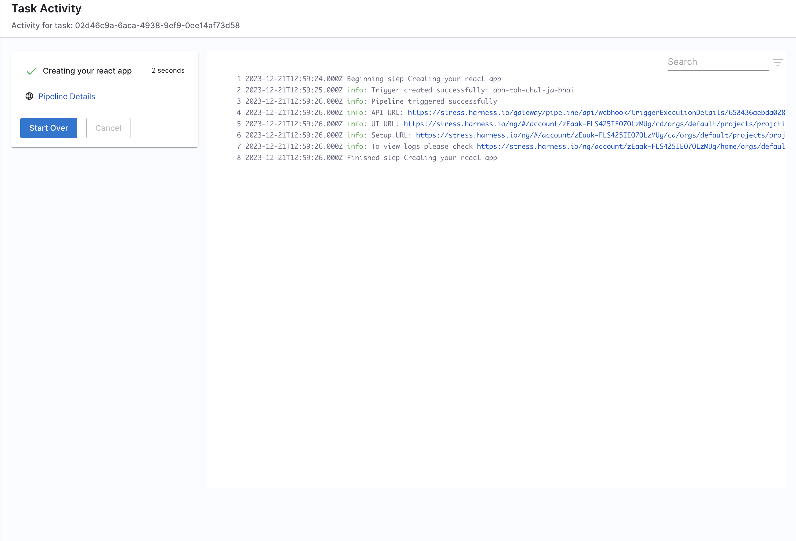

## Introduction

The Flows comes with several built-in actions for fetching content, registering in the catalog and of course actions for creating and publishing a git repository.

There are several repository providers supported out of the box such as **GitHub**, **Azure**, **GitLab** and **Bitbucket**.


## How To View Supported Actions

A list of all registered custom actions can be found under 

`Workflows/Create/Self Service` -> `Installed Actions`


## Harness Specific Custom Actions

### 1. `trigger:harness-custom-pipeline`

This custom action requires **pipeline variables**(`<+pipeline.variables.VARIABLE_IDENTIFIER>`) as input along with the pipeline url, and then trigger the pipeline based in the inputset obtained from the user. 

```YAML
## Example
steps:
- id: trigger
    name: Creating your react app
    action: trigger:harness-custom-pipeline
    input:
    url: "https://app.harness.io/ng/account/vpCkHKsDSxK9_KYfjCTMKA/home/orgs/default/projects/communityeng/pipelines/IDP_New_NextJS_app/pipeline-studio/?storeType=INLINE"
    inputset:
        project_name: ${{ parameters.project_name }}
        github_repo: ${{ parameters.github_repo }}
        cloud_provider: ${{ parameters.provider }}
        db: ${{ parameters.db }}
        cache: ${{ parameters.cache }}
    apikey: ${{ parameters.token }}
```

:::info

In the above example the `apikey` parameter takes input from Harness Token which is specified under spec as a mandatory paramenter as mentioned below

```YAML
...
token:
    title: Harness Token
    type: string
    ui:widget: password
    ui:field: HarnessAuthToken
    ...

```
Without the above parameter input the pipeline won't be executed. Please [take a look at this example](https://github.com/Debanitrkl/backstage-test/blob/0d4dbb877d683ad8764a4a89e636bcf99d16eb32/template.yaml#L58C1-L62C37) 

:::

#### Output

1. `Title` : Name of the Pipeline. 
2.  `url` : Execution URL of the Pipeline eg: `https://app.harness.io/ng/account/********************/module/idp-admin/orgs/default/projects/communityeng/pipelines/uniteddemo/executions/**********/pipeline?storeType=INLINE`

Once you create the workflow with this custom action, you can see the pipeline URL running in the background and executing the flow. 


### 2. `trigger:trigger-pipeline-with-webhook`

This custom action could be used to trigger a pipeline execution based on the [webhook url](https://developer.harness.io/docs/platform/triggers/trigger-deployments-using-custom-triggers/#trigger-a-deployment-using-the-curl-command-for-a-custom-trigger) input for [custom triggers](https://developer.harness.io/docs/platform/triggers/trigger-deployments-using-custom-triggers/#create-the-custom-trigger). 


```YAML
## Example
...
steps:
- id: trigger
    name: Creating your react app
    action: trigger:trigger-pipeline-with-webhook
    input:
    triggerWebhookurl: ${{ parameters.triggerWebhookurl }}
    x_api_key: ${{ parameters.x_api_key }}
...

```

In the above example API key is an optional parameter, and is required in case of **Mandate Authorization for Custom Webhook Triggers** is set to **true** for **Pipeline** under **Default Settings** in **Account Settings**.  

Here's an [example template](https://github.com/Debanitrkl/backstage-test/blob/main/temp-new-trigger.yaml) using the above mentioned custom action.

#### Output

1. `Title` : Name of the Pipeline. 
2.  `url` : Execution URL of the Pipeline eg: `https://app.harness.io/ng/account/********************/module/idp-admin/orgs/default/projects/communityeng/pipelines/uniteddemo/executions/**********/pipeline?storeType=INLINE`

Once you create the workflow with this custom action, you can see the pipeline URL running in the background and executing the flow. 




### 3. `harness:create-secret`

### 4. `harness:delete-secret`

## Custom Field Extensions

Collecting input from the user is a very large part of the scaffolding process and Software Templates as a whole. Sometimes the built in components and fields just aren't good enough, and sometimes you want to enrich the form that the users sees with better inputs that fit better.

This is where Custom Field Extensions come in.

### Harness Specific Custom Extensions

1. `HarnessOrgPicker` : Fetches all the org id dynamically. 

```YAML
#Example
apiVersion: scaffolder.backstage.io/v1beta3
kind: Template
metadata:
  name: your-workflow
  ...
spec:
  ...
  parameters:
    - title: Details
       properties:
         projectId:
           title: Project Identifier
           description: Harness Project Identifier
           type: string
           ui:field: HarnessProjectPicker
         orgId:
            title: Org Identifier
            type: string
            ui:field: HarnessOrgPicker
    ...
```

2. `HarnessProjectPicker` : Fetches all the project id dynamically. 

```YAML
# Example template.yaml file
apiVersion: scaffolder.backstage.io/v1beta3
kind: Template
metadata:
  name: your-workflow
  ...
spec:
  ...
  parameters:
    - title: Details
       properties:
         projectId:
           title: Project Identifier
           description: Harness Project Identifier
           type: string
           ui:field: HarnessProjectPicker
```

3. `HarnessAutoOrgPicker` : It auto populates org id on project selection. So now when you select an project id as an input the org id gets selected automatically if required as an input.

```YAML
# Example template.yaml file
apiVersion: scaffolder.backstage.io/v1beta3
kind: Template
metadata:
  name: your-workflow
  ...
spec:
  ...
  parameters:
    - title: Details
       properties:
         projectId:
           title: Project Identifier
           description: Harness Project Identifier
           type: string
           ui:field: HarnessProjectPicker
         orgId:
           title: Org Identifier
           description: Harness org Identifier
           type: string
           ui:field: HarnessAutoOrgPicker          

```


### Custom Actions Usage Limitations

| **Custom Action**                      | **Pipelines and Stages**    |
|----------------------------------------|-----------------------------|
| trigger:harness-custom-pipeline        | Supports only [custom stage](https://developer.harness.io/docs/platform/pipelines/add-a-stage/#add-a-custom-stage) and codebase disabled [CI stage with Run step](https://developer.harness.io/docs/continuous-integration/use-ci/run-step-settings) |
| trigger:trigger-pipeline-with-webhook  | Supports all the pipelines with a custom webhook based trigger          | 


### Other Supported Extensions 

Here's a [list](https://backstage.io/docs/features/software-templates/ui-options-examples/) of all the other supported custom extensions in Harness IDP. 