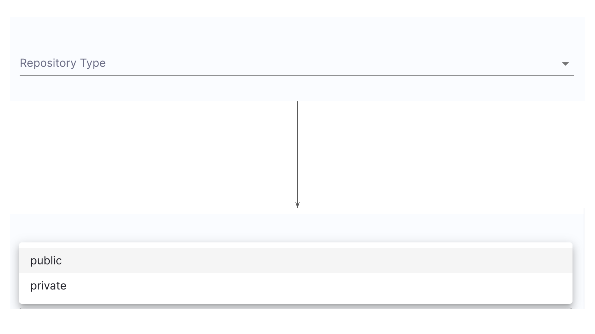
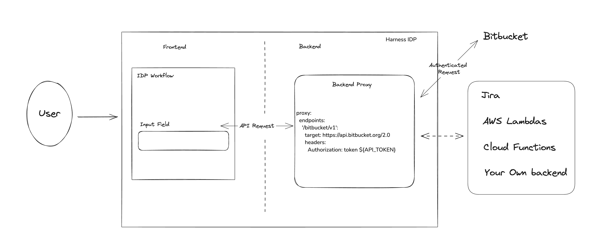
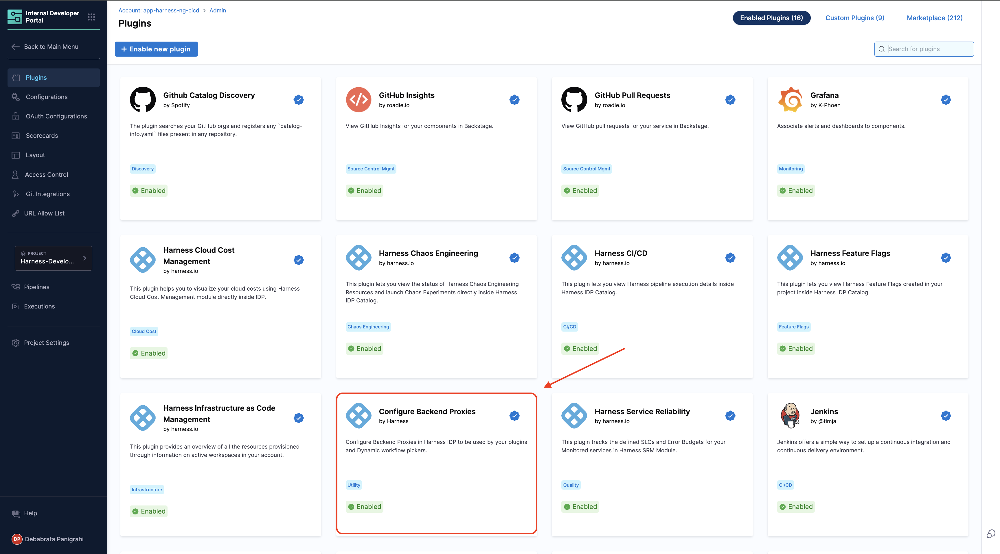
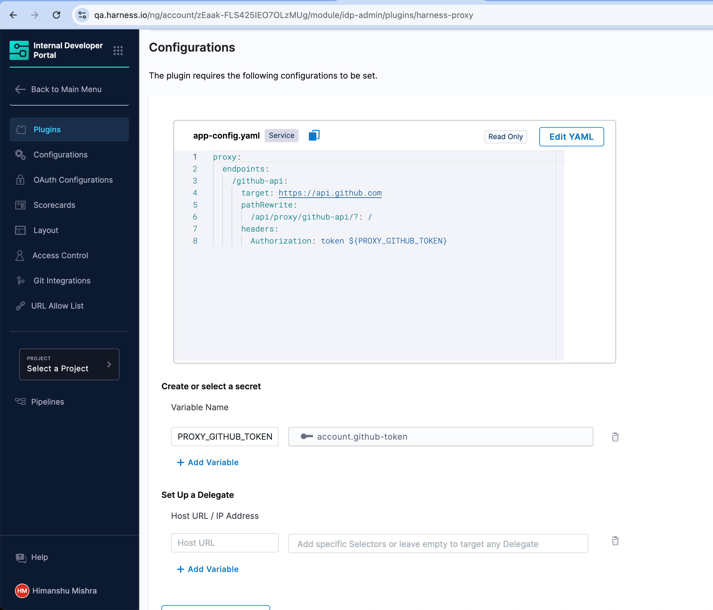
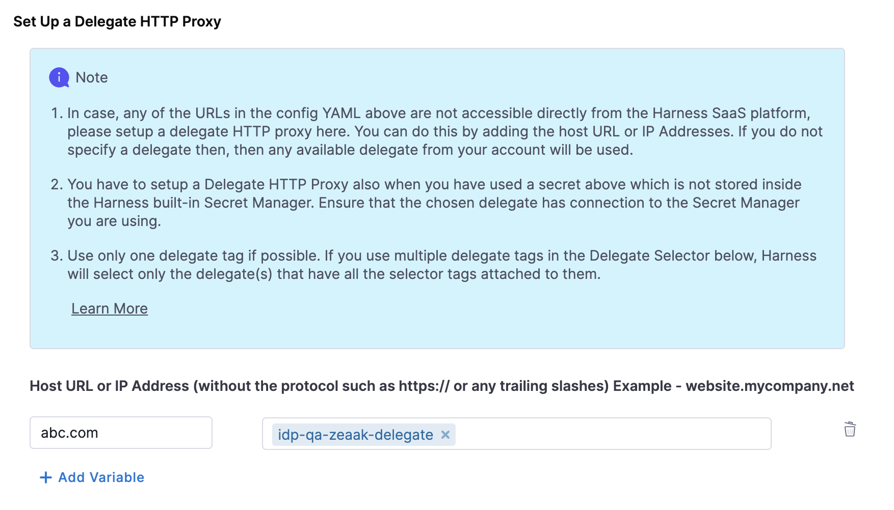
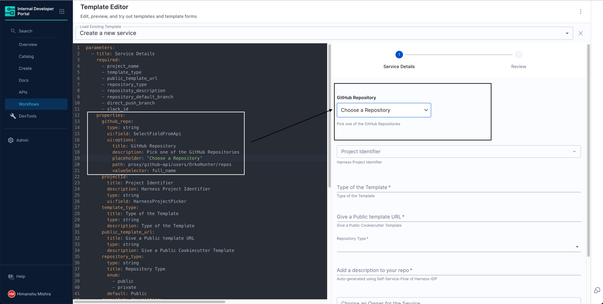
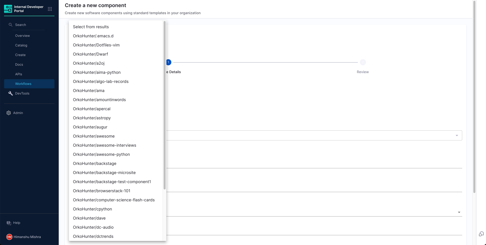

It is quite common to create a UI field in [IDP Workflow](http://developer.harness.io/docs/internal-developer-portal/flows/service-onboarding-pipelines#specparameters---formstep--formstep) forms which shows a static list options to the user. For example -

```yaml
properties:
  repository_type:
    type: string
    title: Repository Type
    enum:
      - public
      - private
```

will generate the following



However, often times a static list does not provide much value to the user. Here are some of the use-cases -

- Choose your Repository
- Choose your Bitbucket Project
- Choose your Jenkins Pipeline
- Choose your Infrastructure Component
- Choose a Jira Project

As a creator of the workflow, you want to provide real-time options for these input fields for a better user experience. This would also allow you to expect the results in a consistent format and leave no room for user formatting errors.

This is where our Dynamic Workflow Picker comes into play. Let's see how it works.



The Workflow UI makes a request to our [Backend Proxy](https://developer.harness.io/docs/internal-developer-portal/plugins/delegate-proxy/) which you can configure as a way to securely make requests to third party APIs and get a response. The UI Picker allows you to customize the response a bit and present it as a list in the dropdown.

## How to create a Dynamic Workflow Picker

There are two steps to adding a dynamic workflow picker in Harness IDP.

1. **Define a Backend Proxy** so that requests from the UI can be populated with authorization headers and forwarded to the third party APIs.
2. **Create the dynamic field in the workflow form**, consuming the backend proxy and the API response.

### Step 1: Create a Backend Proxy

The first step is to declare a new Backend Proxy so that the Workflow forms UI can make authenticated requests to our third party provider. Let's assume you are trying to make requests to GitHub.

Go to IDP Admin -> Plugins. Find the plugin called "Configure Backend Proxies".



Inside the plugin, you get three options (like any other [IDP plugin configuration](https://developer.harness.io/docs/internal-developer-portal/plugins/overview)).

1. Declare a Backend Proxy endpoint and headers
2. Configure necessary secrets
3. Configure Delegate Proxy (in case the API is not publicly accessible, or the secret is on your infrastructure)

In order to set up a proxy to connect with GitHub APIs, you can add the following in the configuration YAML

```yaml
proxy:
  endpoints:
    /github-api:
      target: https://api.github.com
      pathRewrite:
        /api/proxy/github-api/?: /
      headers:
        Authorization: token ${PROXY_GITHUB_TOKEN}
```

Here the `github-api` is the unique name of the endpoint of this Backend proxy. We will need it next.

The `target` should point to the API base URL of your 3rd party provider e.g. `api.github.com`, `https://api.bitbucket.org/2.0` etc.

The `pathRewrite` is field used by the system to ensure the API requests are correctly rerouted. It needs to be of the format `/api/proxy/<endpoint_name>/?: /` as shown above.

In the `headers` you can add an Authorization header. Ensure you use a unique token name here as variables are `GITHUB_TOKEN` or `BITBUCKET_TOKEN` are system defined. The token name does not matter, as long as a secret is set up for the corresponding variable.



Configure a Delegate HTTP Proxy to route traffic through an HTTP proxy server. This is useful when we need to access private endpoints not publicly accessible. 

:::warning

Endpoints targeting the `harness.io` domain should **not** be configured under this field. 

:::



Hit "Save Configuration" and now our backend proxy is ready to use!

You can verify this endpoint by making requests to the `proxy` endpoint at `https://idp.harness.io/{ACCOUNT_IDENTIFIER}/idp/api/proxy/`. For example in order to test the GitHub example above, you can make a request to

```
https://idp.harness.io/{ACCOUNT_IDENTIFIER}/idp/api/proxy/github-api/user
```

Here `https://idp.harness.io/{ACCOUNT_IDENTIFIER}/idp/api/proxy/github-api/` can be seen exactly as `https://api.github.com/`. So all the endpoint paths on the GitHub API can be used after the proxy endpoint URL. You can learn more about how to consume Harness IDP APIs on our [API Docs](/docs/internal-developer-portal/api-refernces/public-api).

### Step 2: Create the dropdown picker in Workflows form

Now that our Backend proxy is ready, it is time to create that dropdown picker. Here is a small example to start with

```yaml
parameters:
  # ...
  properties:
    github_repo:
      type: string
      ui:field: SelectFieldFromApi
      ui:options:
        title: GitHub Repository
        description: Pick one of the GitHub Repositories
        placeholder: "Choose a Repository"
        path: proxy/github-api/users/OrkoHunter/repos
        valueSelector: full_name
```



Let us understand these properties in detail -

- `ui:field` - This has to be set to `SelectFieldFromApi`. This is the name of the UI Field Component responsible for rendering the API response based picker.
- `title`, `description` and `placeholder` are text fields responsible for telling the user what this field is about. See screenshot.
- `path` - This is the most important field and has to be of the format `proxy/<endpoint-name>/<API-path>`. Here the `endpoint-name` is `github-api` as we have defined above. And `users/OrkoHunter/repos` is the API endpoint path on `api.github.com`.
- `valueSelector` - This is an optional field. If the response of the API is an array of strings, then you do not need this field. If the response is an array of objects/map, then `valueSelector` can be used to point to the key in the object/map that needs to be used for the dropdown.

And that's it! We now have a Workflow dropdown where results are coming from an external API response.



### Use Form Data from a Previous page in a New Page

While using Dynamic Workflow UI Pickers, users can now reference the data take as an input in the previous page, using `{{ parameters.properties }}`.

```YAML
parameters:
  - title: Select Harness Project
    type: object
    properties:
      projectId:
        title: Harness Project ID
        description: Select the Harness Project ID
        type: string
        ui:field: HarnessProjectPicker
        ui:autofocus: true
      organizationId:
        title: Harness Organization ID
        description: Select the Harness Organization ID
        type: string
        ui:field: HarnessAutoOrgPicker
  - title: Select Harness Pipeline
    type: object
    properties:
      pipelineId:
        type: string
        ui:field: SelectFieldFromApi
        ui:options:
          title: Harness Pipeline ID
          placeholder: Select the Harness Pipeline ID
          allowArbitraryValues: true
          path: proxy/harness-api/v1/orgs/{{ parameters.organizationId }}/projects/{{
            parameters.projectId }}/pipelines
          valueSelector: identifier
          labelSelector: identifier
steps:
  - id: debug
    name: Debug
    action: debug:log
    input:
      message:
        "{ parameters.pipelineId }": null
```

In the above YAML, the API endpoint values under the `path` dynamically insert the `organizationId` and `projectId` from the first set of parameters taken as an input in the previous page, to construct the endpoint URL for fetching the list of pipelines. 

```bash
proxy/harness-api/v1/orgs/{{ parameters.organizationId }}/projects/{{ parameters.projectId }}/pipelines
```

Hence, it will list all the pipelines present under the particular project int org mentioned as displayed below. 


:::info
You cannot reference properties on the same page, and property references only work with values provided through Dynamic UI pickers. 
:::

## Reference Docs

### `SelectFieldFromApi`

Here is an elaborate example of what all properties are possible with the `SelectFieldFromApi` field.

```yaml
properties:
  api-picker:
    type: string
    ui:field: SelectFieldFromApi

    ui:options:
      title: Title
      description: Description

      # The Path on the Harness IDP backend API and the parameters to fetch the data for the dropdown
      path: "proxy/proxy-endpoint/api-path"
      params:
        urlparamkey: "urlparamvalue"

      # (Optional) Renders the provided text as a placeholder value into the select box.
      placeholder: "Select from options"

      # (Optional) This field is used to point to the Array element inside the API response. It can be nested as shown here. If the response itself is an array, you can skip this.
      arraySelector: "object1.key1"

      # (Optional) If the response array is not an array of strings but rather an array of objects, valueSelector can be used to set the value of each selected item.
      valueSelector: "id"

      # (Optional) In case you want to show the user something else rather than the value itself, you can use the labelSelector for it.
      labelSelector: "name"
```

You can find the detailed docs on the [project's README](https://github.com/RoadieHQ/roadie-backstage-plugins/tree/main/plugins/scaffolder-field-extensions/scaffolder-frontend-module-http-request-field).

### Parsing API Response using filters

Let's look at some different types of API responses and how to create a picker based on that using the `arraySelector`, `valueSelector` and `labelSelector` filters.

#### Case 1: The response is an array

```json
["item1", "item2"]
```

This is the most straightforward case, and we do not need any of the additional filters here.

```yaml
properties:
  api-picker:
    type: string
    ui:field: SelectFieldFromApi
    ui:options:
      title: Title
      description: Description
      path: "proxy/proxy-endpoint/api-path"
```

#### Case 2: The response is an array of objects

```json
[
  {
    "id": "abc123",
    "name": "service A"
  },
  {
    "id": "abc124",
    "name": "service B"
  }
]
```

```yaml
properties:
  api-picker:
    type: string
    ui:field: SelectFieldFromApi
    ui:options:
      title: Title
      description: Description
      path: "proxy/proxy-endpoint/api-path"
      # We need to show `name` to the users
      valueSelector: "name"
```

If you want to show the user the names of the service here, but want to store the ID of the selected service to be used in the Pipeline execution later on, you can do this using

```yaml
properties:
  api-picker:
    type: string
    ui:field: SelectFieldFromApi
    ui:options:
      title: Title
      description: Description
      path: "proxy/proxy-endpoint/api-path"
      # We show the `name` to the users but store the `id` as the selected value
      valueSelector: "id"
      labelSelector: "name
```

#### Case 3: The response is a nested object of arrays

```json
"data": {
  "property": "cities",
  "array": [
    {
      "id": "city123",
      "name": "City A"
    },
    {
      "id": "city124",
      "name": "City B"
    }
  ]
}
```

```yaml
properties:
  api-picker:
    type: string
    ui:field: SelectFieldFromApi
    ui:options:
      title: Title
      description: Description
      path: "proxy/proxy-endpoint/api-path"
      # We need to point to the array inside the response
      arraySelector: "data.array"
      # We show the `name` to the users but store the `id` as the selected value
      valueSelector: "id"
      labelSelector: "name
```

## Notes

### Advanced processing the API response

If the filters here are not sufficient for your use case, and you require additional data processing of the response, then we recommend you setting up a Lambda function in your cloud provider or a lightweight backend to do this job. You can use your Backend Proxy and Delegate Proxy to communicate to your custom Lambda/Backend.

## Example Usage

### Fetch the list of Harness Services in Workflows

1. Configure the [Backend Proxy](#step-1-create-a-backend-proxy)

Set up a backend proxy in the plugin configuration to enable API calls to Harness. 

```YAML
proxy:
  endpoints:
    /harness-api-endpoint:
      target: https://app.harness.io
      pathRewrite:
        /api/proxy/harness-api-endpoint/?: /
      headers:
        x-api-key: ${PROXY_HARNESS_TOKEN}
```

- `/harness-api-endpoint`: Proxy path for the Harness API.
- `x-api-key`: Add your Harness Personal Access Token as an environment variable(covered in the next step).. 

2. Add the [Harness Personal Access Token](https://developer.harness.io/docs/platform/automation/api/add-and-manage-api-keys/#create-personal-api-keys-and-tokens) as a variable. Save the token as an environment variable named `PROXY_HARNESS_TOKEN`.

3. Update your Workflow definition YAML to include a dropdown for fetching the list of services.

```YAML
## Example workflows.yaml
...
properties:
  service:
    type: string
    ui:field: SelectFieldFromApi
    ui:options:
      title: Choose the service
      description: Pick one of the service you want to deploy
      placeholder: "Choose a service"
      allowArbitraryValues: true
      path: proxy/harness-api-endpoint/ng/api/servicesV2?page=0&size=100&accountIdentifier=ACCOUNT_ID&orgIdentifier=ORG_ID&projectIdentifier=PROJECT_ID&includeAllServicesAccessibleAtScope=true
      valueSelector: 'service.name'
      arraySelector: 'data.content'
...
```
- `ui:field`: Configures the dropdown to fetch data from an API.
- `path`: API endpoint for fetching the list of services. You need to add the account identifier in place of `ACCOUNT_ID`, organization identifier in place of `ORG_ID` and project identifier in-place of `PROJECT_ID`.
- `valueSelector`: Extracts the service name for the dropdown values.
- `arraySelector`: Extracts the array containing the services

For a complete example, refer to the [sample Workflows YAML](https://github.com/harness-community/idp-samples/blob/main/tutorial-dynamic-picker-examples.yaml).

