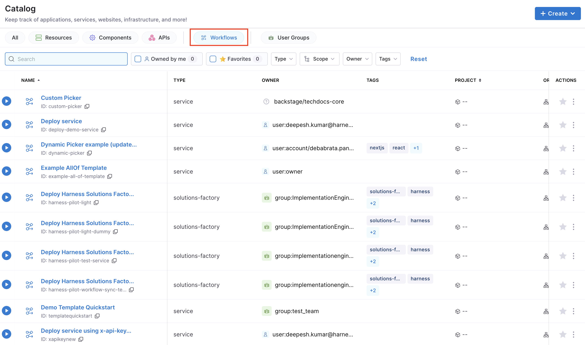
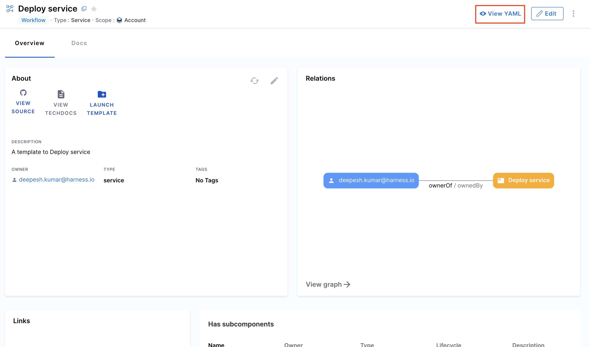
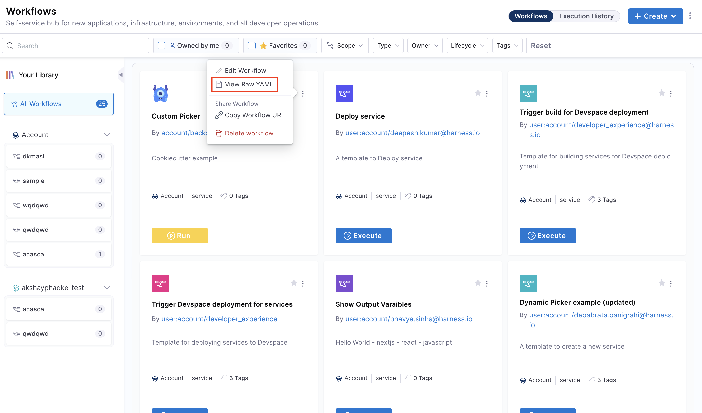
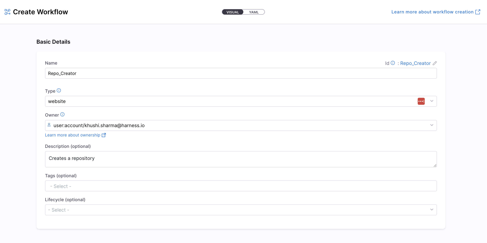
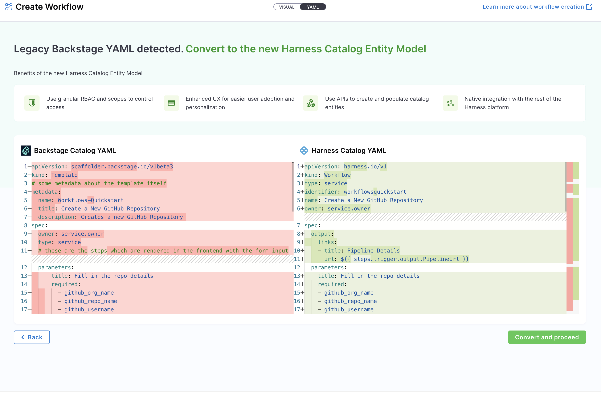
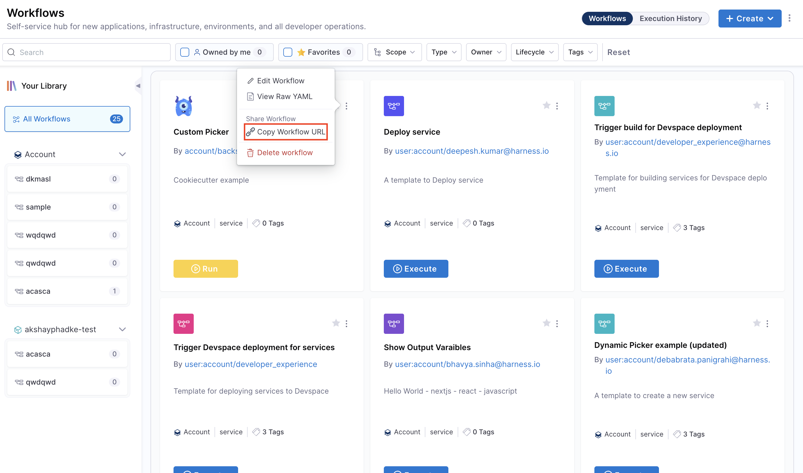
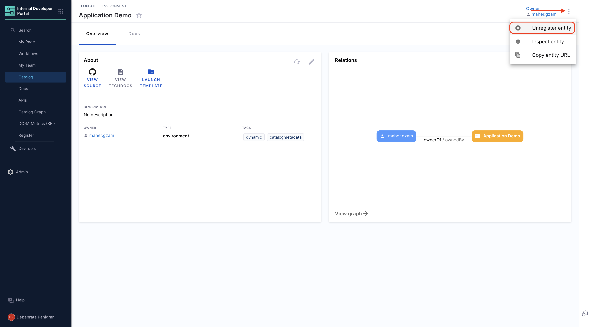

import Tabs from '@theme/Tabs';
import TabItem from '@theme/TabItem';

<Tabs queryString="version">
<TabItem value="IDP 2.0 (New)" label="IDP 2.0 (New)">

:::tip For IDP 2.0 Customers
If you're using Harness IDP 2.0, please ensure you have reviewed the [IDP 2.0 Overview guide](/docs/internal-developer-portal/idp-2o-overview/2-0-overview-and-upgrade-path.md) and are familiar with the key steps for [upgrading to IDP 2.0](/docs/internal-developer-portal/idp-2o-overview/migrating-idp-2o.md). To enable IDP 2.0, you must raise a support ticket to activate the `IDP_2_0` feature flag for your account.
:::

Workflows enable **developer self-service** by automating manual tasks and processes. Using Workflows, platform engineering teams can:

- Automate new **service onboarding**.
- Simplify **Day 2 operations** for developers.
- Provide developers with **golden paths to production** that include guardrails and best practices.

This guide will walk you through the process of registering and managing your Workflows directly from Harness IDP. Let's dive in!

## Workflows in Software Catalog (IDP 2.0)
Once a workflow is registered, it is stored in the Software Catalog under the kind **“Workflow”**.

### Accessing Workflows

1. Navigate to the **Catalog** page in Harness IDP.  
2. Select **Workflows** from the Catalog filter categories to view all registered Workflows.  
3. Use additional filters (e.g., owner, tags) to narrow down the list.




### Viewing Workflow YAML 
You can inspect the Workflow YAML in two ways:

1. From the **Catalog**, select the desired Workflow and click **View YAML**.  

2. From the **Workflows** page, click the three-dot menu on the Workflow and choose **View RAW YAML**. 


## Managing Workflows (IDP 2.0)

### Creating Workflows
With IDP 2.0, we are moving towards a Harness-native Data Model designed for enterprise scale and access control. To learn more about the different changes in the schema, go to [Data Model](/docs/internal-developer-portal/catalog/data-model.md). 

There are two ways for you to add and create a new Workflow in your IDP:
- **Create a Workflow via the Harness IDP UI**: Use the Harness UI to create Workflows directly—no YAML required. This method offers a streamlined, code-free experience for adding entities.
- **Create a Workflow using your Workflow YAML**: You can still create Workflows using your existing Workflow YAML files. Harness will automatically convert legacy Backstage YAML into the new Harness-native Data Model and register the corresponding Workflow.

Let's try creating a **Workflow** using both the methods: 

<Tabs>
  <TabItem value="UI" label="Harness IDP UI">
  To create a new **Workflow**, navigate to the Harness IDP portal and click on **“Create”** from the side-bar menu. Choose **Workflow** from the panel, and follow these steps:
  1. You’ll be redirected to the **"Visual View"**, where you can input basic Workflow details and begin the creation process.
  2. Enter the required Workflow information. The **Visual view** is synced in real-time with the **YAML view** for full transparency.
  
  3. Define the **Workflow scope** — choose whether the Workflow should reside at the Account, Project, or Organization level. For this use-case, let's select the Account scope. Read more about Workflow RBAC.
  
  4. You now have two options for managing your Workflow configuration:
    * **Inline (default):** Manage the Workflow YAML directly within Harness.
    * **Remote:** Choose to store your Workflow YAML in a Git repository for version control, collaboration, and change tracking.
    You can either use a **Harness Code Repository** or connect to a **Third-party Git provider** like GitHub or GitLab by selecting a Git connector, repository, branch, and YAML path.
        
     > The Git Experience is ideal for teams who prefer to manage Workflows as code, with full version control and Git-native workflows. To ensure changes are reflected in both YAML and execution views, a [webhook](/docs/internal-developer-portal/git-experience/gitx-journey#workflow-execution-visibility-and-webhook-requirement) must be configured on the Git connector. Learn more in the [Git Experience Journey documentation](/docs/internal-developer-portal/git-experience/gitx-journey).


  5. Click on **“Review YAML”** to view the auto-generated YAML. Since there's a live sync between the Visual and YAML views, changes in one will reflect in the other. 
  6. You can configure your Workflow by editing the YAML directly—add inputs, backend actions, and outputs as needed. This allows you to fully customize the Workflow behavior. Learn more about the [components of a Workflow](/docs/internal-developer-portal/flows/worflowyaml.md#components-of-workflow-yaml) and its [YAML structure](/docs/internal-developer-portal/flows/worflowyaml.md#workflow-yaml-definition) here.  
  

  :::info
  **YAML validation** is performed to ensure compatibility with the **Harness-native Data Model**. Any errors will be shown in the Validation logs. Ensure your `identifier` follows [naming rules](https://developer.harness.io/docs/platform/references/entity-identifier-reference/#identifier-naming-rules). Invalid identifiers may lead to entity registration errors.
  :::

  6. Once everything is set, click **“Create Workflow”** to finalize and create the Workflow.
  </TabItem>
  <TabItem value="YAML" label="Workflow YAML">
  To create a new entity using the Workflow YAML, navigate to the Harness IDP portal and click **“Create”** from the side-bar menu. Choose **Workflow** from the panel.
  
  :::info
  If you have a **legacy Backstage YAML**, you can still use it to create a **Workflow**. Harness will automatically convert it into the **Harness-native Data Model** format.
  :::

1. You’ll be redirected to the **Visual View**. You can switch to the **YAML View** using the toggle at the top of the screen. This allows you to directly edit the Workflow's YAML definition.

2. If you’re using a **legacy Backstage YAML**, paste it into the YAML view. Harness will convert it into the **Harness-native format** automatically. You can then proceed to finalize and create the Workflow. Since the Visual and YAML views are **live-synced**, changes made in one view will reflect in the other.


4. You can configure your Workflow by editing the YAML directly—add inputs, backend actions, and outputs as needed. This allows you to fully customize the Workflow behavior. Learn more about the [components of a Workflow](/docs/internal-developer-portal/flows/worflowyaml.md#components-of-workflow-yaml) and its [YAML structure](/docs/internal-developer-portal/flows/worflowyaml.md#workflow-yaml-definition) here.  


3. Define the **scope** of the Workflow in two ways: either switch to the Visual View and select the desired scope, or specify the **[projectIdentifier](/docs/internal-developer-portal/catalog/catalog-yaml.md#projectidentifier)** or **[orgIdentifier](/docs/internal-developer-portal/catalog/catalog-yaml.md#orgidentifier)** directly in the YAML to set the project or organization scope.


4. You now have two options for managing your Workflow configuration:
    * **Inline (default):** Manage the Workflow YAML directly within Harness.
    * **Remote:** Choose to store your Workflow YAML in a Git repository for version control, collaboration, and change tracking.
    You can either use a **Harness Code Repository** or connect to a **Third-party Git provider** like GitHub or GitLab by selecting a Git connector, repository, branch, and YAML path.
    
    > The Git Experience is ideal for teams who prefer to manage Workflows as code, with full version control and Git-native workflows. To ensure changes are reflected in both YAML and execution views, a [webhook](/docs/internal-developer-portal/git-experience/gitx-journey#workflow-execution-visibility-and-webhook-requirement) must be configured on the Git connector. Learn more in the [Git Experience Journey documentation](/docs/internal-developer-portal/git-experience/gitx-journey).

:::info
Note: **YAML validation** is automatically performed to ensure compatibility with the **Harness-native Catalog YAML model**. Any validation errors will be displayed in the Validation Logs.
:::

6. Once all details are complete, click **“Create Workflow”** to finalize and register your Workflow in the catalog.
  </TabItem>
</Tabs>

### Executing Workflows
Once a Workflow is created, it can be executed from:

1. The **Catalog** – Click the Workflow entry from the Catalog, then click **Launch Template** on the details page.  

2. The **Workflows** page – Locate the Workflow from the Workflows page and click **Execute**.


### Editing Workflows
1. Go to the **Workflows** page.  
2. Click the three-dot menu on the Workflow you want to edit.  
3. Select **Edit Workflow** to open it in edit mode.


### Deleting Workflows
1. Go to the **Workflows** page.  
2. Click the three-dot menu on the Workflow you want to delete.  
3. Select **Delete Workflow** and confirm the action.


### Sharing Workflows
You can share Workflows by copying their direct URL:

1. On the **Workflows** page, click the three-dot menu for the Workflow.  
2. Select **Copy URL**.  
3. Share the link, keeping in mind scope-level access and RBAC permissions.



</TabItem>
<TabItem value="IDP 1.0" label="IDP 1.0">

This guide will walk you through the process of registering and managing your Workflows directly from Harness IDP. Let's dive in!
## Workflows in Software Catalog (IDP 1.0)
Once a workflow is registered, it is stored in the Software Catalog under the kind **“Template”**.

### Accessing Workflows
1. Navigate to the **“Catalog”** page in Harness IDP.
2. Select **“Template”** from the catalog component filter to view all workflows.


You can also inspect the **catalog metadata** for a workflow by clicking on the **three dots in the top-right corner** and selecting **“Inspect Entity”**.

## Managing Workflows (IDP 1.0)
You can manage your workflows from Harness IDP directly. Let's dive deeper into specific functions.

### Registering Workflows 
You can register a new workflow just like you register a new entity in your software catalog, refer to this guide for more details. 
1. Create a **```workflow.yaml```** file in your source code repository.
2. Go to the **“Workflows”** page in Harness IDP and click **“Register a new workflow”**.

3. Provide the URL of the ```workflow.yaml``` file. Learn more about registering workflows.


### Updating Workflows
You can update/edit your workflows from your Harness IDP by updating your workflow.yaml file: 
1. In the workflows page, click the **three dots** on the desired workflow.
2. Select **“Edit Workflow”** to modify the YAML file.

3. Save changes by committing the updated YAML file.
4. **Refresh the workflow** in Harness IDP to apply changes.


### Unregistering Workflows
You can delete your workflow as well: 
1. Select the **workflow from the software catalog** view.
2. Click the **three dots** in the top-right corner and choose **“Unregister Entity”**.


### Executing Workflows
You can launch workflows directly from the **“Workflows”** page in Harness IDP. Users will be prompted to provide input details via the configured frontend, and the workflow will execute accordingly.


### Setting the Owner

It's a good practice to assign an **Owner** to a Workflow so developers can easily reach out to them if they have any questions or encounter issues. The [``spec.owner``](https://developer.harness.io/docs/internal-developer-portal/catalog/how-to-create-idp-yaml#spec-owner) field in Harness allows you to specify the owner in several ways:

- Assign a [**User Group**](https://developer.harness.io/docs/platform/role-based-access-control/add-user-groups/#built-in-user-groups) for better collaboration and role-based access.
- Specify an email, such as team@mycompany.net, to direct queries to a team or individual.
- Use a plain text identifier like Infra Team for simplicity.

Here’s an example of a basic workflow.yaml definition:

```YAML {4}
...
# these are the steps which are rendered in the frontend with the form input
spec:
  owner: debabrata.panigrahi@harness.io
  type: service
  parameters:
    - title: Service Details
      properties:
        owner:
          title: Choose an Owner for the Service
          type: string
          ui:field: OwnerPicker
          ui:options:
            allowedKinds:
              - Group
        # This field is hidden but needed to authenticate the request to trigger the pipeline
        token:
          title: Harness Token
          type: string
          ui:widget: password
          ui:field: HarnessAuthToken
```

</TabItem>
</Tabs>

