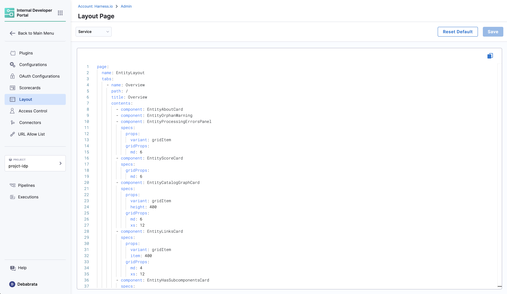

## Introduction

In Harness IDP we take care of the UI configuration for your plugins and core-features, unlike that of Backstage where you need to update the entity pages in the app. But whle doing so we don't take away your ability to configure the cards and tabs instead we auto-ingest most of the values once the plugins are enabled and those values can be further configured according to your needs. 

## Layout Page

The **Layout** page is under the **Admin** section and is a comprehensive and modular interface designed for plugins as well as core features, leveraging HTML for a dynamic and interactive user experience. This document provides detailed information about the layout, its components, and usage.



## Layout Overview
The `EntityLayout` is structured into several tabs, each serving a distinct purpose. This layout is designed to be flexible and customizable, catering to various informational and interactive needs.

## Tabs and Components
Each tab within the `EntityLayout` contains specific components. Below is a detailed breakdown of these tabs and their respective components.

### Overview Tab

- Title: Overview
- Components:
    - `EntityAboutCard`: Provides a brief about the entity.
    - `EntityOrphanWarning`: Displays warnings for orphan entities.
    - `EntityProcessingErrorsPanel`: Shows processing errors in a panel layout.
- Props: variant: gridItem
- GridProps: md: 6
- `EntityScoreCard`: Displays scores and metrics related to the entity.
- GridProps: md: 6

### CI/CD Tab
- Path: /ci-cd
- Title: CI/CD
- Components:
- `EntitySwitch`: Dynamically displays CI/CD information based on service availability.

### Additional Tabs
API, Deps, Scorecard, TechDocs, EntityGithubPullRequestsContent, EntityKubernetesContent, DynatraceTab: Each of these tabs follows a similar structure, containing components specific to their functionality.

## Understanding md and xs Units in Grid Layouts
- Grid System: Most web frameworks use a 12-column grid system for responsive layouts.
- md (Medium): Used for medium-sized screens (e.g., small laptops, larger tablets). A setting of md: 6 means the component occupies half the width on medium screens.
- xs (Extra Small): Targets extra small devices like mobile phones. xs: 12 makes a component take the full width on small screens.
- Optimal Sizes: For medium devices, common sizes are md: 4, md: 6, or md: 8. For extra small devices, xs: 12 is often used for better readability.

### Usage and Examples
Include components as part of the `EntityLayout` configuration. Customize using `props` and `gridProps` as needed.

```html
<EntityLayout>
  <!-- Overview Tab -->
  <Tab path="/" title="Overview">
    <EntityAboutCard />
    <!-- Additional components -->
  </Tab>
  <!-- Additional tabs -->
</EntityLayout>
```
## Best Practices
- Use md and xs to ensure components are appropriately sized on different devices.
- Combine different size units for comprehensive coverage across devices.

## Troubleshooting
- Component Not Rendering: Check for correct `props`.
- Layout Issues: Adjust `gridProps` for responsive design.
