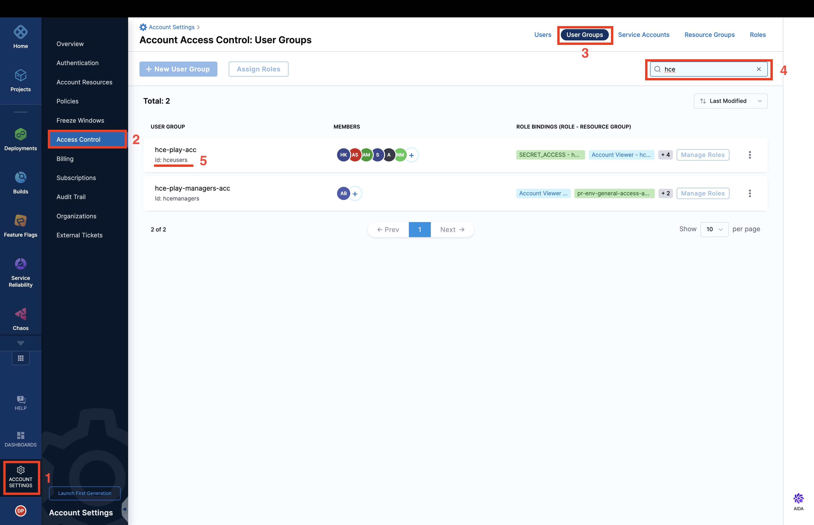
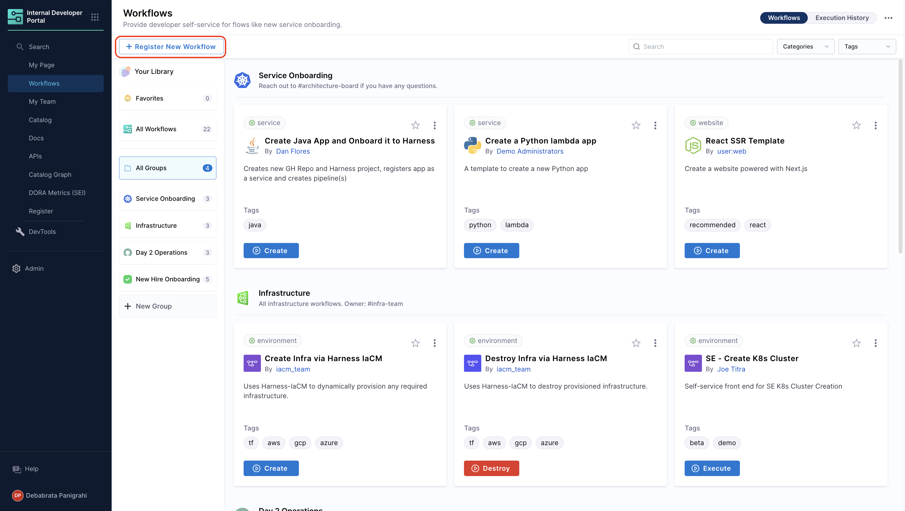

You can register any new software component with the software catalog by creating a `catalog-info.yaml` file in your Git repository and then registering its URL.

<DocVideo src="https://www.youtube.com/embed/YgtIMDGMzJE?si=AYnisVn-lHX-4STw" />

## Create the catalog-info.yaml

<!-- The **IDP YAML** is a crucial descriptor file that provides metadata about the software components you register within our IDP. It serves as a blueprint, detailing essential information about each component, such as its name, description, owner, and other related metadata. This file ensures that our portal accurately represents and organizes the software components, making it easier for teams to discover and understand the tools and services available.

Although it's possible to name catalog entity descriptor files however you wish, we recommend that you name them `idp.yaml`.

:::info

`idp.yaml` follows the same [Descriptor Format of Catalog Entities](https://backstage.io/docs/features/software-catalog/descriptor-format#substitutions-in-the-descriptor-format) as Backstage.io.

::: -->

If you want to register an existing software component, navigate to its repository. If it is a mono-repo, navigate to its directory and create a `catalog-info.yaml` at the root of the directory. The file can technically live anywhere (for example, `.harness/catalog-info.yaml`).

You can use the following YAML code as a template:

```yaml
apiVersion: backstage.io/v1alpha1
kind: Component
metadata:
  name: my-new-service
  description: Description of my new service
  annotations:
    pagerduty.com/integration-key: <sample-service-integration-key>
  tags:
    - java
  links:
    - url: https://admin.example-org.com
      title: Admin Dashboard
      icon: dashboard
      type: admin-dashboard
spec:
  type: service
  lifecycle: production
  owner: team-a
  system: project-x
```

Update these fields in the above example:

- `metadata.name`. This should be a unique name for your component. Usually, it is the name of the service.
- `metadata.description` - A description for your new component.
- `spec.type` - The new software component could be a `service`, `library`, `website`, or any other type.
- `spec.owner` - The user group identifier of the team that owns the component.

### catalog-info.yaml specifications

Expand the sections below to learn more about the contents of `catalog-info.yaml`.

<details>
<summary>Basic Entity Information</summary>

The `catalog-info.yaml` begins with the basic entity information, `apiVersion` and `kind`.

```yaml
apiVersion: backstage.io/v1alpha1
kind: Component
```

`kind` can be any of the following:

* [Component](https://backstage.io/docs/features/software-catalog/descriptor-format/#kind-component)
* [Template](https://backstage.io/docs/features/software-catalog/descriptor-format/#kind-template)
* [API](https://backstage.io/docs/features/software-catalog/descriptor-format/#kind-api)
* [Resource](https://backstage.io/docs/features/software-catalog/descriptor-format/#kind-resource)
* [Location](https://backstage.io/docs/features/software-catalog/descriptor-format/#kind-location)
* And more.

`Component` is quite widely used for service, website, library, and so on, which are specified as `spec.type`.

</details>

<details>
<summary>Metadata</summary>

Under the `metadata` section, provide your components `name` and `description` as well as other optional metadata, such as `annotations` and `links`.

```yaml
metadata:
  name: artist-service
  description: The place to be, for great artists
```

#### annotations

Annotations are used to reference external systems or provide additional non-identifying metadata.

```yaml
annotations:
  harness.io/project-url: "https://app.harness.io/ng/account/accountid/cd/orgs/orgid/projects/projectid"
  github.com/project-slug: github/example-org/artist-website
```

#### tags

Tags are single-valued strings used to classify entities.

```yaml
tags:
  - java
```

#### links

External hyperlinks related to the entity can be added for contextual information.

```yaml
links:
  - url: https://admin.example-org.com
    title: Admin Dashboard
    type: admin-dashboard
```

:::warning Allowing external URLs

If you're referencing external URLs in your catalog file, such as Swagger documentation links, you must ensure that these URLs are allowed within the Harness Internal Developer Portal. This is a crucial step to ensure that the portal can access and display content from these external sources.

To allow external URLs:

1. Navigate to **Admin** in the Harness Internal Developer Portal.
2. Go to **URL Allow List**.
3. Select **Add Host**.
4. Enter the URL pattern you want to allow. For example, to allow all URLs from Swagger, enter `*.swagger.com`.
5. Confirm and save your changes.

:::

#### labels

You can add key/value pairs as labels to classify the component:

```yaml
labels:
  example.com/custom: custom_label_value
```

</details>

<details>
<summary>Specify Component Details (spec)</summary>

Under the `spec` section, provide specific details about the component.

```yaml
spec:
  type: service
  lifecycle: production
  owner: team-a
  system: project-x
```

#### spec.type

The current set of well-known and common values for `spec.type` is:

* `service` - a backend service, typically exposing an API
* `website` - a website
* `library` - a software library, such as an npm module or a Java library

#### spec.owner

In the Harness Internal Developer Portal, the owner of a component is identified by the [Harness User Group ID](https://developer.harness.io/docs/platform/role-based-access-control/add-user-groups). This User Group ID represents the collective entity that holds ultimate responsibility for the component and possesses the authority and capability to develop and maintain it. Should any issues arise or if there are requests for features, this User Group will serve as the primary point of contact. The primary purpose of this field in the Harness IDP is for display, ensuring that individuals accessing catalog items can easily identify the responsible User Group for a given component.

To get the Harness User Group ID:

1. Navigate to the **bottom left** of the Harness dashboard and select **Account settings**.
2. From the Account settings menu, select **Access Control**.
3. Once in the Access Control section, look to the **top right** of the page and click on **User Groups**.
4. You'll see a **search bar** at the top. Use this to search for the specific user group you're interested in.
5. Once you've located the desired user group, you'll find the **User Group ID** listed. Simply **copy** this ID for your reference.



#### spec.system

A system is a collection of resources and components. The system may expose or consume one or several APIs. It is viewed as abstraction level that provides potential consumers insights into exposed features without needing a too detailed view into the details of all components. This also gives the owning team the possibility to decide about published artifacts and APIs.

Here's an example descriptor file for `kind: system`:

```yaml
apiVersion: backstage.io/v1alpha1
kind: System
metadata:
  name: Custom Dashboards
  description: Handles creation of Custom Dashboard across different Harness Modules
spec:
  owner: platformengineeringteam
```

#### spec.lifecycle

The lifecycle state of the component, e.g. `production`. This field is required.

The software catalog accepts any lifecycle value, but an organization should take great care to establish a proper taxonomy for these.

The current set of well-known and common values for this field is:

* `production` - an established, owned, maintained component
* `deprecated` - a component that is at the end of its lifecycle, and may disappear at a later point in time

</details>

:::tip Substitutions in Descriptor Format

The descriptor format supports substitutions using `$text`, `$json`, and `$yaml`. Placeholders like `$json: https://example.com/entity.json` are substituted by the content of the referenced file. You can reference relative files like `./referenced.yaml` from the same location. For example:

```yaml
spec:
  type: service
  owner: platformengineeringteam
  system: developer-experience
  lifecycle: production
  definition: $text://developer.harness.io/docs/enhancing-developer-experience
```

:::

## Register the Software Component

3. In the left navigation, select **Create**, and then select **Register Software Component**.

   
   

4. Enter the URL to your `catalog-info.yaml` from your Git repo, such as `https://github.com/harness-community/idp-samples/blob/main/catalog-info.yaml`.

   

5. Select **Import**.

   

The new component will be available in your catalog.


:::tip Register with the Catalog API

You can also register components via API.

1. Generate a Harness API Key as described in [Manage API keys](https://developer.harness.io/docs/platform/automation/api/add-and-manage-api-keys)
2. Follow the following cURL command with the request body to register your component. The body takes two input at present `type` and `target`.

```cURL
curl --location 'https://idp.harness.io/{ACCOUNT_IDENTIFIER}/idp/api/catalog/locations' \
--header 'x-api-key: {X_API_KEY}' \
--header 'Harness-Account: {ACCOUNT_IDENTIFIER}'
 --data-raw '{"type":"url","target":"https://github.com/harness-community/idp-samples/blob/main/catalog-info.yaml"}'
```

:::

## Register Multiple software components together.

We can register multiple `catalog-info.yaml` in the following ways.

1. If all your `catalog-info.yaml` are in the root of the same repo you can add the extensions in the target, as shown in the example below and it will register all the components. 

```YAML
apiVersion: backstage.io/v1alpha1
kind: Location
metadata:
  name: example-all
  description: A collection of all Backstage example entities, except users, groups, and templates
spec:
  targets:
    - ./all-apis.yaml
    - ./all-components.yaml
```

2. If the `catalog -info.yaml` is scattered across repos and you want to register them together then mention the absolute path in the git provider. Please make sure the **connector** you have created has **account level permissions** and all the repos mentioned under targets are under that **same account**. 

```YAML
apiVersion: backstage.io/v1alpha1
kind: Location
metadata:
  name: food-delivery
  description: A collection of all example entities, except users, groups, and templates
spec:
  targets:
    - https://github.com/account-name/location-service/blob/main/catalog-info.yaml
    - https://github.com/account-name/member-service/blob/main/catalog-info.yaml
    - https://github.com/account-name/delivery-service/blob/main/catalog-info.yaml
    - https://github.com/account-name/order-service/blob/main/catalog-info.yaml
    - https://github.com/account-name/menu-service/blob/main/catalog-info.yaml
```

## Troubleshooting: Failed to register

If after registering an entity your're unable to find the same in your catalog. Check in the Devtools Plugin for Unprocessed Entities. If it's under the **Pending** tab wait for few mins it will get registered and if it's under the **Failed** tab try re-registering the entity.


## Further Reading

For those looking to expand their knowledge and explore more advanced methods of registering software components on Harness IDP, consider the following:

### GitHub Auto-Discovery Plugin:

If you're aiming to register multiple components in the software catalog concurrently, the [GitHub auto-discovery plugin](https://developer.harness.io/docs/internal-developer-portal/plugins/available-plugins/github-catalog-discovery/) is a valuable tool. This plugin automates the discovery and registration of components, with all the idp yamls located in single repo.

### Using the Catalog API:

Another effective approach is leveraging the catalog API. By running a custom script as shown in the example below, you can automate the registration of components, providing a more programmatic method for bulk registrations.

```shell
#!/bin/bash

set -e

function usage {
    echo "usage: $0 [-a accountIdentifier] [-x xApiKey] [-u bearerAuthorization] [-l catalogLocations]"
    echo "  -a      Harness Account Identifier"
    echo "  -x      Harness X-API-KEY for the given account"
    echo "  -u      Harness Bearer Authorization from the logged in session"
    echo "  -l      Catalog locations to be registered in Harness IDP. Comma seperated list of locations"
    exit 1
}

while getopts a:x:u:l:h flag
do
    case "${flag}" in
        a) ACCOUNT_IDENTIFIER=${OPTARG};;
        x) X_API_KEY=${OPTARG};;
        u) BEARER_AUTHORIZATION=${OPTARG};;
        l) CATALOG_LOCATIONS=${OPTARG};;
        h | ?) usage
    esac
done

echo -e "\nStarting catalog location registration for given location in Harness IDP...";

CATALOG_LOCATION_REGISTER_DATA='{"type":"url","target":"CATALOG_LOCATION_TARGET"}'

for LOCATION in ${CATALOG_LOCATIONS//,/ }
do
    echo -e "\n--------"
    echo "Registering $LOCATION catalog location in Harness IDP account $ACCOUNT_IDENTIFIER"

    POST_DATA=${CATALOG_LOCATION_REGISTER_DATA/CATALOG_LOCATION_TARGET/$LOCATION}

    RESULT_HTTP_CODE=$(curl --write-out %{http_code} -s --output /dev/null -H "Content-Type: application/json" -H "Harness-Account: ${ACCOUNT_IDENTIFIER}" -H "x-api-key: ${X_API_KEY}" -H "Authorization: Bearer ${BEARER_AUTHORIZATION}" -X POST --data "${POST_DATA}" "https://idp.harness.io/${ACCOUNT_IDENTIFIER}/idp/api/catalog/locations")

    if [[ "$RESULT_HTTP_CODE" -ne 201 ]] ; then
        echo "Failed registering $LOCATION catalog location in Harness IDP account $ACCOUNT_IDENTIFIER"
    else
        echo "Successfully registerd $LOCATION catalog location in Harness IDP account $ACCOUNT_IDENTIFIER"
    fi

    echo "--------"
done

echo -e "\nCompleted catalog location registration for given location in Harness IDP...";
```
